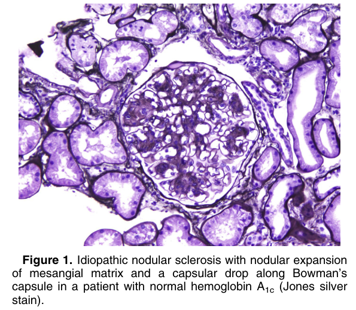
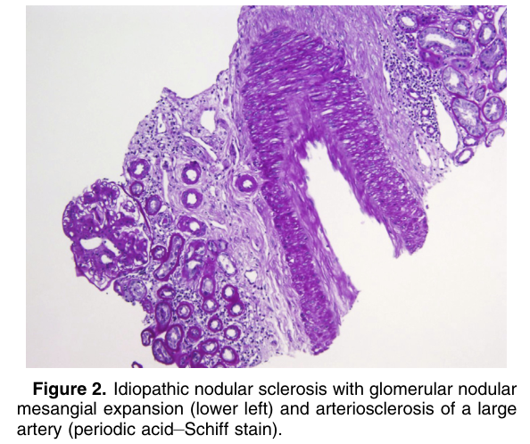
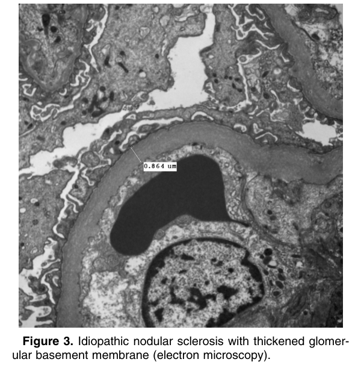

# Idiopathic Nodular Sclerosis - Figures and Tables Index

This document lists all figures and tables extracted from `Idiopathic Nodular Sclerosis.pdf`.

## Table of Contents
- [Figures](#figures)
- [Tables](#tables)

---

## Figures

### Fig_1

Figure 1. Idiopathic nodular sclerosis with nodular expansion of mesangial matrix and a capsular drop along Bowman’s capsule in a patient with normal hemoglobin A1c (Jones silver stain).

---

### Fig_2

Figure 2. Idiopathic nodular sclerosis with glomerular nodular mesangial expansion (lower left) and arteriosclerosis of a large artery (periodic acid–Schiff stain).

---

### Fig_3

Figure 3. Idiopathic nodular sclerosis with thickened glomer ular basement membrane (electron microscopy).

---

## Tables

*No tables resolved for this chapter.*
