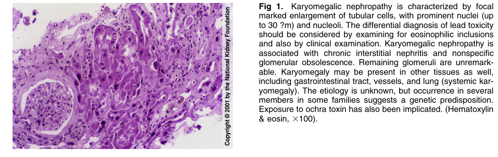
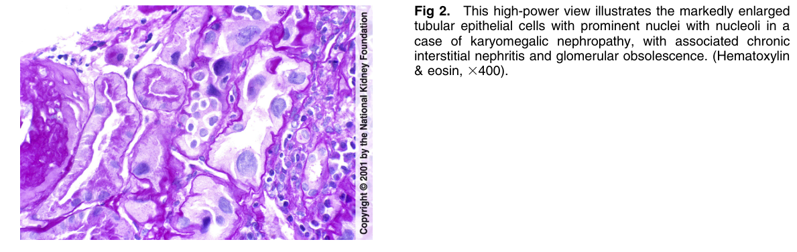

# Karyomegalic Nephropathy 2 - Figures and Tables Index

This document lists all figures and tables extracted from `Karyomegalic Nephropathy 2.pdf`.

## Table of Contents
- [Figures](#figures)
- [Tables](#tables)

---

## Figures

### Fig_1

Figure 1. Karyomegalic nephropathy is characterized by foca marked enlargement of tubular cells, with prominent nuclei (up to 30 ?m) and nucleoli. The differential diagnosis of lead toxicity should be considered by examining for eosinophilic inclusions and also by clinical examination. Karyomegalic nephropathy is associated with chronic interstitial nephritis and nonspecific glomerular obsolescence. Remaining glomeruli are unremarkable. Karyomegaly may be present in other tissues as well, including gastrointestinal tract, vessels, and lung (systemic karyomegaly). The etiology is unknown, but occurrence in severa members in some families suggests a genetic predisposition. Exposure to ochra toxin has also been implicated. (Hematoxylin & eosin, 3100).

---

### Fig_2

Figure 2. This high-power view illustrates the markedly enlarged tubular epithelial cells with prominent nuclei with nucleoli in a case of karyomegalic nephropathy, with associated chronic interstitial nephritis and glomerular obsolescence. (Hematoxylin & eosin, 3400).

---

## Tables

*No tables resolved for this chapter.*
