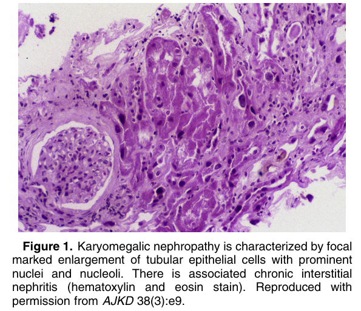
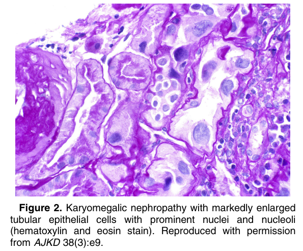

# Karyomegalic Nephropathy - Figures and Tables Index

This document lists all figures and tables extracted from `Karyomegalic Nephropathy.pdf`.

## Table of Contents
- [Figures](#figures)
- [Tables](#tables)

---

## Figures

### Fig_1

Figure 1. Karyomegalic nephropathy is characterized by focal marked enlargement of tubular epithelial cells with prominent nuclei and nucleoli. There is associated chronic interstitial nephritis (hematoxylin and eosin stain). Reproduced with permission from AJKD 38(3):e9.

---

### Fig_2

Figure 2. Karyomegalic nephropathy with markedly enlarged tubular epithelial cells with prominent nuclei and nucleoli (hematoxylin and eosin stain). Reproduced with permission from AJKD 38(3):e9.

---

## Tables

*No tables resolved for this chapter.*
