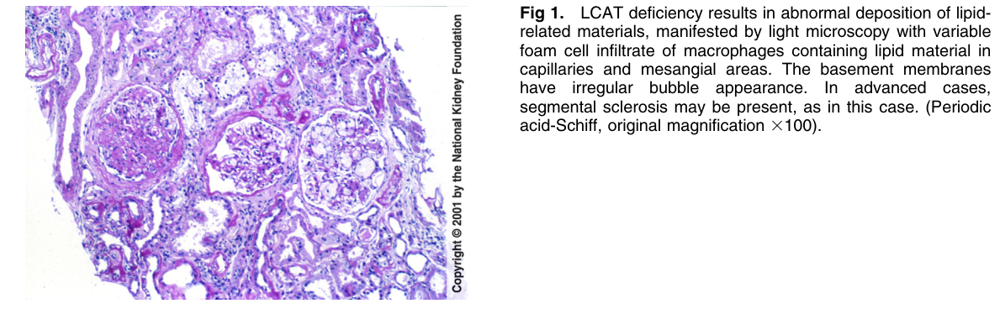
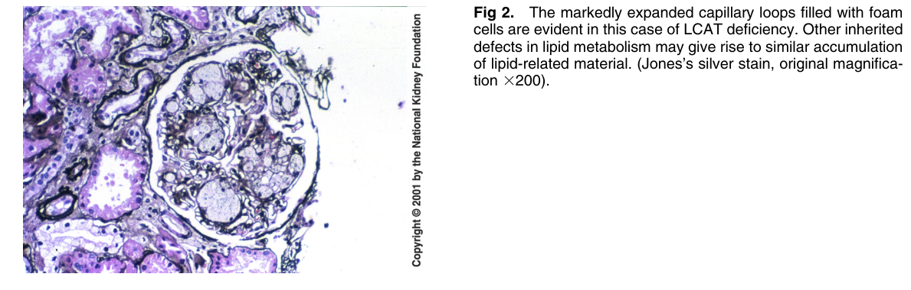
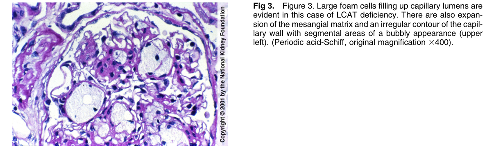
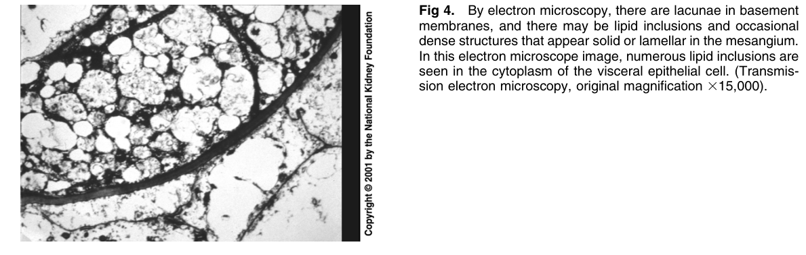

# Lecithin-Cholesterol Acyltransferase (LCAT) Deficiency - Figures and Tables Index

This document lists all figures and tables extracted from `Lecithin-Cholesterol Acyltransferase (LCAT) Deficiency.pdf`.

## Table of Contents
- [Figures](#figures)
- [Tables](#tables)

---

## Figures

### Fig_1

Figure 1. LCAT deficiency results in abnormal deposition of lipid related materials, manifested by light microscopy with variable foam cell infiltrate of macrophages containing lipid material in capillaries and mesangial areas. The basement membranes have irregular bubble appearance. In advanced cases, segmental sclerosis may be present, as in this case. (Periodic acid-Schiff, original magnification 3100).

---

### Fig_2

Figure 2. The markedly expanded capillary loops filled with foam cells are evident in this case of LCAT deficiency. Other inherited defects in lipid metabolism may give rise to similar accumulation of lipid-related material. (Jones’s silver stain, original magnification 3200).

---

### Fig_3

Figure 3. Figure 3. Large foam cells filling up capillary lumens are evident in this case of LCAT deficiency. There are also expansion of the mesangial matrix and an irregular contour of the capil lary wall with segmental areas of a bubbly appearance (upper left). (Periodic acid-Schiff, original magnification 3400).

---

### Fig_4

Figure 4. By electron microscopy, there are lacunae in basement membranes, and there may be lipid inclusions and occasiona dense structures that appear solid or lamellar in the mesangium. In this electron microscope image, numerous lipid inclusions are seen in the cytoplasm of the visceral epithelial cell. (Transmission electron microscopy, original magnification 315,000).

---

## Tables

*No tables resolved for this chapter.*
