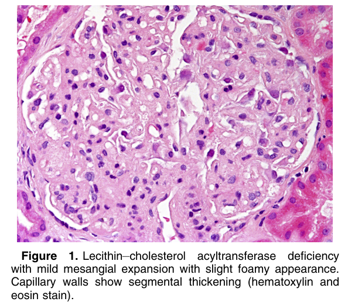
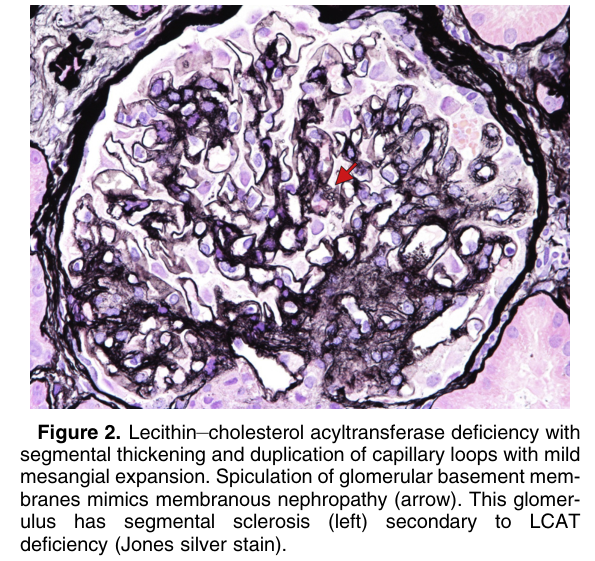
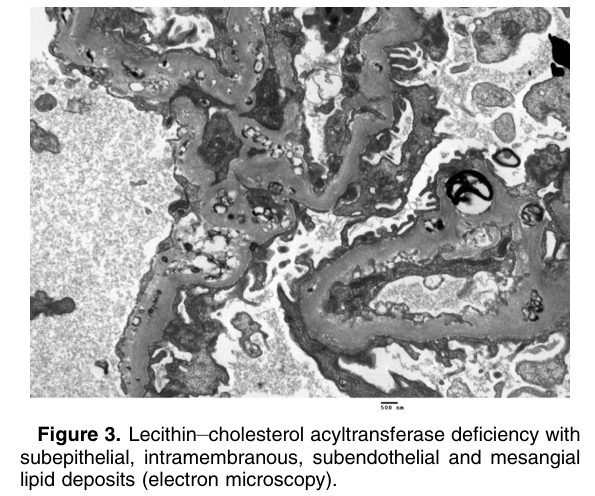

# Lecithin–Cholesterol Acyltransferase (LCAT) Deficiency - Figures and Tables Index

This document lists all figures and tables extracted from `Lecithin–Cholesterol Acyltransferase (LCAT) Deficiency.pdf`.

## Table of Contents
- [Figures](#figures)
- [Tables](#tables)

---

## Figures

### Fig_1

Figure 1. Lecithin–cholesterol acyltransferase deficiency with mild mesangial expansion with slight foamy appearance. Capillary walls show segmental thickening (hematoxylin and eosin stain).

---

### Fig_2

Figure 2. Lecithin–cholesterol acyltransferase deficiency with segmental thickening and duplication of capillary loops with mild mesangial expansion. Spiculation of glomerular basement membranes mimics membranous nephropathy (arrow). This glomerulus has segmental sclerosis (left) secondary to LCAT deficiency (Jones silver stain).

---

### Fig_3

Figure 3. Lecithin–cholesterol acyltransferase deficiency with subepithelial, intramembranous, subendothelial and mesangial lipid deposits (electron microscopy).

---

## Tables

*No tables resolved for this chapter.*
