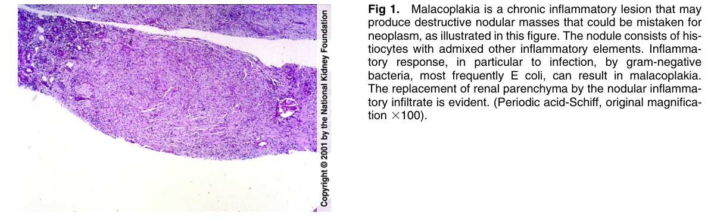
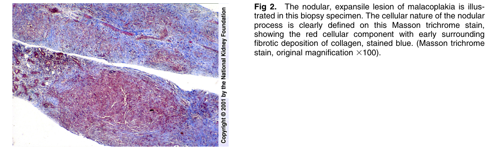
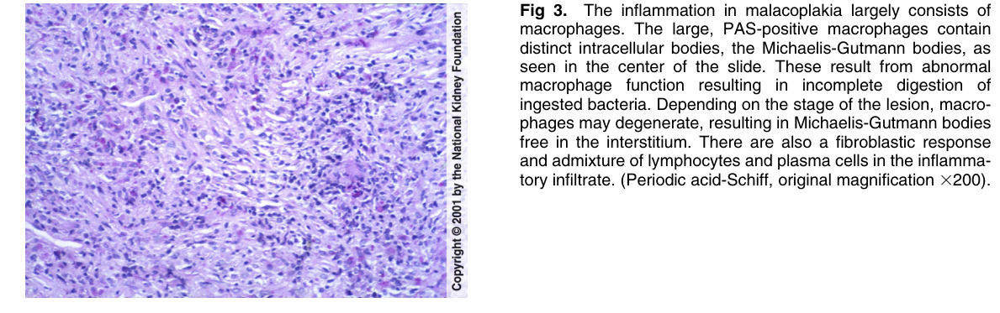
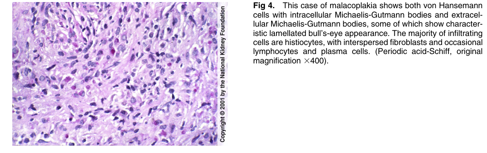
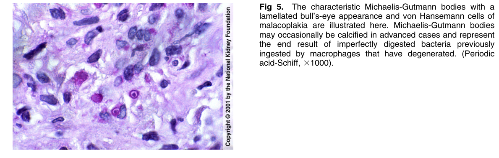

# Malacoplakia - Figures and Tables Index

This document lists all figures and tables extracted from `Malacoplakia.pdf`.

## Table of Contents
- [Figures](#figures)
- [Tables](#tables)

---

## Figures

### Fig_1

Figure 1. Malacoplakia is a chronic inflammatory lesion that may produce destructive nodular masses that could be mistaken for neoplasm, as illustrated in this figure. The nodule consists of his tiocytes with admixed other inflammatory elements. Inflammatory response, in particular to infection, by gram-negative bacteria, most frequently E coli, can result in malacoplakia. The replacement of renal parenchyma by the nodular inflammatory infiltrate is evident. (Periodic acid-Schiff, original magnification 3100).

---

### Fig_2

Figure 2. The nodular, expansile lesion of malacoplakia is illustrated in this biopsy specimen. The cellular nature of the nodular process is clearly defined on this Masson trichrome stain, showing the red cellular component with early surrounding fibrotic deposition of collagen, stained blue. (Masson trichrome stain, original magnification 3100).

---

### Fig_3

Figure 3. The inflammation in malacoplakia largely consists of macrophages. The large, PAS-positive macrophages contain distinct intracellular bodies, the Michaelis-Gutmann bodies, as seen in the center of the slide. These result from abnormal macrophage function resulting in incomplete digestion of ingested bacteria. Depending on the stage of the lesion, macrophages may degenerate, resulting in Michaelis-Gutmann bodies free in the interstitium. There are also a fibroblastic response and admixture of lymphocytes and plasma cells in the inflammatory infiltrate. (Periodic acid-Schiff, original magnification 3200).

---

### Fig_4

Figure 4. This case of malacoplakia shows both von Hansemann cells with intracellular Michaelis-Gutmann bodies and extracellular Michaelis-Gutmann bodies, some of which show characteristic lamellated bull’s-eye appearance. The majority of infiltrating cells are histiocytes, with interspersed fibroblasts and occasiona lymphocytes and plasma cells. (Periodic acid-Schiff, origina magnification 3400).

---

### Fig_5

Figure 5. The characteristic Michaelis-Gutmann bodies with a lamellated bull’s-eye appearance and von Hansemann cells of malacoplakia are illustrated here. Michaelis-Gutmann bodies may occasionally be calcified in advanced cases and represent the end result of imperfectly digested bacteria previously ingested by macrophages that have degenerated. (Periodic acid-Schiff, 31000).

---

## Tables

*No tables resolved for this chapter.*
