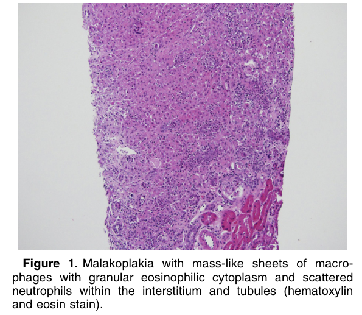
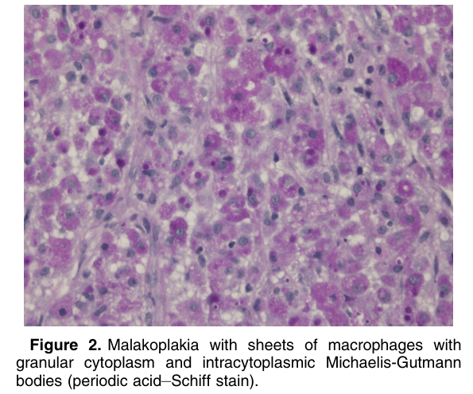
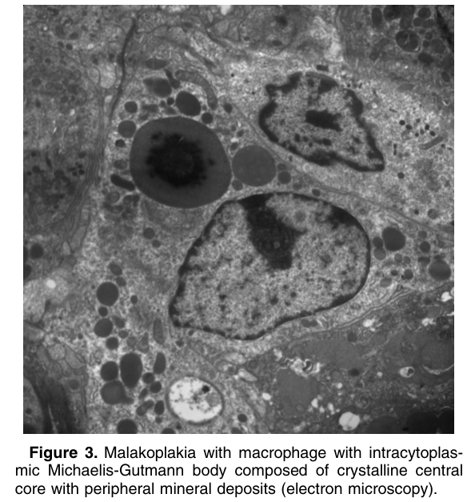

# Malakoplakia - Figures and Tables Index

This document lists all figures and tables extracted from `Malakoplakia.pdf`.

## Table of Contents
- [Figures](#figures)
- [Tables](#tables)

---

## Figures

### Fig_1

Figure 1. Malakoplakia with mass-like sheets of macrophages with granular eosinophilic cytoplasm and scattered neutrophils within the interstitium and tubules (hematoxylin and eosin stain).

---

### Fig_2

Figure 2. Malakoplakia with sheets of macrophages with granular cytoplasm and intracytoplasmic Michaelis-Gutmann bodies (periodic acid–Schiff stain).

---

### Fig_3

Figure 3. Malakoplakia with macrophage with intracytoplasmic Michaelis-Gutmann body composed of crystalline central core with peripheral mineral deposits (electron microscopy).

---

## Tables

*No tables resolved for this chapter.*
