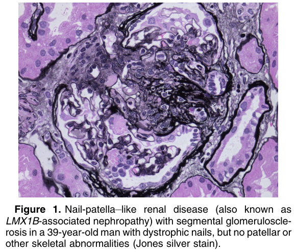
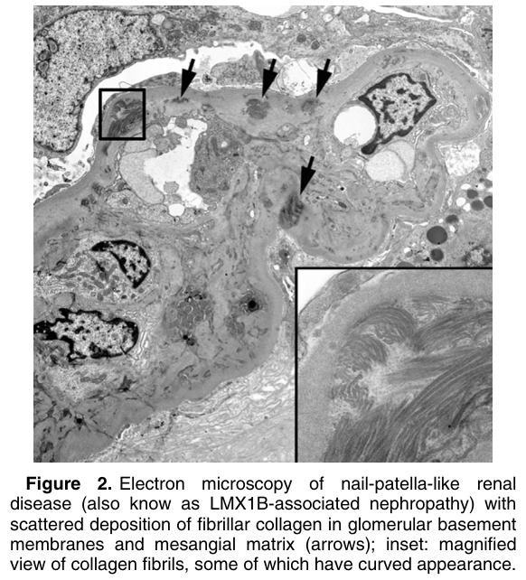

# Nail-Patella Syndrome–Associated Nephropathy - Figures and Tables Index

This document lists all figures and tables extracted from `Nail-Patella Syndrome–Associated Nephropathy.pdf`.

## Table of Contents
- [Figures](#figures)
- [Tables](#tables)

---

## Figures

### Fig_1

Figure 1. Nail-patella–like renal disease (also known as LMX1B-associated nephropathy) with segmental glomerulosclerosis in a 39-year-old man with dystrophic nails, but no patellar or other skeletal abnormalities (Jones silver stain).

---

### Fig_2

Figure 2. Electron microscopy of nail-patella-like renal disease (also know as LMX1B-associated nephropathy) with scattered deposition of fibrillar collagen in glomerular basement membranes and mesangial matrix (arrows); inset: magnified view of collagen fibrils, some of which have curved appearance.

---

## Tables

*No tables resolved for this chapter.*
