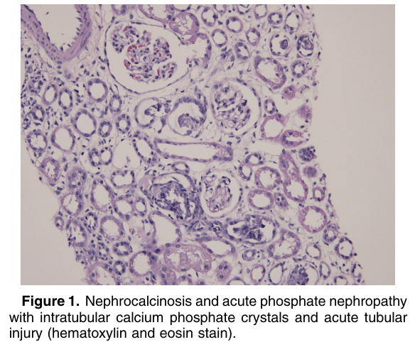
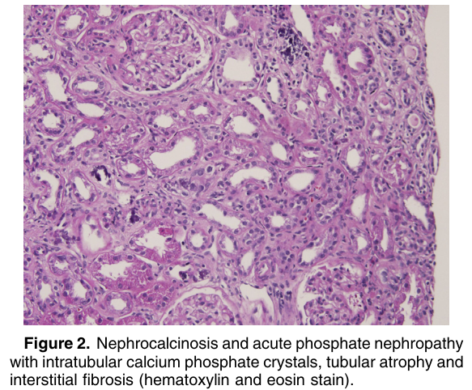

# Nephrocalcinosis and Acute Phosphate Nephropathy - Figures and Tables Index

This document lists all figures and tables extracted from `Nephrocalcinosis and Acute Phosphate Nephropathy.pdf`.

## Table of Contents
- [Figures](#figures)
- [Tables](#tables)

---

## Figures

### Fig_1

Figure 1. Nephrocalcinosis and acute phosphate nephropathy with intratubular calcium phosphate crystals and acute tubular injury (hematoxylin and eosin stain).

---

### Fig_2

Figure 2. Nephrocalcinosis and acute phosphate nephropathy with intratubular calcium phosphate crystals, tubular atrophy and interstitial fibrosis (hematoxylin and eosin stain).

---

## Tables

*No tables resolved for this chapter.*
