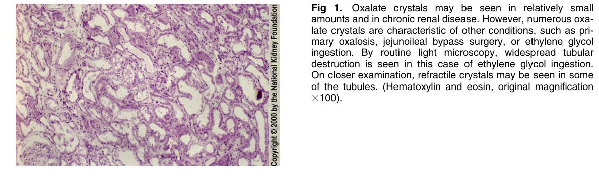
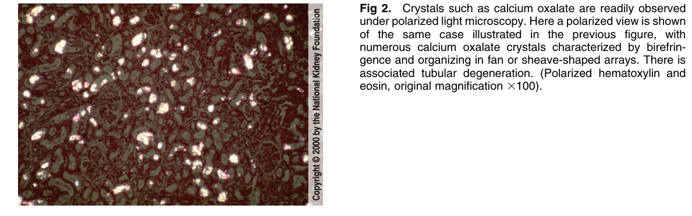

# Oxalosis 2 - Figures and Tables Index

This document lists all figures and tables extracted from `Oxalosis 2.pdf`.

## Table of Contents
- [Figures](#figures)
- [Tables](#tables)

---

## Figures

### Fig_1

Figure 1. Oxalate crystals may be seen in relatively smal amounts and in chronic renal disease. However, numerous oxalate crystals are characteristic of other conditions, such as primary oxalosis, jejunoileal bypass surgery, or ethylene glycol ingestion. By routine light microscopy, widespread tubular destruction is seen in this case of ethylene glycol ingestion. On closer examination, refractile crystals may be seen in some of the tubules. (Hematoxylin and eosin, original magnification 3100).

---

### Fig_2

Figure 2. Crystals such as calcium oxalate are readily observed under polarized light microscopy. Here a polarized view is shown of the same case illustrated in the previous figure, with numerous calcium oxalate crystals characterized by birefringence and organizing in fan or sheave-shaped arrays. There is associated tubular degeneration. (Polarized hematoxylin and eosin, original magnification 3100).

---

## Tables

*No tables resolved for this chapter.*
