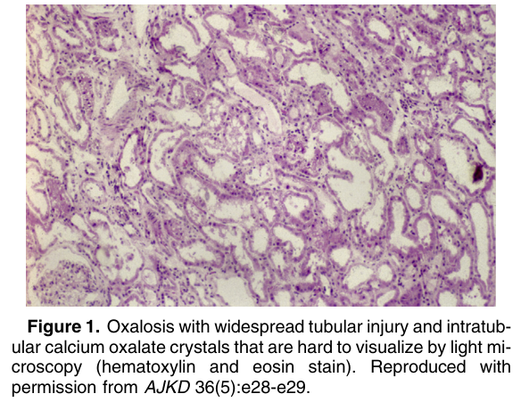
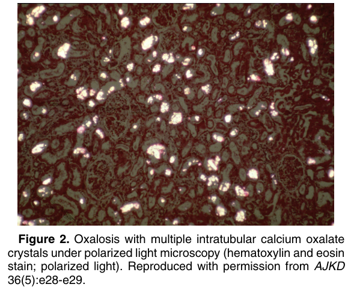
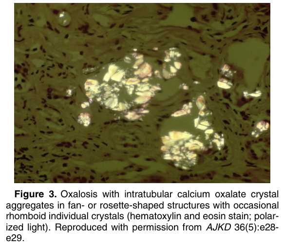

# Oxalosis - Figures and Tables Index

This document lists all figures and tables extracted from `Oxalosis.pdf`.

## Table of Contents
- [Figures](#figures)
- [Tables](#tables)

---

## Figures

### Fig_1

Figure 1. Oxalosis with widespread tubular injury and intratubular calcium oxalate crystals that are hard to visualize by light microscopy (hematoxylin and eosin stain). Reproduced with permission from AJKD 36(5):e28-e29.

---

### Fig_2

Figure 2. Oxalosis with multiple intratubular calcium oxalate crystals under polarized light microscopy (hematoxylin and eosin stain; polarized light). Reproduced with permission from AJKD 36(5):e28-e29.

---

### Fig_3

Figure 3. Oxalosis with intratubular calcium oxalate crystal aggregates in fan- or rosette-shaped structures with occasional rhomboid individual crystals (hematoxylin and eosin stain; polarized light). Reproduced with permission from AJKD 36(5):e28e29.

---

## Tables

*No tables resolved for this chapter.*
