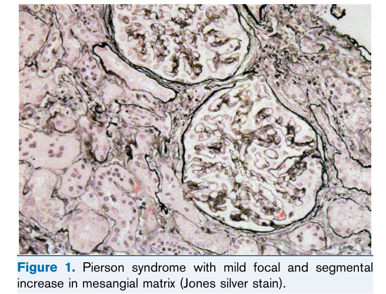
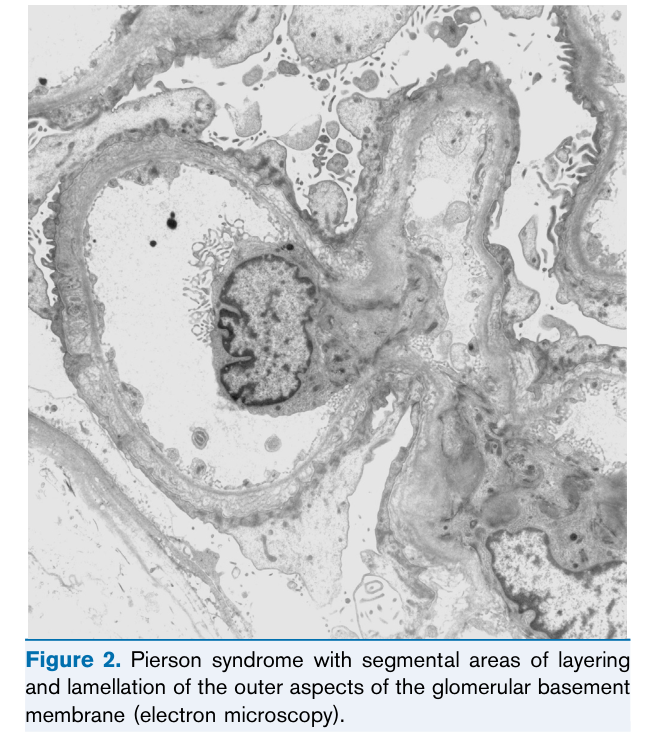

# Pierson Syndrome - Figures and Tables Index

This document lists all figures and tables extracted from `Pierson Syndrome.pdf`.

## Table of Contents
- [Figures](#figures)
- [Tables](#tables)

---

## Figures

### Fig_1

Figure 1. Pierson syndrome with mild focal and segmental increase in mesangial matrix (Jones silver stain).

---

### Fig_2

Figure 2. Pierson syndrome with segmental areas of layering and lamellation of the outer aspects of the glomerular basement membrane (electron microscopy).

---

## Tables

*No tables resolved for this chapter.*
