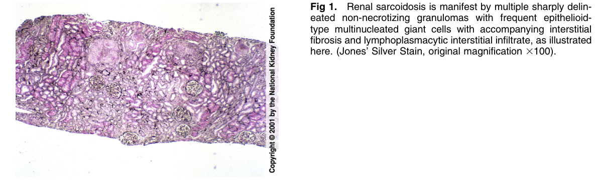
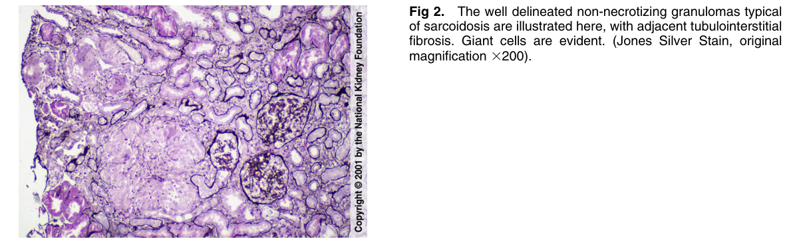

# Sarcoidosis 2 - Figures and Tables Index

This document lists all figures and tables extracted from `Sarcoidosis 2.pdf`.

## Table of Contents
- [Figures](#figures)
- [Tables](#tables)

---

## Figures

### Fig_1

Figure 1. Renal sarcoidosis is manifest by multiple sharply delineated non-necrotizing granulomas with frequent epithelioidtype multinucleated giant cells with accompanying interstitia fibrosis and lymphoplasmacytic interstitial infiltrate, as illustrated here. (Jones’ Silver Stain, original magnification 3100).

---

### Fig_2

Fig 2. The well delineated non-necrotizing granulomas typical of sarcoidosis are illustrated here, with adjacent tubulointerstitial fibrosis. Giant cells are evident. (Jones Silver Stain, original magnification 3200).

---

## Tables

*No tables resolved for this chapter.*
