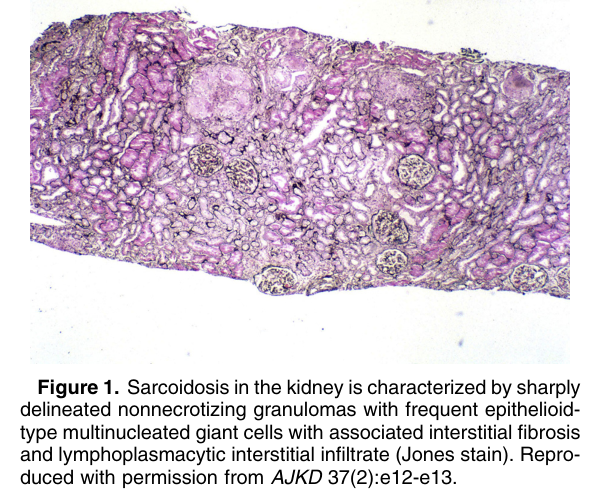
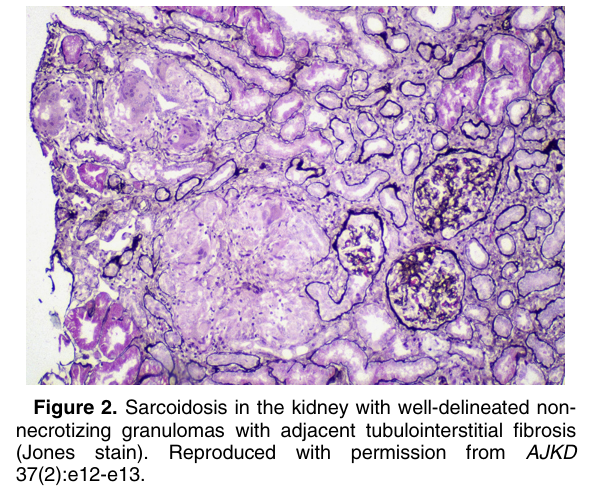
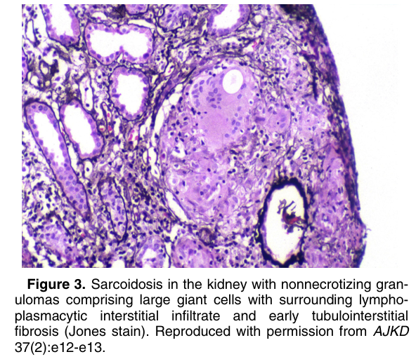
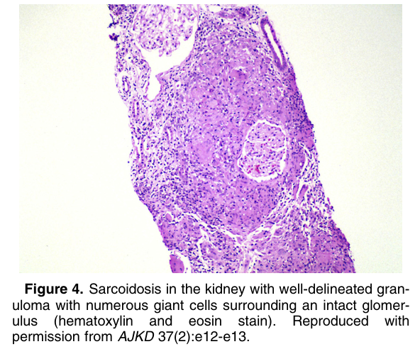
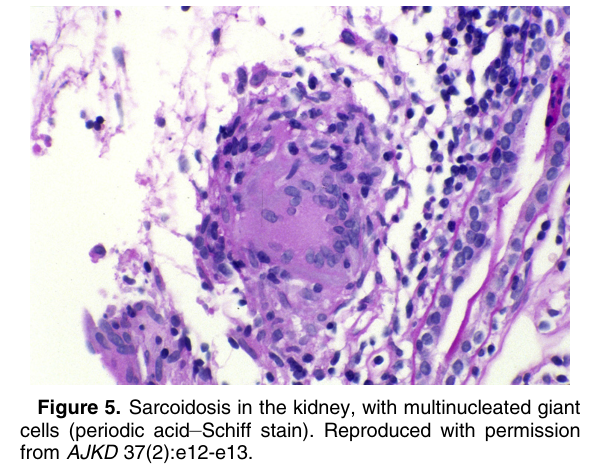

# Sarcoidosis - Figures and Tables Index

This document lists all figures and tables extracted from `Sarcoidosis.pdf`.

## Table of Contents
- [Figures](#figures)
- [Tables](#tables)

---

## Figures

### Fig_1

Figure 1. Sarcoidosis in the kidney is characterized by sharply delineated nonnecrotizing granulomas with frequent epithelioid type multinucleated giant cells with associated interstitial fibrosis and lymphoplasmacytic interstitial infiltrate (Jones stain). Repro duced with permission from AJKD 37(2):e12-e13.

---

### Fig_2

Figure 2. Sarcoidosis in the kidney with well-delineated nonnecrotizing granulomas with adjacent tubulointerstitial fibrosis (Jones stain). Reproduced with permission from AJKD 37(2):e12-e13.

---

### Fig_3

Figure 3. Sarcoidosis in the kidney with nonnecrotizing granulomas comprising large giant cells with surrounding lymphoplasmacytic interstitial infiltrate and early tubulointerstitial fibrosis (Jones stain). Reproduced with permission from AJKD 37(2):e12-e13.

---

### Fig_4

Figure 4. Sarcoidosis in the kidney with well-delineated granuloma with numerous giant cells surrounding an intact glomerulus (hematoxylin and eosin stain). Reproduced with permission from AJKD 37(2):e12-e13.

---

### Fig_5

Figure 5. Sarcoidosis in the kidney, with multinucleated giant cells (periodic acid–Schiff stain). Reproduced with permission from AJKD 37(2):e12-e13.

---

## Tables

*No tables resolved for this chapter.*
