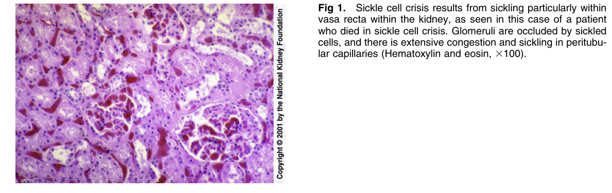
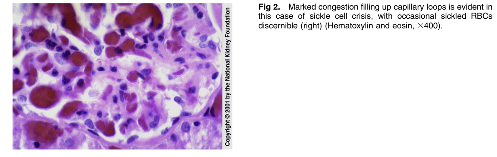
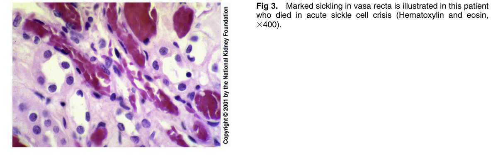
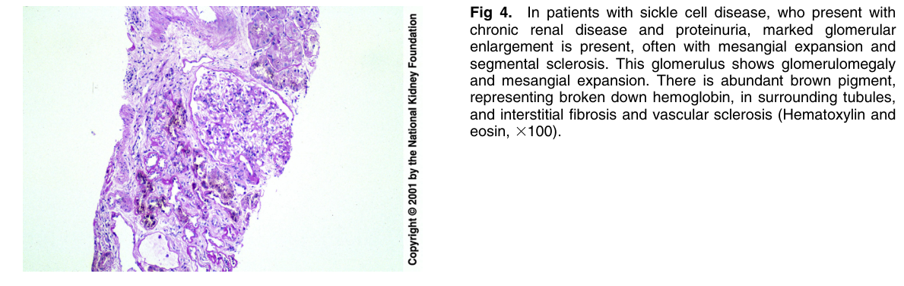
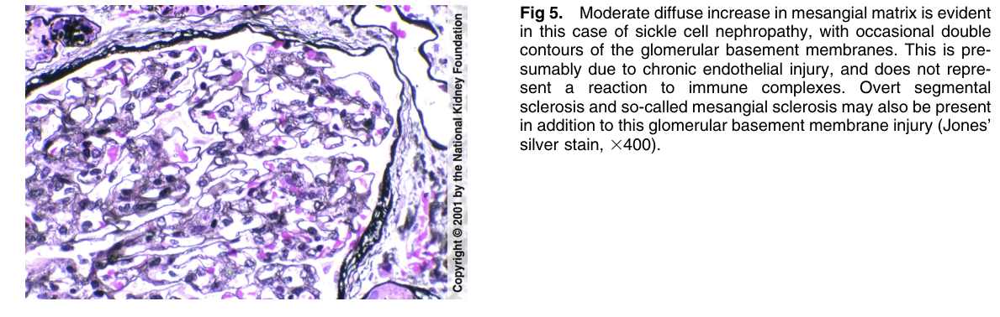
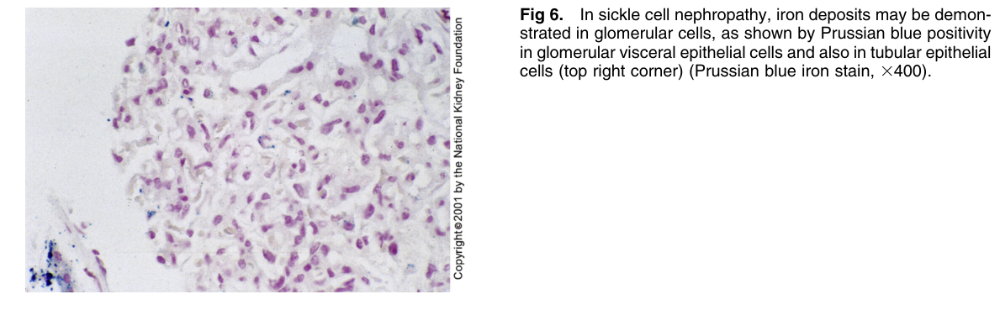
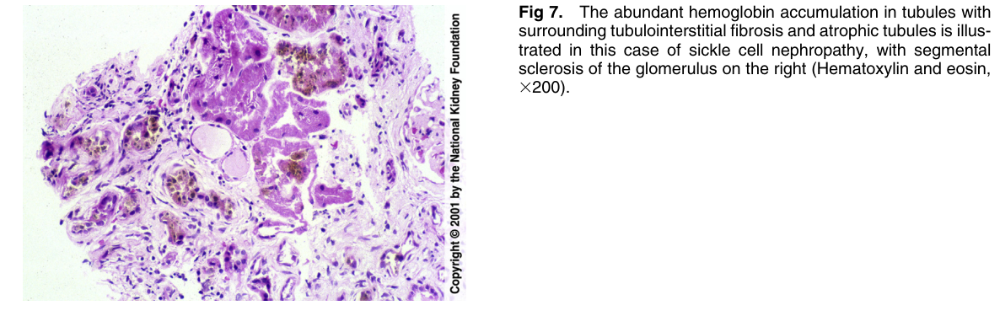
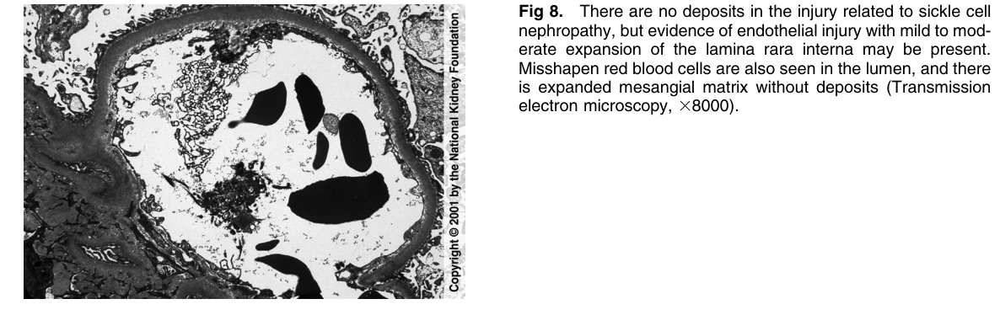

# Sickle Cell Nephropathy 2 - Figures and Tables Index

This document lists all figures and tables extracted from `Sickle Cell Nephropathy 2.pdf`.

## Table of Contents
- [Figures](#figures)
- [Tables](#tables)

---

## Figures

### Fig_1

Figure 1. Sickle cell crisis results from sickling particularly within vasa recta within the kidney, as seen in this case of a patien who died in sickle cell crisis. Glomeruli are occluded by sickled cells, and there is extensive congestion and sickling in peritubu lar capillaries (Hematoxylin and eosin, 3100).

---

### Fig_2

Figure 2. Marked congestion filling up capillary loops is evident in this case of sickle cell crisis, with occasional sickled RBCs discernible (right) (Hematoxylin and eosin, 3400).

---

### Fig_3

Figure 3. Marked sickling in vasa recta is illustrated in this patien who died in acute sickle cell crisis (Hematoxylin and eosin, 3400).

---

### Fig_4

Figure 4. In patients with sickle cell disease, who present with chronic renal disease and proteinuria, marked glomerular enlargement is present, often with mesangial expansion and segmental sclerosis. This glomerulus shows glomerulomegal and mesangial expansion. There is abundant brown pigment, representing broken down hemoglobin, in surrounding tubules, and interstitial fibrosis and vascular sclerosis (Hematoxylin and eosin, 3100).

---

### Fig_5

Figure 5. Moderate diffuse increase in mesangial matrix is evident in this case of sickle cell nephropathy, with occasional double contours of the glomerular basement membranes. This is presumably due to chronic endothelial injury, and does not represent a reaction to immune complexes. Overt segmenta sclerosis and so-called mesangial sclerosis may also be present in addition to this glomerular basement membrane injury (Jones silver stain, 3400).

---

### Fig_6

Figure 6. In sickle cell nephropathy, iron deposits may be demonstrated in glomerular cells, as shown by Prussian blue positivity in glomerular visceral epithelial cells and also in tubular epithelia cells (top right corner) (Prussian blue iron stain, 3400).

---

### Fig_7

Figure 7. The abundant hemoglobin accumulation in tubules with surrounding tubulointerstitial fibrosis and atrophic tubules is illustrated in this case of sickle cell nephropathy, with segmenta sclerosis of the glomerulus on the right (Hematoxylin and eosin, 3200).

---

### Fig_8

Figure 8. There are no deposits in the injury related to sickle cel nephropathy, but evidence of endothelial injury with mild to moderate expansion of the lamina rara interna may be present. Misshapen red blood cells are also seen in the lumen, and there is expanded mesangial matrix without deposits (Transmission electron microscopy, 38000).

---

## Tables

*No tables resolved for this chapter.*
