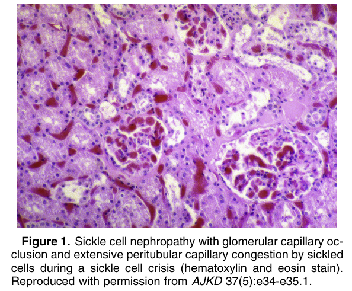
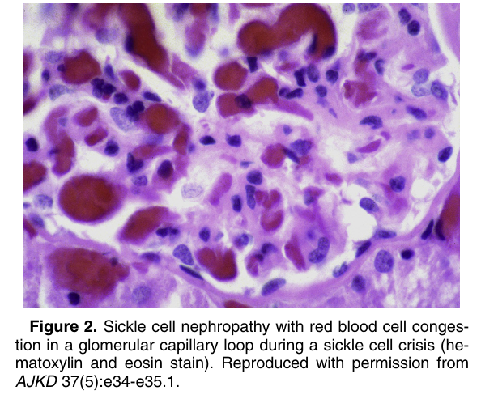
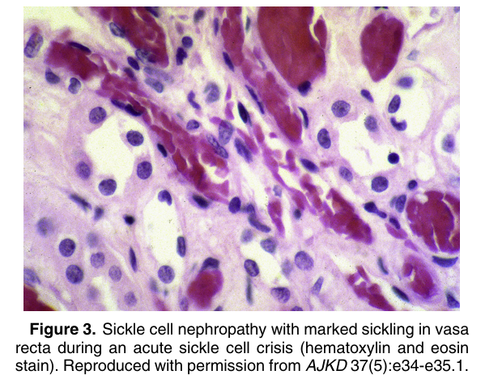
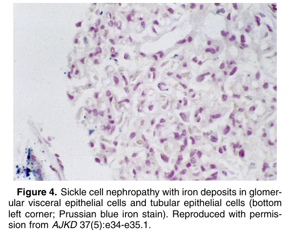
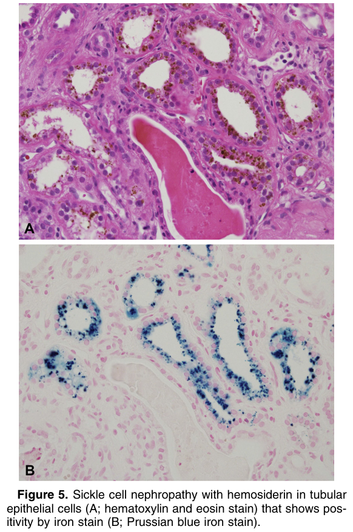
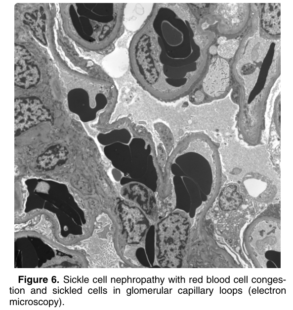

# Sickle Cell Nephropathy - Figures and Tables Index

This document lists all figures and tables extracted from `Sickle Cell Nephropathy.pdf`.

## Table of Contents
- [Figures](#figures)
- [Tables](#tables)

---

## Figures

### Fig_1

Figure 1. Sickle cell nephropathy with glomerular capillary occlusion and extensive peritubular capillary congestion by sickled cells during a sickle cell crisis (hematoxylin and eosin stain). Reproduced with permission from AJKD 37(5):e34-e35.1.

---

### Fig_2

Figure 2. Sickle cell nephropathy with red blood cell congestion in a glomerular capillary loop during a sickle cell crisis (hematoxylin and eosin stain). Reproduced with permission from AJKD 37(5):e34-e35.1.

---

### Fig_3

Figure 3. Sickle cell nephropathy with marked sickling in vasa recta during an acute sickle cell crisis (hematoxylin and eosin stain). Reproduced with permission from AJKD 37(5):e34-e35.1.

---

### Fig_4

Figure 4. Sickle cell nephropathy with iron deposits in glomerular visceral epithelial cells and tubular epithelial cells (bottom left corner; Prussian blue iron stain). Reproduced with permission from AJKD 37(5):e34-e35.1.

---

### Fig_5

Figure 5. Sickle cell nephropathy with hemosiderin in tubular epithelial cells (A; hematoxylin and eosin stain) that shows pos itivity by iron stain (B; Prussian blue iron stain).

---

### Fig_6

Figure 6. Sickle cell nephropathy with red blood cell congestion and sickled cells in glomerular capillary loops (electron microscopy).

---

## Tables

*No tables resolved for this chapter.*
