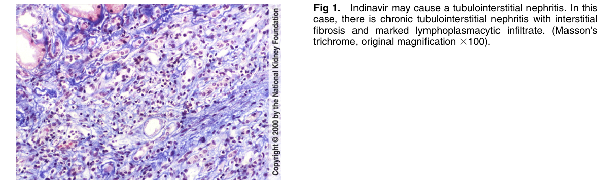
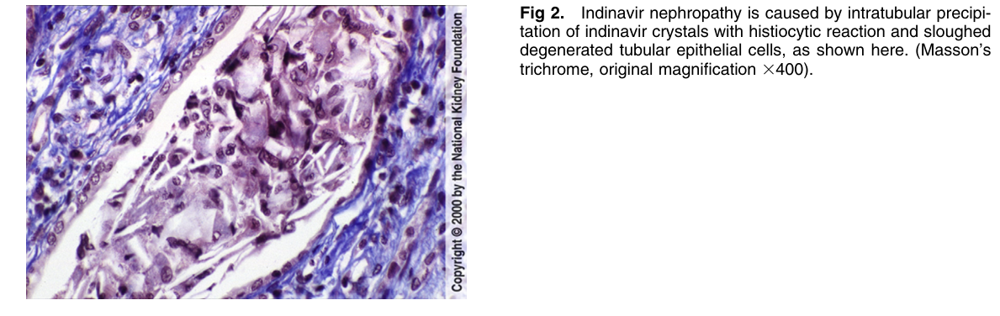

# Indinavir Nephropathy - Figures and Tables Index

This document lists all figures and tables extracted from `Indinavir Nephropathy.pdf`.

## Table of Contents
- [Figures](#figures)
- [Tables](#tables)

---

## Figures

### Fig_1

Figure 1. Indinavir may cause a tubulointerstitial nephritis. In this case, there is chronic tubulointerstitial nephritis with interstitia fibrosis and marked lymphoplasmacytic infiltrate. (Masson’s trichrome, original magnification 3100).

---

### Fig_2

Figure 2. Indinavir nephropathy is caused by intratubular precipitation of indinavir crystals with histiocytic reaction and sloughed degenerated tubular epithelial cells, as shown here. (Masson’s trichrome, original magnification 3400).

---

## Tables

*No tables resolved for this chapter.*
