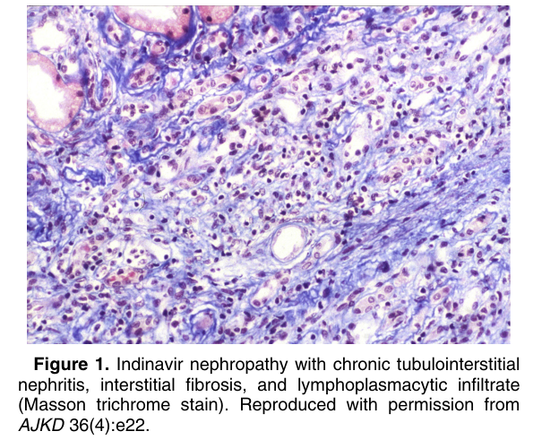
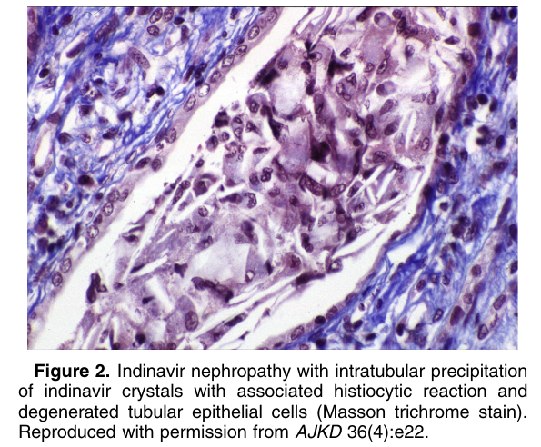

# Indinavir Nephrotoxicity - Figures and Tables Index

This document lists all figures and tables extracted from `Indinavir Nephrotoxicity.pdf`.

## Table of Contents
- [Figures](#figures)
- [Tables](#tables)

---

## Figures

### Fig_1

Figure 1. Indinavir nephropathy with chronic tubulointerstitial nephritis, interstitial fibrosis, and lymphoplasmacytic infiltrate (Masson trichrome stain). Reproduced with permission from AJKD 36(4):e22.

---

### Fig_2

Figure 2. Indinavir nephropathy with intratubular precipitation of indinavir crystals with associated histiocytic reaction and degenerated tubular epithelial cells (Masson trichrome stain). Reproduced with permission from AJKD 36(4):e22.

---

## Tables

*No tables resolved for this chapter.*
