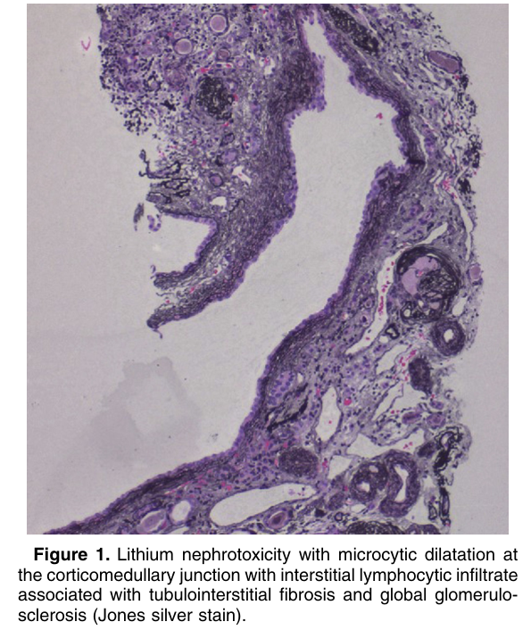
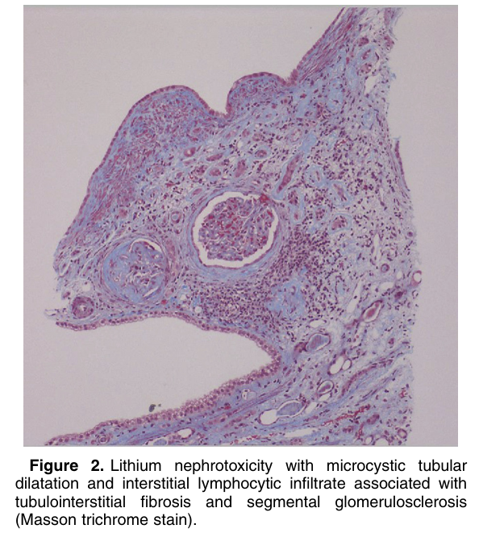

# Lithium Nephrotoxicity - Figures and Tables Index

This document lists all figures and tables extracted from `Lithium Nephrotoxicity.pdf`.

## Table of Contents
- [Figures](#figures)
- [Tables](#tables)

---

## Figures

### Fig_1

Figure 1. Lithium nephrotoxicity with microcytic dilatation at the corticomedullary junction with interstitial lymphocytic infiltrate associated with tubulointerstitial fibrosis and global glomerulo sclerosis (Jones silver stain).

---

### Fig_2

Figure 2. Lithium nephrotoxicity with microcystic tubular dilatation and interstitial lymphocytic infiltrate associated with tubulointerstitial fibrosis and segmental glomerulosclerosis (Masson trichrome stain).

---

## Tables

*No tables resolved for this chapter.*
