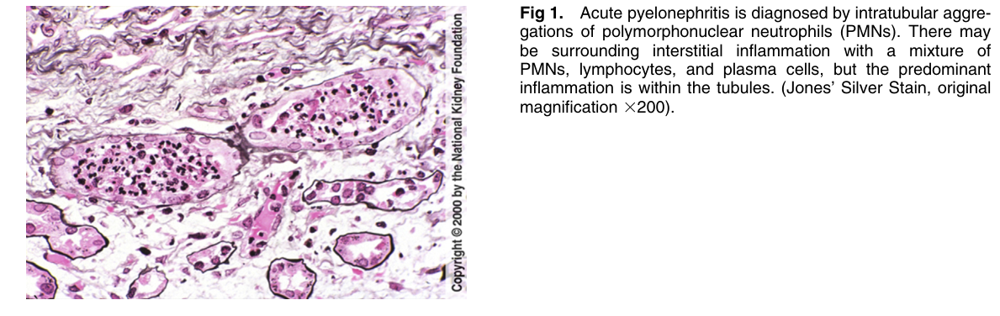
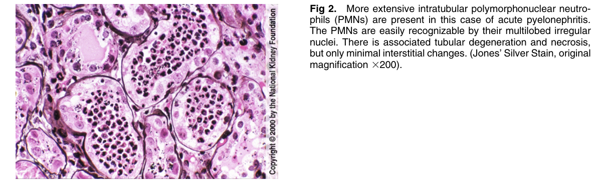

# Acute Pyelonephritis 2 - Figures and Tables Index

This document lists all figures and tables extracted from `Acute Pyelonephritis 2.pdf`.

## Table of Contents
- [Figures](#figures)
- [Tables](#tables)

---

## Figures

### Fig_1

Figure 1. Acute pyelonephritis is diagnosed by intratubular aggregations of polymorphonuclear neutrophils (PMNs). There may be surrounding interstitial inflammation with a mixture of PMNs, lymphocytes, and plasma cells, but the predominant inflammation is within the tubules. (Jones’ Silver Stain, origina magnification 3200).

---

### Fig_2

Figure 2. More extensive intratubular polymorphonuclear neutrophils (PMNs) are present in this case of acute pyelonephritis. The PMNs are easily recognizable by their multilobed irregular nuclei. There is associated tubular degeneration and necrosis, but only minimal interstitial changes. (Jones’ Silver Stain, origina magnification 3200).

---

## Tables

*No tables resolved for this chapter.*
