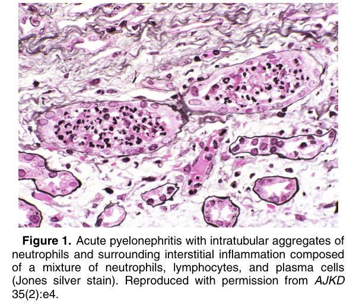
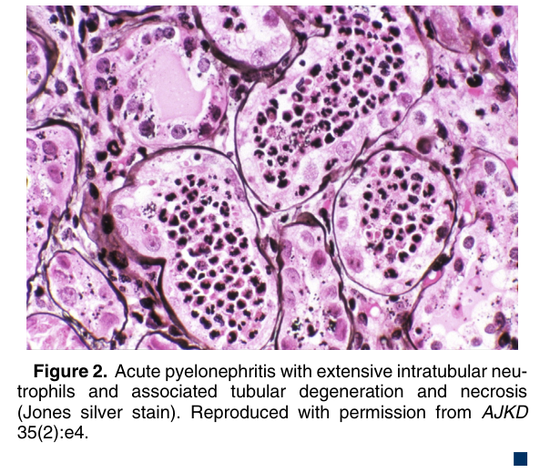

# Acute Pyelonephritis - Figures and Tables Index

This document lists all figures and tables extracted from `Acute Pyelonephritis.pdf`.

## Table of Contents
- [Figures](#figures)
- [Tables](#tables)

---

## Figures

### Fig_1

Figure 1. Acute pyelonephritis with intratubular aggregates of neutrophils and surrounding interstitial inflammation composed of a mixture of neutrophils, lymphocytes, and plasma cells (Jones silver stain). Reproduced with permission from AJKD 35(2):e4.

---

### Fig_2

Figure 2. Acute pyelonephritis with extensive intratubular neutrophils and associated tubular degeneration and necrosis (Jones silver stain). Reproduced with permission from AJKD 35(2):e4. -

---

## Tables

*No tables resolved for this chapter.*
