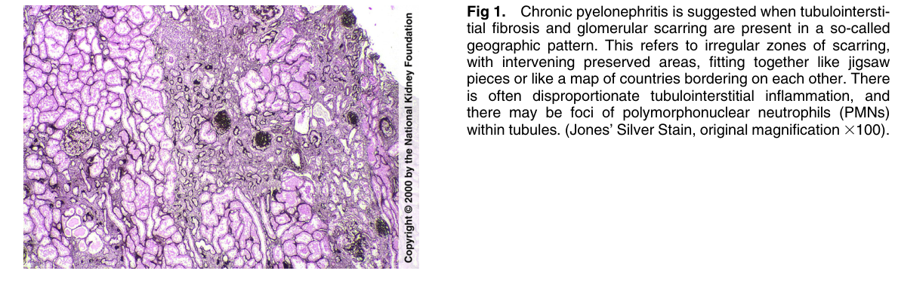
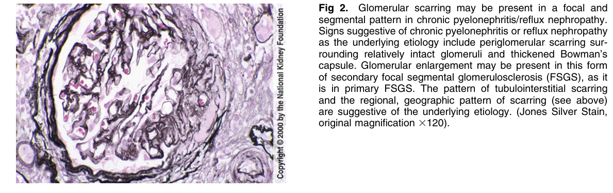
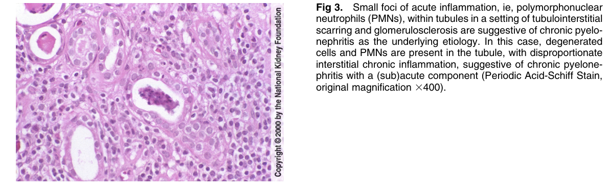
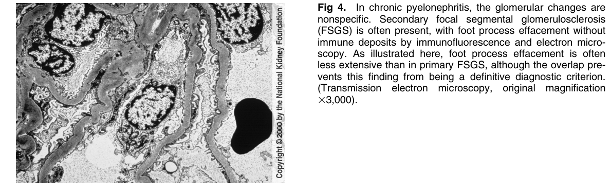

# Chronic Pyelonephritis 2 - Figures and Tables Index

This document lists all figures and tables extracted from `Chronic Pyelonephritis 2.pdf`.

## Table of Contents
- [Figures](#figures)
- [Tables](#tables)

---

## Figures

### Fig_1

Figure 1. Chronic pyelonephritis is suggested when tubulointerstitial fibrosis and glomerular scarring are present in a so-called geographic pattern. This refers to irregular zones of scarring, with intervening preserved areas, fitting together like jigsaw pieces or like a map of countries bordering on each other. There is often disproportionate tubulointerstitial inflammation, and there may be foci of polymorphonuclear neutrophils (PMNs) within tubules. (Jones’ Silver Stain, original magnification 3100).

---

### Fig_2

Figure 2. Glomerular scarring may be present in a focal and segmental pattern in chronic pyelonephritis/reflux nephropathy. Signs suggestive of chronic pyelonephritis or reflux nephropathy as the underlying etiology include periglomerular scarring surrounding relatively intact glomeruli and thickened Bowman’s capsule. Glomerular enlargement may be present in this form of secondary focal segmental glomerulosclerosis (FSGS), as it is in primary FSGS. The pattern of tubulointerstitial scarring and the regional, geographic pattern of scarring (see above) are suggestive of the underlying etiology. (Jones Silver Stain, original magnification 3120).

---

### Fig_3

Figure 3. Small foci of acute inflammation, ie, polymorphonuclear neutrophils (PMNs), within tubules in a setting of tubulointerstitia scarring and glomerulosclerosis are suggestive of chronic pyelonephritis as the underlying etiology. In this case, degenerated cells and PMNs are present in the tubule, with disproportionate interstitial chronic inflammation, suggestive of chronic pyelonephritis with a (sub)acute component (Periodic Acid-Schiff Stain, original magnification 3400).

---

### Fig_4

Figure 4. In chronic pyelonephritis, the glomerular changes are nonspecific. Secondary focal segmental glomerulosclerosis (FSGS) is often present, with foot process effacement withou immune deposits by immunofluorescence and electron micro scopy. As illustrated here, foot process effacement is often less extensive than in primary FSGS, although the overlap prevents this finding from being a definitive diagnostic criterion. (Transmission electron microscopy, original magnification 33,000).

---

## Tables

*No tables resolved for this chapter.*
