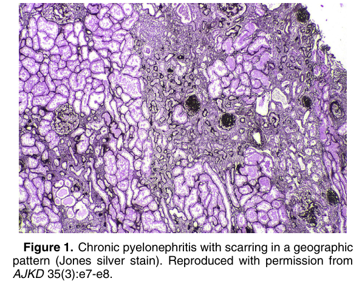
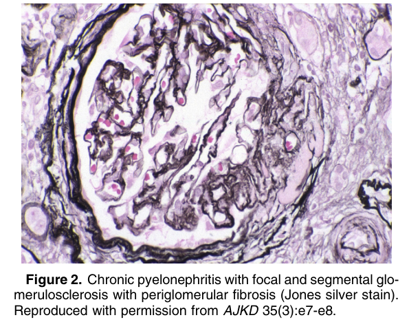
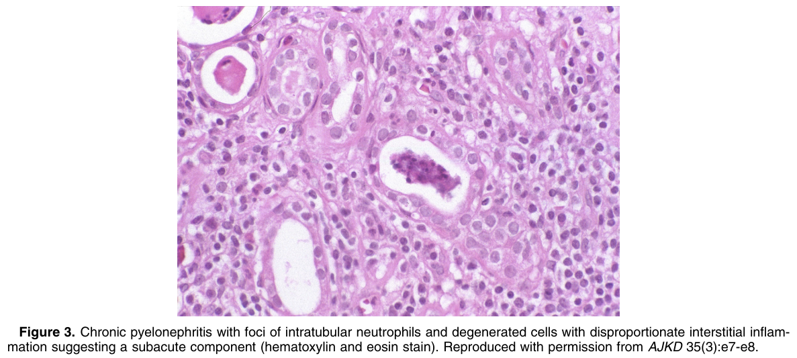
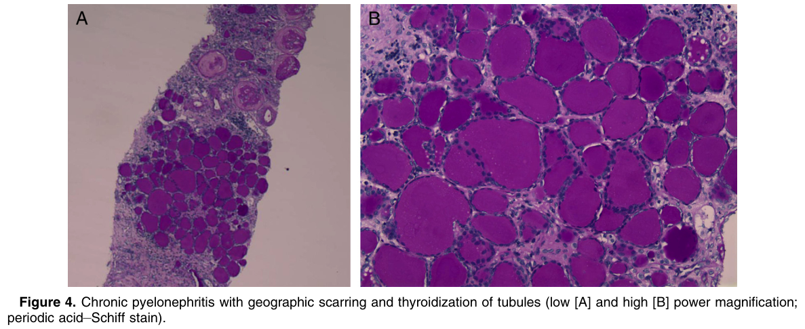
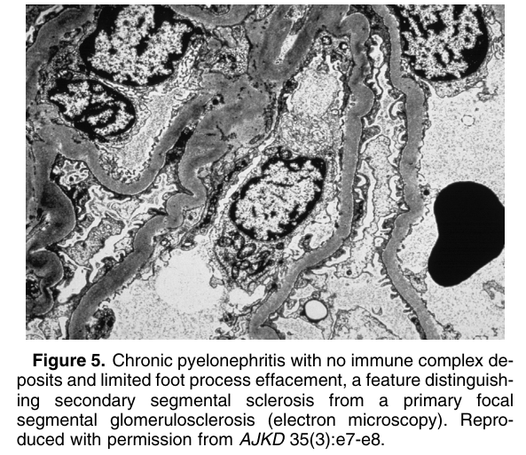

# Chronic Pyelonephritis - Figures and Tables Index

This document lists all figures and tables extracted from `Chronic Pyelonephritis.pdf`.

## Table of Contents
- [Figures](#figures)
- [Tables](#tables)

---

## Figures

### Fig_1

Figure 1. Chronic pyelonephritis with scarring in a geographic pattern (Jones silver stain). Reproduced with permission from AJKD 35(3):e7-e8.

---

### Fig_2

Figure 2. Chronic pyelonephritis with focal and segmental glo merulosclerosis with periglomerular fibrosis (Jones silver stain). Reproduced with permission from AJKD 35(3):e7-e8.

---

### Fig_3

Figure 3. Chronic pyelonephritis with foci of intratubular neutrophils and degenerated cells with disproportionate interstitial inflammation suggesting a subacute component (hematoxylin and eosin stain). Reproduced with permission from AJKD 35(3):e7-e8.

---

### Fig_4

Figure 4. Chronic pyelonephritis with geographic scarring and thyroidization of tubules (low [A] and high [B] power magnification; periodic acid–Schiff stain).

---

### Fig_5

Figure 5. Chronic pyelonephritis with no immune complex deposits and limited foot process effacement, a feature distinguishing secondary segmental sclerosis from a primary focal segmental glomerulosclerosis (electron microscopy). Reproduced with permission from AJKD 35(3):e7-e8.

---

## Tables

*No tables resolved for this chapter.*
