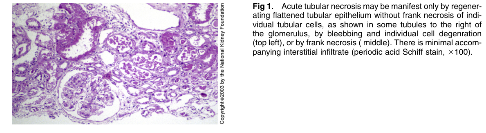
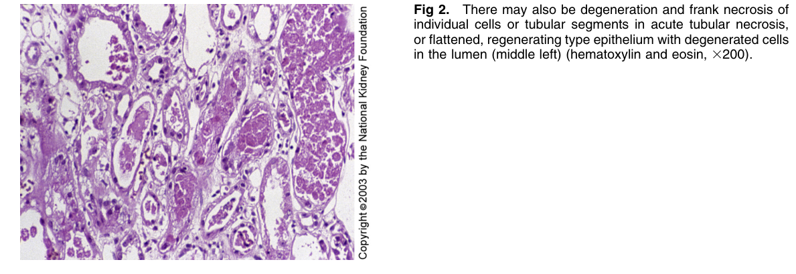
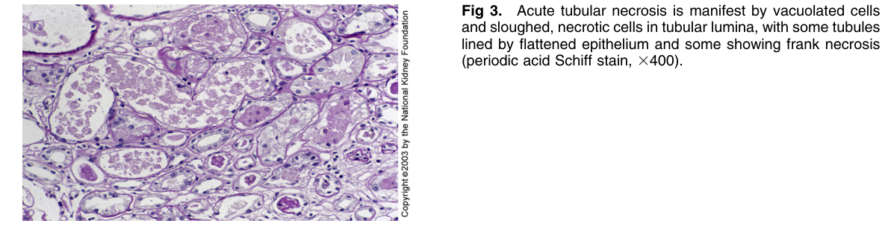

# Acute Tubular Necrosis - Figures and Tables Index

This document lists all figures and tables extracted from `Acute Tubular Necrosis.pdf`.

## Table of Contents
- [Figures](#figures)
- [Tables](#tables)

---

## Figures

### Fig_1

Figure 1. Acute tubular necrosis may be manifest only by regenerating flattened tubular epithelium without frank necrosis of individual tubular cells, as shown in some tubules to the right of the glomerulus, by bleebbing and individual cell degenration (top left), or by frank necrosis ( middle). There is minimal accompanying interstitial infiltrate (periodic acid Schiff stain, 3100).

---

### Fig_2

Figure 2. There may also be degeneration and frank necrosis of individual cells or tubular segments in acute tubular necrosis, or flattened, regenerating type epithelium with degenerated cells in the lumen (middle left) (hematoxylin and eosin, 3200).

---

### Fig_3

Figure 3. Acute tubular necrosis is manifest by vacuolated cells and sloughed, necrotic cells in tubular lumina, with some tubules lined by flattened epithelium and some showing frank necrosis (periodic acid Schiff stain, 3400).

---

## Tables

*No tables resolved for this chapter.*
