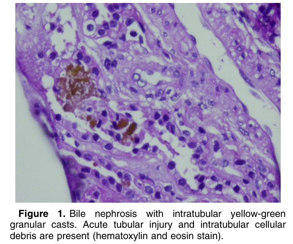
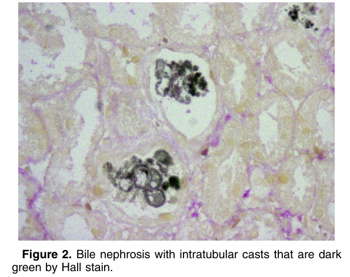

# Bile Nephrosis - Figures and Tables Index

This document lists all figures and tables extracted from `Bile Nephrosis.pdf`.

## Table of Contents
- [Figures](#figures)
- [Tables](#tables)

---

## Figures

### Fig_1

Figure 1. Bile nephrosis with intratubular yellow-green granular casts. Acute tubular injury and intratubular cellular debris are present (hematoxylin and eosin stain).

---

### Fig_2

Figure 2. Bile nephrosis with intratubular casts that are dark green by Hall stain.

---

## Tables

*No tables resolved for this chapter.*
