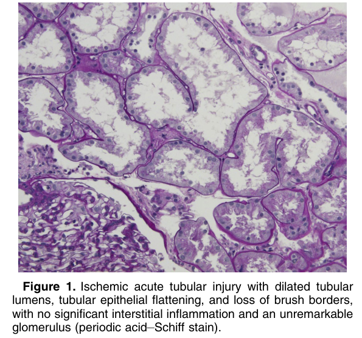
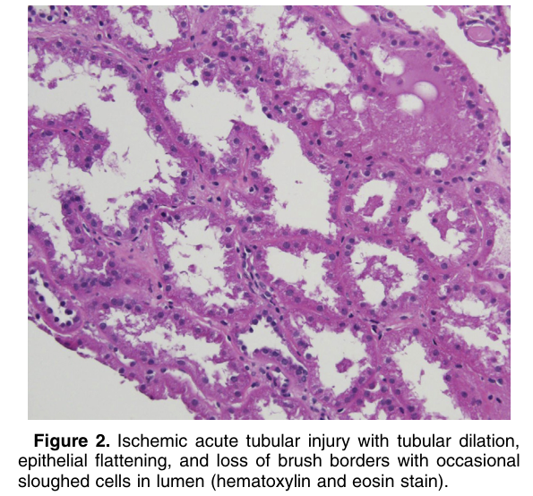

# Ischemic Acute Tubular Injury - Figures and Tables Index

This document lists all figures and tables extracted from `Ischemic Acute Tubular Injury.pdf`.

## Table of Contents
- [Figures](#figures)
- [Tables](#tables)

---

## Figures

### Fig_1

Figure 1. Ischemic acute tubular injury with dilated tubular lumens, tubular epithelial flattening, and loss of brush borders, with no significant interstitial inflammation and an unremarkable glomerulus (periodic acid–Schiff stain).

---

### Fig_2

Figure 2. Ischemic acute tubular injury with tubular dilation, epithelial flattening, and loss of brush borders with occasional sloughed cells in lumen (hematoxylin and eosin stain).

---

## Tables

*No tables resolved for this chapter.*
