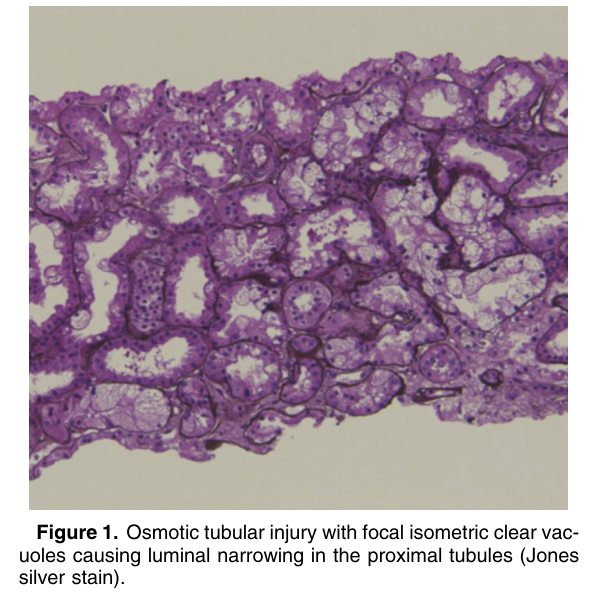
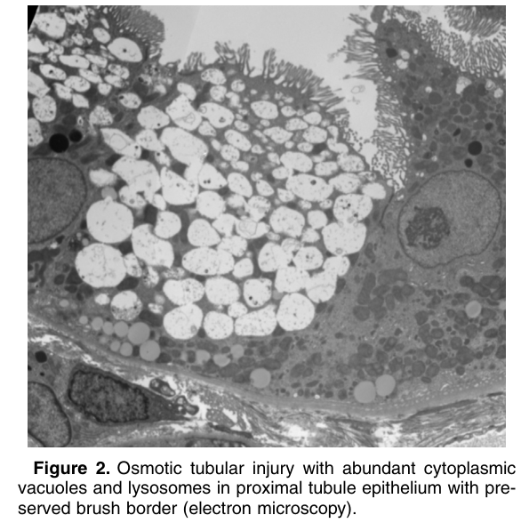

# Osmotic Tubular Injury - Figures and Tables Index

This document lists all figures and tables extracted from `Osmotic Tubular Injury.pdf`.

## Table of Contents
- [Figures](#figures)
- [Tables](#tables)

---

## Figures

### Fig_1

Figure 1. Osmotic tubular injury with focal isometric clear vacuoles causing luminal narrowing in the proximal tubules (Jones silver stain).

---

### Fig_2

Figure 2. Osmotic tubular injury with abundant cytoplasmic vacuoles and lysosomes in proximal tubule epithelium with preserved brush border (electron microscopy).

---

## Tables

*No tables resolved for this chapter.*
