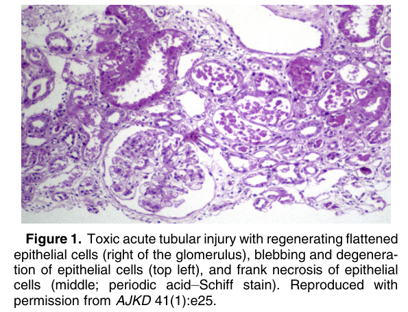
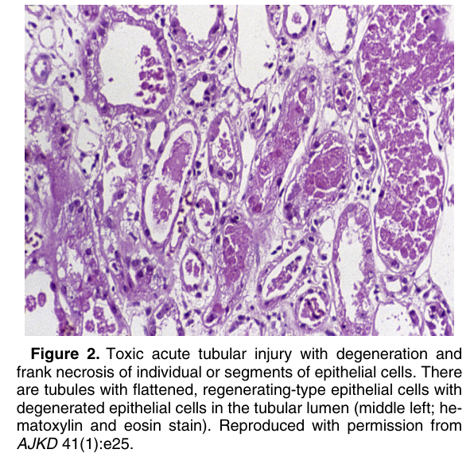
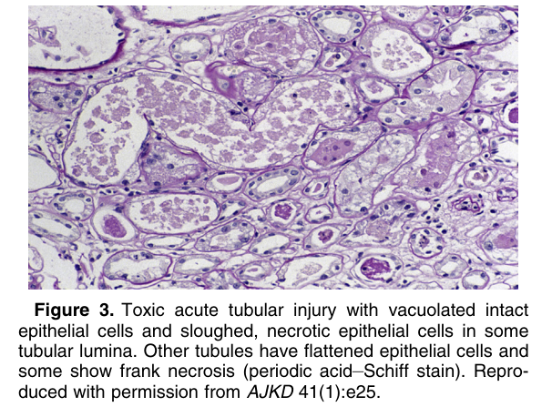

# Toxic Acute Tubular Injury - Figures and Tables Index

This document lists all figures and tables extracted from `Toxic Acute Tubular Injury.pdf`.

## Table of Contents
- [Figures](#figures)
- [Tables](#tables)

---

## Figures

### Fig_1

Figure 1. Toxic acute tubular injury with regenerating flattened epithelial cells (right of the glomerulus), blebbing and degeneration of epithelial cells (top left), and frank necrosis of epithelial cells (middle; periodic acid–Schiff stain). Reproduced with permission from AJKD 41(1):e25.

---

### Fig_2

Figure 2. Toxic acute tubular injury with degeneration and frank necrosis of individual or segments of epithelial cells. There are tubules with flattened, regenerating-type epithelial cells with degenerated epithelial cells in the tubular lumen (middle left; hematoxylin and eosin stain). Reproduced with permission from AJKD 41(1):e25.

---

### Fig_3

Figure 3. Toxic acute tubular injury with vacuolated intact epithelial cells and sloughed, necrotic epithelial cells in some tubular lumina. Other tubules have flattened epithelial cells and some show frank necrosis (periodic acid–Schiff stain). Reproduced with permission from AJKD 41(1):e25.

---

## Tables

*No tables resolved for this chapter.*
