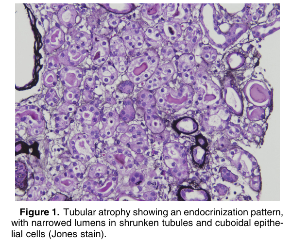
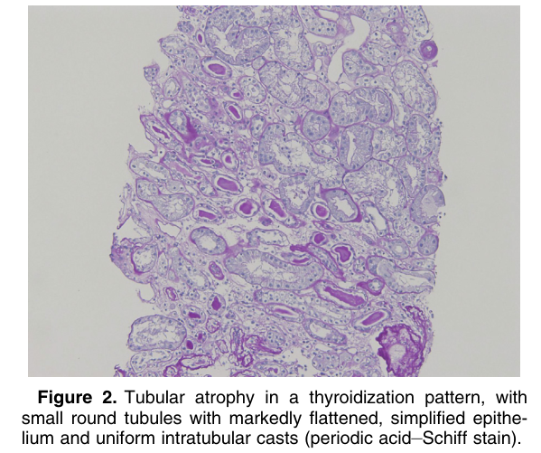
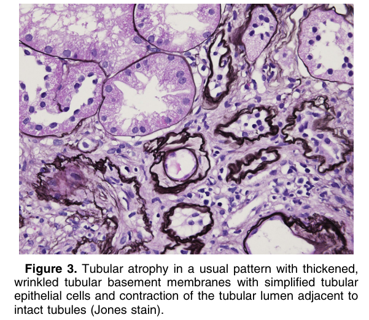

# Tubular Atrophy - Figures and Tables Index

This document lists all figures and tables extracted from `Tubular Atrophy.pdf`.

## Table of Contents
- [Figures](#figures)
- [Tables](#tables)

---

## Figures

### Fig_1

Figure 1. Tubular atrophy showing an endocrinization pattern, with narrowed lumens in shrunken tubules and cuboidal epithe lial cells (Jones stain).

---

### Fig_2

Figure 2. Tubular atrophy in a thyroidization pattern, with small round tubules with markedly flattened, simplified epithelium and uniform intratubular casts (periodic acid–Schiff stain).

---

### Fig_3

Figure 3. Tubular atrophy in a usual pattern with thickened, wrinkled tubular basement membranes with simplified tubular epithelial cells and contraction of the tubular lumen adjacent to intact tubules (Jones stain).

---

## Tables

*No tables resolved for this chapter.*
