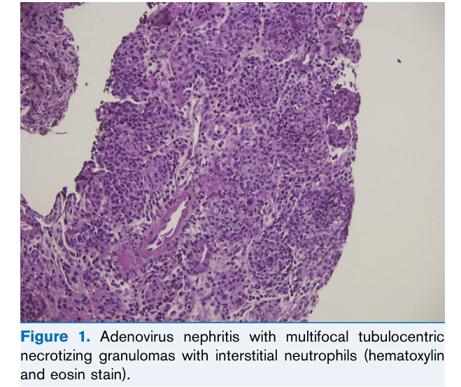
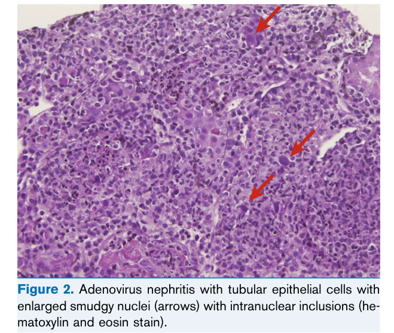
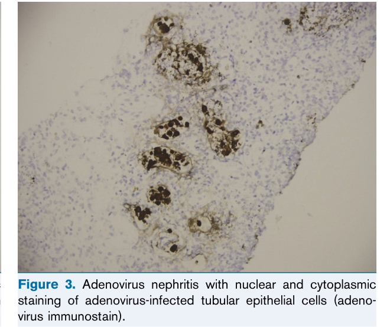
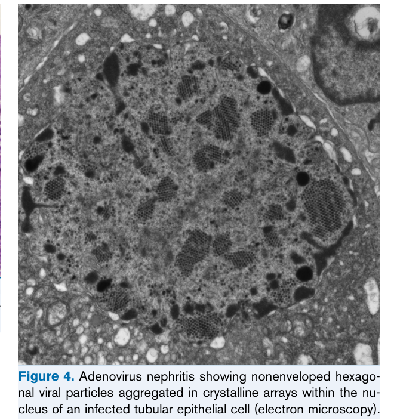

# Adenovirus Infection - Figures and Tables Index

This document lists all figures and tables extracted from `Adenovirus Infection.pdf`.

## Table of Contents
- [Figures](#figures)
- [Tables](#tables)

---

## Figures

### Fig_1

Figure 1. Adenovirus nephritis with multifocal tubulocentric necrotizing granulomas with interstitial neutrophils (hematoxylin and eosin stain).

---

### Fig_2

Figure 2. Adenovirus nephritis with tubular epithelial cells with enlarged smudgy nuclei (arrows) with intranuclear inclusions (he matoxylin and eosin stain).

---

### Fig_3

Figure 3. Adenovirus nephritis with nuclear and cytoplasmic staining of adenovirus-infected tubular epithelial cells (adeno virus immunostain).

---

### Fig_4

Figure 4. Adenovirus nephritis showing nonenveloped hexago nal viral particles aggregated in crystalline arrays within the nu cleus of an infected tubular epithelial cell (electron microscopy).

---

## Tables

*No tables resolved for this chapter.*
