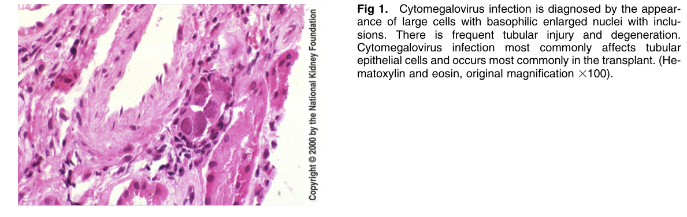
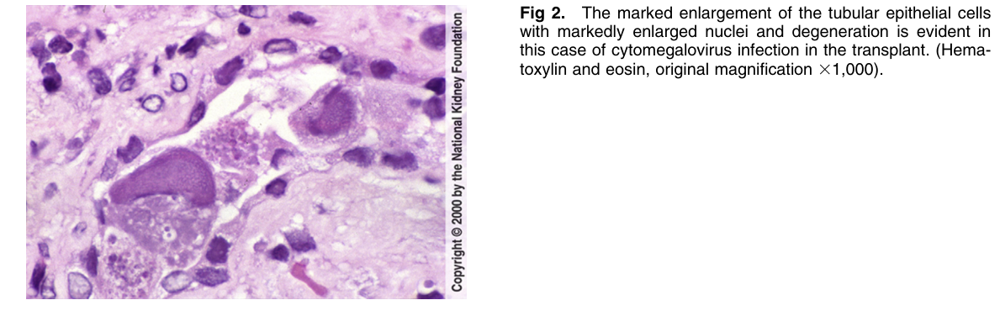
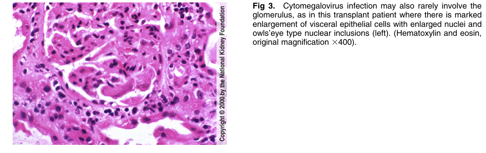
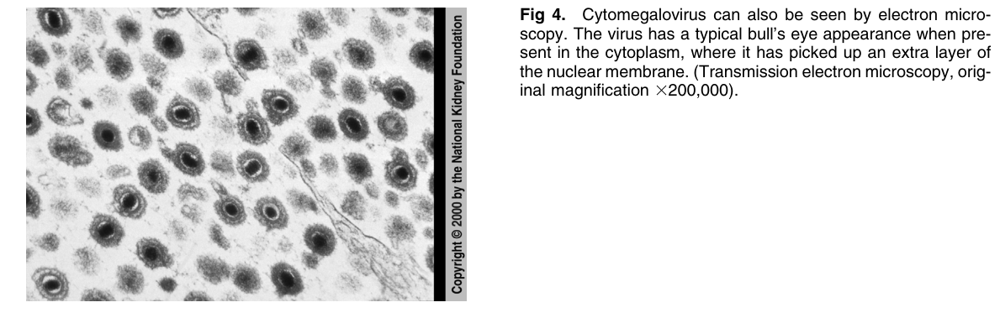

# Cytomegalovirus Infection 2 - Figures and Tables Index

This document lists all figures and tables extracted from `Cytomegalovirus Infection 2.pdf`.

## Table of Contents
- [Figures](#figures)
- [Tables](#tables)

---

## Figures

### Fig_1

Figure 1. Cytomegalovirus infection is diagnosed by the appearance of large cells with basophilic enlarged nuclei with inclusions. There is frequent tubular injury and degeneration. Cytomegalovirus infection most commonly affects tubular epithelial cells and occurs most commonly in the transplant. (He matoxylin and eosin, original magnification 3100).

---

### Fig_2

Figure 2. The marked enlargement of the tubular epithelial cells with markedly enlarged nuclei and degeneration is evident in this case of cytomegalovirus infection in the transplant. (Hematoxylin and eosin, original magnification 31,000).

---

### Fig_3

Figure 3. Cytomegalovirus infection may also rarely involve the glomerulus, as in this transplant patient where there is marked enlargement of visceral epithelial cells with enlarged nuclei and owls’eye type nuclear inclusions (left). (Hematoxylin and eosin, original magnification 3400).

---

### Fig_4

Figure 4. Cytomegalovirus can also be seen by electron microscopy. The virus has a typical bull’s eye appearance when present in the cytoplasm, where it has picked up an extra layer o the nuclear membrane. (Transmission electron microscopy, original magnification 3200,000).

---

## Tables

*No tables resolved for this chapter.*
