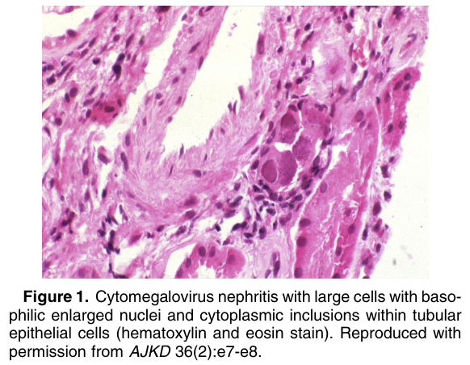
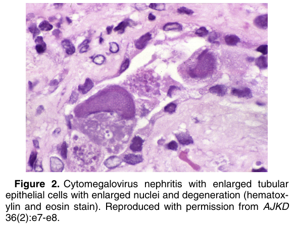
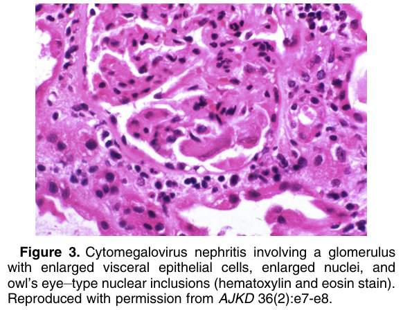
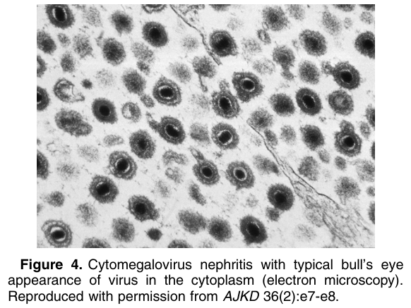

# Cytomegalovirus Infection - Figures and Tables Index

This document lists all figures and tables extracted from `Cytomegalovirus Infection.pdf`.

## Table of Contents
- [Figures](#figures)
- [Tables](#tables)

---

## Figures

### Fig_1

Figure 1. Cytomegalovirus nephritis with large cells with basophilic enlarged nuclei and cytoplasmic inclusions within tubular epithelial cells (hematoxylin and eosin stain). Reproduced with permission from AJKD 36(2):e7-e8.

---

### Fig_2

Figure 2. Cytomegalovirus nephritis with enlarged tubular epithelial cells with enlarged nuclei and degeneration (hematoxylin and eosin stain). Reproduced with permission from AJKD 36(2):e7-e8.

---

### Fig_3

Figure 3. Cytomegalovirus nephritis involving a glomerulus with enlarged visceral epithelial cells, enlarged nuclei, and owl’s eye–type nuclear inclusions (hematoxylin and eosin stain). Reproduced with permission from AJKD 36(2):e7-e8.

---

### Fig_4

Figure 4. Cytomegalovirus nephritis with typical bull’s eye appearance of virus in the cytoplasm (electron microscopy). Reproduced with permission from AJKD 36(2):e7-e8.

---

## Tables

*No tables resolved for this chapter.*
