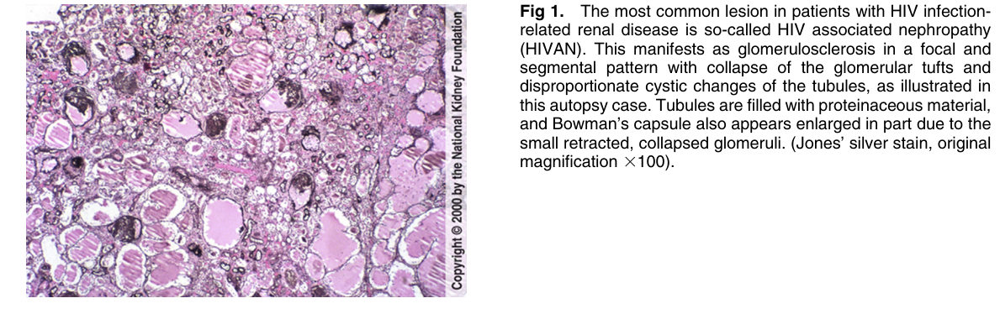
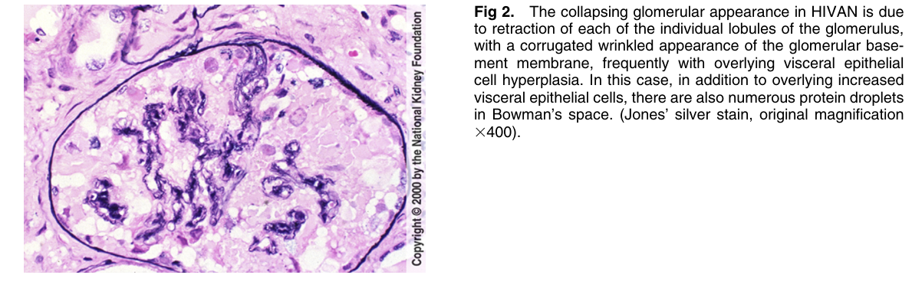
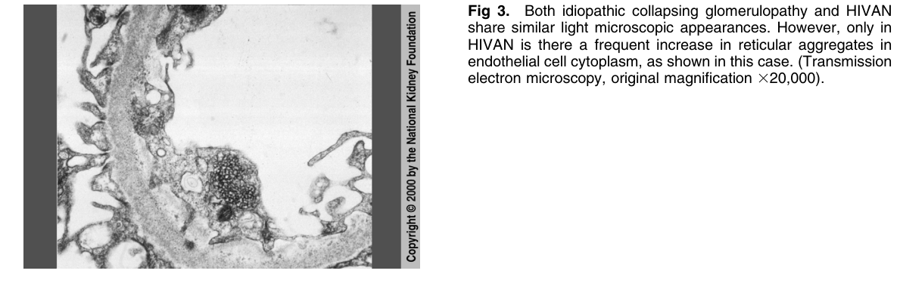

# HIV Associated Nephropathy - Figures and Tables Index

This document lists all figures and tables extracted from `HIV Associated Nephropathy.pdf`.

## Table of Contents
- [Figures](#figures)
- [Tables](#tables)

---

## Figures

### Fig_1

Figure 1. The most common lesion in patients with HIV infectionrelated renal disease is so-called HIV associated nephropathy (HIVAN). This manifests as glomerulosclerosis in a focal and segmental pattern with collapse of the glomerular tufts and disproportionate cystic changes of the tubules, as illustrated in this autopsy case. Tubules are filled with proteinaceous material, and Bowman’s capsule also appears enlarged in part due to the small retracted, collapsed glomeruli. (Jones’ silver stain, origina magnification 3100).

---

### Fig_2

Figure 2. The collapsing glomerular appearance in HIVAN is due to retraction of each of the individual lobules of the glomerulus, with a corrugated wrinkled appearance of the glomerular basement membrane, frequently with overlying visceral epithelia cell hyperplasia. In this case, in addition to overlying increased visceral epithelial cells, there are also numerous protein droplets in Bowman’s space. (Jones’ silver stain, original magnification 3400).

---

### Fig_3

Figure 3. Both idiopathic collapsing glomerulopathy and HIVAN share similar light microscopic appearances. However, only in HIVAN is there a frequent increase in reticular aggregates in endothelial cell cytoplasm, as shown in this case. (Transmission electron microscopy, original magnification 320,000).

---

## Tables

*No tables resolved for this chapter.*
