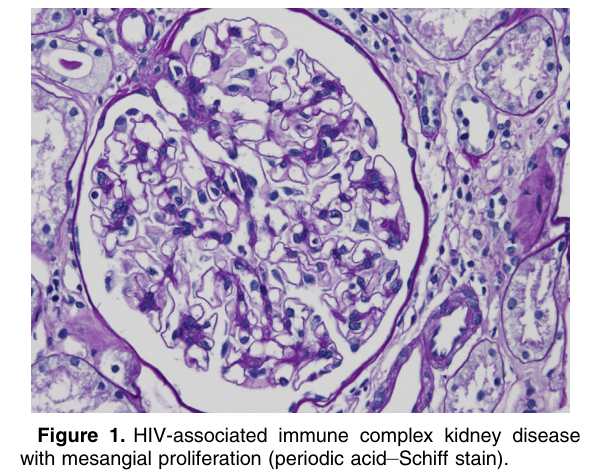
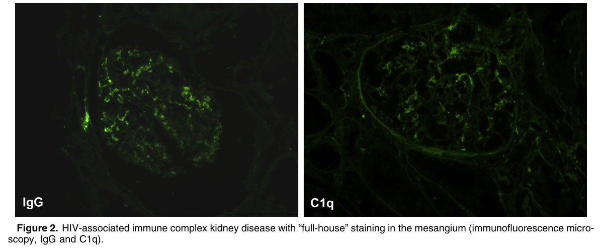
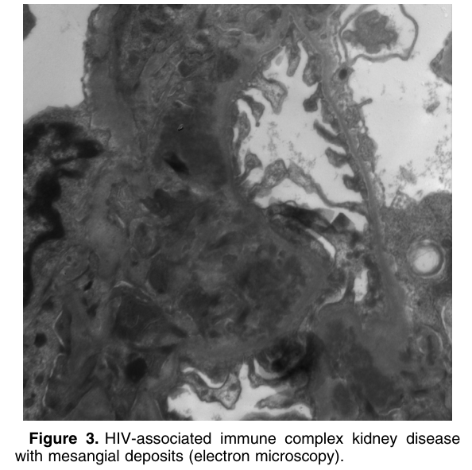
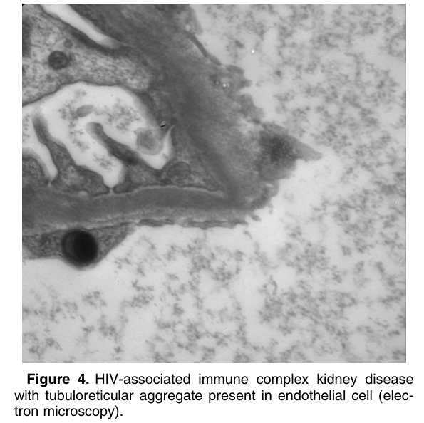

# HIV-Associated Immune Complex Kidney Disease (HIVICK) - Figures and Tables Index

This document lists all figures and tables extracted from `HIV-Associated Immune Complex Kidney Disease (HIVICK).pdf`.

## Table of Contents
- [Figures](#figures)
- [Tables](#tables)

---

## Figures

### Fig_1

Figure 1. HIV-associated immune complex kidney disease with mesangial proliferation (periodic acid–Schiff stain).

---

### Fig_2

Figure 2. HIV-associated immune complex kidney disease with “full-house” staining in the mesangium (immunofluorescence micro scopy, IgG and C1q).

---

### Fig_3

Figure 3. HIV-associated immune complex kidney disease with mesangial deposits (electron microscopy).

---

### Fig_4

Figure 4. HIV-associated immune complex kidney disease with tubuloreticular aggregate present in endothelial cell (elec tron microscopy).

---

## Tables

*No tables resolved for this chapter.*
