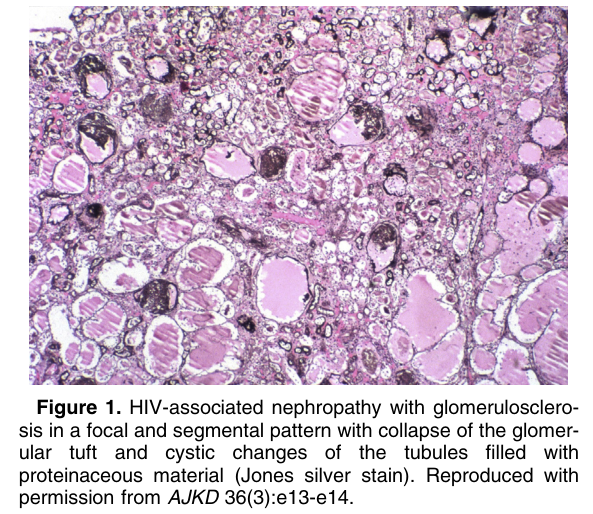
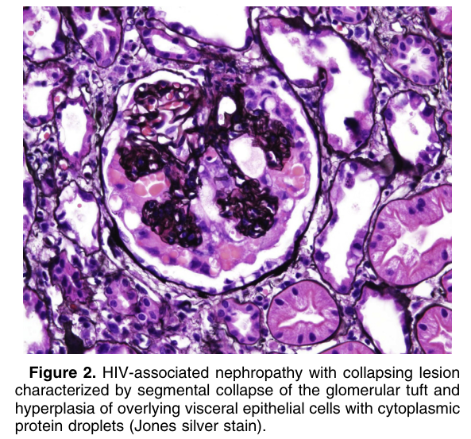
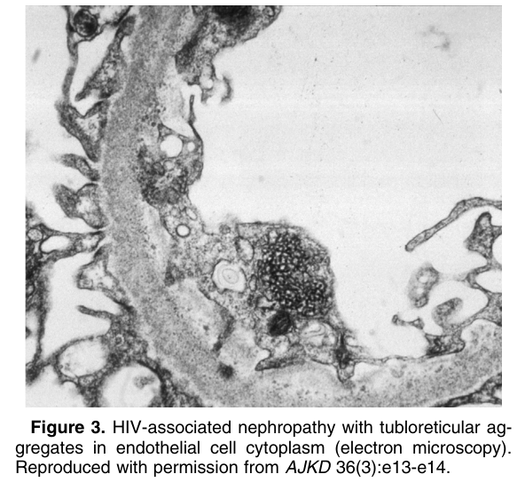

# HIV-Associated Nephropathy (HIVAN) - Figures and Tables Index

This document lists all figures and tables extracted from `HIV-Associated Nephropathy (HIVAN).pdf`.

## Table of Contents
- [Figures](#figures)
- [Tables](#tables)

---

## Figures

### Fig_1

Figure 1. HIV-associated nephropathy with glomerulosclerosis in a focal and segmental pattern with collapse of the glomerular tuft and cystic changes of the tubules filled with proteinaceous material (Jones silver stain). Reproduced with permission from AJKD 36(3):e13-e14.

---

### Fig_2

Figure 2. HIV-associated nephropathy with collapsing lesion characterized by segmental collapse of the glomerular tuft and hyperplasia of overlying visceral epithelial cells with cytoplasmic protein droplets (Jones silver stain).

---

### Fig_3

Figure 3. HIV-associated nephropathy with tubloreticular ag gregates in endothelial cell cytoplasm (electron microscopy). Reproduced with permission from AJKD 36(3):e13-e14.

---

## Tables

*No tables resolved for this chapter.*
