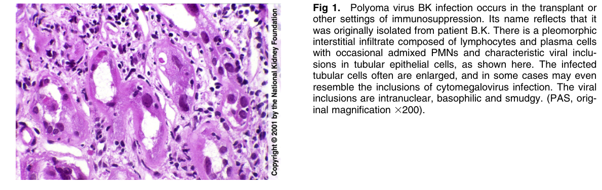
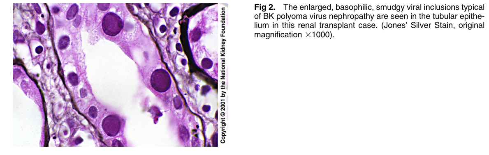
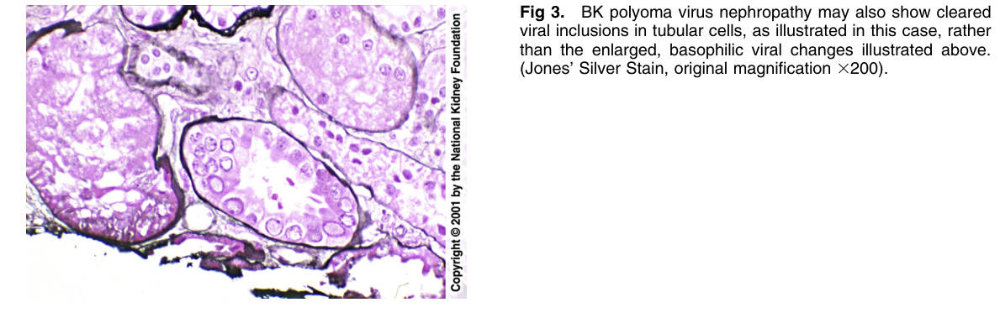
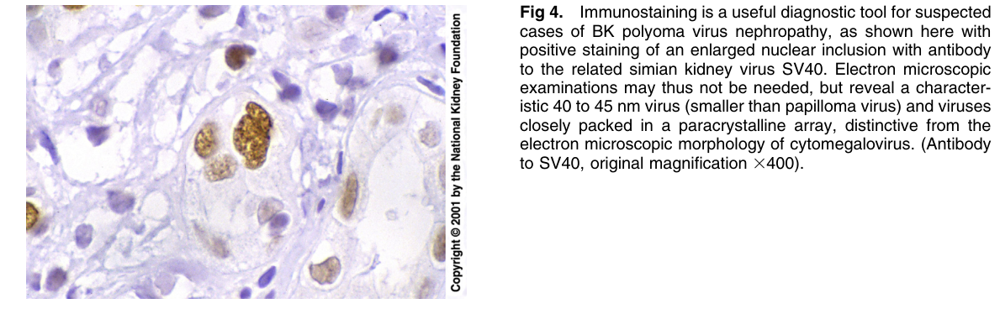

# Polyoma Virus Infection - Figures and Tables Index

This document lists all figures and tables extracted from `Polyoma Virus Infection.pdf`.

## Table of Contents
- [Figures](#figures)
- [Tables](#tables)

---

## Figures

### Fig_1

Figure 1. Polyoma virus BK infection occurs in the transplant or other settings of immunosuppression. Its name reflects that it was originally isolated from patient B.K. There is a pleomorphic interstitial infiltrate composed of lymphocytes and plasma cells with occasional admixed PMNs and characteristic viral inclusions in tubular epithelial cells, as shown here. The infected tubular cells often are enlarged, and in some cases may even resemble the inclusions of cytomegalovirus infection. The vira inclusions are intranuclear, basophilic and smudgy. (PAS, original magnification 3200).

---

### Fig_2

Figure 2. The enlarged, basophilic, smudgy viral inclusions typica of BK polyoma virus nephropathy are seen in the tubular epithelium in this renal transplant case. (Jones’ Silver Stain, origina magnification 31000).

---

### Fig_3

Figure 3. BK polyoma virus nephropathy may also show cleared viral inclusions in tubular cells, as illustrated in this case, rather than the enlarged, basophilic viral changes illustrated above. (Jones’ Silver Stain, original magnification 3200).

---

### Fig_4

Figure 4. Immunostaining is a useful diagnostic tool for suspected cases of BK polyoma virus nephropathy, as shown here with positive staining of an enlarged nuclear inclusion with antibod to the related simian kidney virus SV40. Electron microscopic examinations may thus not be needed, but reveal a characteristic 40 to 45 nm virus (smaller than papilloma virus) and viruses closely packed in a paracrystalline array, distinctive from the electron microscopic morphology of cytomegalovirus. (Antibod to SV40, original magnification 3400).

---

## Tables

*No tables resolved for this chapter.*
