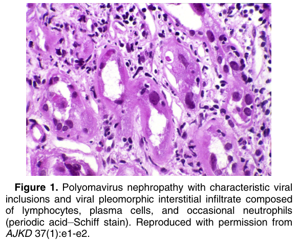
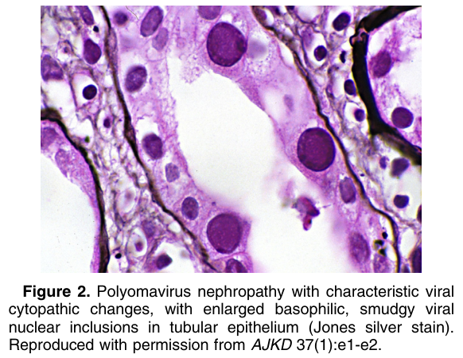
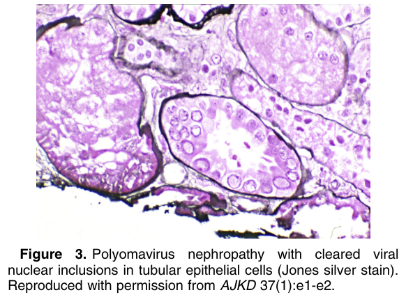
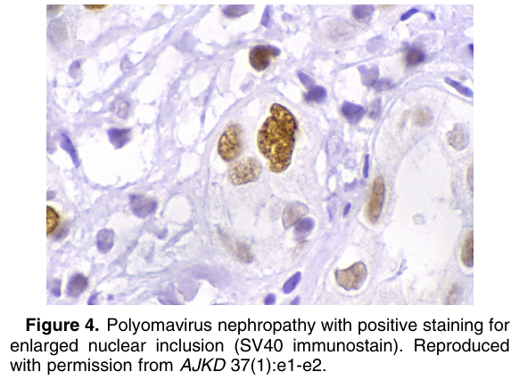

# Polyomavirus Nephropathy - Figures and Tables Index

This document lists all figures and tables extracted from `Polyomavirus Nephropathy.pdf`.

## Table of Contents
- [Figures](#figures)
- [Tables](#tables)

---

## Figures

### Fig_1

Figure 1. Polyomavirus nephropathy with characteristic viral inclusions and viral pleomorphic interstitial infiltrate composed of lymphocytes, plasma cells, and occasional neutrophils (periodic acid–Schiff stain). Reproduced with permission from AJKD 37(1):e1-e2.

---

### Fig_2

Figure 2. Polyomavirus nephropathy with characteristic viral cytopathic changes, with enlarged basophilic, smudgy viral nuclear inclusions in tubular epithelium (Jones silver stain). Reproduced with permission from AJKD 37(1):e1-e2.

---

### Fig_3

Figure 3. Polyomavirus nephropathy with cleared viral nuclear inclusions in tubular epithelial cells (Jones silver stain). Reproduced with permission from AJKD 37(1):e1-e2.

---

### Fig_4

Figure 4. Polyomavirus nephropathy with positive staining for enlarged nuclear inclusion (SV40 immunostain). Reproduced with permission from AJKD 37(1):e1-e2.

---

## Tables

*No tables resolved for this chapter.*
