# 001. Renal Anatomy - Figures and Tables Index

This document lists all figures and tables extracted from `001. Renal Anatomy.pdf`.

## Table of Contents
- [Figures](#figures)
- [Tables](#tables)

---

## Figures

### Fig_1_1

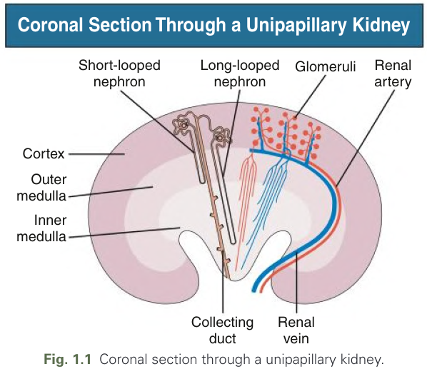

Fig. 1.1 Coronal section through a unipapillary kidney.

---

### Fig_1_2

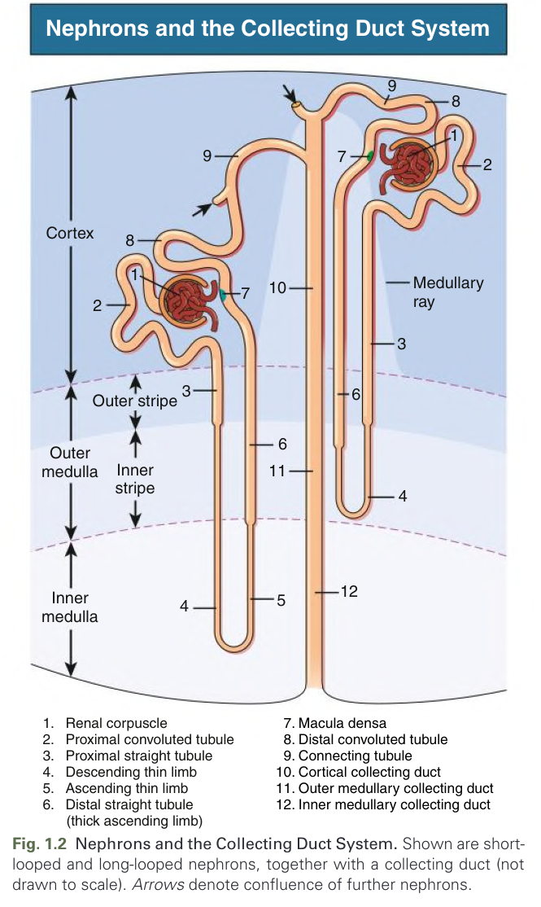

Fig. 1.2 Nephrons and the Collecting Duct System. Shown are short-looped and long-looped nephrons, together with a collecting duct (not drawn to scale). Arrows denote confluence of further nephrons.

---

### Fig_1_3

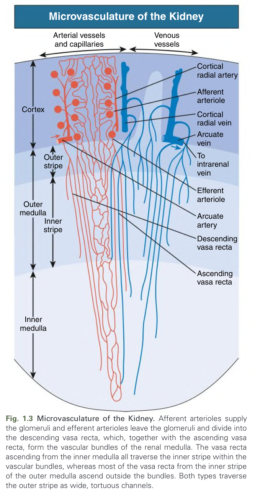

Fig. 1.3 Microvasculature of the Kidney. Afferent arterioles supply the glomeruli and efferent arterioles leave the glomeruli and divide into the descending vasa recta, which, together with the ascending vasa recta, form the vascular bundles of the renal medulla. The vasa recta ascending from the inner medulla all traverse the inner stripe within the vascular bundles, whereas most of the vasa recta from the inner stripe of the outer medulla ascend outside the bundles. Both types traverse the outer stripe as wide, tortuous channels.

---

### Fig_1_4

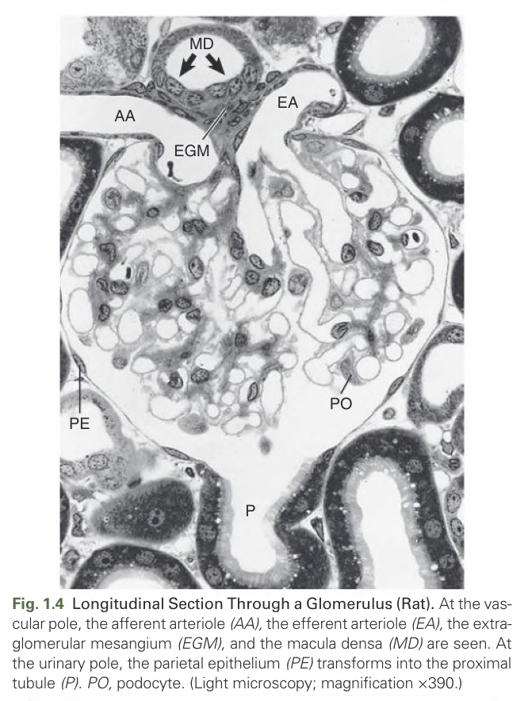

Fig. 1.4 Longitudinal Section Through a Glomerulus (Rat). At the vascular pole, the afferent arteriole (AA), the efferent arteriole (EA), the extraglomerular mesangium (EGM), and the macula densa (MD) are seen. At the urinary pole, the parietal epithelium (PE) transforms into the proximal tubule (P). PO, podocyte. (Light microscopy; magnification ×390.)

---

### Fig_1_5

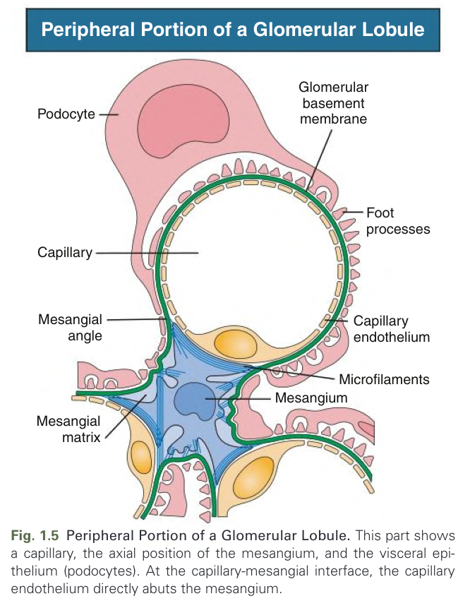

Fig. 1.5 Peripheral Portion of a Glomerular Lobule. This part shows a capillary, the axial position of the mesangium, and the visceral epithelium (podocytes). At the capillary-mesangial interface, the capillary endothelium directly abuts the mesangium.

---

### Fig_1_6

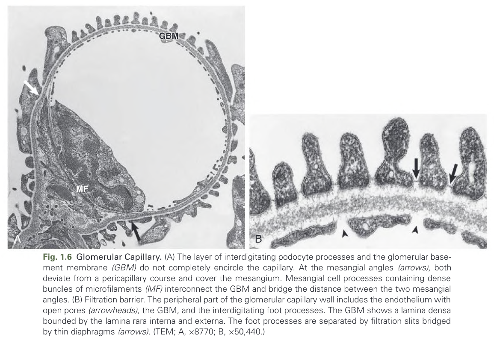

Fig. 1.6 Glomerular Capillary. (A) The layer of interdigitating podocyte processes and the glomerular basement membrane (GBM) do not completely encircle the capillary. At the mesangial angles (arrows), both deviate from a pericapillary course and cover the mesangium. Mesangial cell processes containing dense bundles of microfilaments (MF) interconnect the GBM and bridge the distance between the two mesangial angles. (B) Filtration barrier. The peripheral part of the glomerular capillary wall includes the endothelium with open pores (arrowheads), the GBM, and the interdigitating foot processes. The GBM shows a lamina densa bounded by the lamina rara interna and externa. The foot processes are separated by filtration slits bridged by thin diaphragms (arrows). (TEM; A, ×8770; B, ×50,440.)

---

### Fig_1_7

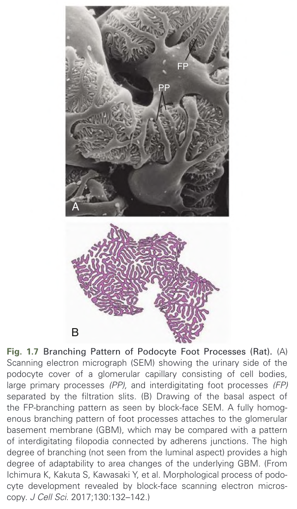

Fig. 1.7 Branching Pattern of Podocyte Foot Processes (Rat). (A) Scanning electron micrograph (SEM) showing the urinary side of the podocyte cover of a glomerular capillary consisting of cell bodies, large primary processes (PP), and interdigitating foot processes (FP) separated by the filtration slits. (B) Drawing of the basal aspect of the FP-branching pattern as seen by block-face SEM. A fully homogenous branching pattern of foot processes attaches to the glomerular basement membrane (GBM), which may be compared with a pattern of interdigitating filopodia connected by adherens junctions. The high degree of branching (not seen from the luminal aspect) provides a high degree of adaptability to area changes of the underlying GBM. (From Ichimura K, Kakuta S, Kawasaki Y, et al. Morphological process of podocyte development revealed by block-face scanning electron microscopy. J Cell Sci. 2017;130:132–142.)

---

### Fig_1_8

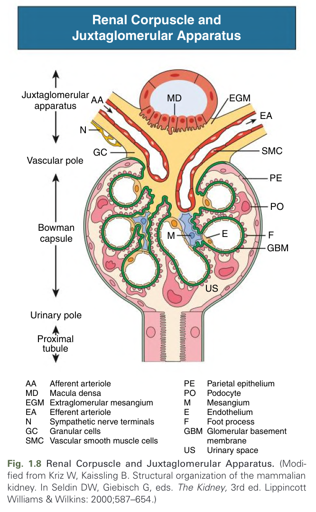

Fig. 1.8 Renal Corpuscle and Juxtaglomerular Apparatus. (Modified from Kriz W, Kaissling B. Structural organization of the mammalian kidney. In Seldin DW, Giebisch G, eds. The Kidney, 3rd ed. Lippincott Williams & Wilkins: 2000;587–654.)

---

### Fig_1_9

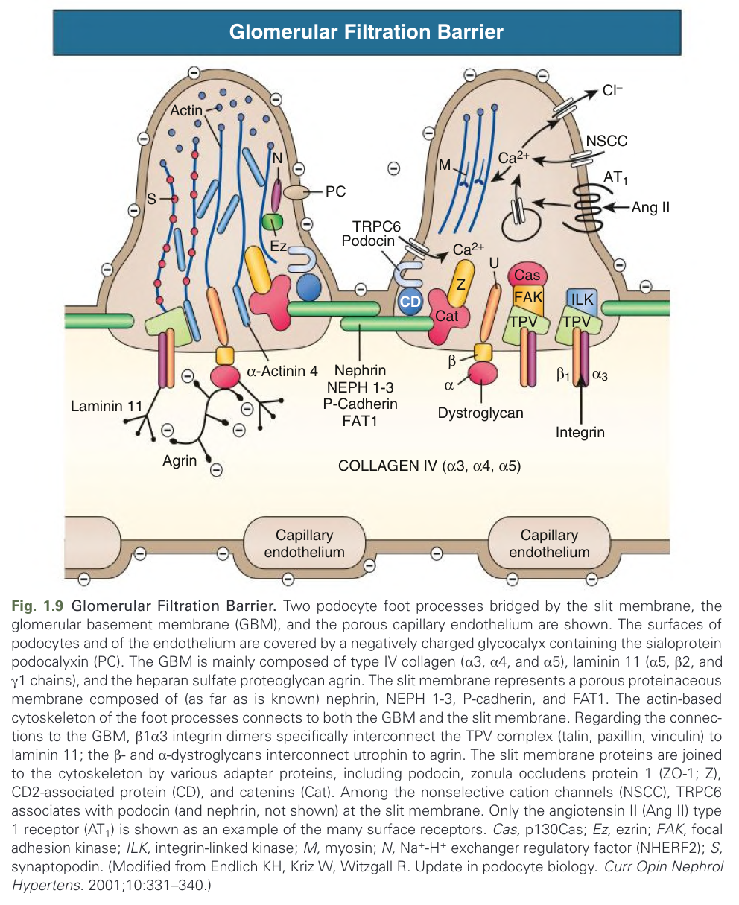

Fig. 1.9 Glomerular Filtration Barrier. Two podocyte foot processes bridged by the slit membrane, the glomerular basement membrane (GBM), and the porous capillary endothelium are shown. The surfaces of podocytes and of the endothelium are covered by a negatively charged glycocalyx containing the sialoprotein podocalyxin (PC). The GBM is mainly composed of type IV collagen (α3, α4, and α5), laminin 11 (α5, β2, and γ1 chains), and the heparan sulfate proteoglycan agrin. The slit membrane represents a porous proteinaceous membrane composed of (as far as is known) nephrin, NEPH 1-3, P-cadherin, and FAT1. The actin-based cytoskeleton of the foot processes connects to both the GBM and the slit membrane. Regarding the connections to the GBM, β1α3 integrin dimers specifically interconnect the TPV complex (talin, paxillin, vinculin) to laminin 11; the β- and α-dystroglycans interconnect utrophin to agrin. The slit membrane proteins are joined to the cytoskeleton by various adapter proteins, including podocin, zonula occludens protein 1 (ZO-1; Z), CD2-associated protein (CD), and catenins (Cat). Among the nonselective cation channels (NSCC), TRPC6 associates with podocin (and nephrin, not shown) at the slit membrane. Only the angiotensin II (Ang II) type 1 receptor (AT1) is shown as an example of the many surface receptors. Cas, p130Cas; Ez, ezrin; FAK, focal adhesion kinase; ILK, integrin-linked kinase; M, myosin; N, Na+-H+ exchanger regulatory factor (NHERF2); S, synaptopodin. (Modified from Endlich KH, Kriz W, Witzgall R. Update in podocyte biology. Curr Opin Nephrol Hypertens. 2001;10:331–340.)

---

### Fig_1_10

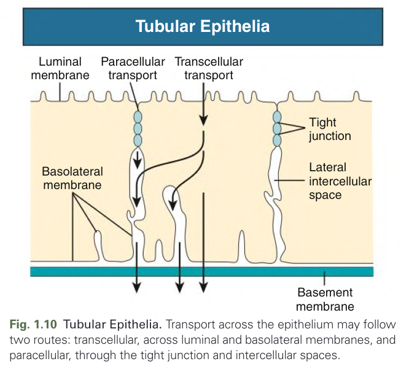

Fig. 1.10 Tubular Epithelia. Transport across the epithelium may follow two routes: transcellular, across luminal and basolateral membranes, and paracellular, through the tight junction and intercellular spaces.

---

### Fig_1_11

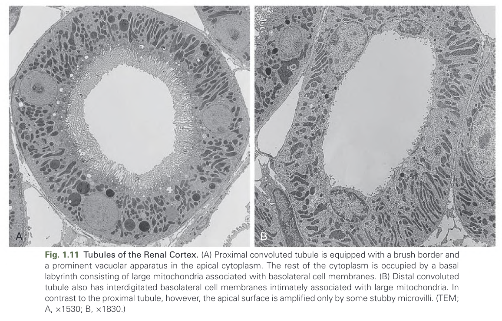

Fig. 1.11 Tubules of the Renal Cortex. (A) Proximal convoluted tubule is equipped with a brush border and a prominent vacuolar apparatus in the apical cytoplasm. The rest of the cytoplasm is occupied by a basal labyrinth consisting of large mitochondria associated with basolateral cell membranes. (B) Distal convoluted tubule also has interdigitated basolateral cell membranes intimately associated with large mitochondria. In contrast to the proximal tubule, however, the apical surface is amplified only by some stubby microvilli. (TEM; A, ×1530; B, ×1830.)

---

### Fig_1_12

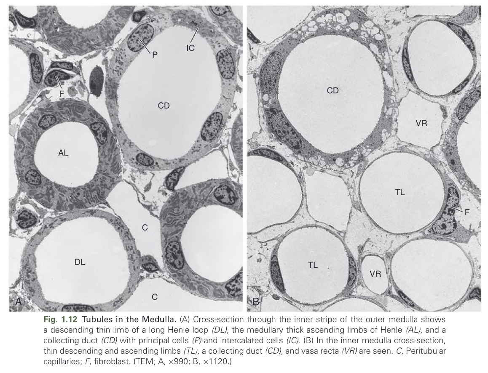

Fig. 1.12 Tubules in the Medulla. (A) Cross-section through the inner stripe of the outer medulla shows a descending thin limb of a long Henle loop (DL), the medullary thick ascending limbs of Henle (AL), and a collecting duct (CD) with principal cells (P) and intercalated cells (IC). (B) In the inner medulla cross-section, thin descending and ascending limbs (TL), a collecting duct (CD), and vasa recta (VR) are seen. C, Peritubular capillaries; F, fibroblast. (TEM; A, ×990; B, ×1120.)

---

### Fig_1_13

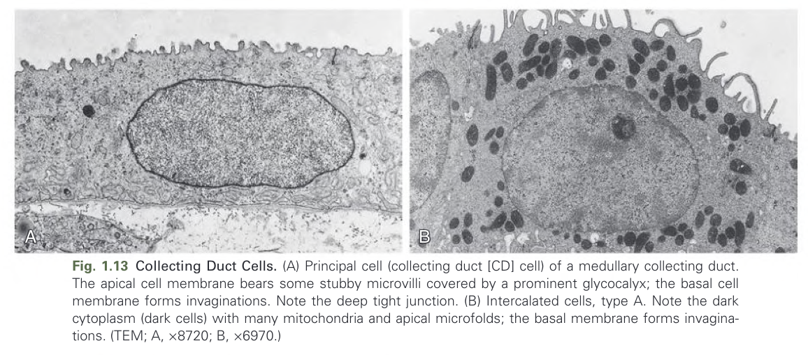

Fig. 1.13 Collecting Duct Cells. (A) Principal cell (collecting duct [CD] cell) of a medullary collecting duct. The apical cell membrane bears some stubby microvilli covered by a prominent glycocalyx; the basal cell membrane forms invaginations. Note the deep tight junction. (B) Intercalated cells, type A. Note the dark cytoplasm (dark cells) with many mitochondria and apical microfolds; the basal membrane forms invaginations. (TEM; A, ×8720; B, ×6970.)

---

### Fig_1_14

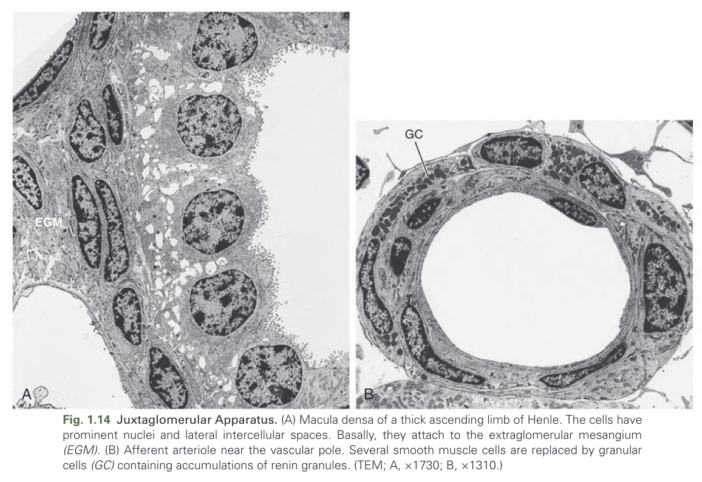

Fig. 1.14 Juxtaglomerular Apparatus. (A) Macula densa of a thick ascending limb of Henle. The cells have prominent nuclei and lateral intercellular spaces. Basally, they attach to the extraglomerular mesangium (EGM). (B) Afferent arteriole near the vascular pole. Several smooth muscle cells are replaced by granular cells (GC) containing accumulations of renin granules. (TEM; A, ×1730; B, ×1310.)

---

### Fig_1_15

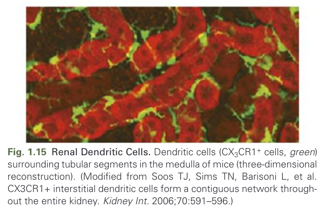

Fig. 1.15 Renal Dendritic Cells. Dendritic cells (CX3CR1+ cells, green) surrounding tubular segments in the medulla of mice (three-dimensional reconstruction). (Modified from Soos TJ, Sims TN, Barisoni L, et al. CX3CR1+ interstitial dendritic cells form a contiguous network throughout the entire kidney. Kidney Int. 2006;70:591–596.)

---

## Tables

### Table_1_1

#### Table Image

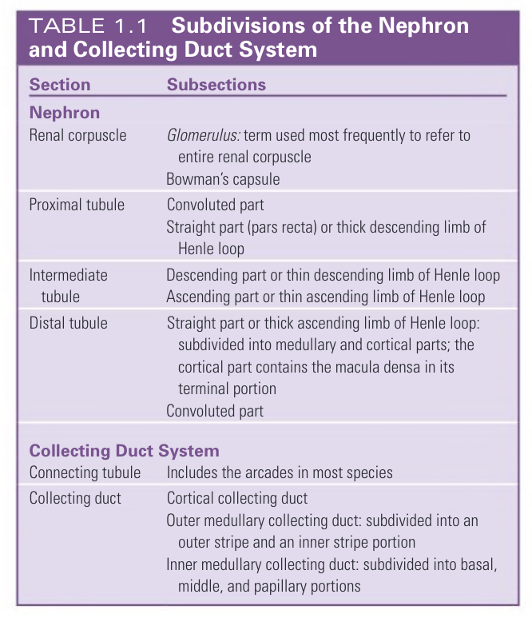

#### Table Data (CSV: [Table_1_1.csv](Table_1_1.csv))

```markdown
| Table Text (OCR) |
| :--- |
| TABLE 1.1 |
| Subdivisions of the Nephron |
| and Collecting Duct System |
| Section |
| Subsections |
| Nephron |
| Renal corpuscle |
| Glomerulus: term used most frequently to refer to |
| entire renal corpuscle |
| Bowman’s capsule |
| Proximal tubule |
| Convoluted part |
| Straight part (pars recta) or thick descending limb of |
| Henle loop |
| Intermediate |
| tubule |
| Descending part or thin descending limb of Henle loop |
| Ascending part or thin ascending limb of Henle loop |
| Distal tubule |
| Straight part or thick ascending limb of Henle loop: |
| subdivided into medullary and cortical parts; the |
| cortical part contains the macula densa in its |
| terminal portion |
| Convoluted part |
| Collecting Duct System |
| Connecting tubule |
| Includes the arcades in most species |
| Collecting duct |
| Cortical collecting duct |
| Outer medullary collecting duct: subdivided into an |
| outer stripe and an inner stripe portion |
| Inner medullary collecting duct: subdivided into basal, |
| middle, and papillary portions |
```

TABLE 1.1 Subdivisions of the Nephron and Collecting Duct System

---
