# 002. Renal Physiology - Figures and Tables Index

This document lists all figures, tables and boxes extracted from `002. Renal Physiology.pdf`.

## Table of Contents
- [Figures](#figures)
- [Tables](#tables)
- [Boxes](#boxes)

---

## Figures

### Fig_2_1

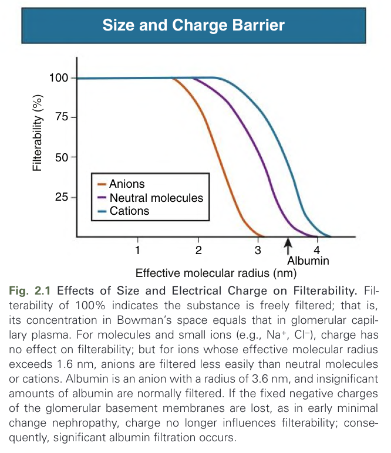

Fig. 2.1 Effects of Size and Electrical Charge on Filterability. Filterability of 100% indicates the substance is freely filtered; that is, its concentration in Bowman’s space equals that in glomerular capillary plasma. For molecules and small ions (e.g., Na+, Cl−), charge has no effect on filterability; but for ions whose effective molecular radius exceeds 1.6 nm, anions are filtered less easily than neutral molecules or cations. Albumin is an anion with a radius of 3.6 nm, and insignificant amounts of albumin are normally filtered. If the fixed negative charges of the glomerular basement membranes are lost, as in early minimal change nephropathy, charge no longer influences filterability; consequently, significant albumin filtration occurs.

---

### Fig_2_2

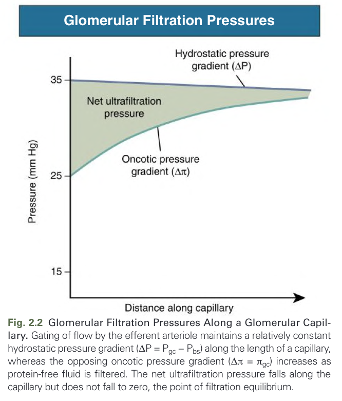

Fig. 2.2 Glomerular Filtration Pressures Along a Glomerular Capillary. Gating of flow by the efferent arteriole maintains a relatively constant hydrostatic pressure gradient (ΔP = Pgc − Pbs) along the length of a capillary, whereas the opposing oncotic pressure gradient (Δπ = πgc) increases as protein-free fluid is filtered. The net ultrafiltration pressure falls along the capillary but does not fall to zero, the point of filtration equilibrium.

---

### Fig_2_3

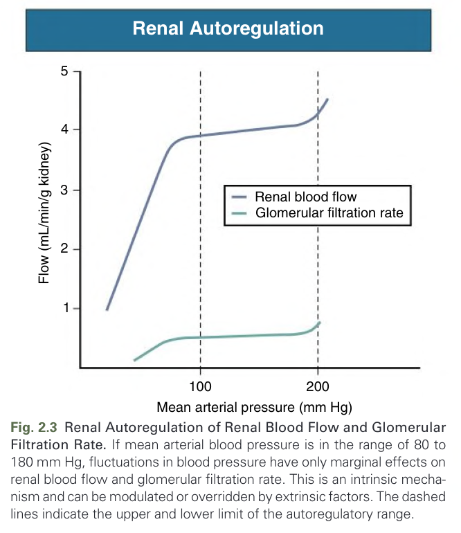

Fig. 2.3 Renal Autoregulation of Renal Blood Flow and Glomerular Filtration Rate. If mean arterial blood pressure is in the range of 80 to 180 mm Hg, fluctuations in blood pressure have only marginal effects on renal blood flow and glomerular filtration rate. This is an intrinsic mechanism and can be modulated or overridden by extrinsic factors. The dashed lines indicate the upper and lower limit of the autoregulatory range.

---

### Fig_2_4

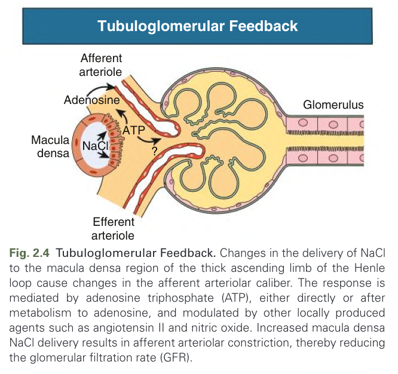

Fig. 2.4 Tubuloglomerular Feedback. Changes in the delivery of NaCl to the macula densa region of the thick ascending limb of the Henle loop cause changes in the afferent arteriolar caliber. The response is mediated by adenosine triphosphate (ATP), either directly or after metabolism to adenosine, and modulated by other locally produced agents such as angiotensin II and nitric oxide. Increased macula densa NaCl delivery results in afferent arteriolar constriction, thereby reducing the glomerular filtration rate (GFR).

---

### Fig_2_5

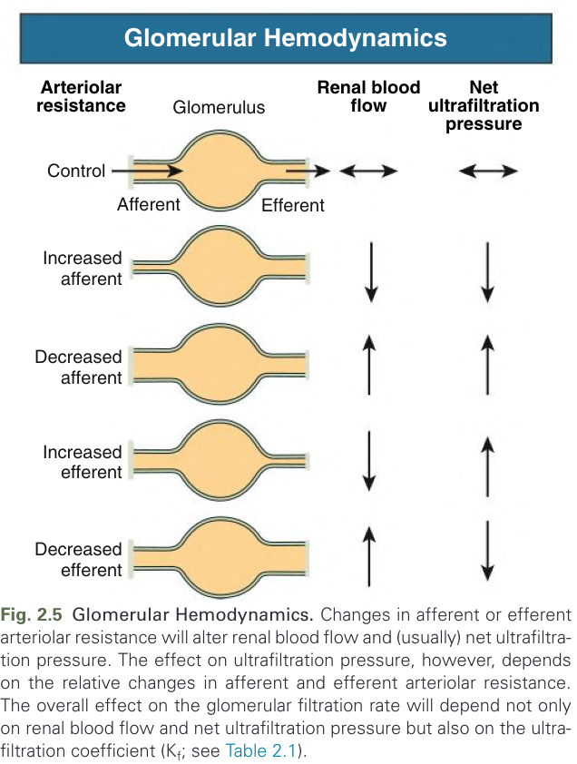

Fig. 2.5 Glomerular Hemodynamics. Changes in afferent or efferent arteriolar resistance will alter renal blood flow and (usually) net ultrafiltration pressure. The effect on ultrafiltration pressure, however, depends on the relative changes in afferent and efferent arteriolar resistance. The overall effect on the glomerular filtration rate will depend not only on renal blood flow and net ultrafiltration pressure but also on the ultrafiltration coefficient (Kf; see Table 2.1).

---

### Fig_2_6

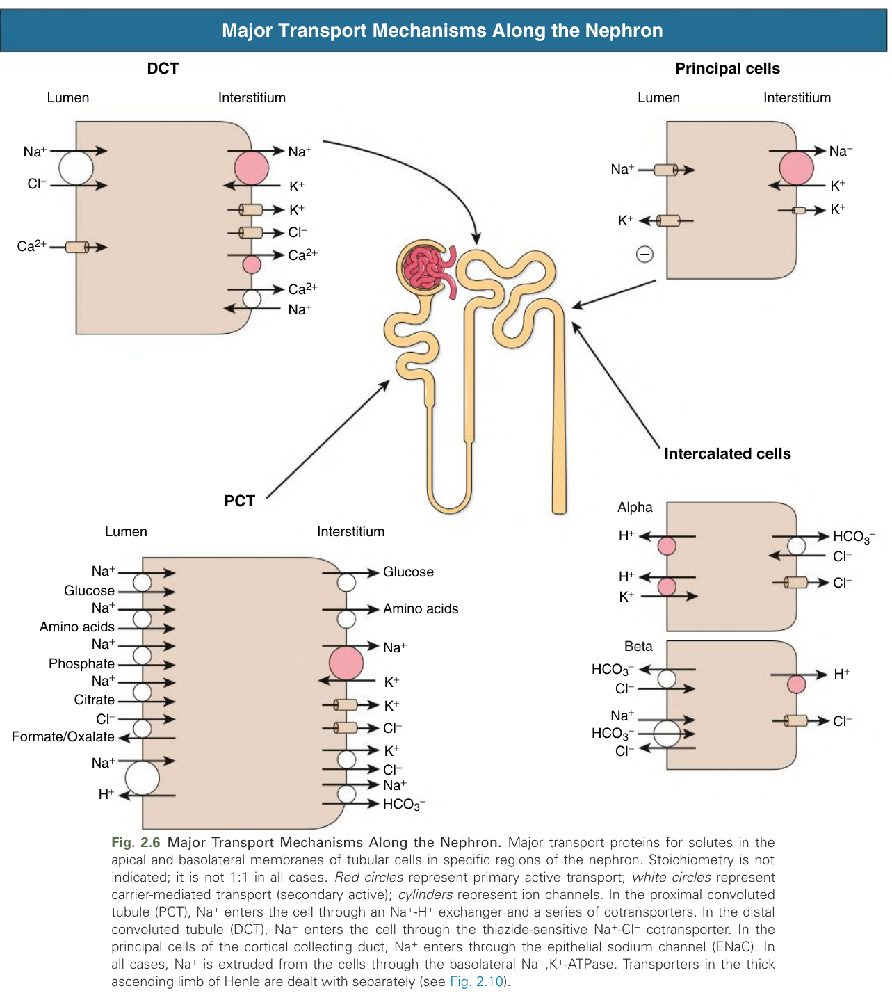

Fig. 2.6 Major Transport Mechanisms Along the Nephron. Major transport proteins for solutes in the apical and basolateral membranes of tubular cells in specific regions of the nephron. Stoichiometry is not indicated; it is not 1:1 in all cases. Red circles represent primary active transport; white circles represent carrier-mediated transport (secondary active); cylinders represent ion channels. In the proximal convoluted tubule (PCT), Na+ enters the cell through an Na+-H+ exchanger and a series of cotransporters. In the distal convoluted tubule (DCT), Na+ enters the cell through the thiazide-sensitive Na+-Cl− cotransporter. In the principal cells of the cortical collecting duct, Na+ enters through the epithelial sodium channel (ENaC). In all cases, Na+ is extruded from the cells through the basolateral Na+,K+-ATPase. Transporters in the thick ascending limb of Henle are dealt with separately (see Fig. 2.10).

---

### Fig_2_7

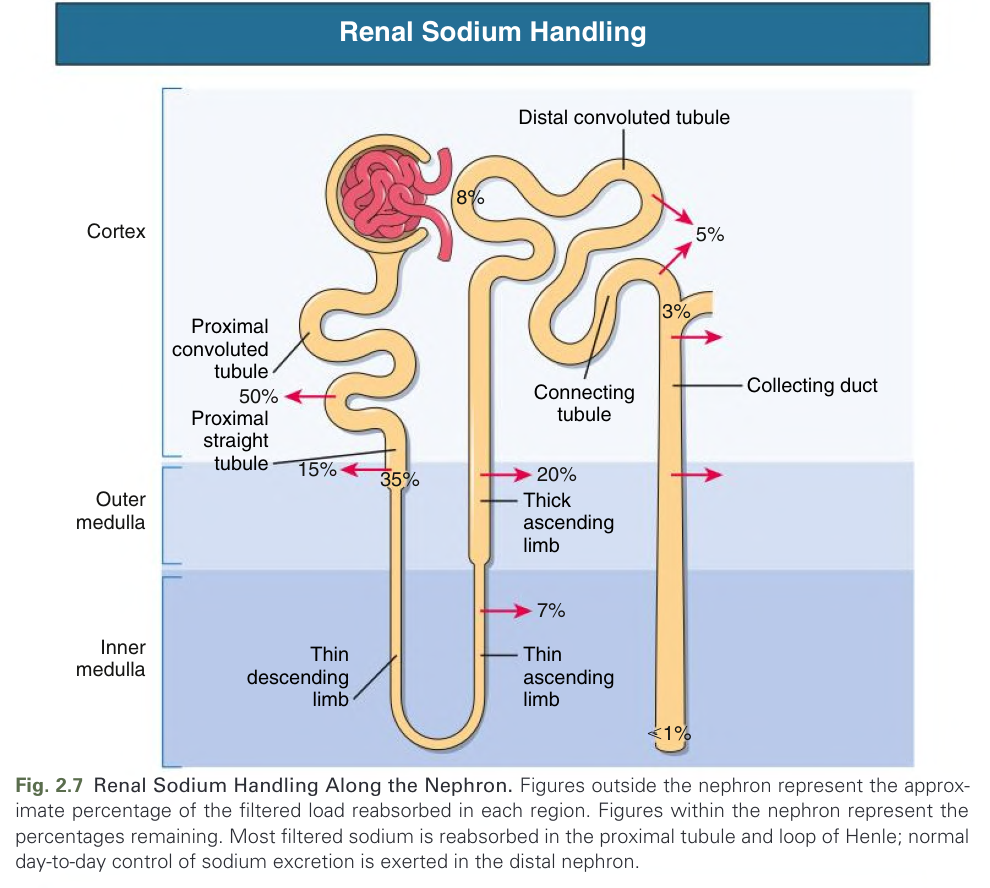

Fig. 2.7 Renal Sodium Handling Along the Nephron. Figures outside the nephron represent the approximate percentage of the filtered load reabsorbed in each region. Figures within the nephron represent the percentages remaining. Most filtered sodium is reabsorbed in the proximal tubule and loop of Henle; normal day-to-day control of sodium excretion is exerted in the distal nephron.

---

### Fig_2_8

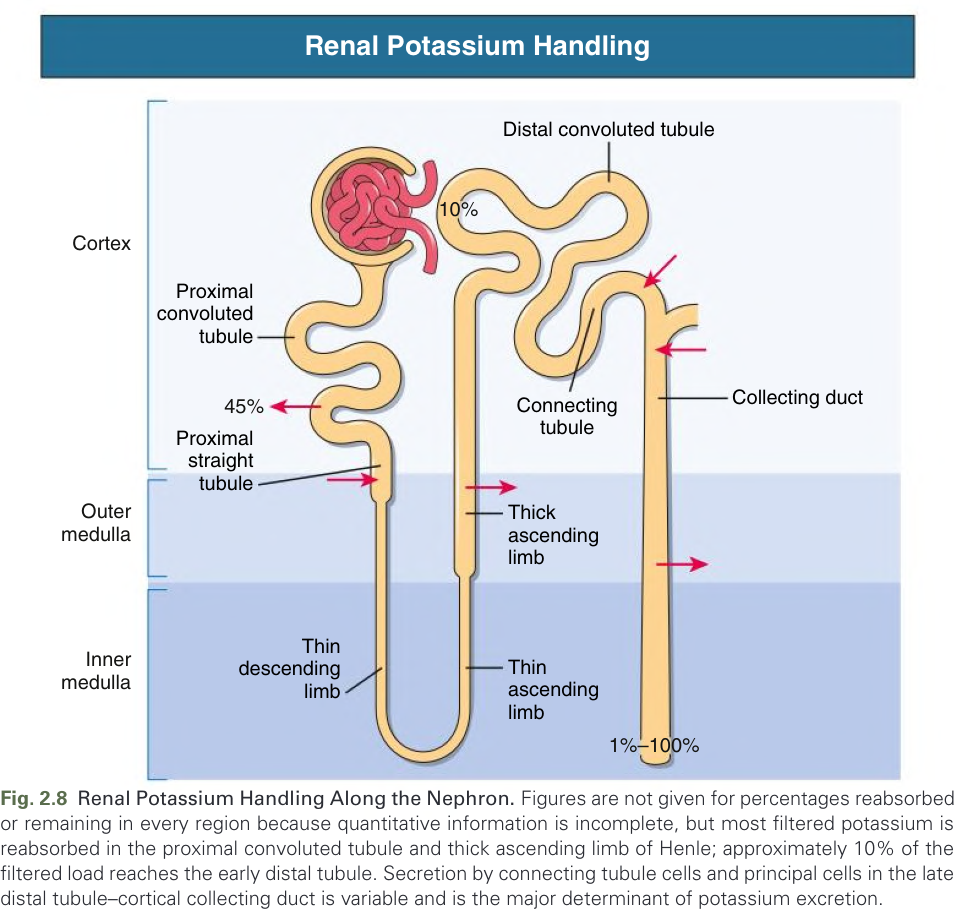

Fig. 2.8 Renal Potassium Handling Along the Nephron. Figures are not given for percentages reabsorbed or remaining in every region because quantitative information is incomplete, but most filtered potassium is reabsorbed in the proximal convoluted tubule and thick ascending limb of Henle; approximately 10% of the filtered load reaches the early distal tubule. Secretion by connecting tubule cells and principal cells in the late distal tubule–cortical collecting duct is variable and is the major determinant of potassium excretion.

---

### Fig_2_9

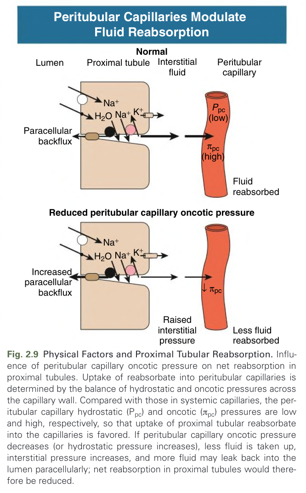

Fig. 2.9 Physical Factors and Proximal Tubular Reabsorption. Influence of peritubular capillary oncotic pressure on net reabsorption in proximal tubules. Uptake of reabsorbate into peritubular capillaries is determined by the balance of hydrostatic and oncotic pressures across the capillary wall. Compared with those in systemic capillaries, the peritubular capillary hydrostatic (Ppc) and oncotic (πpc) pressures are low and high, respectively, so that uptake of proximal tubular reabsorbate into the capillaries is favored. If peritubular capillary oncotic pressure decreases (or hydrostatic pressure increases), less fluid is taken up, interstitial pressure increases, and more fluid may leak back into the lumen paracellularly; net reabsorption in proximal tubules would therefore be reduced.

---

### Fig_2_10

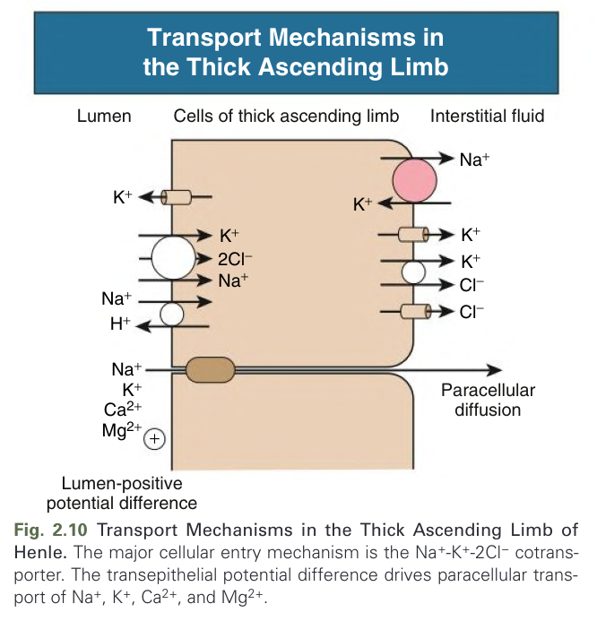

Fig. 2.10 Transport Mechanisms in the Thick Ascending Limb of Henle. The major cellular entry mechanism is the Na+-K+-2Cl− cotransporter. The transepithelial potential difference drives paracellular transport of Na+, K+, Ca2+, and Mg2+.

---

### Fig_2_11

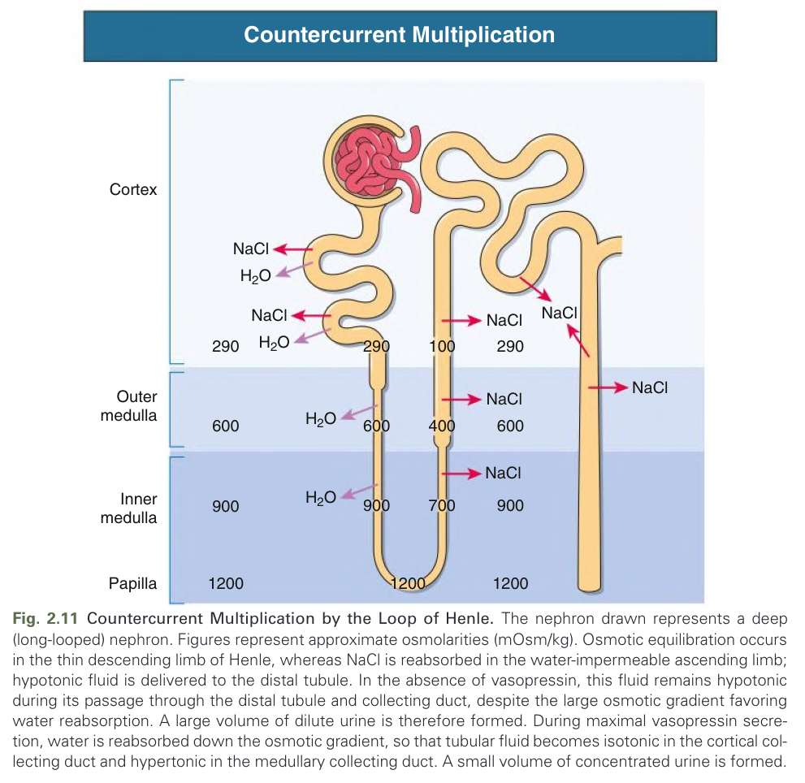

Fig. 2.11 Countercurrent Multiplication by the Loop of Henle. The nephron drawn represents a deep (long-looped) nephron. Figures represent approximate osmolarities (mOsm/kg). Osmotic equilibration occurs in the thin descending limb of Henle, whereas NaCl is reabsorbed in the water-impermeable ascending limb; hypotonic fluid is delivered to the distal tubule. In the absence of vasopressin, this fluid remains hypotonic during its passage through the distal tubule and collecting duct, despite the large osmotic gradient favoring water reabsorption. A large volume of dilute urine is therefore formed. During maximal vasopressin secretion, water is reabsorbed down the osmotic gradient, so that tubular fluid becomes isotonic in the cortical collecting duct and hypertonic in the medullary collecting duct. A small volume of concentrated urine is formed.

---

### Fig_2_12

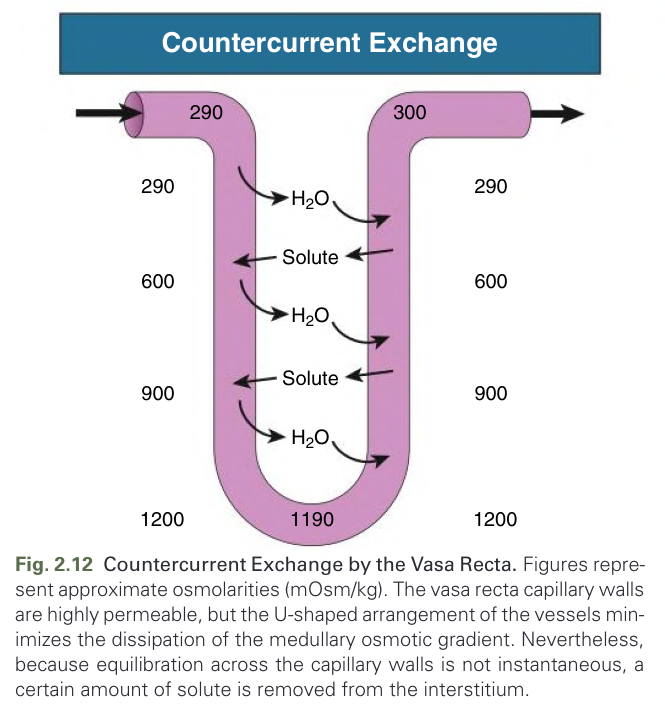

Fig. 2.12 Countercurrent Exchange by the Vasa Recta. Figures represent approximate osmolarities (mOsm/kg). The vasa recta capillary walls are highly permeable, but the U-shaped arrangement of the vessels minimizes the dissipation of the medullary osmotic gradient. Nevertheless, because equilibration across the capillary walls is not instantaneous, a certain amount of solute is removed from the interstitium.

---

### Fig_2_13

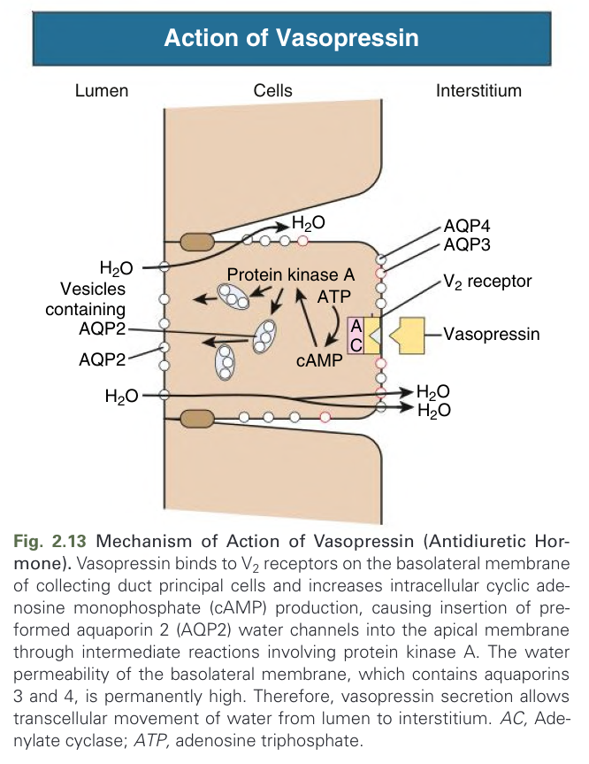

Fig. 2.13 Mechanism of Action of Vasopressin (Antidiuretic Hormone). Vasopressin binds to V2 receptors on the basolateral membrane of collecting duct principal cells and increases intracellular cyclic adenosine monophosphate (cAMP) production, causing insertion of preformed aquaporin 2 (AQP2) water channels into the apical membrane through intermediate reactions involving protein kinase A. The water permeability of the basolateral membrane, which contains aquaporins 3 and 4, is permanently high. Therefore, vasopressin secretion allows transcellular movement of water from lumen to interstitium. AC, Adenylate cyclase; ATP, adenosine triphosphate.

---

### Fig_2_14

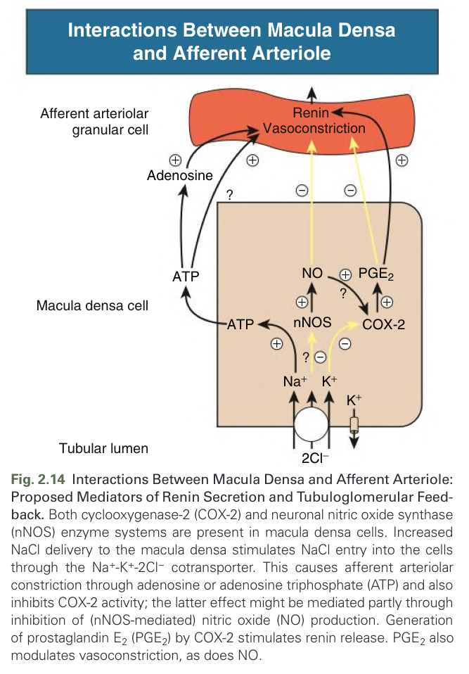

Fig. 2.14 Interactions Between Macula Densa and Afferent Arteriole: Proposed Mediators of Renin Secretion and Tubuloglomerular Feedback. Both cyclooxygenase-2 (COX-2) and neuronal nitric oxide synthase (nNOS) enzyme systems are present in macula densa cells. Increased NaCl delivery to the macula densa stimulates NaCl entry into the cells through the Na+-K+-2Cl− cotransporter. This causes afferent arteriolar constriction through adenosine or adenosine triphosphate (ATP) and also inhibits COX-2 activity; the latter effect might be mediated partly through inhibition of (nNOS-mediated) nitric oxide (NO) production. Generation of prostaglandin E2 (PGE2) by COX-2 stimulates renin release. PGE2 also modulates vasoconstriction, as does NO.

---

## Tables

### Table_2_1

#### Table Image

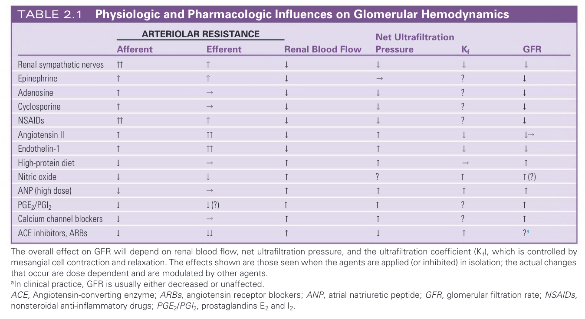

#### Table Data (CSV: [Table_2_1.csv](Table_2_1.csv))

```markdown
| | **ARTERIOLAR RESISTANCE** | | | | |
| :--- | :--- | :--- | :--- | :--- | :--- | :--- |
| | **Afferent** | **Efferent** | **Renal Blood Flow** | **Net Ultrafiltration Pressure** | **K<sub>f</sub>** | **GFR** |
| Renal sympathetic nerves | ↑↑ | ↑ | ↓ | ↓ | ↓ | ↓ |
| Epinephrine | ↑ | ↑ | ↓ | ← | ? | ↓ |
| Adenosine | ↑ | ← | ↓ | ↓ | ? | ↓ |
| Cyclosporine | ↑ | ← | ↓ | ↓ | ? | ↓ |
| NSAIDS | ↑↑ | ↑ | ↓ | ↓ | ? | ↓ |
| Angiotensin II | ↑ | ↑↑ | ↓ | ↑ | ↓ | ↓→ |
| Endothelin-1 | ↑ | ↑↑ | ↓ | ↑ | ↓ | ↓ |
| High-protein diet | ↓ | ← | ↑ | ↑ | ← | ↑ |
| Nitric oxide | ↓ | ↓ | ↑ | ? | ↑ | ↑ (?) |
| ANP (high dose) | ↓ | ← | ↑ | ↑ | ↑ | ↑ |
| PGE<sub>2</sub>/PGI<sub>2</sub> | ↓ | ↓(?) | ↑ | ↑ | ? | ↑ |
| Calcium channel blockers | ↓ | ← | ↑ | ↑ | ? | ↑ |
| ACE inhibitors, ARBs | ↓ | ↓ | ↑ | ↑ | ? | ?a |

The overall effect on GFR will depend on renal blood flow, net ultrafiltration pressure, and the ultrafiltration coefficient (K<sub>f</sub>), which is controlled by mesangial cell contraction and relaxation. The effects shown are those seen when the agents are applied (or inhibited) in isolation; the actual changes that occur are dose dependent and are modulated by other agents.
<sup>a</sup>In clinical practice, GFR is usually either decreased or unaffected.
ACE, Angiotensin-converting enzyme; ARBs, angiotensin receptor blockers; ANP, atrial natriuretic peptide; GFR, glomerular filtration rate; NSAIDs, nonsteroidal anti-inflammatory drugs; PGE<sub>2</sub>/PGI<sub>2</sub>, prostaglandins E<sub>2</sub> and I<sub>2</sub>.
```

TABLE 2.1 Physiologic and Pharmacologic Influences on Glomerular Hemodynamics

---

### Table_2_2

#### Table Image

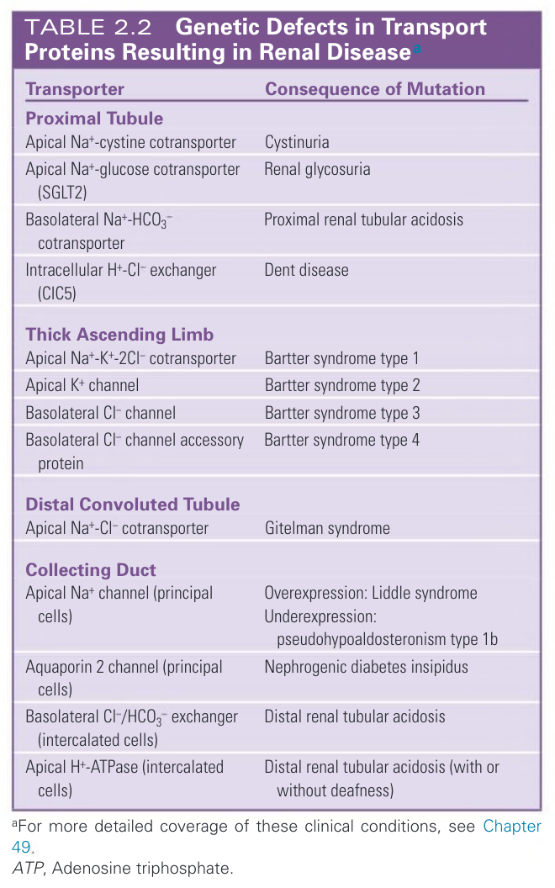

#### Table Data (CSV: [Table_2_2.csv](Table_2_2.csv))

```markdown
| Transporter | Consequence of Mutation |
| :--- | :--- |
| **Proximal Tubule** | |
| Apical Na<sup>+</sup>-cystine cotransporter | Cystinuria |
| Apical Na<sup>+</sup>-glucose cotransporter (SGLT2) | Renal glycosuria |
| Basolateral Na<sup>+</sup>-HCO<sub>3</sub><sup>-</sup> cotransporter | Proximal renal tubular acidosis |
| Intracellular H<sup>+</sup>-Cl<sup>-</sup> exchanger (ClC5) | Dent disease |
| **Thick Ascending Limb** | |
| Apical Na<sup>+</sup>-K<sup>+</sup>-2Cl<sup>-</sup> cotransporter | Bartter syndrome type 1 |
| Apical K<sup>+</sup> channel | Bartter syndrome type 2 |
| Basolateral Cl<sup>-</sup> channel | Bartter syndrome type 3 |
| Basolateral Cl<sup>-</sup> channel accessory protein | Bartter syndrome type 4 |
| **Distal Convoluted Tubule** | |
| Apical Na<sup>+</sup>-Cl<sup>-</sup> cotransporter | Gitelman syndrome |
| **Collecting Duct** | |
| Apical Na<sup>+</sup> channel (principal cells) | Overexpression: Liddle syndrome<br>Underexpression: pseudohypoaldosteronism type 1b |
| Aquaporin 2 channel (principal cells) | Nephrogenic diabetes insipidus |
| Basolateral Cl<sup>-</sup>/HCO<sub>3</sub><sup>-</sup> exchanger (intercalated cells) | Distal renal tubular acidosis |
| Apical H<sup>+</sup>-ATPase (intercalated cells) | Distal renal tubular acidosis (with or without deafness) |

<sup>a</sup>For more detailed coverage of these clinical conditions, see Chapter 49.
ATP, Adenosine triphosphate.
```

TABLE 2.2 Genetic Defects in Transport Proteins Resulting in Renal Diseasea

---

## Boxes

*No boxes resolved for this chapter.*
