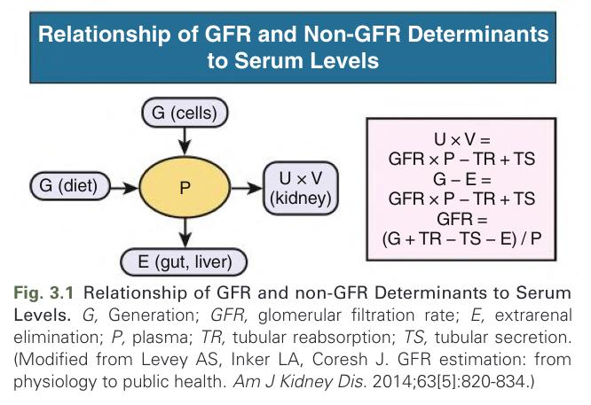
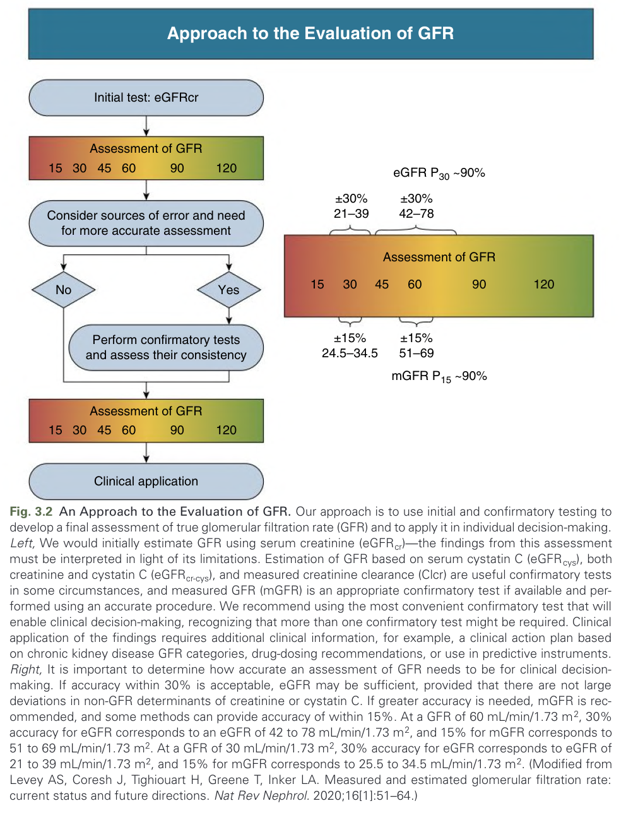
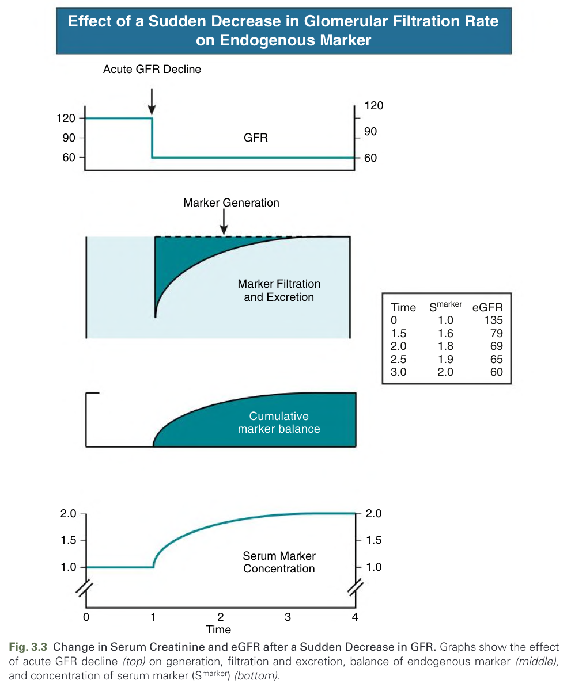
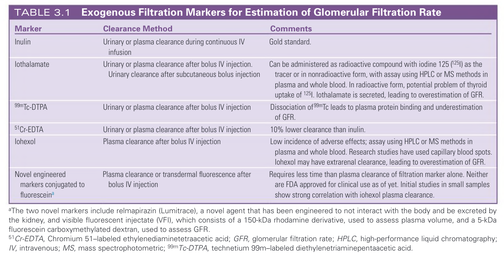
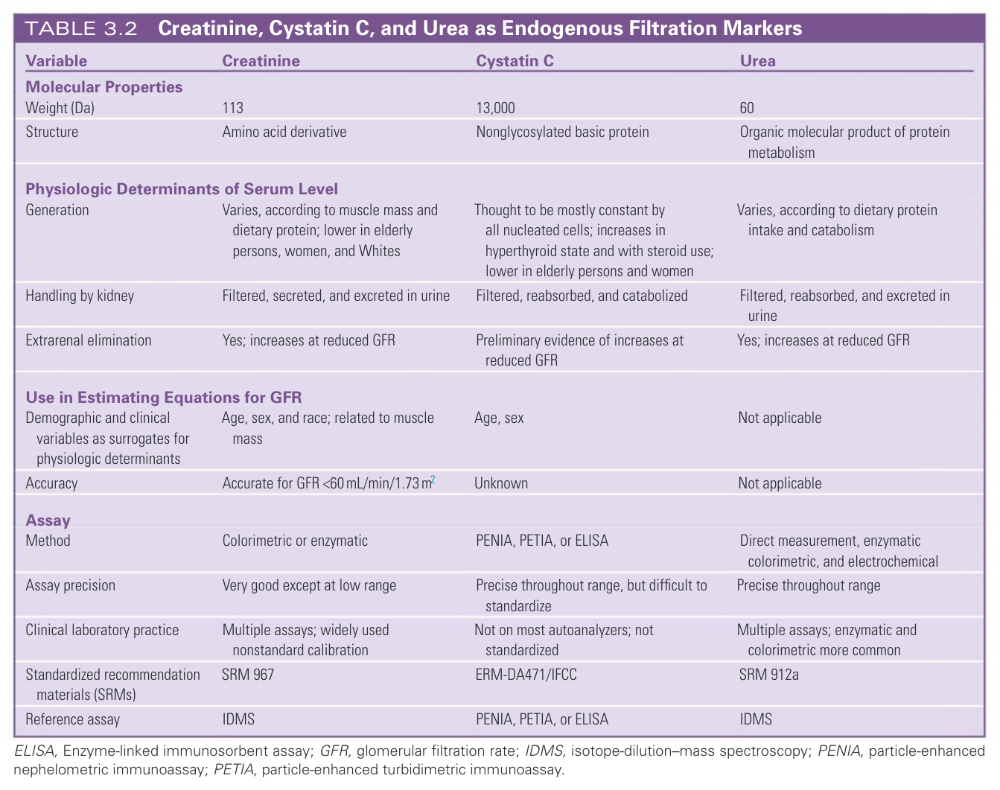
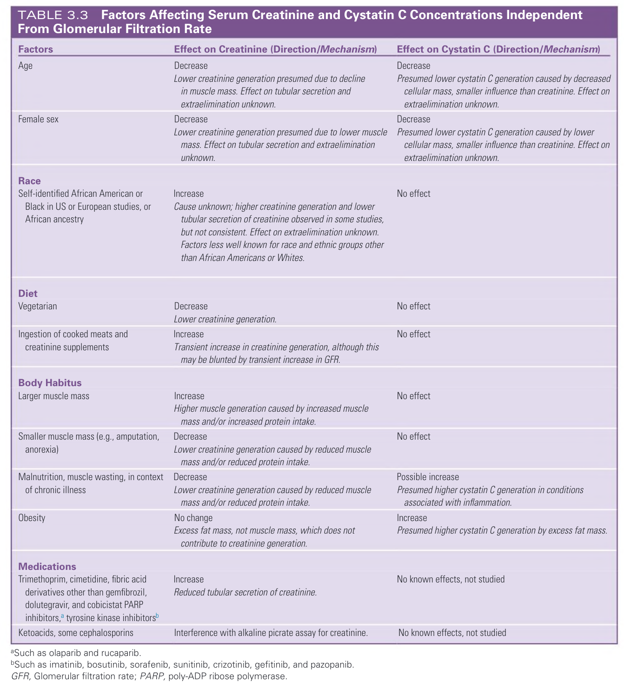
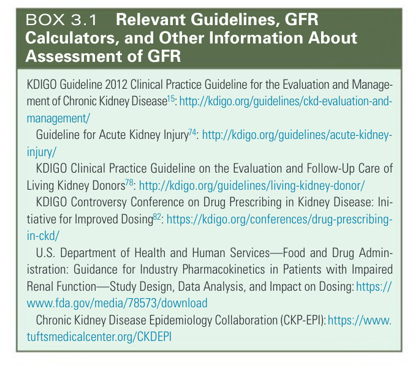

# 003. Assessment of Glomerular Filtration Rate - Figures and Tables Index

This document lists all figures, tables and boxes extracted from `003. Assessment of Glomerular Filtration Rate.pdf`.

## Table of Contents
- [Figures](#figures)
- [Tables](#tables)
- [Boxes](#boxes)

---

## Figures

### Fig_3_1



Fig. 3.1 Relationship of GFR and non-GFR Determinants to Serum Levels. G, Generation; GFR, glomerular filtration rate; E, extrarenal elimination; P, plasma; TR, tubular reabsorption; TS, tubular secretion. (Modified from Levey AS, Inker LA, Coresh J. GFR estimation: from physiology to public health. Am J Kidney Dis. 2014;63[5]:820-834.)

---

### Fig_3_2



Fig. 3.2 An Approach to the Evaluation of GFR. Our approach is to use initial and confirmatory testing to develop a final assessment of true glomerular filtration rate (GFR) and to apply it in individual decision-making. Left, We would initially estimate GFR using serum creatinine (eGFRcr)—the findings from this assessment must be interpreted in light of its limitations. Estimation of GFR based on serum cystatin C (eGFRcys), both creatinine and cystatin C (eGFRcr-cys), and measured creatinine clearance (Clcr) are useful confirmatory tests in some circumstances, and measured GFR (mGFR) is an appropriate confirmatory test if available and performed using an accurate procedure. We recommend using the most convenient confirmatory test that will enable clinical decision-making, recognizing that more than one confirmatory test might be required. Clinical application of the findings requires additional clinical information, for example, a clinical action plan based on chronic kidney disease GFR categories, drug-dosing recommendations, or use in predictive instruments. Right, It is important to determine how accurate an assessment of GFR needs to be for clinical decision-making. If accuracy within 30% is acceptable, eGFR may be sufficient, provided that there are not large deviations in non-GFR determinants of creatinine or cystatin C. If greater accuracy is needed, mGFR is recommended, and some methods can provide accuracy of within 15%. At a GFR of 60 mL/min/1.73 m2, 30% accuracy for eGFR corresponds to an eGFR of 42 to 78 mL/min/1.73 m2, and 15% for mGFR corresponds to 51 to 69 mL/min/1.73 m2. At a GFR of 30 mL/min/1.73 m2, 30% accuracy for eGFR corresponds to eGFR of 21 to 39 mL/min/1.73 m2, and 15% for mGFR corresponds to 25.5 to 34.5 mL/min/1.73 m2. (Modified from Levey AS, Coresh J, Tighiouart H, Greene T, Inker LA. Measured and estimated glomerular filtration rate: current status and future directions. Nat Rev Nephrol. 2020;16[1]:51–64.)

---

### Fig_3_3



Fig. 3.3 Change in Serum Creatinine and eGFR after a Sudden Decrease in GFR. Graphs show the effect of acute GFR decline (top) on generation, filtration and excretion, balance of endogenous marker (middle), and concentration of serum marker (Smarker) (bottom).

---

## Tables

### Table_3_1

#### Table Image



#### Table Data (CSV: [Table_3_1.csv](Table_3_1.csv))

```markdown
| Table Text (OCR) |
| :--- |
| TABLE 3.1 |
| Exogenous Filtration Markers for Estimation of Glomerular Filtration Rate |
| Marker |
| Clearance Method |
| Comments |
| Inulin |
| Urinary or plasma clearance during continuous IV |
| infusion |
| Gold standard. |
| Iothalamate |
| Urinary or plasma clearance after bolus IV injection. |
| Urinary clearance after subcutaneous bolus injection |
| Can be administered as radioactive compound with iodine 125 (125I) as the |
| tracer or in nonradioactive form, with assay using HPLC or MS methods in |
| plasma and whole blood. In radioactive form, potential problem of thyroid |
| uptake of 125I. Iothalamate is secreted, leading to overestimation of GFR. |
| 99mTc-DTPA |
| Urinary or plasma clearance after bolus IV injection |
| Dissociation of 99mTc leads to plasma protein binding and underestimation |
| of GFR. |
| 51Cr-EDTA |
| Urinary or plasma clearance after bolus IV injection |
| 10% lower clearance than inulin. |
| Iohexol |
| Plasma clearance after bolus IV injection |
| Low incidence of adverse effects; assay using HPLC or MS methods in |
| plasma and whole blood. Research studies have used capillary blood spots. |
| Iohexol may have extrarenal clearance, leading to overestimation of GFR. |
| Novel engineered |
| markers conjugated to |
| fluoresceina |
| Plasma clearance or transdermal fluorescence after |
| bolus IV injection |
| Requires less time than plasma clearance of filtration marker alone. Neither |
| are FDA approved for clinical use as of yet. Initial studies in small samples |
| show strong correlation with iohexol plasma clearance. |
| aThe two novel markers include relmapirazin (Lumitrace), a novel agent that has been engineered to not interact with the body and be excreted by |
| fluorescein carboxymethylated dextran, used to assess GFR. |
| 51Cr-EDTA, Chromium 51–labeled ethylenediaminetetraacetic acid; GFR, glomerular filtration rate; HPLC, high-performance liquid chromatography; |
| IV, intravenous; MS, mass spectrophotometric; 99mTc-DTPA, technetium 99m–labeled diethylenetriaminepentaacetic acid. |
```

TABLE 3.1 Exogenous Filtration Markers for Estimation of Glomerular Filtration Rate

---

### Table_3_2

#### Table Image



#### Table Data (CSV: [Table_3_2.csv](Table_3_2.csv))

```markdown
| Table Text (OCR) |
| :--- |
| TABLE 3.2 |
| Creatinine, Cystatin C, and Urea as Endogenous Filtration Markers |
| Variable |
| Creatinine |
| Cystatin C |
| Urea |
| Molecular Properties |
| Weight (Da) |
| 113 |
| 13,000 |
| 60 |
| Structure |
| Amino acid derivative |
| Nonglycosylated basic protein |
| Organic molecular product of protein |
| metabolism |
| Physiologic Determinants of Serum Level |
| Generation |
| Varies, according to muscle mass and |
| dietary protein; lower in elderly |
| persons, women, and Whites |
| Thought to be mostly constant by |
| all nucleated cells; increases in |
| hyperthyroid state and with steroid use; |
| lower in elderly persons and women |
| Varies, according to dietary protein |
| intake and catabolism |
| Handling by kidney |
| Filtered, secreted, and excreted in urine |
| Filtered, reabsorbed, and catabolized |
| Filtered, reabsorbed, and excreted in |
| urine |
| Extrarenal elimination |
| Yes; increases at reduced GFR |
| Preliminary evidence of increases at |
| reduced GFR |
| Yes; increases at reduced GFR |
| Use in Estimating Equations for GFR |
| Demographic and clinical |
| variables as surrogates for |
| physiologic determinants |
| Age, sex, and race; related to muscle |
| mass |
| Age, sex |
| Not applicable |
| Accuracy |
| Accurate for GFR <60mL/min/1.73m2 |
| Unknown |
| Not applicable |
| Assay |
| Method |
| Colorimetric or enzymatic |
| PENIA, PETIA, or ELISA |
| Direct measurement, enzymatic |
| colorimetric, and electrochemical |
| Assay precision |
| Very good except at low range |
| Precise throughout range, but difficult to |
| standardize |
| Precise throughout range |
| Clinical laboratory practice |
| Multiple assays; widely used |
| nonstandard calibration |
| Not on most autoanalyzers; not |
| standardized |
| Multiple assays; enzymatic and |
| colorimetric more common |
| Standardized recommendation |
| materials (SRMs) |
| SRM 967 |
| ERM-DA471/IFCC |
| SRM 912a |
| Reference assay |
| IDMS |
| PENIA, PETIA, or ELISA |
| IDMS |
| ELISA Enzyme linked immunosorbent assay; GFR glomerular filtration rate; IDMS isotope dilution mass spectroscopy; PENIA particle enhanced |
| ELISA, Enzyme-linked immunosorbent assay; GFR, glomerular filtration rate; IDMS, isotope-dilution–mass spectroscopy; PENIA, particle-enhanced |
| nephelometric immunoassay; PETIA, particle-enhanced turbidimetric immunoassay. |
```

TABLE 3.2 Creatinine, Cystatin C, and Urea as Endogenous Filtration Markers

---

### Table_3_3

#### Table Image



#### Table Data (CSV: [Table_3_3.csv](Table_3_3.csv))

```markdown
| Table Text (OCR) |
| :--- |
| TABLE 3.3 |
| Factors Affecting Serum Creatinine and Cystatin C Concentrations Independent |
| From Glomerular Filtration Rate |
| Factors |
| Effect on Creatinine (Direction/Mechanism) |
| Effect on Cystatin C (Direction/Mechanism) |
| Age |
| Decrease |
| Lower creatinine generation presumed due to decline |
| in muscle mass. Effect on tubular secretion and |
| extraelimination unknown. |
| Decrease |
| Presumed lower cystatin C generation caused by decreased |
| cellular mass, smaller influence than creatinine. Effect on |
| extraelimination unknown. |
| Female sex |
| Decrease |
| Lower creatinine generation presumed due to lower muscle |
| mass. Effect on tubular secretion and extraelimination |
| unknown. |
| Decrease |
| Presumed lower cystatin C generation caused by lower |
| cellular mass, smaller influence than creatinine. Effect on |
| extraelimination unknown. |
| Race |
| Self-identified African American or |
| Black in US or European studies, or |
| African ancestry |
| Increase |
| Cause unknown; higher creatinine generation and lower |
| tubular secretion of creatinine observed in some studies, |
| but not consistent. Effect on extraelimination unknown. |
| Factors less well known for race and ethnic groups other |
| than African Americans or Whites. |
| No effect |
| Diet |
| Vegetarian |
| Decrease |
| Lower creatinine generation. |
| No effect |
| Ingestion of cooked meats and |
| creatinine supplements |
| Increase |
| Transient increase in creatinine generation, although this |
| may be blunted by transient increase in GFR. |
| No effect |
| Body Habitus |
| Larger muscle mass |
| Increase |
| Higher muscle generation caused by increased muscle |
| mass and/or increased protein intake. |
| No effect |
| Smaller muscle mass (e.g., amputation, |
| anorexia) |
| Decrease |
| Lower creatinine generation caused by reduced muscle |
| mass and/or reduced protein intake. |
| No effect |
| Malnutrition, muscle wasting, in context |
| of chronic illness |
| Decrease |
| Lower creatinine generation caused by reduced muscle |
| mass and/or reduced protein intake. |
| Possible increase |
| Presumed higher cystatin C generation in conditions |
| associated with inflammation. |
| Obesity |
| No change |
| Excess fat mass, not muscle mass, which does not |
| contribute to creatinine generation. |
| Increase |
| Presumed higher cystatin C generation by excess fat mass. |
| Medications |
| Trimethoprim, cimetidine, fibric acid |
| derivatives other than gemfibrozil, |
| dolutegravir, and cobicistat PARP |
| inhibitors,a tyrosine kinase inhibitorsb |
| Increase |
| Reduced tubular secretion of creatinine. |
| No known effects, not studied |
| Ketoacids, some cephalosporins |
| Interference with alkaline picrate assay for creatinine. |
| No known effects, not studied |
| aSuch as olaparib and rucaparib. |
| p |
| p |
| bSuch as imatinib, bosutinib, sorafenib, sunitinib, crizotinib, gefitinib, and pazopanib. |
| GFR, Glomerular filtration rate; PARP, poly-ADP ribose polymerase. |
```

TABLE 3.3 Factors Affecting Serum Creatinine and Cystatin C Concentrations Independent From Glomerular Filtration Rate

---

## Boxes

### Box_3_1



#### Box Text

```markdown
BOX 3.1 Relevant Guidelines, GFR Calculators, and Other Information About Assessment of GFR KDIGO Guideline 2012 Clinical Practice Guideline for the Evaluation and Manage ment of Chronic Kidney Disease15: http://kdigo.org/guidelines/ckd-evaluation-andmanagement/ Guideline for Acute Kidney Injury74: http://kdigo.org/guidelines/acute-kidneyinjury/ KDIGO Clinical Practice Guideline on the Evaluation and Follow-Up Care of Living Kidney Donors78: http://kdigo.org/guidelines/living-kidney-donor/ KDIGO Controversy Conference on Drug Prescribing in Kidney Disease: Ini tiative for Improved Dosing82: https://kdigo.org/conferences/drug-prescribingin-ckd/ U.S. Department of Health and Human Services—Food and Drug Admin istration: Guidance for Industry Pharmacokinetics in Patients with Impaired Renal Function—Study Design, Data Analysis, and Impact on Dosing: https:// www.fda.gov/media/78573/download Chronic Kidney Disease Epidemiology Collaboration (CKP-EPI): https://www tuftsmedicalcenter.org/CKDEPI
```

Box 3.1

---
