# 004. Urinalysis - Figures and Tables Index

This document lists all figures, tables and boxes extracted from `004. Urinalysis.pdf`.

## Table of Contents
- [Figures](#figures)
- [Tables](#tables)
- [Boxes](#boxes)

---

## Figures

### Fig_4_1

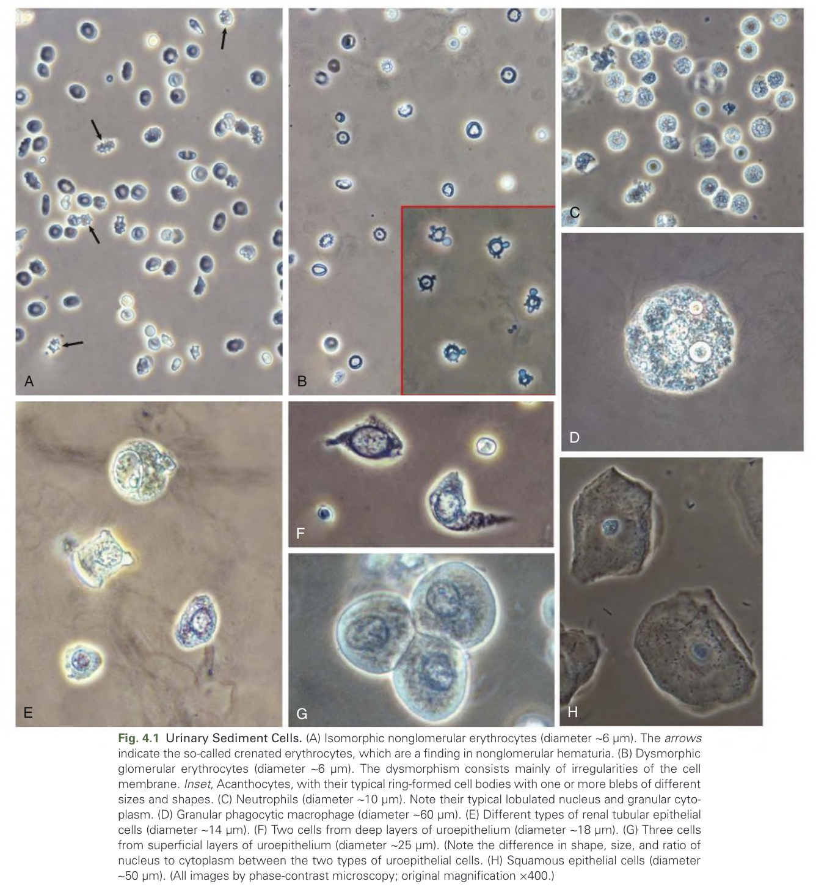

Fig. 4.1 Urinary Sediment Cells. (A) Isomorphic nonglomerular erythrocytes (diameter ∼6 μm). The arrows indicate the so-called crenated erythrocytes, which are a nding in nonglomerular hematuria. (B) Dysmorphic glomerular erythrocytes (diameter ∼6 μm). The dysmorphism consists mainly of irregularities of the cell membrane. Inset, Acanthocytes, with their typical ring-formed cell bodies with one or more blebs of different sizes and shapes. (C) Neutrophils (diameter ∼10 μm). Note their typical lobulated nucleus and granular cyto- plasm. (D) Granular phagocytic macrophage (diameter ∼60 μm). (E) Different types of renal tubular epithelial cells (diameter ∼14 μm). (F) Two cells from deep layers of uroepithelium (diameter ∼18 μm). (G) Three cells from supercial layers of uroepithelium (diameter ∼25 μm). (Note the difference in shape, size, and ratio of nucleus to cytoplasm between the two types of uroepithelial cells. (H) Squamous epithelial cells (diameter ∼50 μm). (All images by phase-contrast microscopy; original magnication ×400.)

---

### Fig_4_2

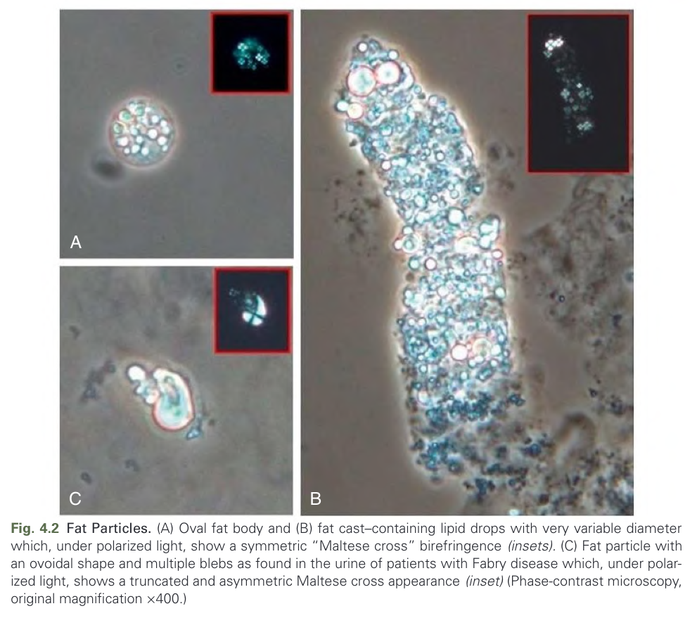

Fig. 4.2 Fat Particles. (A) Oval fat body and (B) fat cast–containing lipid drops with very variable diameter which, under polarized light, show a symmetric “Maltese cross” birefringence (insets). (C) Fat particle with an ovoidal shape and multiple blebs as found in the urine of patients with Fabry disease which, under polar- ized light, shows a truncated and asymmetric Maltese cross appearance (inset) (Phase-contrast microscopy, original magnication ×400.)

---

### Fig_4_3

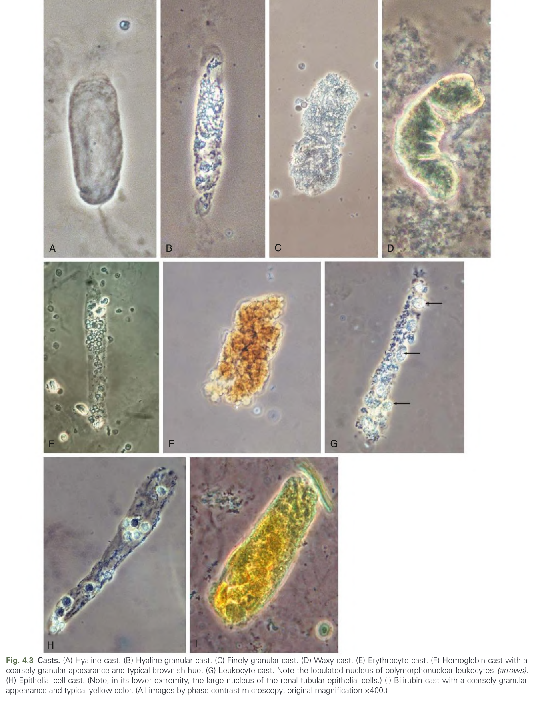

Fig. 4.3 Casts. (A) Hyaline cast. (B) Hyaline-granular cast. (C) Finely granular cast. (D) Waxy cast. (E) Erythrocyte cast. (F) Hemoglobin cast with a coarsely granular appearance and typical brownish hue. (G) Leukocyte cast. Note the lobulated nucleus of polymorphonuclear leukocytes (arrows). (H) Epithelial cell cast. (Note, in its lower extremity, the large nucleus of the renal tubular epithelial cells.) (I) Bilirubin cast with a coarsely granular appearance and typical yellow color. (All images by phase-contrast microscopy; original magnication ×400.)

---

### Fig_4_4

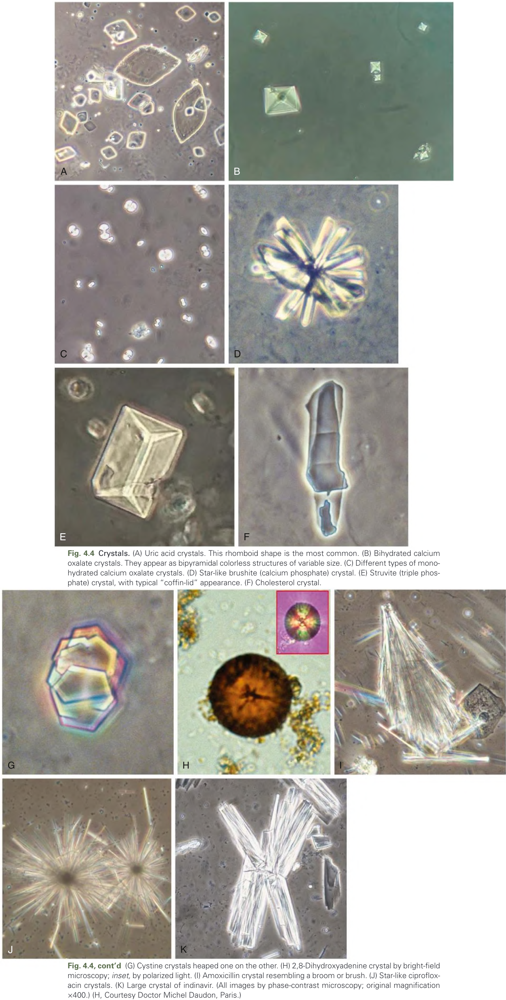

Fig. 4.4 Crystals. (A) Uric acid crystals. This rhomboid shape is the most common. (B) Bihydrated calcium oxalate crystals. They appear as bipyramidal colorless structures of variable size. (C) Different types of mono- hydrated calcium oxalate crystals. (D) Star-like brushite (calcium phosphate) crystal. (E) Struvite (triple phos- phate) crystal, with typical “cofn-lid” appearance. (F) Cholesterol crystal.

---

### Fig_4_5

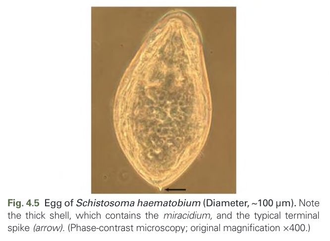

Fig. 4.5 Egg of Schistosoma haematobium (Diameter, ~100 μm). Note the thick shell, which contains the miracidium, and the typical terminal spike (arrow). (Phase-contrast microscopy; original magnication ×400.)

---

### Fig_4_6

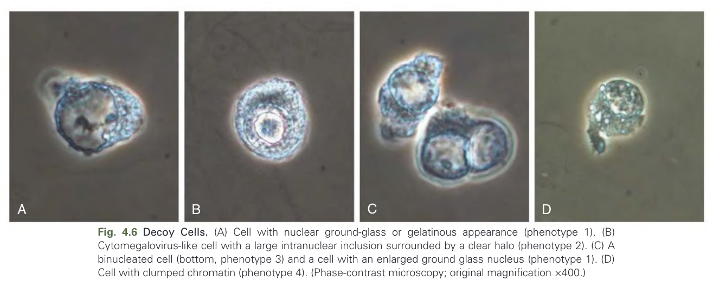

Fig. 4.6 Decoy Cells. (A) Cell with nuclear ground-glass or gelatinous appearance (phenotype 1). (B) Cytomegalovirus-like cell with a large intranuclear inclusion surrounded by a clear halo (phenotype 2). (C) A binucleated cell (bottom, phenotype 3) and a cell with an enlarged ground glass nucleus (phenotype 1). (D) Cell with clumped chromatin (phenotype 4). (Phase-contrast microscopy; original magnication ×400.)

---

## Tables

### Table_4_1

#### Table Image

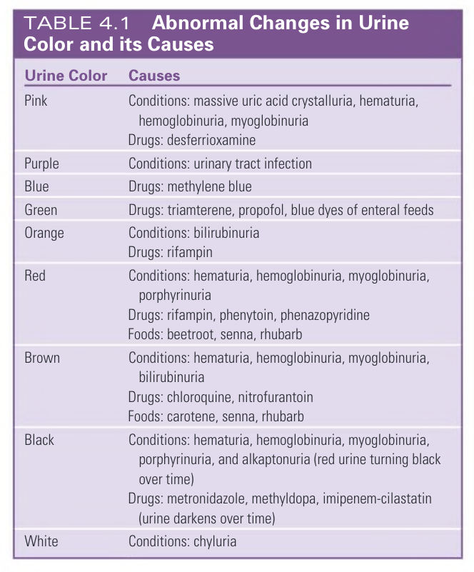

#### Table Data (CSV: [Table_4_1.csv](Table_4_1.csv))

```markdown
| Table Text (OCR) |
| :--- |
| TABLE 4.1 Abnormal Changes in Urine Color and its Causes |
| Urine Color Causes Pink Conditions: massive uric acid crystalluria, hematuria, hemoglobinuria, myoglobinuriaDrugs: desferrioxamine Purple Conditions: urinary tract infection Blue Drugs: methylene blue Green Drugs: triamterene, propofol, blue dyes of enteral feeds Orange Conditions: bilirubinuriaDrugs: rifampin Red Conditions: hematuria, hemoglobinuria, myoglobinuria, porphyrinuriaDrugs: rifampin, phenytoin, phenazopyridineFoods: beetroot, senna, rhubarb Brown Conditions: hematuria, hemoglobinuria, myoglobinuria, bilirubinuriaDrugs: chloroquine, nitrofurantoinFoods: carotene, senna, rhubarb Black Conditions: hematuria, hemoglobinuria, myoglobinuria, porphyrinuria, and alkaptonuria (red urine turning black over time)Drugs: metronidazole, methyldopa, imipenem-cilastatin (urine darkens over time) White Conditions: chyluria |
```

Table 4.1

---

### Table_4_2

#### Table Image

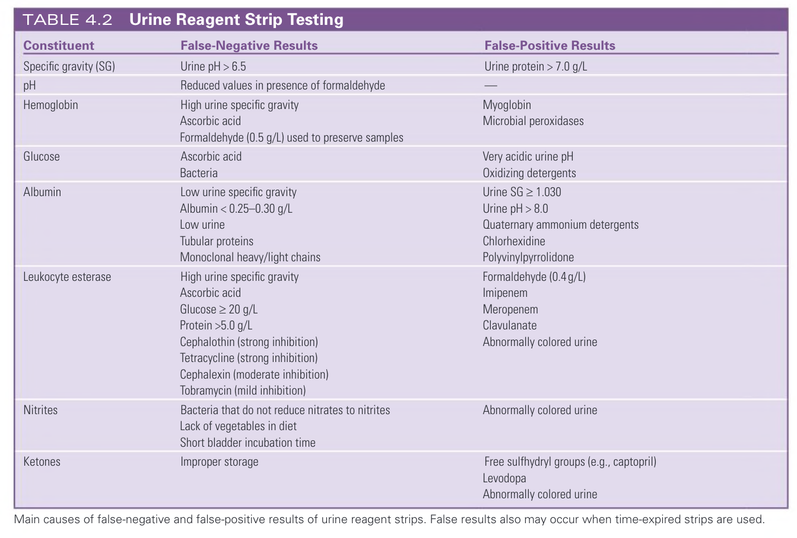

#### Table Data (CSV: [Table_4_2.csv](Table_4_2.csv))

```markdown
| Table Text (OCR) |
| :--- |
| TABLE 4.2 Urine Reagent Strip Testing |
| Constituent False-Negative Results False-Positive Results Specific gravity (SG) Urine pH > 6.5 Urine protein > 7.0 g/L pH Reduced values in presence of formaldehyde — Hemoglobin High urine specific gravityAscorbic acidFormaldehyde (0.5 g/L) used to preserve samples MyoglobinMicrobial peroxidases Glucose Ascorbic acidBacteria Very acidic urine pHOxidizing detergents Albumin Low urine specific gravityAlbumin < 0.25–0.30 g/LLow urineTubular proteinsMonoclonal heavy/light chains Urine SG ≥ 1.030Urine pH > 8.0Quaternary ammonium detergentsChlorhexidinePolyvinylpyrrolidone Leukocyte esterase High urine specific gravityAscorbic acidGlucose ≥ 20 g/LProtein >5.0 g/LCephalothin (strong inhibition)Tetracycline (strong inhibition)Cephalexin (moderate inhibition)Tobramycin (mild inhibition) Formaldehyde (0.4 g/L)ImipenemMeropenemClavulanateAbnormally colored urine Nitrites Bacteria that do not reduce nitrates to nitritesLack of vegetables in dietShort bladder incubation time Abnormally colored urine Ketones Improper storage Free sulfhydryl groups (e.g., captopril)LevodopaAbnormally colored urine |
| Main causes of false-negative and false-positive results of urine reagent strips. False results also may occur when time-expired strips are used. |
```

Table 4.2

---

### Table_4_3

#### Table Image

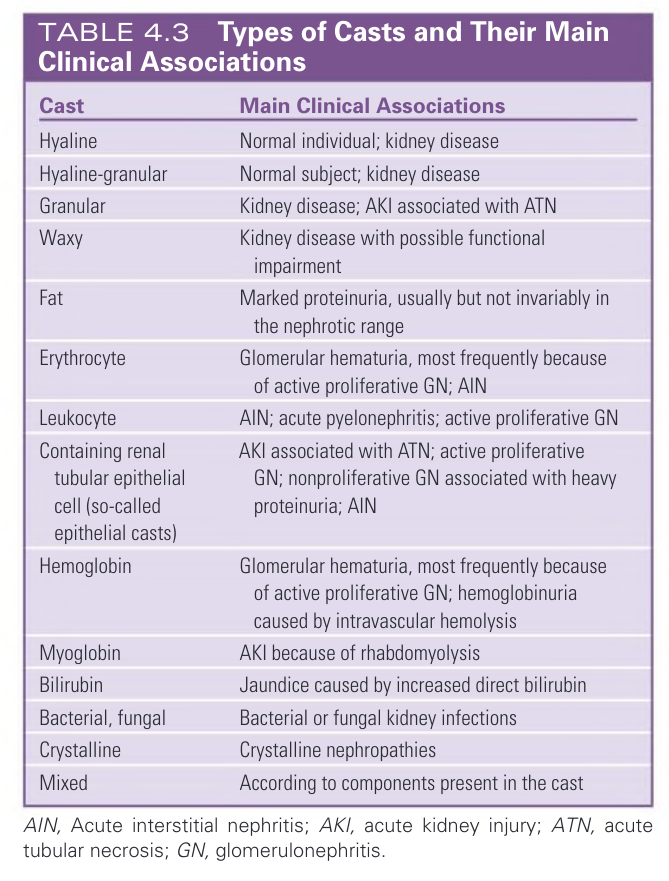

#### Table Data (CSV: [Table_4_3.csv](Table_4_3.csv))

```markdown
| Table Text (OCR) |
| :--- |
| TABLE 4.3 Types of Casts and Their Main Clinical Associations |
| Cast Main Clinical Associations Hyaline Normal individual; kidney disease Hyaline-granular Normal subject; kidney disease Granular Kidney disease; AKI associated with ATN Waxy Kidney disease with possible functional impairment Fat Marked proteinuria, usually but not invariably in the nephrotic range Erythrocyte Glomerular hematuria, most frequently because of active proliferative GN; AIN Leukocyte AIN; acute pyelonephritis; active proliferative GN Containing renal tubular epithelial cell (so-called epithelial casts) AKI associated with ATN; active proliferative GN; nonproliferative GN associated with heavy proteinuria; AIN Hemoglobin Glomerular hematuria, most frequently because of active proliferative GN; hemoglobinuria caused by intravascular hemolysis Myoglobin AKI because of rhabdomyolysis Bilirubin Jaundice caused by increased direct bilirubin Bacterial, fungal Bacterial or fungal kidney infections Crystalline Crystalline nephropathies Mixed According to components present in the cast |
| AIN, Acute interstitial nephritis; AKI, acute kidney injury; ATN, acute tubular necrosis; GN, glomerulonephritis. |
```

Table 4.3

---

### Table_4_4

#### Table Image

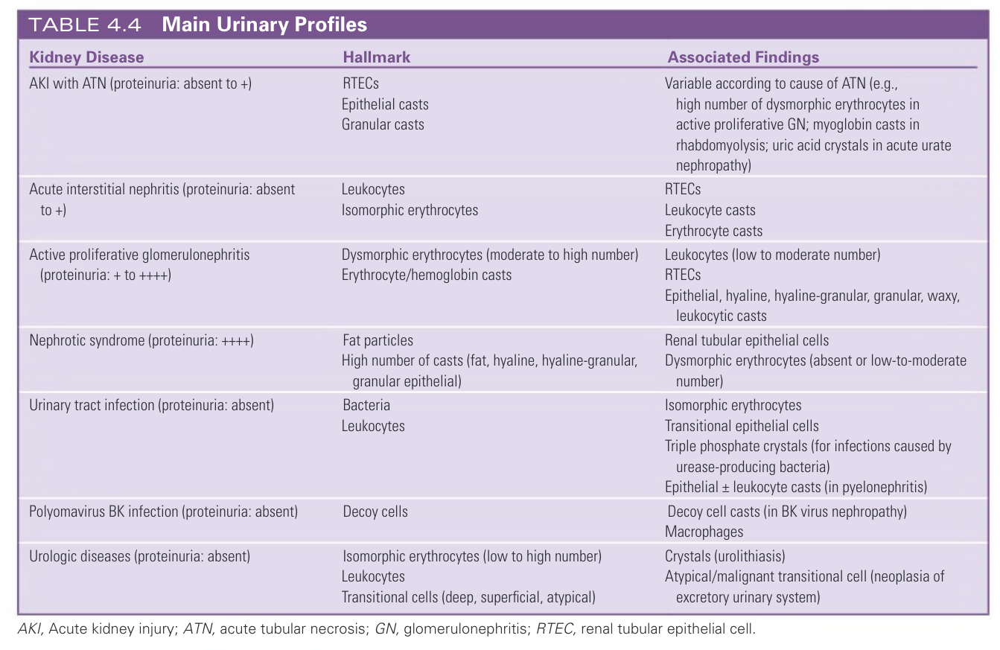

#### Table Data (CSV: [Table_4_4.csv](Table_4_4.csv))

```markdown
| Table Text (OCR) |
| :--- |
| TABLE 4.4 Main Urinary Profiles |
| Kidney Disease Hallmark Associated Findings AKI with ATN (proteinuria: absent to +) RTECsEpithelial castsGranular casts Variable according to cause of ATN (e.g.,high number of dysmorphic erythrocytes inactive proliferative GN; myoglobin casts inrhabdomyolysis; uric acid crystals in acute uratenephropathy) Acute interstitial nephritis (proteinuria: absent to +) LeukocytesIsomorphic erythrocytes RTECsLeukocyte castsErythrocyte casts Active proliferative glomerulonephritis (proteinuria: + to ++++) Dysmorphic erythrocytes (moderate to high number)Erythrocyte/hemoglobin casts Leukocytes (low to moderate number)RTECsEpithelial, hyaline, hyaline-granular, granular, waxy,leukocytic casts Nephrotic syndrome (proteinuria: ++++) Fat particlesHigh number of casts (fat, hyaline, hyaline-granular,granular epithelial) Renal tubular epithelial cellsDysmorphic erythrocytes (absent or low-to-moderatenumber) Urinary tract infection (proteinuria: absent) BacteriaLeukocytes Isomorphic erythrocytesTransitional epithelial cellsTriple phosphate crystals (for infections caused byurease-producing bacteria)Epithelial ± leukocyte casts (in pyelonephritis) Polyomavirus BK infection (proteinuria: absent) Decoy cells Decoy cell casts (in BK virus nephropathy)Macrophages Urologic diseases (proteinuria: absent) Isomorphic erythrocytes (low to high number)LeukocytesTransitional cells (deep, superficial, atypical) Crystals (urolithiasis)Atypical/malignant transitional cell (neoplasia ofexcretory urinary system) |
| AKI, Acute kidney injury; ATN, acute tubular necrosis; GN, glomerulonephritis; RTEC, renal tubular epithelial cell. |
```

Table 4.4

---

## Boxes

### Box_4_1

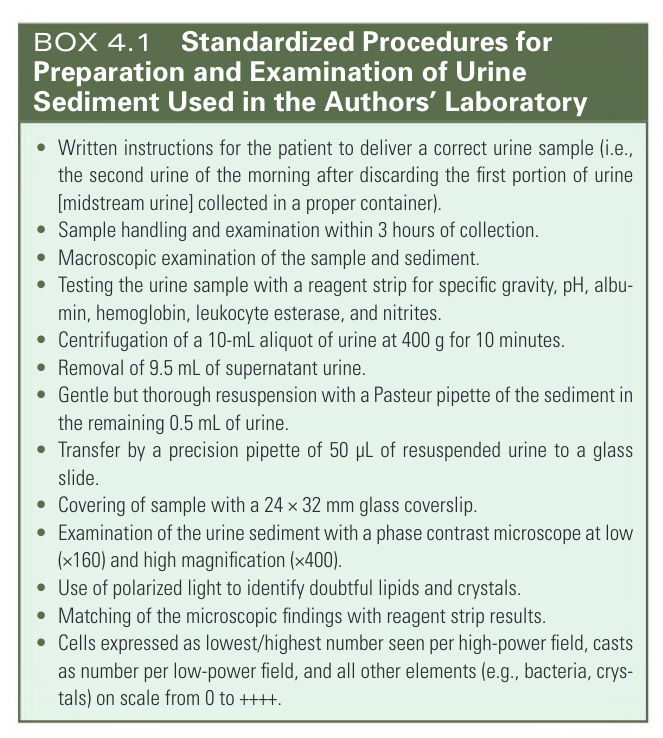

#### Box Text

```markdown
BOX 4.1 Standardized Procedures for Preparation and Examination of Urine Sediment Used in the Authors' Laboratory - Written instructions for the patient to deliver a correct urine sample (i.e., the second urine of the morning after discarding the first portion of urine [midstream urine] collected in a proper container). • Sample handling and examination within 3 hours of collection. • Macroscopic examination of the sample and sediment. - Testing the urine sample with a reagent strip for specific gravity, pH, albumin, hemoglobin, leukocyte esterase, and nitrites. - Centrifugation of a 10-mL aliquot of urine at 400 g for 10 minutes. - Removal of 9.5 mL of supernatant urine. - Gentle but thorough resuspension with a Pasteur pipette of the sediment in the remaining 0.5 mL of urine. - Transfer by a precision pipette of 50 \mu L of resuspended urine to a glass slide. - Covering of sample with a 24 \times 32 \mathrm{~mm} glass coverslip. - Examination of the urine sediment with a phase contrast microscope at low (×160) and high magnification (×400). - Use of polarized light to identify doubtful lipids and crystals. - Matching of the microscopic findings with reagent strip results. - Cells expressed as lowest/highest number seen per high-power field, casts as number per low-power field, and all other elements (e.g., bacteria, crystals) on scale from 0 to ++++.
```

Box 4.1

---
