# 005. Point of Care Ultrasound in Nephrology - Figures and Tables Index

This document lists all figures, tables and boxes extracted from `005. Point of Care Ultrasound in Nephrology.pdf`.

## Table of Contents
- [Figures](#figures)
- [Tables](#tables)
- [Boxes](#boxes)

---

## Figures

### Fig_5_1

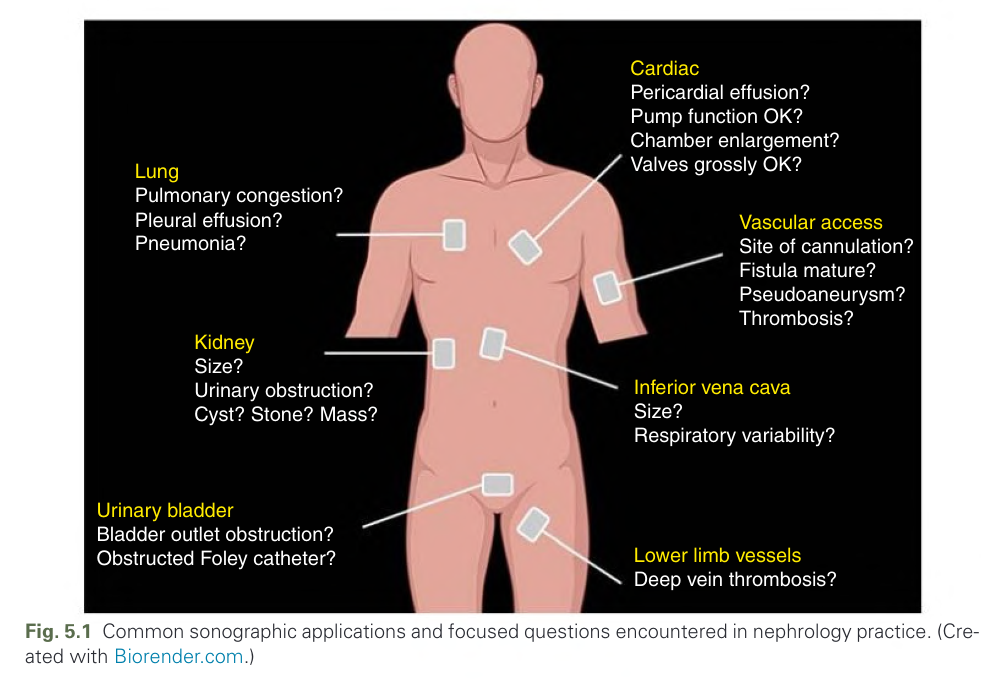

Fig. 5.1 Common sonographic applications and focused questions encountered in nephrology practice. (Created with Biorender.com.)

---

### Fig_5_2

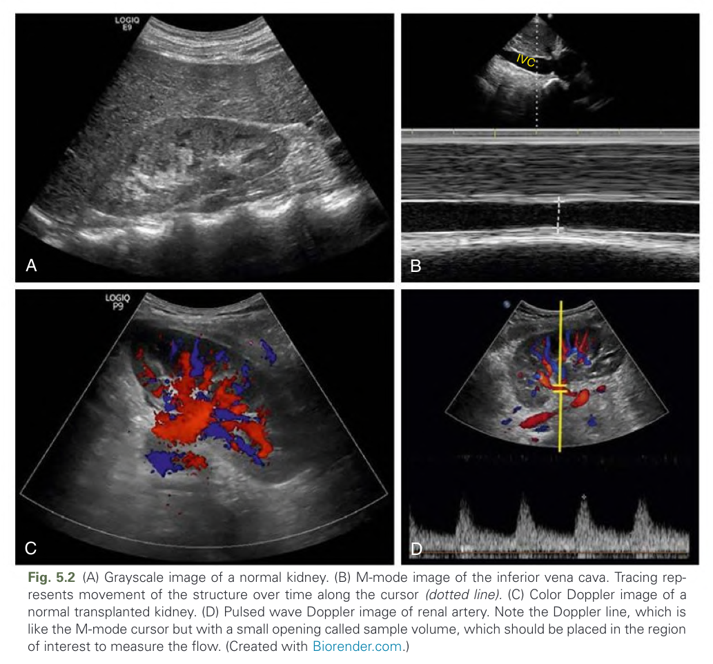

Fig. 5.2 (A) Grayscale image of a normal kidney. (B) M-mode image of the inferior vena cava. Tracing represents movement of the structure over time along the cursor (dotted line). (C) Color Doppler image of a normal transplanted kidney. (D) Pulsed wave Doppler image of renal artery. Note the Doppler line, which is like the M-mode cursor but with a small opening called sample volume, which should be placed in the region of interest to measure the flow. (Created with Biorender.com.)

---

### Fig_5_3

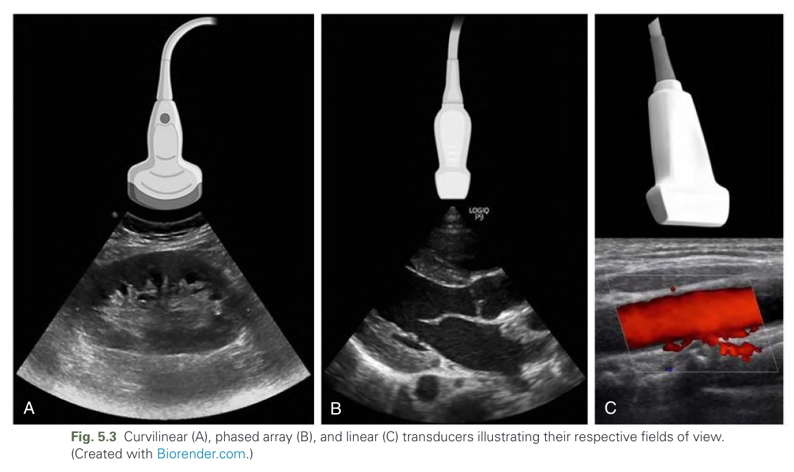

Fig. 5.3 Curvilinear (A), phased array (B), and linear (C) transducers illustrating their respective fields of view. (Created with Biorender.com.)

---

### Fig_5_4

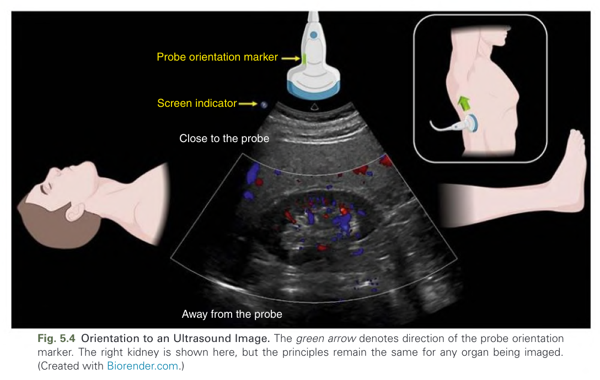

Fig. 5.4 Orientation to an Ultrasound Image. The green arrow denotes direction of the probe orientation marker. The right kidney is shown here, but the principles remain the same for any organ being imaged. (Created with Biorender.com.)

---

### Fig_5_5

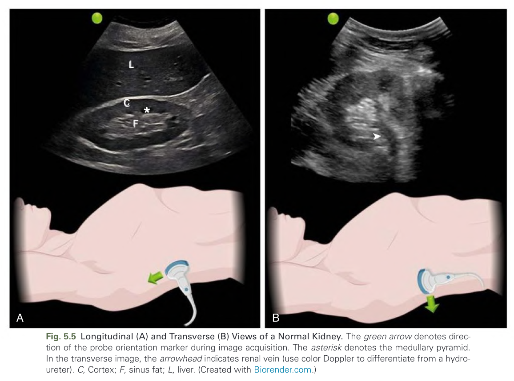

Fig. 5.5 Longitudinal (A) and Transverse (B) Views of a Normal Kidney. The green arrow denotes direction of the probe orientation marker during image acquisition. The asterisk denotes the medullary pyramid. In the transverse image, the arrowhead indicates renal vein (use color Doppler to differentiate from a hydroureter). C, Cortex; F, sinus fat; L, liver. (Created with Biorender.com.)

---

### Fig_5_6

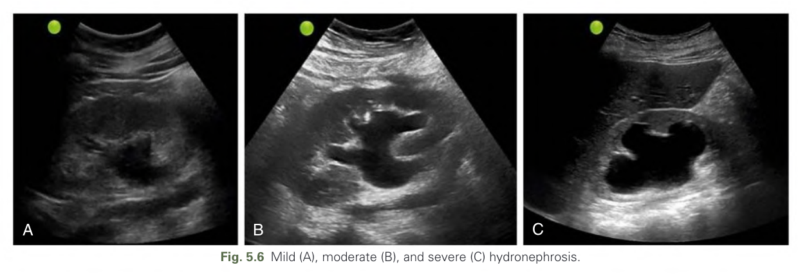

Fig. 5.6 Mild (A), moderate (B), and severe (C) hydronephrosis.

---

### Fig_5_7

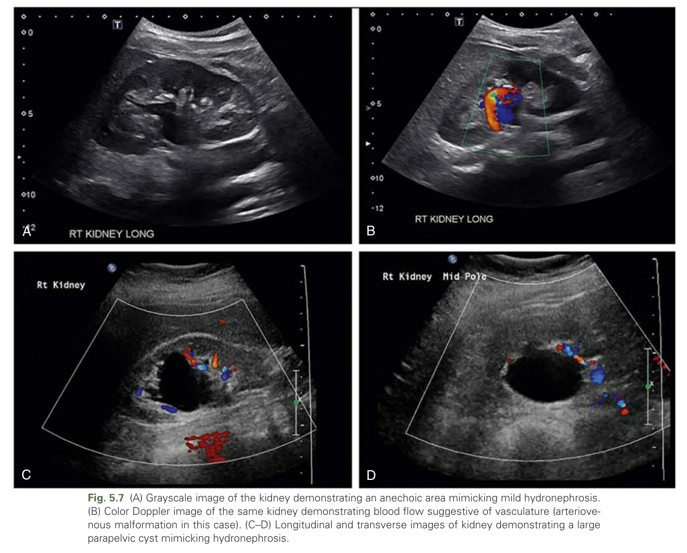

Fig. 5.7 (A) Grayscale image of the kidney demonstrating an anechoic area mimicking mild hydronephrosis. (B) Color Doppler image of the same kidney demonstrating blood flow suggestive of vasculature (arteriovenous malformation in this case). (C–D) Longitudinal and transverse images of kidney demonstrating a large parapelvic cyst mimicking hydronephrosis.

---

### Fig_5_8

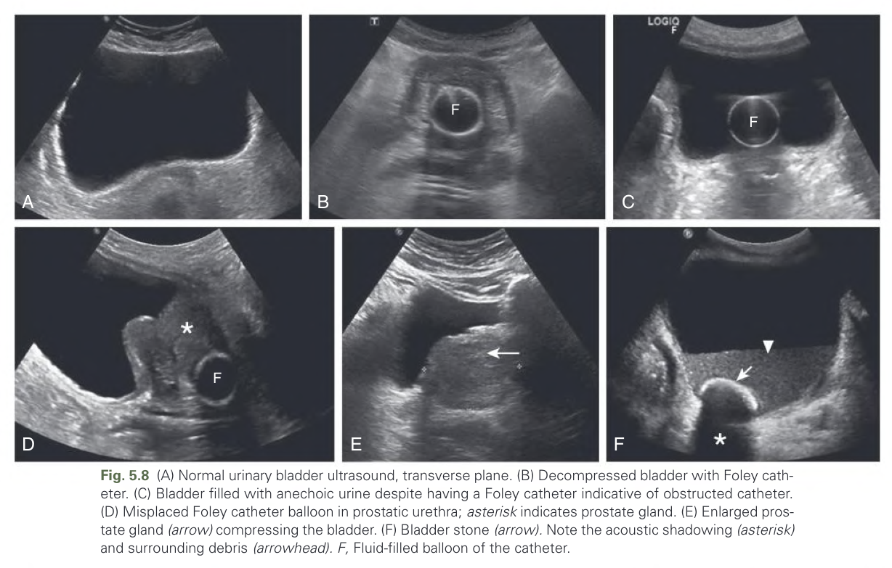

Fig. 5.8 (A) Normal urinary bladder ultrasound, transverse plane. (B) Decompressed bladder with Foley catheter. (C) Bladder filled with anechoic urine despite having a Foley catheter indicative of obstructed catheter. (D) Misplaced Foley catheter balloon in prostatic urethra; asterisk indicates prostate gland. (E) Enlarged prostate gland (arrow) compressing the bladder. (F) Bladder stone (arrow). Note the acoustic shadowing (asterisk) and surrounding debris (arrowhead). F, Fluid-filled balloon of the catheter.

---

### Fig_5_9

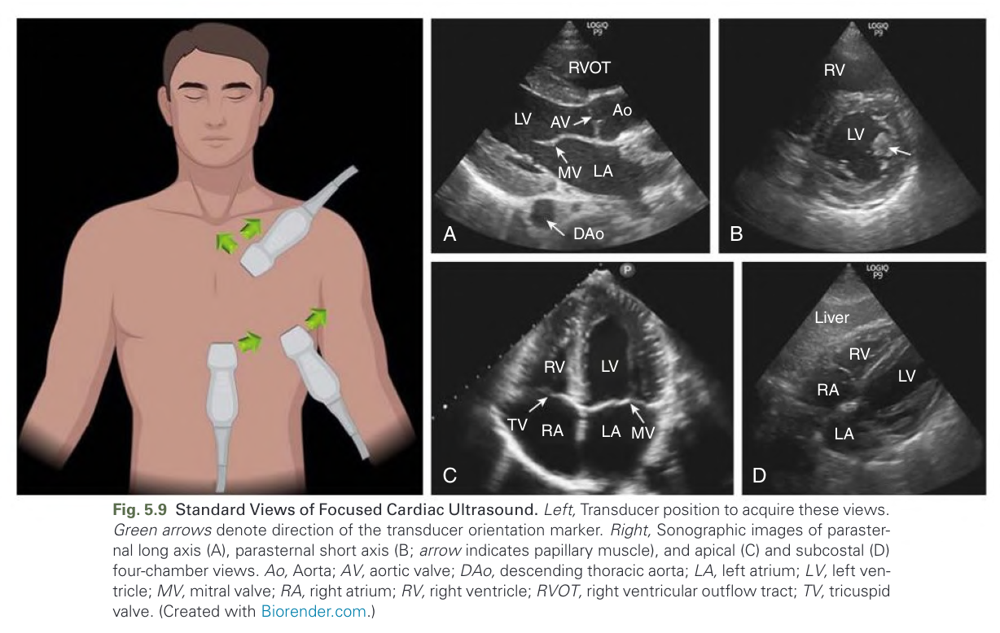

Fig. 5.9 Standard Views of Focused Cardiac Ultrasound. Left, Transducer position to acquire these views. Green arrows denote direction of the transducer orientation marker. Right, Sonographic images of parasternal long axis (A), parasternal short axis (B; arrow indicates papillary muscle), and apical (C) and subcostal (D) four-chamber views. Ao, Aorta; AV, aortic valve; DAo, descending thoracic aorta; LA, left atrium; LV, left ventricle; MV, mitral valve; RA, right atrium; RV, right ventricle; RVOT, right ventricular outflow tract; TV, tricuspid valve. (Created with Biorender.com.)

---

### Fig_5_10

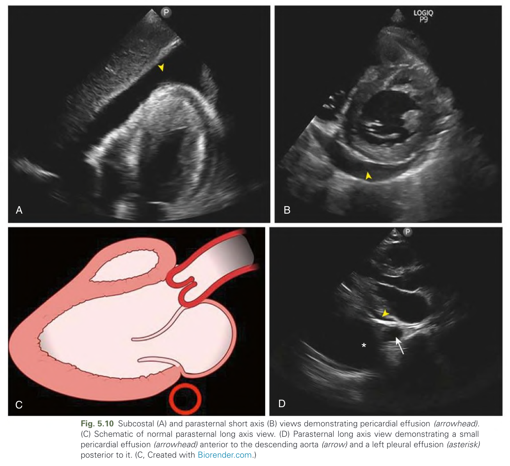

Fig. 5.10 Subcostal (A) and parasternal short axis (B) views demonstrating pericardial effusion (arrowhead). (C) Schematic of normal parasternal long axis view. (D) Parasternal long axis view demonstrating a small pericardial effusion (arrowhead) anterior to the descending aorta (arrow) and a left pleural effusion (asterisk) posterior to it. (C, Created with Biorender.com.)

---

### Fig_5_11

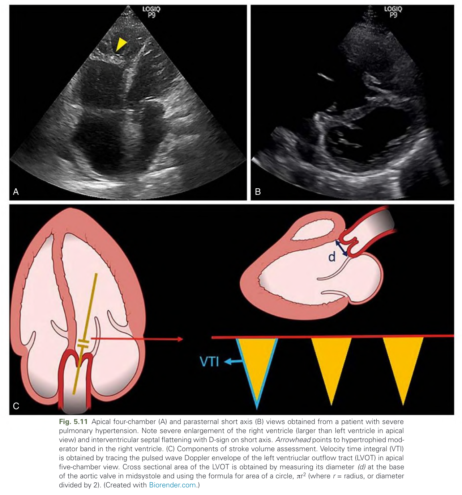

Fig. 5.11 Apical four-chamber (A) and parasternal short axis (B) views obtained from a patient with severe pulmonary hypertension. Note severe enlargement of the right ventricle (larger than left ventricle in apical view) and interventricular septal flattening with D-sign on short axis. Arrowhead points to hypertrophied moderator band in the right ventricle. (C) Components of stroke volume assessment. Velocity time integral (VTI) is obtained by tracing the pulsed wave Doppler envelope of the left ventricular outflow tract (LVOT) in apical five-chamber view. Cross sectional area of the LVOT is obtained by measuring its diameter (d) at the base of the aortic valve in midsystole and using the formula for area of a circle, \pi r^{2} (where r = radius, or diameter divided by 2). (Created with Biorender.com.)

---

### Fig_5_12

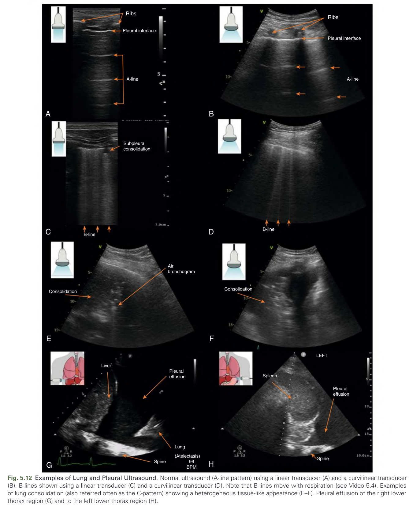

Fig. 5.12 Examples of Lung and Pleural Ultrasound. Normal ultrasound (A-line pattern) using a linear transducer (A) and a curvilinear transducer (B). B-lines shown using a linear transducer (C) and a curvilinear transducer (D). Note that B-lines move with respiration (see Video 5.4). Examples of lung consolidation (also referred often as the C-pattern) showing a heterogeneous tissue-like appearance (E–F). Pleural effusion of the right lower thorax region (G) and to the left lower thorax region (H).

---

### Fig_5_13

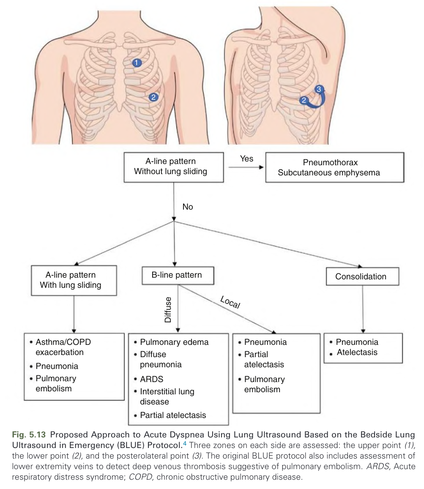

Fig. 5.13 Proposed Approach to Acute Dyspnea Using Lung Ultrasound Based on the Bedside Lung Ultrasound in Emergency (BLUE) Protocol. ^{4} Three zones on each side are assessed: the upper point (1), the lower point (2), and the posterolateral point (3). The original BLUE protocol also includes assessment of lower extremity veins to detect deep venous thrombosis suggestive of pulmonary embolism. ARDS, Acute respiratory distress syndrome; COPD, chronic obstructive pulmonary disease.

---

### Fig_5_14

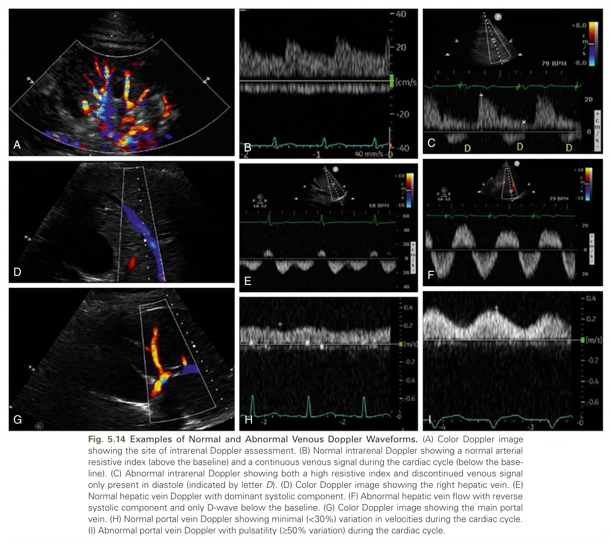

Fig. 5.14 Examples of Normal and Abnormal Venous Doppler Waveforms. (A) Color Doppler image showing the site of intrarenal Doppler assessment. (B) Normal intrarenal Doppler showing a normal arterial resistive index (above the baseline) and a continuous venous signal during the cardiac cycle (below the baseline). (C) Abnormal intrarenal Doppler showing both a high resistive index and discontinued venous signal only present in diastole (indicated by letter D). (D) Color Doppler image showing the right hepatic vein. (E) Normal hepatic vein Doppler with dominant systolic component. (F) Abnormal hepatic vein flow with reverse systolic component and only D-wave below the baseline. (G) Color Doppler image showing the main portal vein. (H) Normal portal vein Doppler showing minimal (<30%) variation in velocities during the cardiac cycle. (I) Abnormal portal vein Doppler with pulsatility (≥50% variation) during the cardiac cycle.

---

## Tables

### Table_5_1

#### Table Image

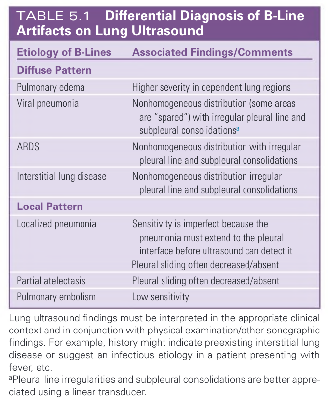

#### Table Data (CSV: [Table_5_1.csv](Table_5_1.csv))

```markdown
| Etiology of B-Lines | Associated Findings/Comments |
| :--- | :--- |
| **Diffuse Pattern** | |
| Pulmonary edema | Higher severity in dependent lung regions |
| Viral pneumonia | Nonhomogeneous distribution (some areas are "spared") with irregular pleural line and subpleural consolidationsa |
| ARDS | Nonhomogeneous distribution with irregular pleural line and subpleural consolidations |
| Interstitial lung disease | Nonhomogeneous distribution irregular pleural line and subpleural consolidations |
| **Local Pattern** | |
| Localized pneumonia | Sensitivity is imperfect because the pneumonia must extend to the pleural interface before ultrasound can detect it |
| Partial atelectasis | Pleural sliding often decreased/absent |
| Pulmonary embolism | Pleural sliding often decreased/absent, Low sensitivity |
*Lung ultrasound findings must be interpreted in the appropriate clinical context and in conjunction with physical examination/other sonographic findings. For example, history might indicate preexisting interstitial lung disease or suggest an infectious etiology in a patient presenting with fever, etc.*
*aPleural line irregularities and subpleural consolidations are better appreciated using a linear transducer.*
```

TABLE 5.1 Differential Diagnosis of B-Line Artifacts on Lung Ultrasound

---

### Table_5_2

#### Table Image

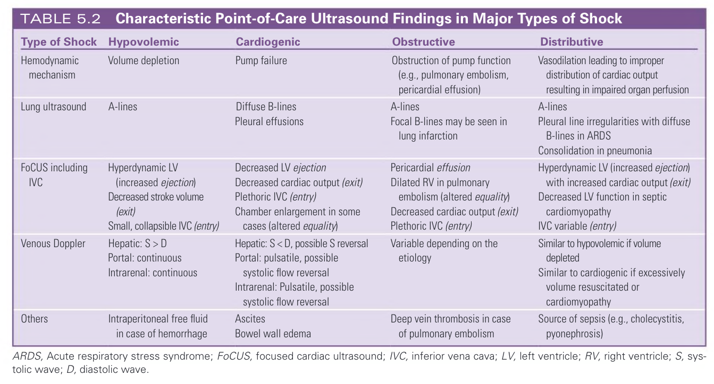

#### Table Data (CSV: [Table_5_2.csv](Table_5_2.csv))

```markdown
| Type of Shock | Hypovolemic | Cardiogenic | Obstructive | Distributive |
| :--- | :--- | :--- | :--- | :--- |
| **Hemodynamic mechanism** | Volume depletion | Pump failure | Obstruction of pump function (e.g., pulmonary embolism, pericardial effusion) | Vasodilation leading to improper distribution of cardiac output resulting in impaired organ perfusion |
| **Lung ultrasound** | A-lines | Diffuse B-lines, Pleural effusions | A-lines, Focal B-lines may be seen in lung infarction | A-lines, Pleural line irregularities with diffuse B-lines in ARDS, Consolidation in pneumonia |
| **FoCUS including IVC** | Hyperdynamic LV (increased ejection), Decreased stroke volume (exit), Small, collapsible IVC (entry) | Decreased LV ejection, Decreased cardiac output (exit), Plethoric IVC (entry), Chamber enlargement in some cases (altered equality) | Pericardial effusion, Dilated RV in pulmonary embolism (altered equality), Decreased cardiac output (exit), Plethoric IVC (entry) | Hyperdynamic LV (increased ejection) with increased cardiac output (exit), Decreased LV function in septic cardiomyopathy, IVC variable (entry) |
| **Venous Doppler** | Hepatic: S > D, Portal: continuous, Intrarenal: continuous | Hepatic: S < D, possible S reversal, Portal: pulsatile, possible systolic flow reversal, Intrarenal: Pulsatile, possible systolic flow reversal | Variable depending on the etiology | Similar to hypovolemic if volume depleted, Similar to cardiogenic if excessively volume resuscitated or cardiomyopathy |
| **Others** | Intraperitoneal free fluid in case of hemorrhage | Ascites, Bowel wall edema | Deep vein thrombosis in case of pulmonary embolism | Source of sepsis (e.g., cholecystitis, pyonephrosis) |
*ARDS, Acute respiratory stress syndrome; FoCUS, focused cardiac ultrasound; IVC, inferior vena cava; LV, left ventricle; RV, right ventricle; S, systolic wave; D, diastolic wave.*
```

TABLE 5.2 Characteristic Point-of-Care Ultrasound Findings in Major Types of Shock

---

## Boxes

*No boxes resolved for this chapter.*
