# 006. Radiologic and Nuclear Imaging in Nephrology - Figures and Tables Index

This document lists all figures and tables extracted from `006. Radiologic and Nuclear Imaging in Nephrology.pdf`.

## Table of Contents
- [Figures](#figures)
- [Tables](#tables)

---

## Figures

### Fig_6_1

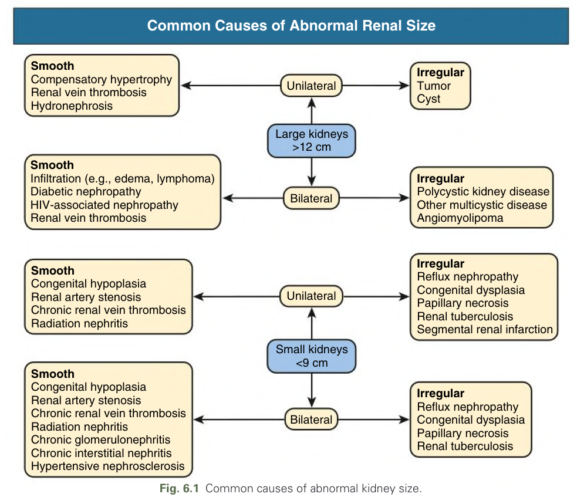

Fig. 6.1 Common causes of abnormal kidney size.

---

### Fig_6_2

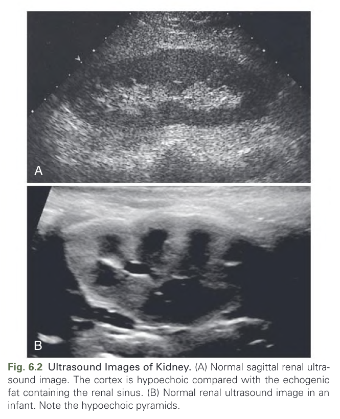

Fig. 6.2 Ultrasound Images of Kidney. (A) Normal sagittal renal ultra- sound image. The cortex is hypoechoic compared with the echogenic fat containing the renal sinus. (B) Normal renal ultrasound image in an infant. Note the hypoechoic pyramids.

---

### Fig_6_3

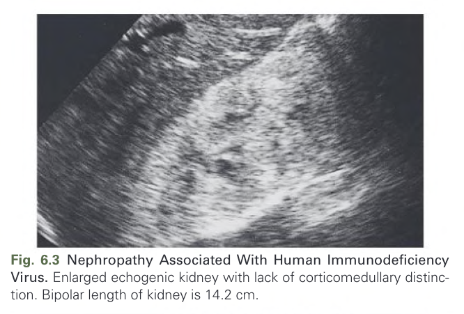

Fig. 6.3 Nephropathy Associated With Human Immunodeciency Virus. Enlarged echogenic kidney with lack of corticomedullary distinc- tion. Bipolar length of kidney is 14.2 cm.

---

### Fig_6_4

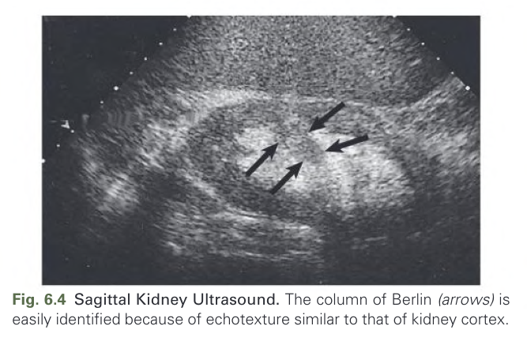

Fig. 6.4 Sagittal Kidney Ultrasound. The column of Berlin (arrows) is easily identied because of echotexture similar to that of kidney cortex.

---

### Fig_6_5

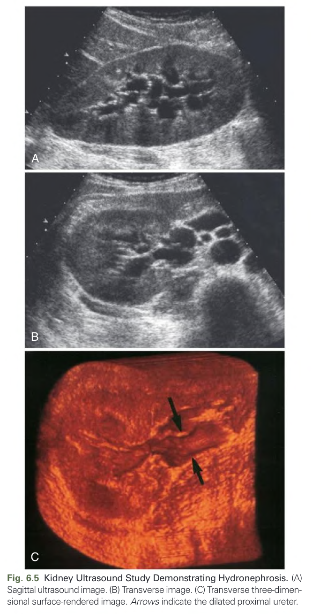

Fig. 6.5 Kidney Ultrasound Study Demonstrating Hydronephrosis. (A) Sagittal ultrasound image. (B) Transverse image. (C) Transverse three-dimen- sional surface-rendered image. Arrows indicate the dilated proximal ureter.

---

### Fig_6_6

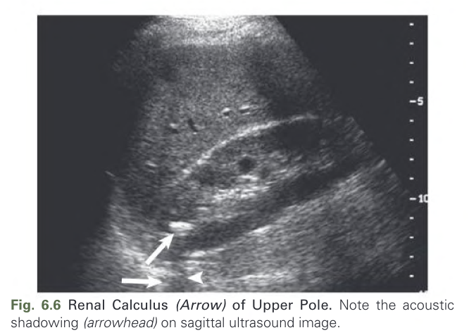

Fig. 6.6 Renal Calculus (Arrow) of Upper Pole. Note the acoustic shadowing (arrowhead) on sagittal ultrasound image.

---

### Fig_6_7

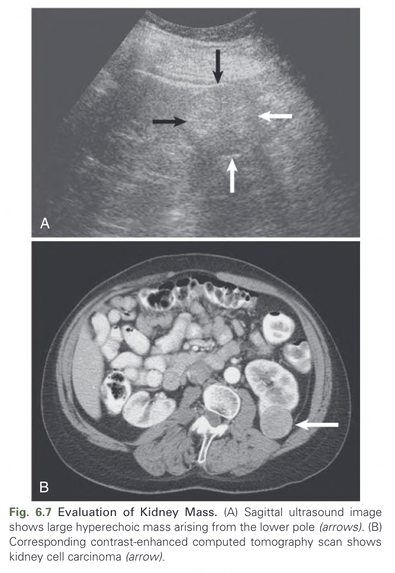

Fig. 6.7 Evaluation of Kidney Mass. (A) Sagittal ultrasound image shows large hyperechoic mass arising from the lower pole (arrows). (B) Corresponding contrast-enhanced computed tomography scan shows kidney cell carcinoma (arrow)

---

### Fig_6_8

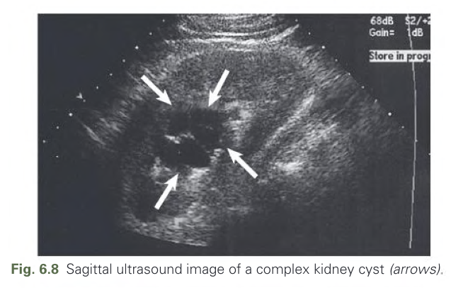

Fig. 6.8 Sagittal ultrasound image of a complex kidney cyst (arrows)

---

### Fig_6_9

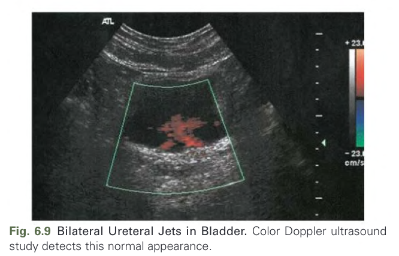

Fig. 6.9 Bilateral Ureteral Jets in Bladder. Color Doppler ultrasound study detects this normal appearance.

---

### Fig_6_10

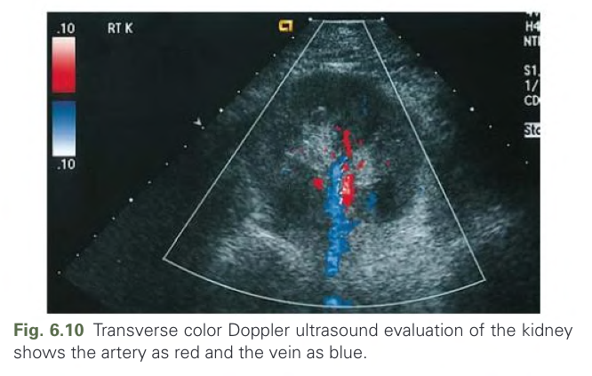

Fig. 6.10 Transverse color Doppler ultrasound evaluation of the kidney shows the artery as red and the vein as blue.

---

### Fig_6_11

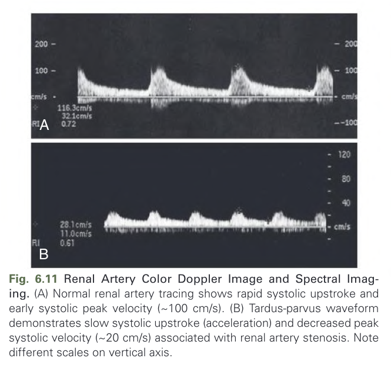

Fig. 6.11 Renal Artery Color Doppler Image and Spectral Imag- ing. (A) Normal renal artery tracing shows rapid systolic upstroke and early systolic peak velocity (~100 cm/s). (B) Tardus-parvus waveform demonstrates slow systolic upstroke (acceleration) and decreased peak systolic velocity (~20 cm/s) associated with renal artery stenosis. Note different scales on vertical axis.

---

### Fig_6_12

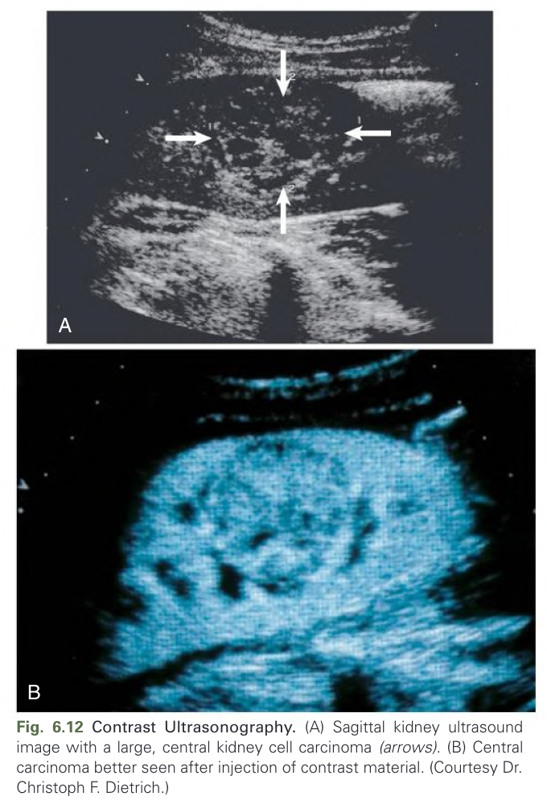

Fig. 6.12 Contrast Ultrasonography. (A) Sagittal kidney ultrasound image with a large, central kidney cell carcinoma (arrows). (B) Central carcinoma better seen after injection of contrast material. (Courtesy Dr. Christoph F. Dietrich.)

---

### Fig_6_13

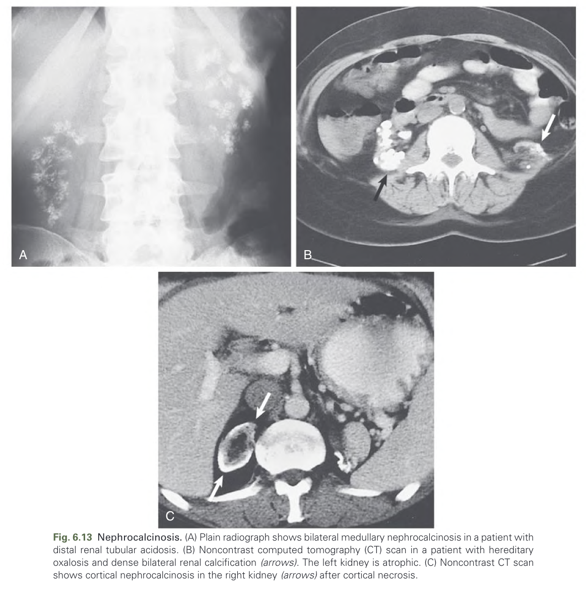

Fig. 6.13 Nephrocalcinosis. (A) Plain radiograph shows bilateral medullary nephrocalcinosis in a patient with distal renal tubular acidosis. (B) Noncontrast computed tomography (CT) scan in a patient with hereditary oxalosis and dense bilateral renal calcication (arrows). The left kidney is atrophic. (C) Noncontrast CT scan shows cortical nephrocalcinosis in the right kidney (arrows) after cortical necrosis.

---

### Fig_6_14

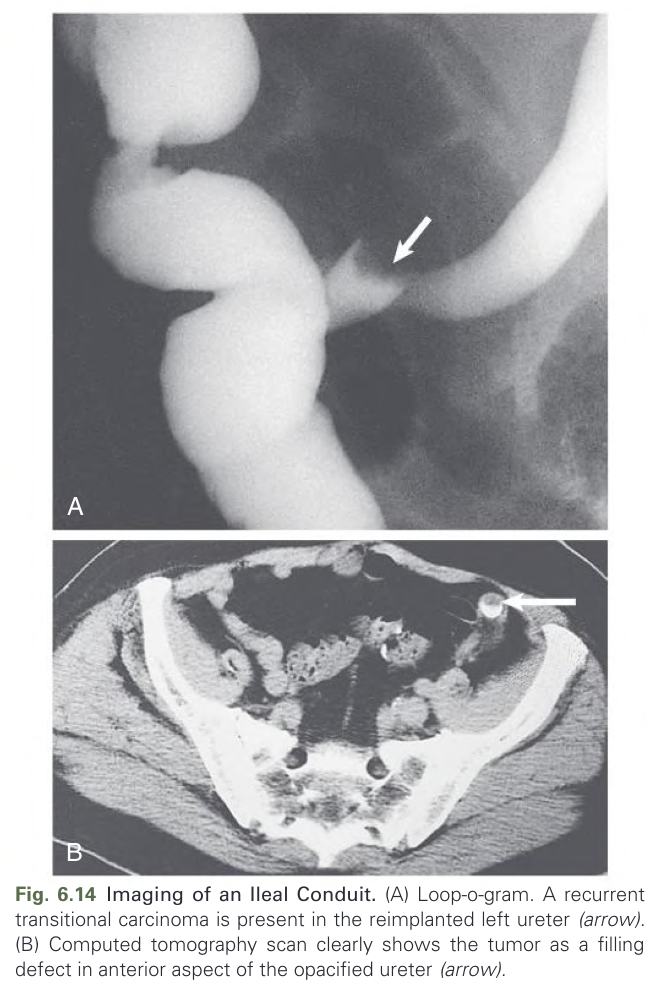

Fig. 6.14 Imaging of an Ileal Conduit. (A) Loop-o-gram. A recurrent transitional carcinoma is present in the reimplanted left ureter (arrow). (B) Computed tomography scan clearly shows the tumor as a lling defect in anterior aspect of the opacied ureter (arrow).

---

### Fig_6_15

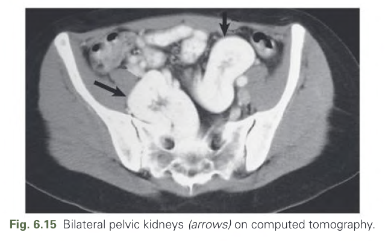

Fig. 6.15 Bilateral pelvic kidneys (arrows) on computed tomography.

---

### Fig_6_16

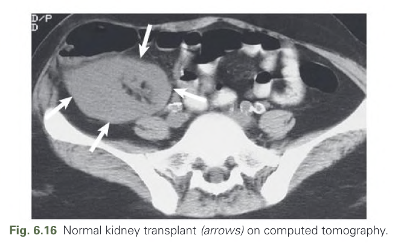

Fig. 6.16 Normal kidney transplant (arrows) on computed tomography.

---

### Fig_6_17

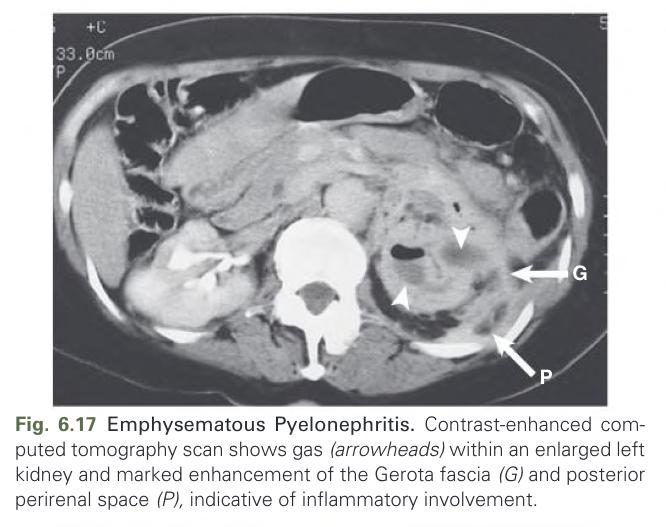

Fig. 6.17 Emphysematous Pyelonephritis. Contrast-enhanced com- puted tomography scan shows gas (arrowheads) within an enlarged left kidney and marked enhancement of the Gerota fascia (G) and posterior perirenal space (P), indicative of inammatory involvement.

---

### Fig_6_18

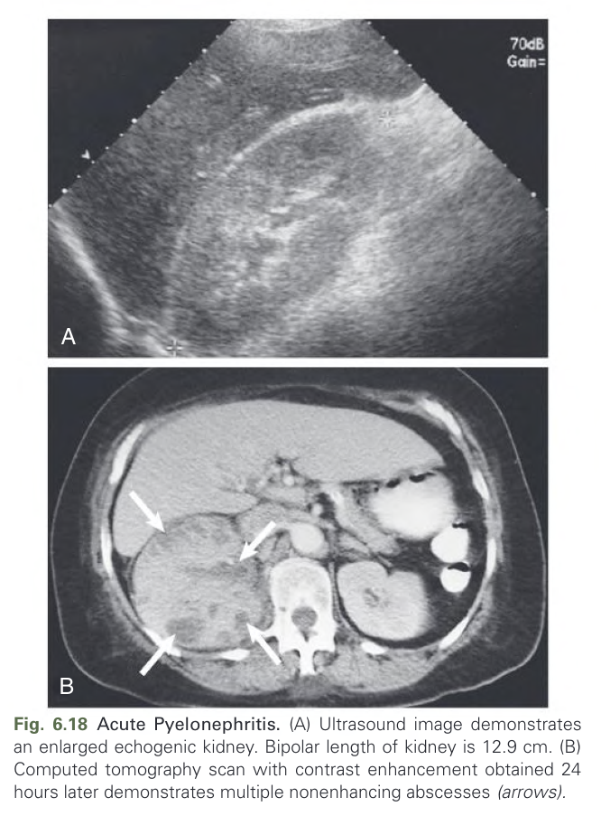

Fig. 6.18 Acute Pyelonephritis. (A) Ultrasound image demonstrates an enlarged echogenic kidney. Bipolar length of kidney is 12.9 cm. (B) Computed tomography scan with contrast enhancement obtained 24 hours later demonstrates multiple nonenhancing abscesses (arrows).

---

### Fig_6_19

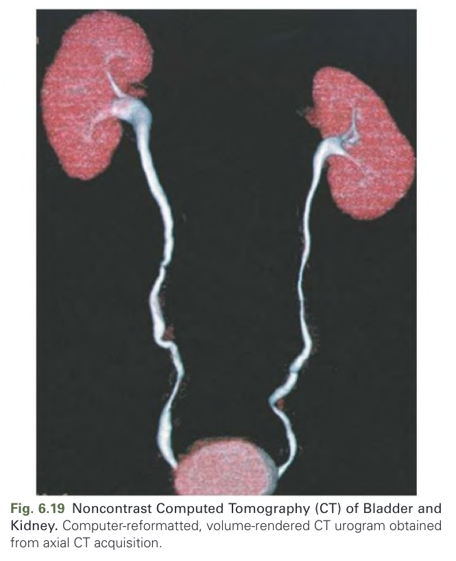

Fig. 6.19 Noncontrast Computed Tomography (CT) of Bladder and Kidney. Computer-reformatted, volume-rendered CT urogram obtained from axial CT acquisition.

---

### Fig_6_20

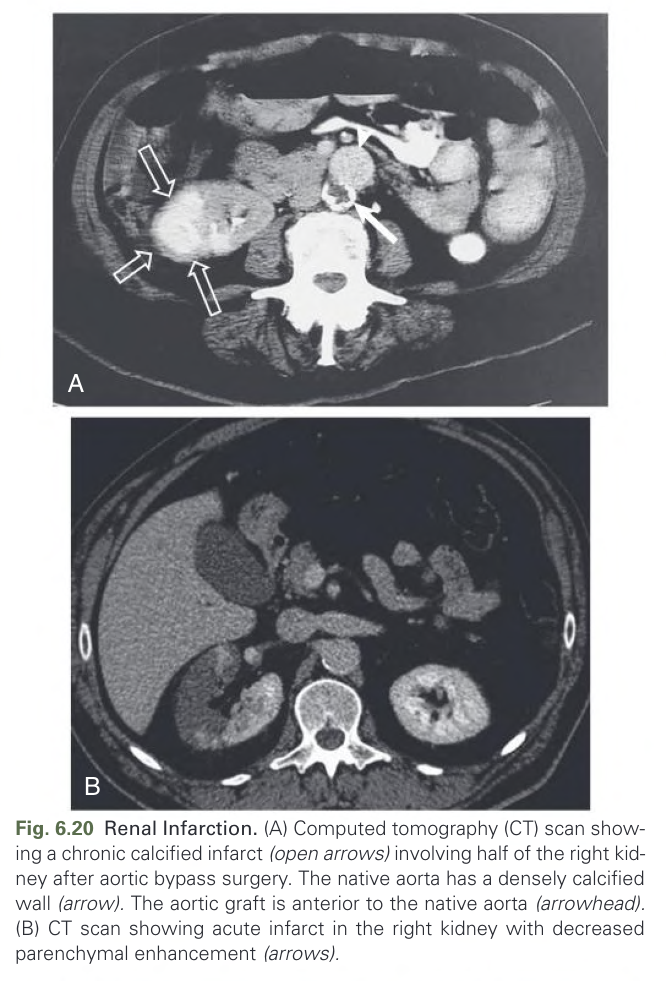

Fig. 6.20 Renal Infarction. (A) Computed tomography (CT) scan show- ing a chronic calcied infarct (open arrows) involving half of the right kid- ney after aortic bypass surgery. The native aorta has a densely calcied wall (arrow). The aortic graft is anterior to the native aorta (arrowhead). (B) CT scan showing acute infarct in the right kidney with decreased parenchymal enhancement (arrows).

---

### Fig_6_21

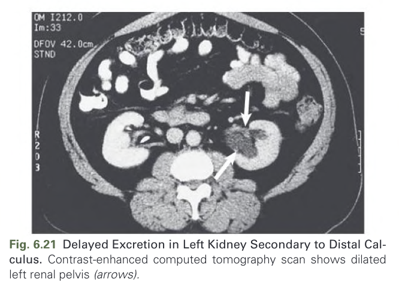

Fig. 6.21 Delayed Excretion in Left Kidney Secondary to Distal Cal- culus. Contrast-enhanced computed tomography scan shows dilated left renal pelvis (arrows).

---

### Fig_6_22

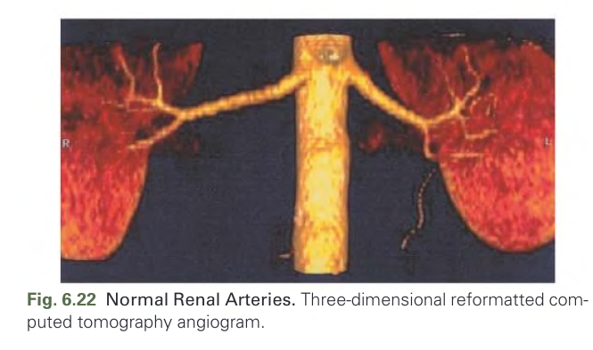

Fig. 6.22 Normal Renal Arteries. Three-dimensional reformatted computed tomography angiogram.

---

### Fig_6_23

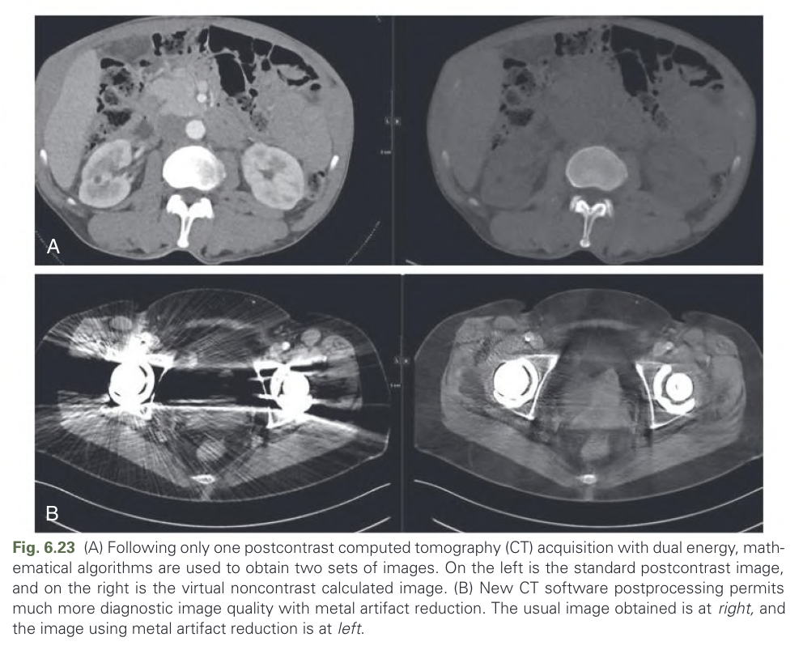

Fig. 6.23 (A) Following only one postcontrast computed tomography (CT) acquisition with dual energy, math- ematical algorithms are used to obtain two sets of images. On the left is the standard postcontrast image, and on the right is the virtual noncontrast calculated image. (B) New CT software postprocessing permits much more diagnostic image quality with metal artifact reduction. The usual image obtained is at right, and the image using metal artifact reduction is at left.

---

### Fig_6_24

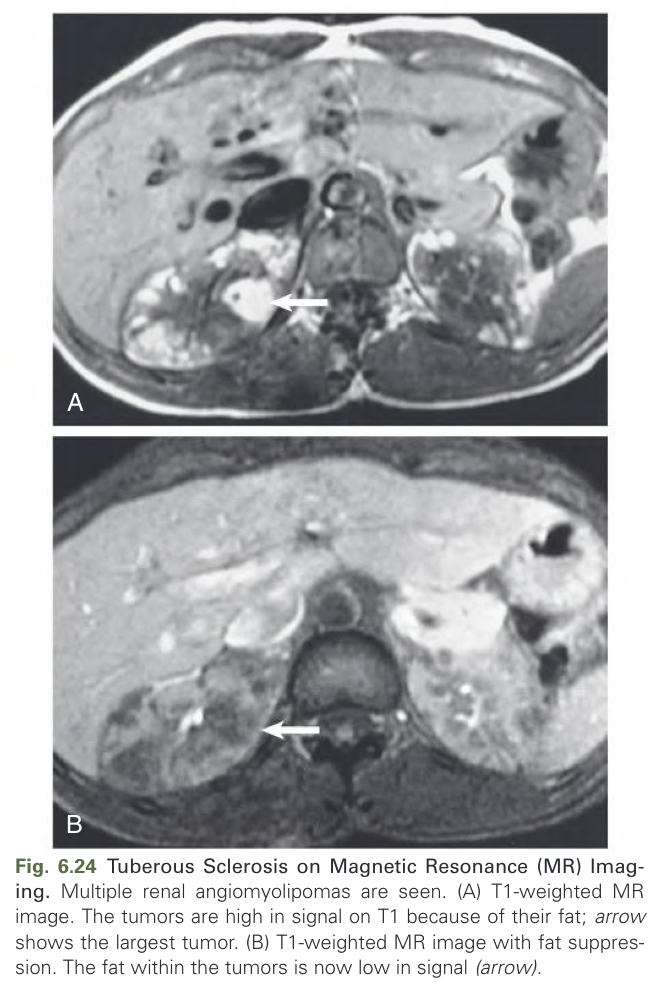

Fig. 6.24 Tuberous Sclerosis on Magnetic Resonance (MR) Imag- ing. Multiple renal angiomyolipomas are seen. (A) T1-weighted MR image. The tumors are high in signal on T1 because of their fat; arrow shows the largest tumor. (B) T1-weighted MR image with fat suppres- sion. The fat within the tumors is now low in signal (arrow).

---

### Fig_6_25

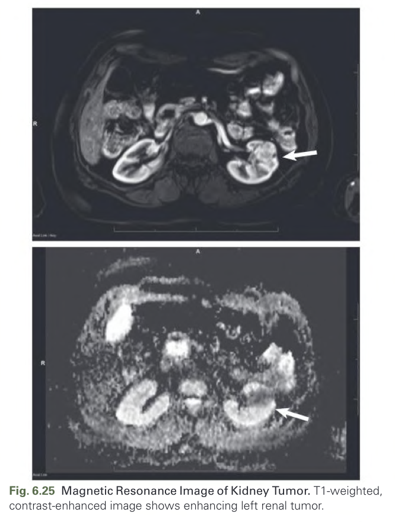

Fig. 6.25 Magnetic Resonance Image of Kidney Tumor. T1-weighted, contrast-enhanced image shows enhancing left renal tumor.

---

### Fig_6_26

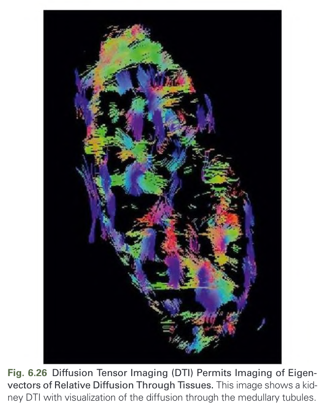

Fig. 6.26 Diffusion Tensor Imaging (DTI) Permits Imaging of Eigen- vectors of Relative Diffusion Through Tissues. This image shows a kid- ney DTI with visualization of the diffusion through the medullary tubules.

---

### Fig_6_27

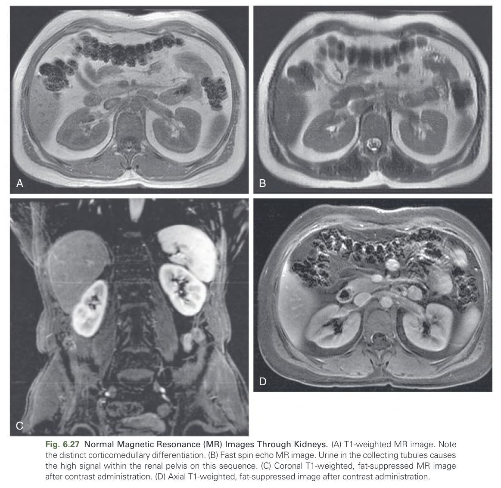

Fig. 6.27 Normal Magnetic Resonance (MR) Images Through Kidneys. (A) T1-weighted MR image. Note the distinct corticomedullary differentiation. (B) Fast spin echo MR image. Urine in the collecting tubules causes the high signal within the renal pelvis on this sequence. (C) Coronal T1-weighted, fat-suppressed MR image after contrast administration. (D) Axial T1-weighted, fat-suppressed image after contrast administration.

---

### Fig_6_28

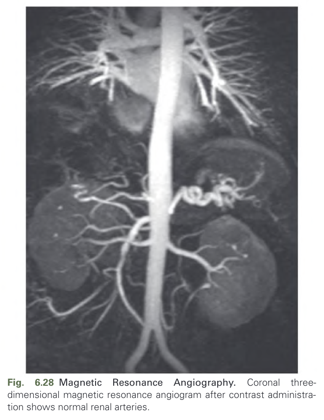

Fig. 6.28 Magnetic Resonance Angiography. Coronal three- dimensional magnetic resonance angiogram after contrast administra- tion shows normal renal arteries.

---

### Fig_6_29

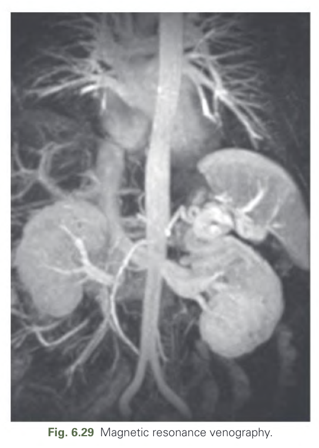

Fig. 6.29 Magnetic resonance venography.

---

### Fig_6_30

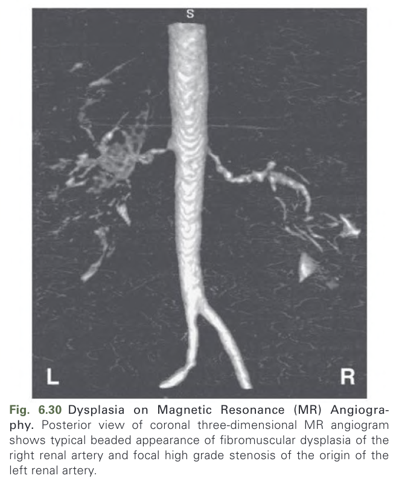

Fig. 6.30 Dysplasia on Magnetic Resonance (MR) Angiogra- phy. Posterior view of coronal three-dimensional MR angiogram shows typical beaded appearance of bromuscular dysplasia of the right renal artery and focal high grade stenosis of the origin of the left renal artery.

---

### Fig_6_31

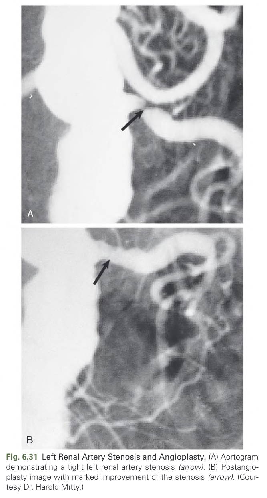

Fig. 6.31 Left Renal Artery Stenosis and Angioplasty. (A) Aortogram demonstrating a tight left renal artery stenosis (arrow). (B) Postangio- plasty image with marked improvement of the stenosis (arrow). (Cour- tesy Dr. Harold Mitty.)

---

### Fig_6_32

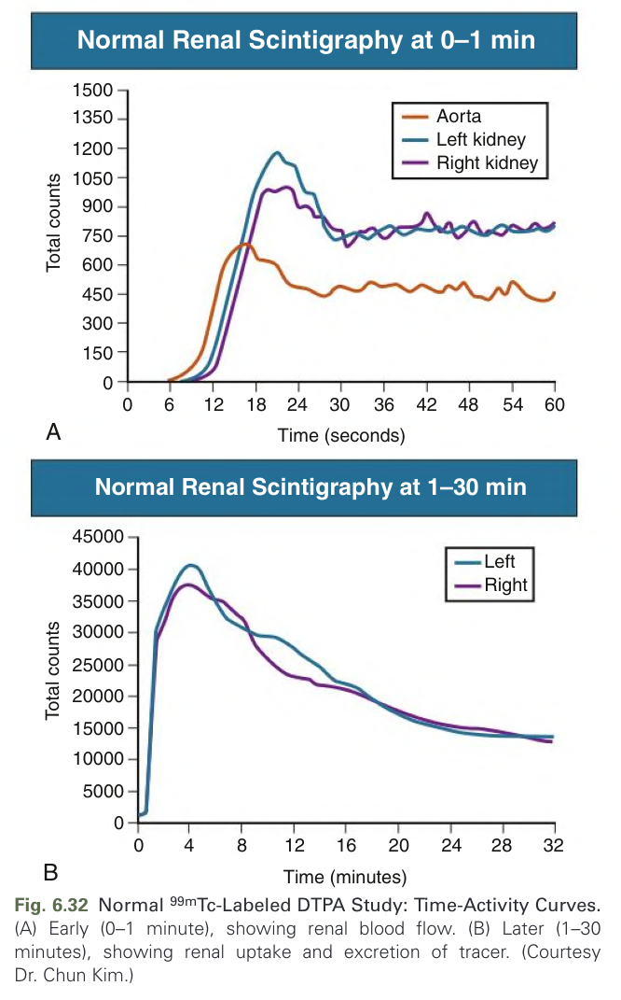

Fig. 6.32 Normal 99mTc-Labeled DTPA Study: Time-Activity Curves. (A) Early (0–1 minute), showing renal blood ow. (B) Later (1–30 minutes), showing renal uptake and excretion of tracer. (Courtesy Dr. Chun Kim.)

---

### Fig_6_33

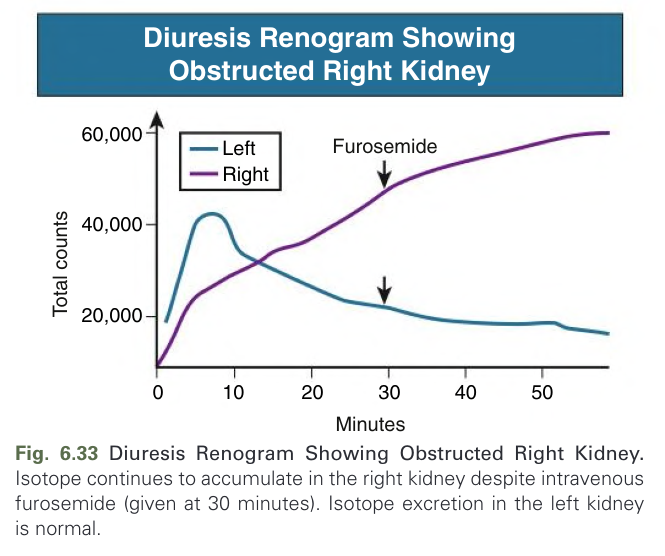

Fig. 6.33 Diuresis Renogram Showing Obstructed Right Kidney. Isotope continues to accumulate in the right kidney despite intravenous furosemide (given at 30 minutes). Isotope excretion in the left kidney is normal.

---

### Fig_6_34

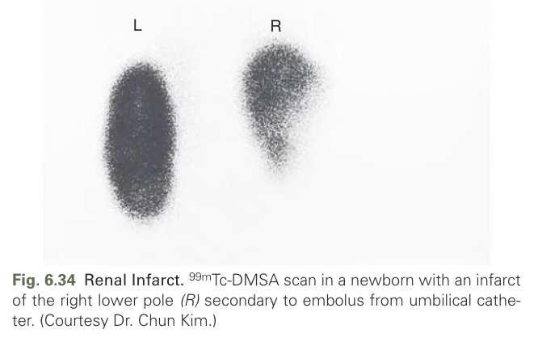

Fig. 6.34 Renal Infarct. 99mTc-DMSA scan in a newborn with an infarct of the right lower pole (R) secondary to embolus from umbilical cathe- ter. (Courtesy Dr. Chun Kim.)

---

### Fig_6_35

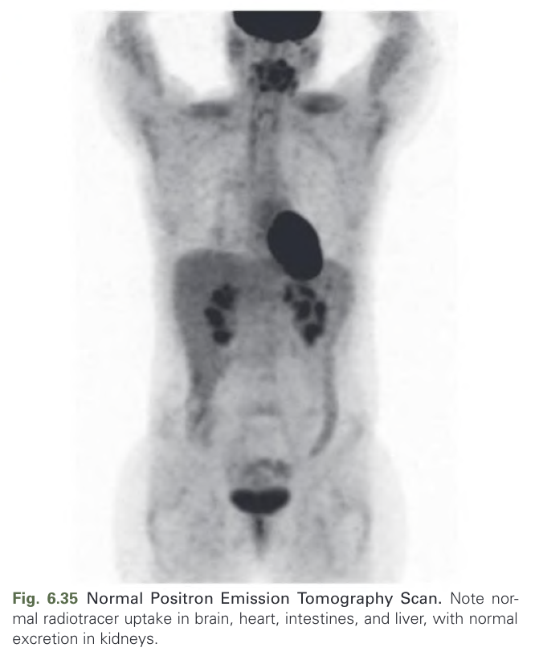

Fig. 6.35 Normal Positron Emission Tomography Scan. Note nor- mal radiotracer uptake in brain, heart, intestines, and liver, with normal excretion in kidneys.

---

## Tables

### Table_6_1

#### Table Image

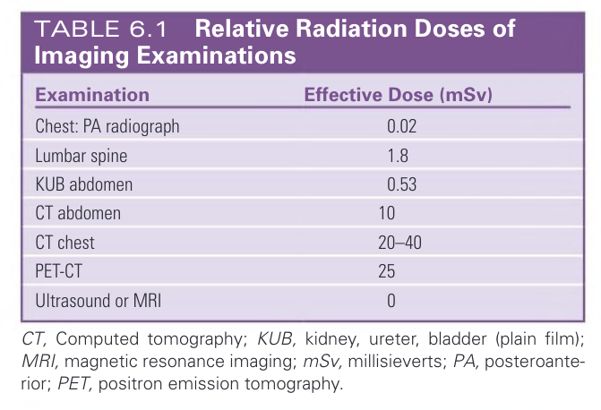

#### Table Data (CSV: [Table_6_1.csv](Table_6_1.csv))

```markdown
| Table Text (OCR) |
| :--- |
| TABLE 6.1 Relative Radiation Doses of Imaging Examinations |
| Examination Effective Dose (mSv) Chest: PA radiograph 0.02 Lumbar spine 1.8 KUB abdomen 0.53 CT abdomen 10 CT chest 20–40 PET-CT 25 Ultrasound or MRI 0 |
| CT, Computed tomography; KUB, kidney, ureter, bladder (plain film); MRI, magnetic resonance imaging; mSv, millisieverts; PA, posteroanterior; PET, positron emission tomography. |
```

Table 6.1

---

### Table_6_2

#### Table Image

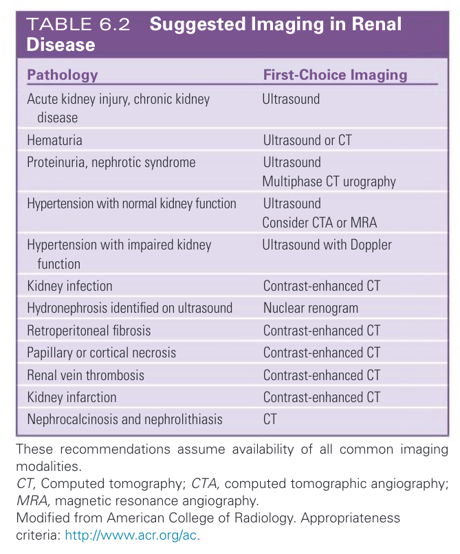

#### Table Data (CSV: [Table_6_2.csv](Table_6_2.csv))

```markdown
| Table Text (OCR) |
| :--- |
| TABLE 6.2 Suggested Imaging in Renal Disease |
| Pathology First-Choice Imaging Acute kidney injury, chronic kidney disease Ultrasound Hematuria Ultrasound or CT Proteinuria, nephrotic syndrome UltrasoundMultiphase CT urography Hypertension with normal kidney function UltrasoundConsider CTA or MRA Hypertension with impaired kidney function Ultrasound with Doppler Kidney infection Contrast-enhanced CT Hydronephrosis identified on ultrasound Nuclear renogram Retroperitoneal fibrosis Contrast-enhanced CT Papillary or cortical necrosis Contrast-enhanced CT Renal vein thrombosis Contrast-enhanced CT Kidney infarction Contrast-enhanced CT Nephrocalcinosis and nephrolithiasis CT |
| These recommendations assume availability of all common imaging modalities. |
| CT, Computed tomography; CTA, computed tomographic angiography; MRA, magnetic resonance angiography. |
| Modified from American College of Radiology. Appropriateness criteria: http://www.acr.org/ac. |
```

Table 6.2

---

### Table_6_3

#### Table Image

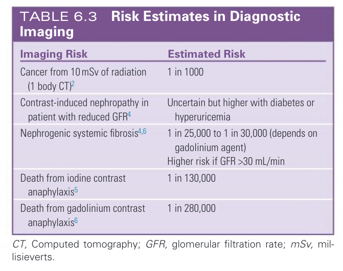

#### Table Data (CSV: [Table_6_3.csv](Table_6_3.csv))

```markdown
| Table Text (OCR) |
| :--- |
| TABLE 6.3 Risk Estimates in Diagnostic Imaging |
| Imaging Risk Estimated Risk Cancer from 10mSv of radiation (1 body CT) ^{2} 1 in 1000 Contrast-induced nephropathy in patient with reduced GFR ^{4} Uncertain but higher with diabetes or hyperuricemia Nephrogenic systemic fibrosis ^{4,6} 1 in 25,000 to 1 in 30,000 (depends on gadolinium agent)Higher risk if GFR >30 mL/min Death from iodine contrast anaphylaxis ^{5} 1 in 130,000 Death from gadolinium contrast anaphylaxis ^{6} 1 in 280,000 |
| CT, Computed tomography; GFR, glomerular filtration rate; mSv, millisieverts. |
```

Table 6.3

---

### Table_6_4

#### Table Image

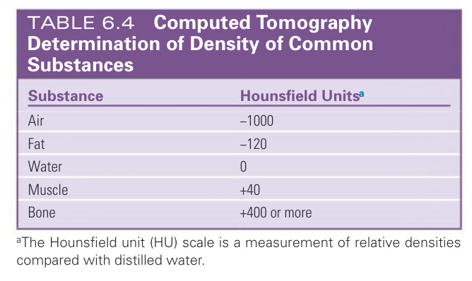

#### Table Data (CSV: [Table_6_4.csv](Table_6_4.csv))

```markdown
| Table Text (OCR) |
| :--- |
| TABLE 6.4 Computed Tomography Determination of Density of Common Substances |
| Substance Hounsfield Unitsa Air -1000 Fat -120 Water 0 Muscle +40 Bone +400 or more |
| ^{a} The Hounsfield unit (HU) scale is a measurement of relative densities compared with distilled water. |
```

Table 6.4

---

### Table_6_5

#### Table Image

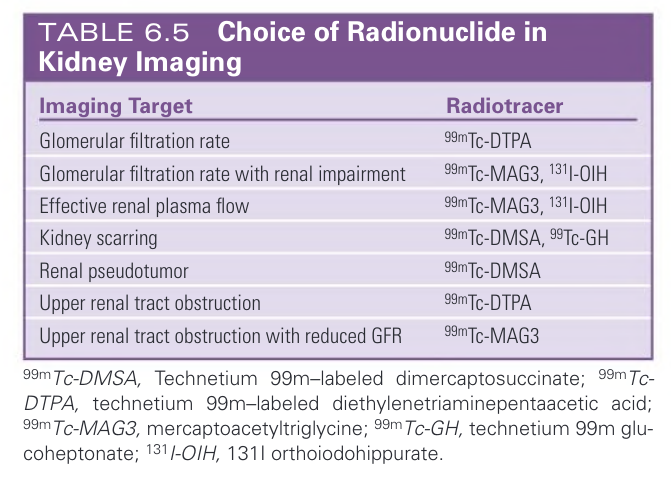

#### Table Data (CSV: [Table_6_5.csv](Table_6_5.csv))

```markdown
| Table Text (OCR) |
| :--- |
| TABLE 6.5 Choice of Radionuclide in Kidney Imaging |
| Imaging Target Radiotracer Glomerular filtration rate ^{99m}Tc-DTPA Glomerular filtration rate with renal impairment ^{99m}Tc-MAG3, ^{131}I-OIH Effective renal plasma flow ^{99m}Tc-MAG3, ^{131}I-OIH Kidney scarring ^{99m}Tc-DMSA, ^{99}Tc-GH Renal pseudotumor ^{99m}Tc-DMSA Upper renal tract obstruction ^{99m}Tc-DTPA Upper renal tract obstruction with reduced GFR ^{99m}Tc-MAG3 |
| ^{99m} Tc-DMSA, Technetium 99m-labeled dimercaptosuccinate; ^{99m} Tc-DTPA, technetium 99m-labeled diethylenetriaminepentaacetic acid; ^{99m} Tc-MAG3, mercaptoacetyltriglycine; ^{99m} Tc-GH, technetium 99m glucoheptonate; ^{131} I-OIH, 131I orthoiodohippurate. |
```

Table 6.5

---
