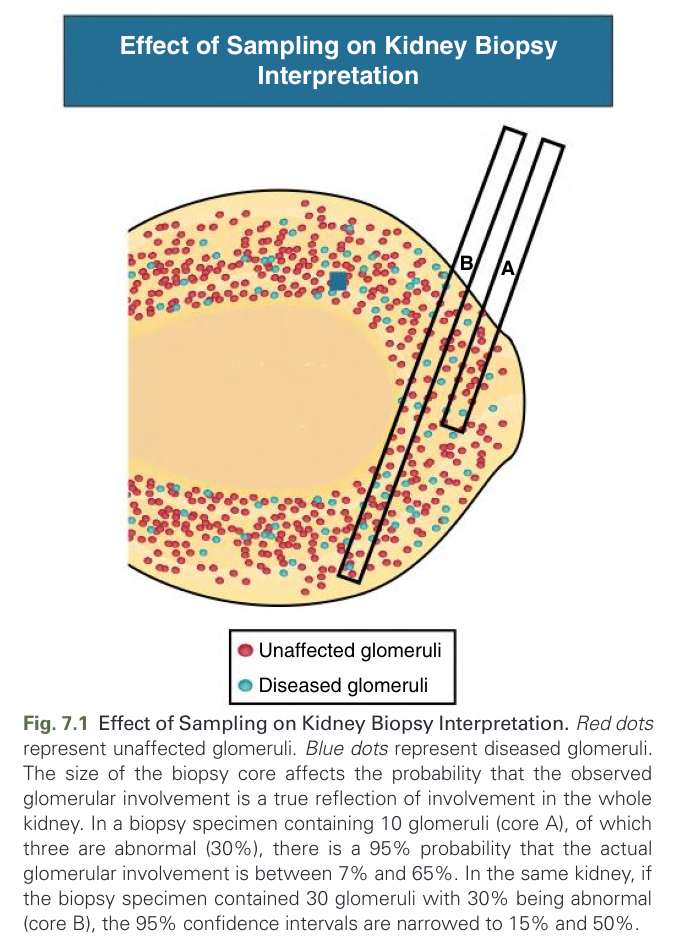
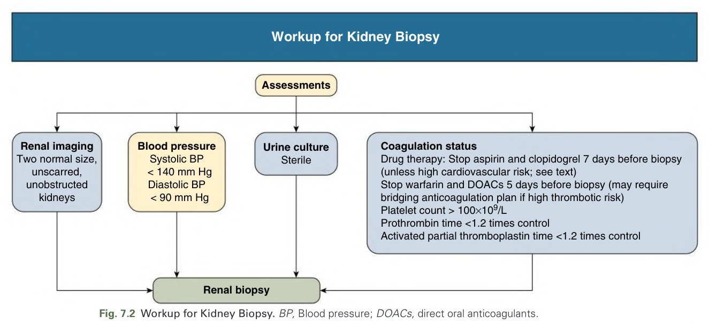
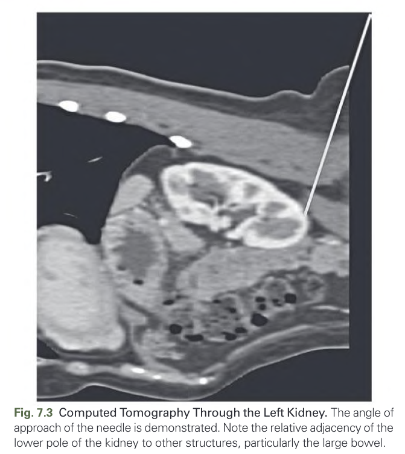
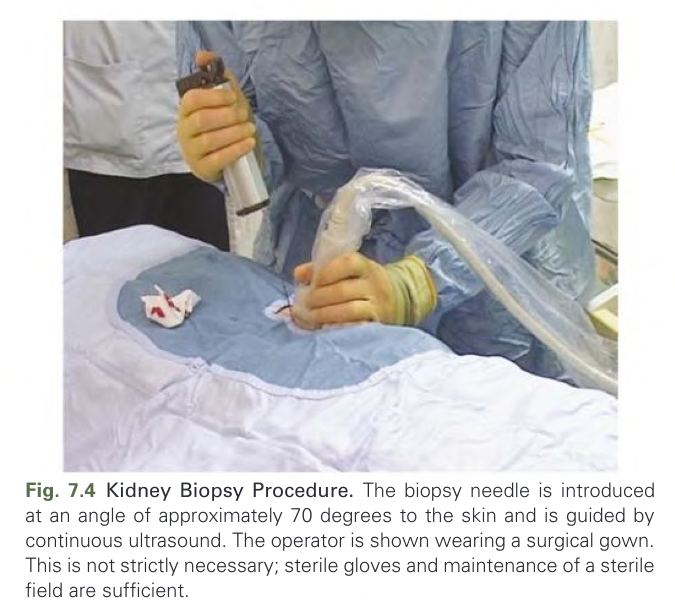
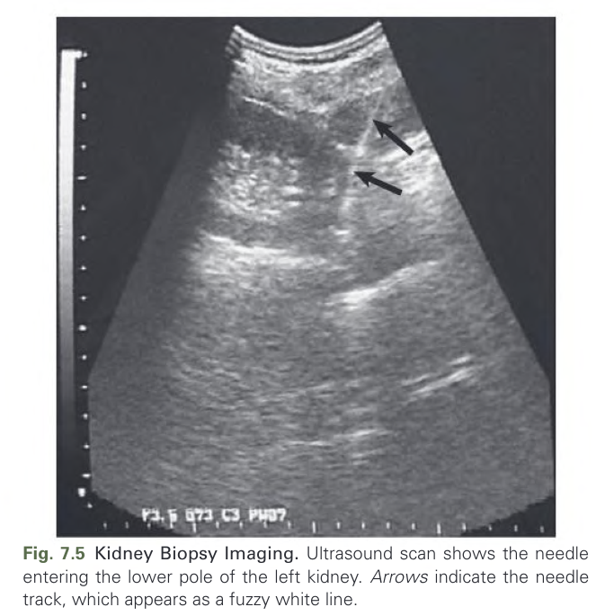
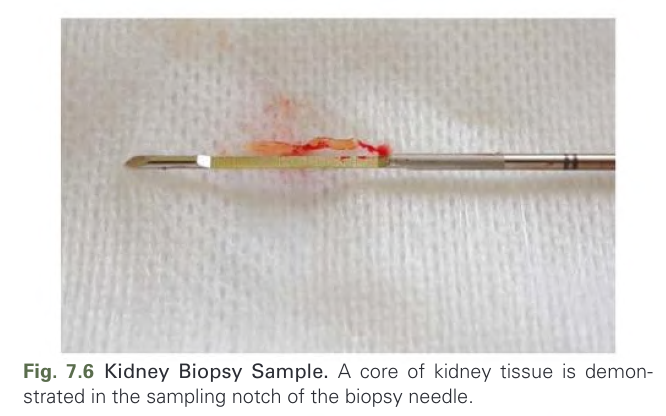
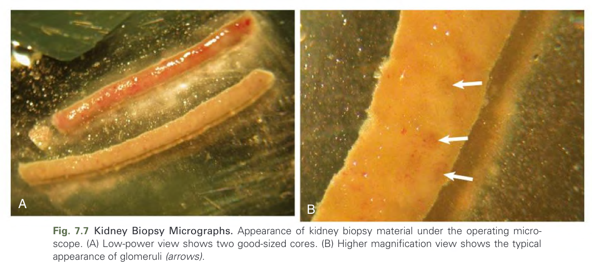
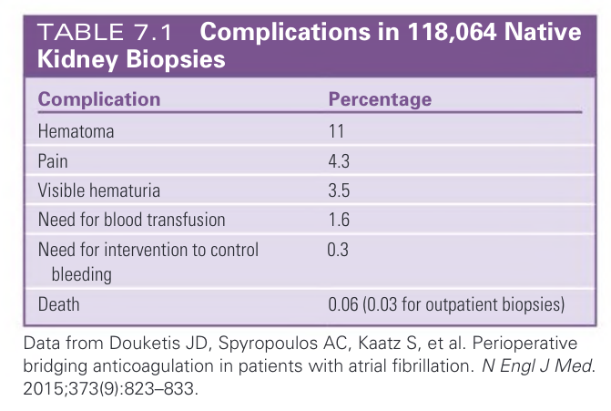
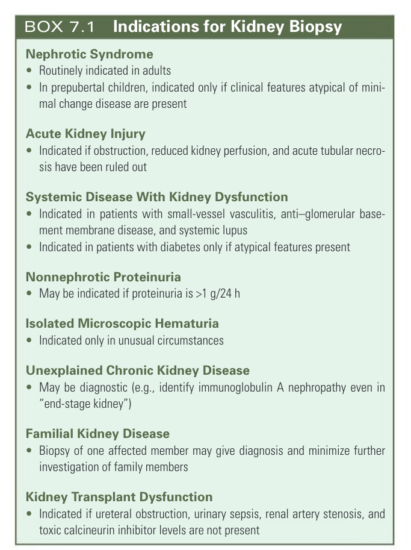
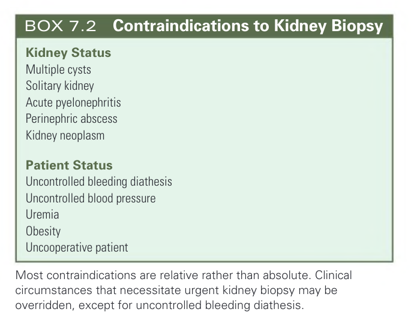

# 007. Kidney Biopsy - Figures and Tables Index

This document lists all figures, tables and boxes extracted from `007. Kidney Biopsy.pdf`.

## Table of Contents
- [Figures](#figures)
- [Tables](#tables)
- [Boxes](#boxes)

---

## Figures

### Fig_7_1



Fig. 7.1 Effect of Sampling on Kidney Biopsy Interpretation. Red dots represent unaffected glomeruli. Blue dots represent diseased glomeruli. The size of the biopsy core affects the probability that the observed glomerular involvement is a true reflection of involvement in the whole kidney. In a biopsy specimen containing 10 glomeruli (core A), of which three are abnormal (30%), there is a 95% probability that the actual glomerular involvement is between 7% and 65%. In the same kidney, if the biopsy specimen contained 30 glomeruli with 30% being abnormal (core B), the 95% confidence intervals are narrowed to 15% and 50%.

---

### Fig_7_2



Fig. 7.2 Workup for Kidney Biopsy. BP, Blood pressure; DOACs, direct oral anticoagulants.

---

### Fig_7_3



Fig. 7.3 Computed Tomography Through the Left Kidney. The angle of approach of the needle is demonstrated. Note the relative adjacency of the lower pole of the kidney to other structures, particularly the large bowel.

---

### Fig_7_4



Fig. 7.4 Kidney Biopsy Procedure. The biopsy needle is introduced at an angle of approximately 70 degrees to the skin and is guided by continuous ultrasound. The operator is shown wearing a surgical gown. This is not strictly necessary; sterile gloves and maintenance of a sterile field are sufficient.

---

### Fig_7_5



Fig. 7.5 Kidney Biopsy Imaging. Ultrasound scan shows the needle entering the lower pole of the left kidney. Arrows indicate the needle track, which appears as a fuzzy white line.

---

### Fig_7_6



Fig. 7.6 Kidney Biopsy Sample. A core of kidney tissue is demonstrated in the sampling notch of the biopsy needle.

---

### Fig_7_7



Fig. 7.7 Kidney Biopsy Micrographs. Appearance of kidney biopsy material under the operating microscope. (A) Low-power view shows two good-sized cores. (B) Higher magnification view shows the typical appearance of glomeruli (arrows).

---

## Tables

### Table_7_1

#### Table Image



#### Table Data (CSV: [Table_7_1.csv](Table_7_1.csv))

```markdown
| Complication | Percentage |
| :--- | :--- |
| Hematoma | 11 |
| Pain | 4.3 |
| Visible hematuria | 3.5 |
| Need for blood transfusion | 1.6 |
| Need for intervention to control bleeding | 0.3 |
| Death | 0.06 (0.03 for outpatient biopsies) |

Data from Douketis JD, Spyropoulos AC, Kaatz S, et al. Perioperative bridging anticoagulation in patients with atrial fibrillation. N Engl J Med. 2015;373(9):823-833.
```

Table 7.1 Complications in 118,064 Native Kidney Biopsies

---

## Boxes

### Box_7_1



#### Box Text

```markdown
**Nephrotic Syndrome**
*   Routinely indicated in adults
*   In prepubertal children, indicated only if clinical features atypical of minimal change disease are present

**Acute Kidney Injury**
*   Indicated if obstruction, reduced kidney perfusion, and acute tubular necrosis have been ruled out

**Systemic Disease With Kidney Dysfunction**
*   Indicated in patients with small-vessel vasculitis, anti-glomerular basement membrane disease, and systemic lupus
*   Indicated in patients with diabetes only if atypical features present

**Nonnephrotic Proteinuria**
*   May be indicated if proteinuria is >1 g/24 h

**Isolated Microscopic Hematuria**
*   Indicated only in unusual circumstances

**Unexplained Chronic Kidney Disease**
*   May be diagnostic (e.g., identify immunoglobulin A nephropathy even in "end-stage kidney")

**Familial Kidney Disease**
*   Biopsy of one affected member may give diagnosis and minimize further investigation of family members

**Kidney Transplant Dysfunction**
*   Indicated if ureteral obstruction, urinary sepsis, renal artery stenosis, and toxic calcineurin inhibitor levels are not present
```

BOX 7.1 Indications for Kidney Biopsy Nephrotic Syndrome • Routinely indicated in adults • In prepubertal children, indicated only if clinical features atypical of minimal change disease are present Acute Kidney Injury • Indicated if obstruction, reduced kidney perfusion, and acute tubular necrosis have been ruled out Systemic Disease With Kidney Dysfunction • Indicated in patients with small-vessel vasculitis, anti–glomerular basement membrane disease, and systemic lupus • Indicated in patients with diabetes only if atypical features present Nonnephrotic Proteinuria • May be indicated if proteinuria is >1 g/24 h Isolated Microscopic Hematuria • Indicated only in unusual circumstances Unexplained Chronic Kidney Disease • May be diagnostic (e.g., identify immunoglobulin A nephropathy even in “end-stage kidney”) Familial Kidney Disease • Biopsy of one affected member may give diagnosis and minimize further investigation of family members Kidney Transplant Dysfunction • Indicated if ureteral obstruction, urinary sepsis, renal artery stenosis, and toxic calcineurin inhibitor levels are not present

---

### Box_7_2



#### Box Text

```markdown
**Kidney Status**
*   Multiple cysts
*   Solitary kidney
*   Acute pyelonephritis
*   Perinephric abscess
*   Kidney neoplasm

**Patient Status**
*   Uncontrolled bleeding diathesis
*   Uncontrolled blood pressure
*   Uremia
*   Obesity
*   Uncooperative patient

Most contraindications are relative rather than absolute. Clinical circumstances that necessitate urgent kidney biopsy may be overridden, except for uncontrolled bleeding diathesis.
```

BOX 7.2 Contraindications to Kidney Biopsy Kidney Status Multiple cysts Solitary kidney Acute pyelonephritis Perinephric abscess Kidney neoplasm Patient Status Uncontrolled bleeding diathesis Uncontrolled blood pressure Uremia Obesity Uncooperative patient Most contraindications are relative rather than absolute. Clinical circumstances that necessitate urgent kidney biopsy may be overridden, except for uncontrolled bleeding diathesis.

---
