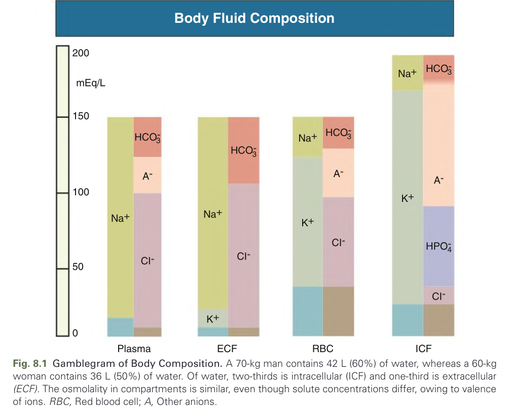
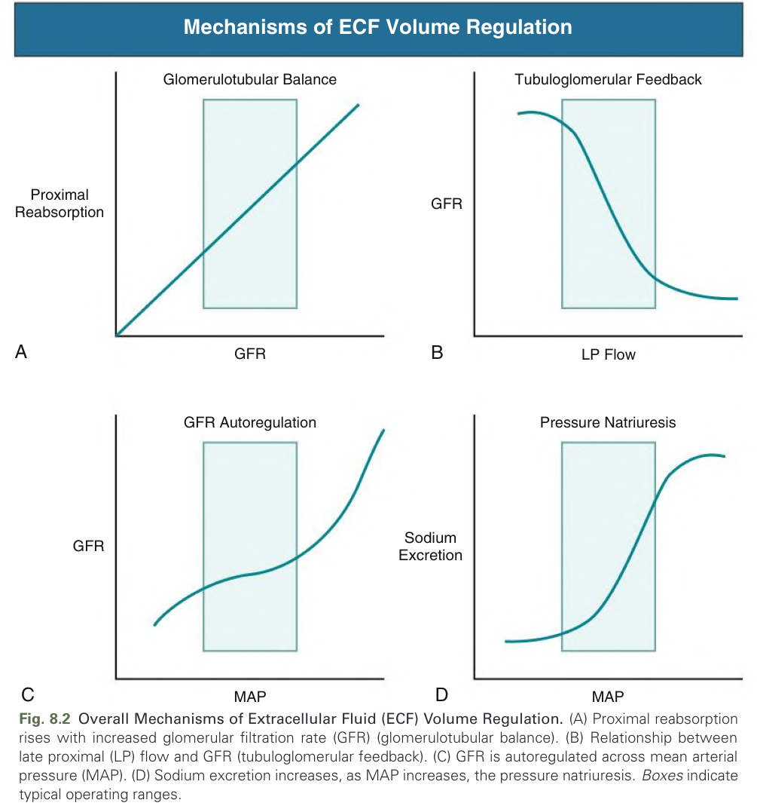
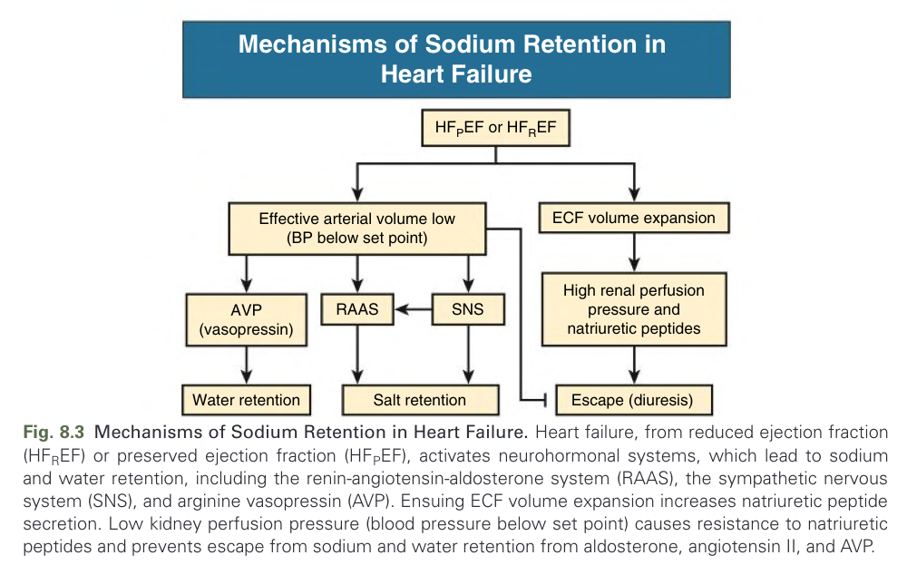
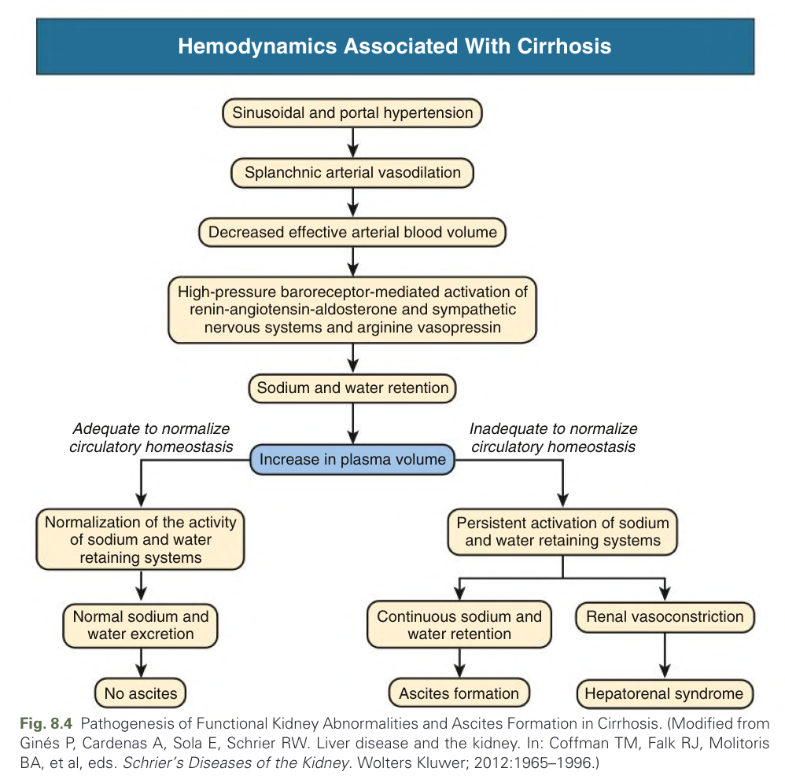
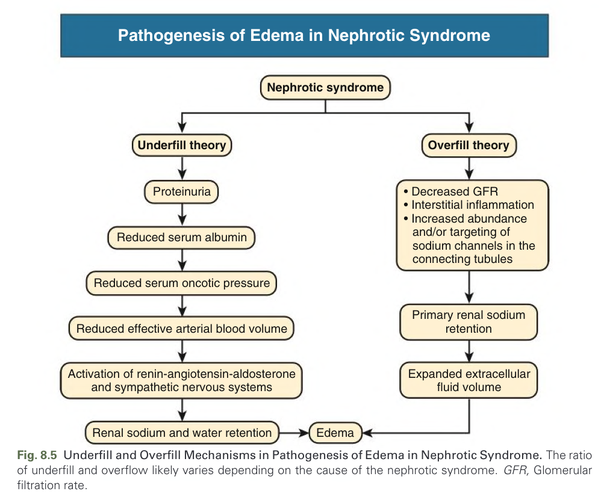
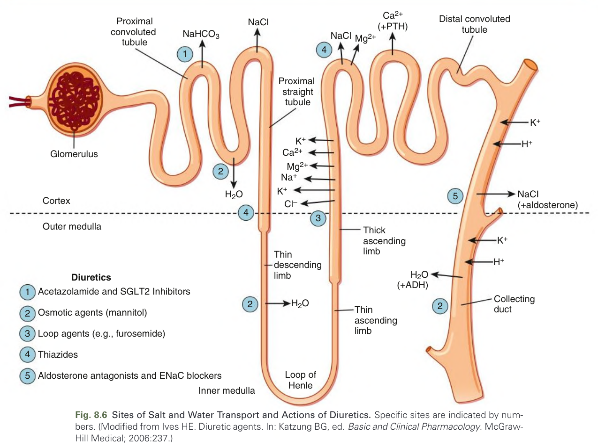
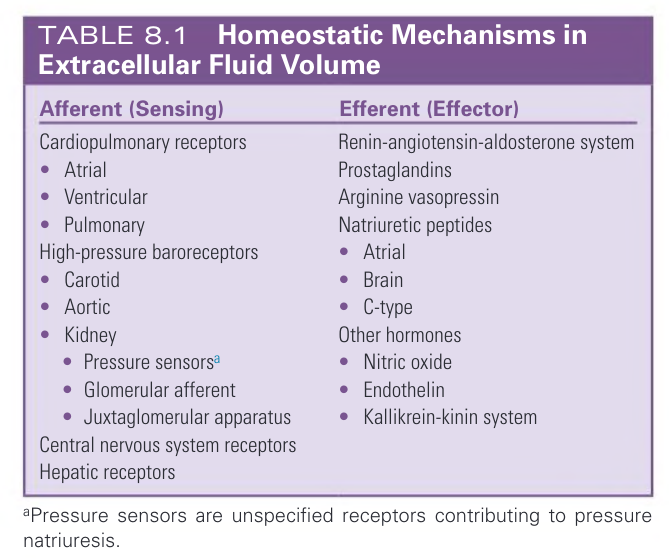
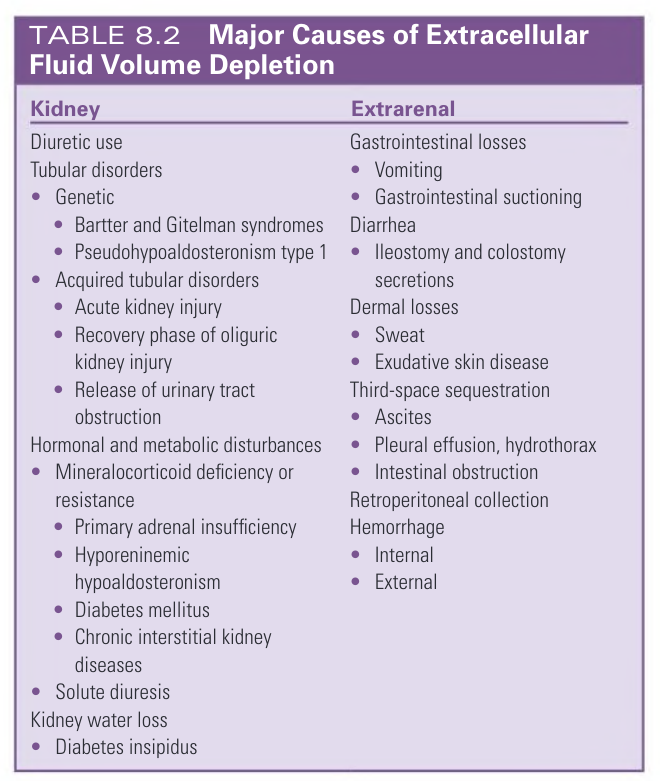
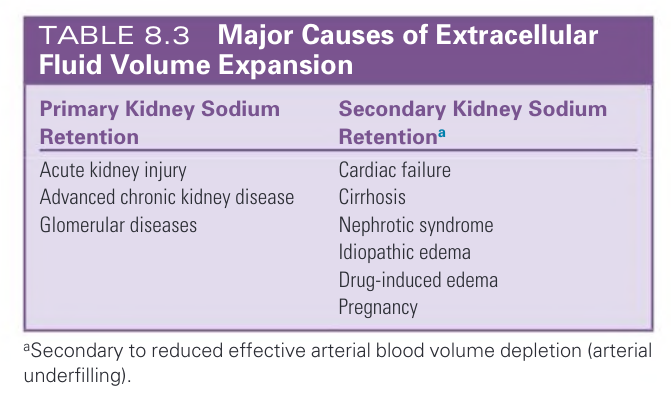
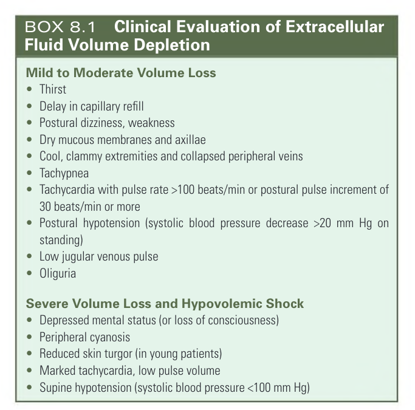

# 008. Disorders of Extracellular Volume - Figures and Tables Index

This document lists all figures, tables and boxes extracted from `008. Disorders of Extracellular Volume.pdf`.

## Table of Contents
- [Figures](#figures)
- [Tables](#tables)
- [Boxes](#boxes)

---

## Figures

### Fig_8_1



Fig. 8.1 Gamblegram of Body Composition. A 70-kg man contains 42 L (60%) of water, whereas a 60-kg woman contains 36 L (50%) of water. Of water, two-thirds is intracellular (ICF) and one-third is extracellular (ECF). The osmolality in compartments is similar, even though solute concentrations differ, owing to valence of ions. RBC, Red blood cell; A, Other anions.

---

### Fig_8_2



Fig. 8.2 Overall Mechanisms of Extracellular Fluid (ECF) Volume Regulation. (A) Proximal reabsorption rises with increased glomerular filtration rate (GFR) (glomerulotubular balance). (B) Relationship between late proximal (LP) flow and GFR (tubuloglomerular feedback). (C) GFR is autoregulated across mean arterial pressure (MAP). (D) Sodium excretion increases, as MAP increases, the pressure natriuresis. Boxes indicate typical operating ranges.

---

### Fig_8_3



Fig. 8.3 Mechanisms of Sodium Retention in Heart Failure. Heart failure, from reduced ejection fraction ( $HF_{R}EF$ ) or preserved ejection fraction ( $HF_{P}EF$ ), activates neurohormonal systems, which lead to sodium and water retention, including the renin-angiotensin-aldosterone system (RAAS), the sympathetic nervous system (SNS), and arginine vasopressin (AVP). Ensuing ECF volume expansion increases natriuretic peptide secretion. Low kidney perfusion pressure (blood pressure below set point) causes resistance to natriuretic peptides and prevents escape from sodium and water retention from aldosterone, angiotensin II, and AVP.

---

### Fig_8_4



Fig. 8.4 Pathogenesis of Functional Kidney Abnormalities and Ascites Formation in Cirrhosis. (Modified from Ginés P, Cardenas A, Sola E, Schrier RW. Liver disease and the kidney. In: Coffman TM, Falk RJ, Molitoris BA, et al, eds. Schrier's Diseases of the Kidney. Wolters Kluwer; 2012:1965–1996.)

---

### Fig_8_5



Fig. 8.5 Underfill and Overfill Mechanisms in Pathogenesis of Edema in Nephrotic Syndrome. The ratio of underfill and overflow likely varies depending on the cause of the nephrotic syndrome. GFR, Glomerular filtration rate.

---

### Fig_8_6



Fig. 8.6 Sites of Salt and Water Transport and Actions of Diuretics. Specific sites are indicated by numbers. (Modified from Ives HE. Diuretic agents. In: Katzung BG, ed. Basic and Clinical Pharmacology. McGraw-Hill Medical; 2006:237.)

---

## Tables

### Table_8_1

#### Table Image



#### Table Data (CSV: [Table_8_1.csv](Table_8_1.csv))

```markdown
| Afferent (Sensing) | Efferent (Effector) |
| :--- | :--- |
| Cardiopulmonary receptors<br>• Atrial<br>• Ventricular<br>• Pulmonary | Renin-angiotensin-aldosterone system |
| High-pressure baroreceptors<br>• Carotid<br>• Aortic<br>• Kidney<br>  • Pressure sensorsa<br>  • Glomerular afferent<br>  • Juxtaglomerular apparatus | Prostaglandins |
| Central nervous system receptors | Arginine vasopressin |
| Hepatic receptors | Natriuretic peptides<br>• Atrial<br>• Brain<br>• C-type |
| | Other hormones<br>• Nitric oxide<br>• Endothelin<br>• Kallikrein-kinin system |

aPressure sensors are unspecified receptors contributing to pressure natriuresis.
```

Table 8.1 Homeostatic Mechanisms in Extracellular Fluid Volume

---

### Table_8_2

#### Table Image



#### Table Data (CSV: [Table_8_2.csv](Table_8_2.csv))

```markdown
| Kidney | Extrarenal |
| :--- | :--- |
| Diuretic use | Gastrointestinal losses<br>• Vomiting<br>• Gastrointestinal suctioning |
| Tubular disorders<br>• Genetic<br>  • Bartter and Gitelman syndromes<br>  • Pseudohypoaldosteronism type 1<br>• Acquired tubular disorders<br>  • Acute kidney injury<br>  • Recovery phase of oliguric kidney injury<br>  • Release of urinary tract obstruction | Diarrhea<br>• lleostomy and colostomy secretions |
| Hormonal and metabolic disturbances<br>• Mineralocorticoid deficiency or resistance<br>  • Primary adrenal insufficiency<br>  • Hyporeninemic hypoaldosteronism<br>  • Diabetes mellitus<br>  • Chronic interstitial kidney diseases<br>• Solute diuresis | Dermal losses<br>• Sweat<br>• Exudative skin disease |
| Kidney water loss<br>• Diabetes insipidus | Third-space sequestration<br>• Ascites<br>• Pleural effusion, hydrothorax<br>• Intestinal obstruction<br>Retroperitoneal collection |
| | Hemorrhage<br>• Internal<br>• External |
```

Table 8.2 Major Causes of Extracellular Fluid Volume Depletion

---

### Table_8_3

#### Table Image



#### Table Data (CSV: [Table_8_3.csv](Table_8_3.csv))

```markdown
| Primary Kidney Sodium Retention | Secondary Kidney Sodium Retentiona |
| :--- | :--- |
| Acute kidney injury | Cardiac failure |
| Advanced chronic kidney disease | Cirrhosis |
| Glomerular diseases | Nephrotic syndrome |
| | Idiopathic edema |
| | Drug-induced edema |
| | Pregnancy |

aSecondary to reduced effective arterial blood volume depletion (arterial underfilling).
```

Table 8.3 Major Causes of Extracellular Fluid Volume Expansion

---

## Boxes

### Box_8_1



#### Box Text

```markdown
**Mild to Moderate Volume Loss**
* Thirst
* Delay in capillary refill
* Postural dizziness, weakness
* Dry mucous membranes and axillae
* Cool, clammy extremities and collapsed peripheral veins
* Tachypnea
* Tachycardia with pulse rate >100 beats/min or postural pulse increment of 30 beats/min or more
* Postural hypotension (systolic blood pressure decrease >20 mm Hg on standing)
* Low jugular venous pulse
* Oliguria

**Severe Volume Loss and Hypovolemic Shock**
* Depressed mental status (or loss of consciousness)
* Peripheral cyanosis
* Reduced skin turgor (in young patients)
* Marked tachycardia, low pulse volume
* Supine hypotension (systolic blood pressure <100 mm Hg)
```

BOX 8.1 Clinical Evaluation of Extracellular Fluid Volume Depletion Mild to Moderate Volume Loss • Thirst • Delay in capillary refill • Postural dizziness, weakness • Dry mucous membranes and axillae • Cool, clammy extremities and collapsed peripheral veins • Tachypnea • Tachycardia with pulse rate >100 beats/min or postural pulse increment of 30 beats/min or more • Postural hypotension (systolic blood pressure decrease >20 mm Hg on standing) • Low jugular venous pulse • Oliguria Severe Volume Loss and Hypovolemic Shock • Depressed mental status (or loss of consciousness) • Peripheral cyanosis • Reduced skin turgor (in young patients) • Marked tachycardia, low pulse volume • Supine hypotension (systolic blood pressure <100 mm Hg)

---
