# 009. Disorders of Water Metabolism - Figures and Tables Index

This document lists all figures, tables and boxes extracted from `009. Disorders of Water Metabolism.pdf`.

## Table of Contents
- [Figures](#figures)
- [Tables](#tables)
- [Boxes](#boxes)

---

## Figures

### Fig_9_1

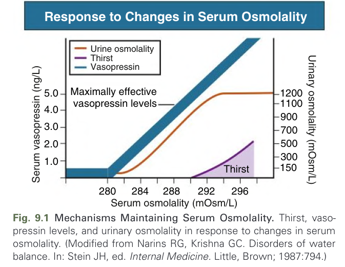

Fig. 9.1 Mechanisms Maintaining Serum Osmolality. Thirst, vasopressin levels, and urinary osmolality in response to changes in serum osmolality. (Modified from Narins RG, Krishna GC. Disorders of water balance. In: Stein JH, ed. Internal Medicine. Little, Brown; 1987:794.)

---

### Fig_9_2

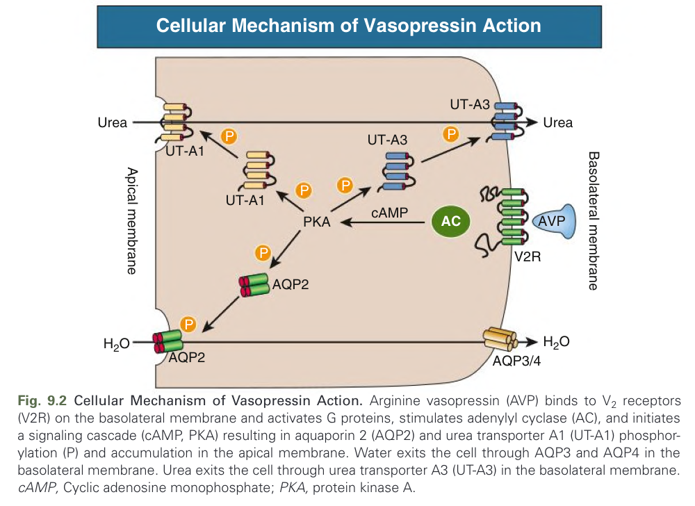

Fig. 9.2 Cellular Mechanism of Vasopressin Action. Arginine vasopressin (AVP) binds to $V_{2}$ receptors (V2R) on the basolateral membrane and activates G proteins, stimulates adenylyl cyclase (AC), and initiates a signaling cascade (cAMP, PKA) resulting in aquaporin 2 (AQP2) and urea transporter A1 (UT-A1) phosphorylation (P) and accumulation in the apical membrane. Water exits the cell through AQP3 and AQP4 in the basolateral membrane. Urea exits the cell through urea transporter A3 (UT-A3) in the basolateral membrane. cAMP, Cyclic adenosine monophosphate; PKA, protein kinase A.

---

### Fig_9_3

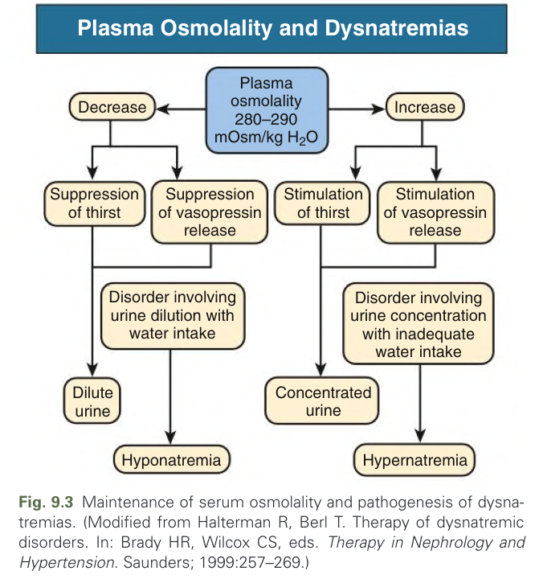

Fig. 9.3 Maintenance of serum osmolality and pathogenesis of dysnatremias. (Modified from Halterman R, Berl T. Therapy of dysnatremic disorders. In: Brady HR, Wilcox CS, eds. Therapy in Nephrology and Hypertension. Saunders; 1999:257–269.)

---

### Fig_9_4

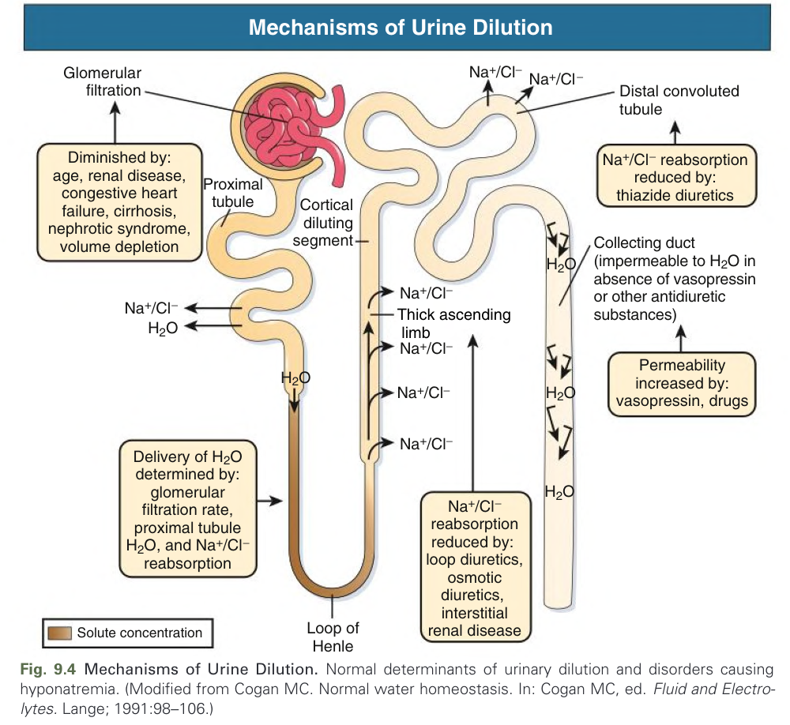

Fig. 9.4 Mechanisms of Urine Dilution. Normal determinants of urinary dilution and disorders causing hyponatremia. (Modified from Cogan MC. Normal water homeostasis. In: Cogan MC, ed. Fluid and Electrolytes. Lange; 1991:98–106.)

---

### Fig_9_5

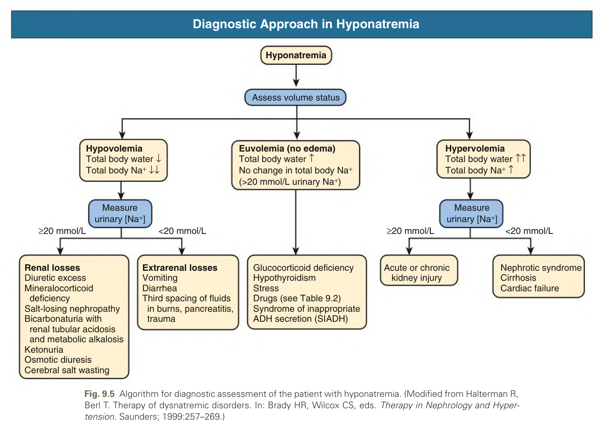

Fig. 9.5 Algorithm for diagnostic assessment of the patient with hyponatremia. (Modified from Halterman R, Berl T. Therapy of dysnatremic disorders. In: Brady HR, Wilcox CS, eds. Therapy in Nephrology and Hypertension. Saunders; 1999:257–269.)

---

### Fig_9_6

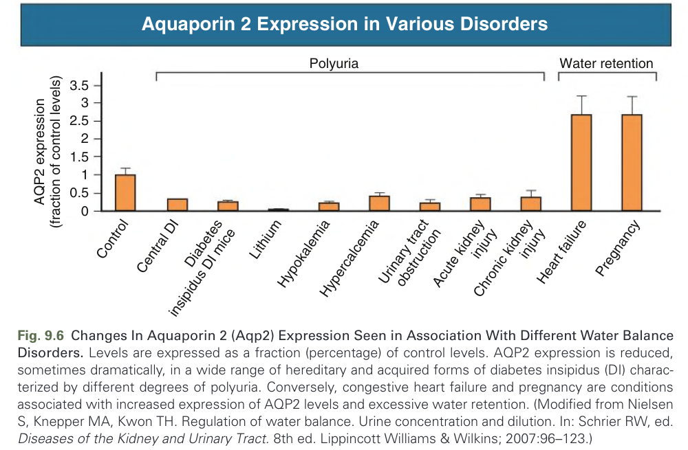

Fig. 9.6 Changes In Aquaporin 2 (Aqp2) Expression Seen in Association With Different Water Balance Disorders. Levels are expressed as a fraction (percentage) of control levels. AQP2 expression is reduced, sometimes dramatically, in a wide range of hereditary and acquired forms of diabetes insipidus (DI) characterized by different degrees of polyuria. Conversely, congestive heart failure and pregnancy are conditions associated with increased expression of AQP2 levels and excessive water retention. (Modified from Nielsen S, Knepper MA, Kwon TH. Regulation of water balance. Urine concentration and dilution. In: Schrier RW, ed. Diseases of the Kidney and Urinary Tract. 8th ed. Lippincott Williams & Wilkins; 2007:96–123.)

---

### Fig_9_7

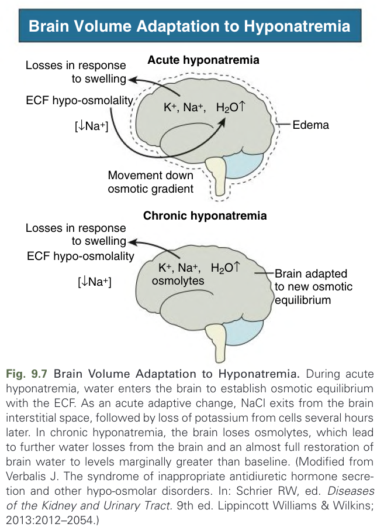

Fig. 9.7 Brain Volume Adaptation to Hyponatremia. During acute hyponatremia, water enters the brain to establish osmotic equilibrium with the ECF. As an acute adaptive change, NaCl exits from the brain interstitial space, followed by loss of potassium from cells several hours later. In chronic hyponatremia, the brain loses osmolytes, which lead to further water losses from the brain and an almost full restoration of brain water to levels marginally greater than baseline. (Modified from Verbalis J. The syndrome of inappropriate antidiuretic hormone secretion and other hypo-osmolar disorders. In: Schrier RW, ed. Diseases of the Kidney and Urinary Tract. 9th ed. Lippincott Williams & Wilkins; 2013:2012–2054.)

---

### Fig_9_8

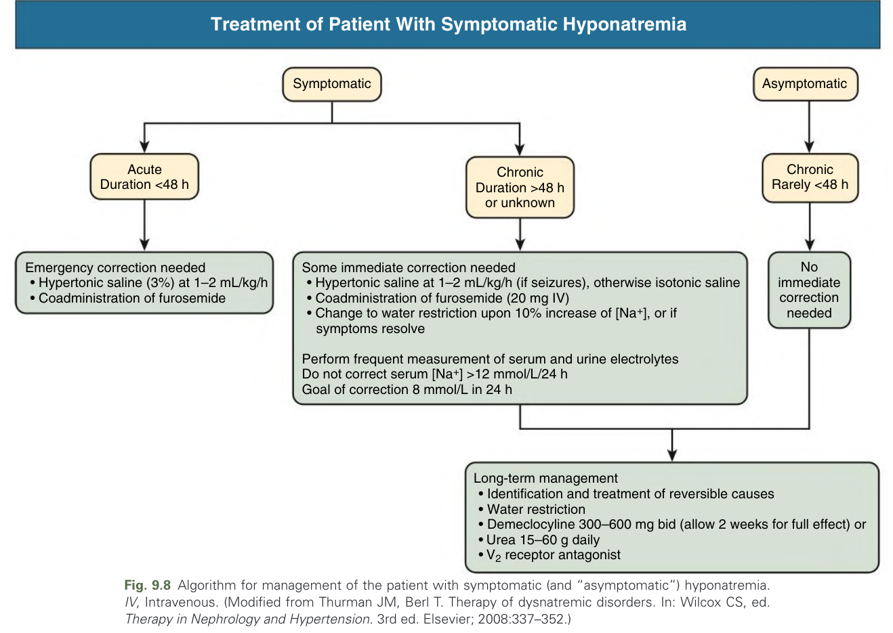

Fig. 9.8 Algorithm for management of the patient with symptomatic (and “asymptomatic”) hyponatremia. IV, Intravenous. (Modified from Thurman JM, Berl T. Therapy of dysnatremic disorders. In: Wilcox CS, ed. Therapy in Nephrology and Hypertension. 3rd ed. Elsevier; 2008:337–352.)

---

### Fig_9_9

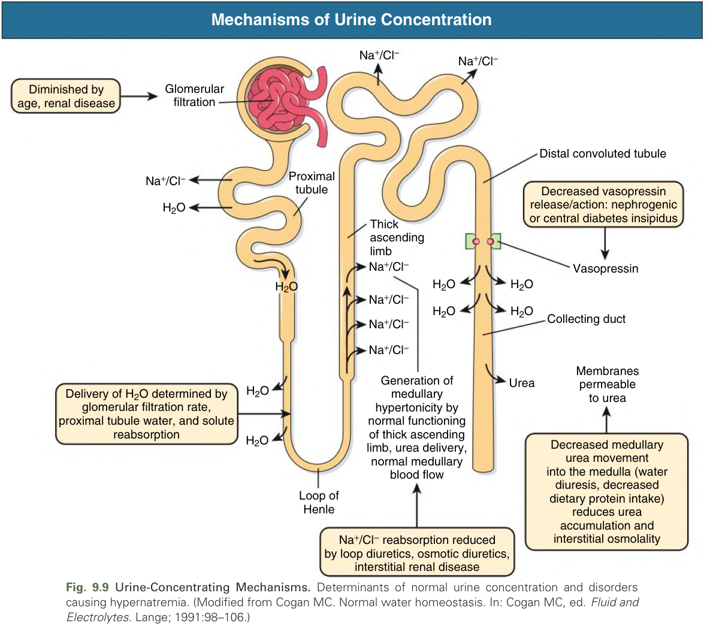

Fig. 9.9 Urine-Concentrating Mechanisms. Determinants of normal urine concentration and disorders causing hypernatremia. (Modified from Cogan MC. Normal water homeostasis. In: Cogan MC, ed. Fluid and Electrolytes. Lange; 1991:98–106.)

---

### Fig_9_10

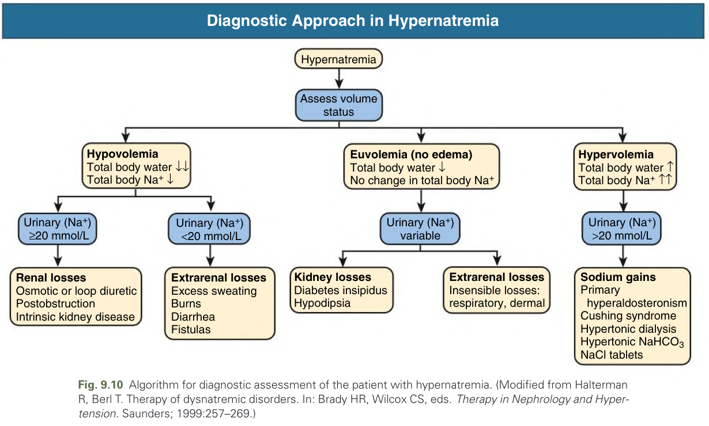

Fig. 9.10 Algorithm for diagnostic assessment of the patient with hypernatremia. (Modified from Halterman R, Berl T. Therapy of dysnatremic disorders. In: Brady HR, Wilcox CS, eds. Therapy in Nephrology and Hypertension. Saunders; 1999:257–269.)

---

### Fig_9_11

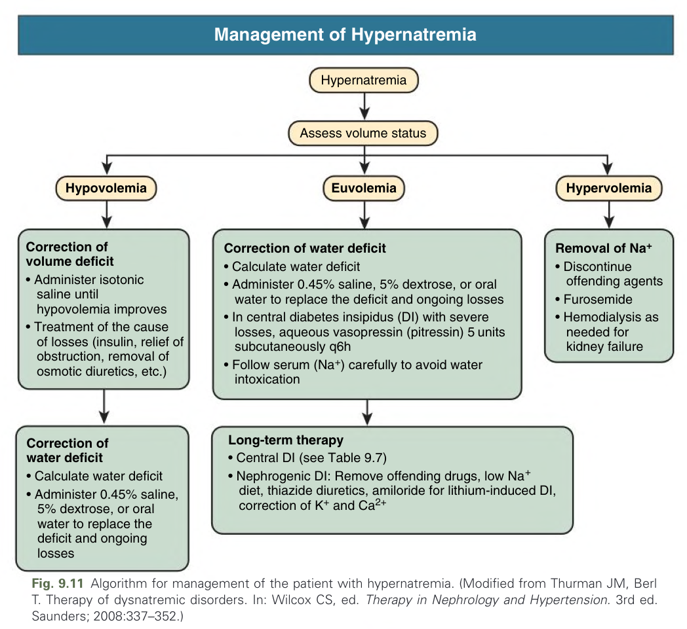

Fig. 9.11 Algorithm for management of the patient with hypernatremia. (Modified from Thurman JM, Berl T. Therapy of dysnatremic disorders. In: Wilcox CS, ed. Therapy in Nephrology and Hypertension. 3rd ed. Saunders; 2008:337–352.)

---

## Tables

### Table_9_1

#### Table Image

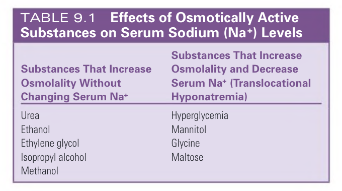

#### Table Data (CSV: [Table_9_1.csv](Table_9_1.csv))

```markdown
| Table Text (OCR) |
| :--- |
| TABLE 9.1 |
| Effects of Osmotically Active |
| Substances on Serum Sodium (Na+) Levels |
| Substances That Increase |
| Osmolality Without |
| Changing Serum Na+ |
| Substances That Increase |
| Osmolality and Decrease |
| Serum Na+ (Translocational |
| Hyponatremia) |
| Urea |
| Ethanol |
| Ethylene glycol |
| Isopropyl alcohol |
| Methanol |
| Hyperglycemia |
| Mannitol |
| Glycine |
| Maltose |
```

Table 9.1 Effects of Osmotically Active Substances on Serum Sodium (Na $^{+}$ ) Levels

---

### Table_9_2

#### Table Image

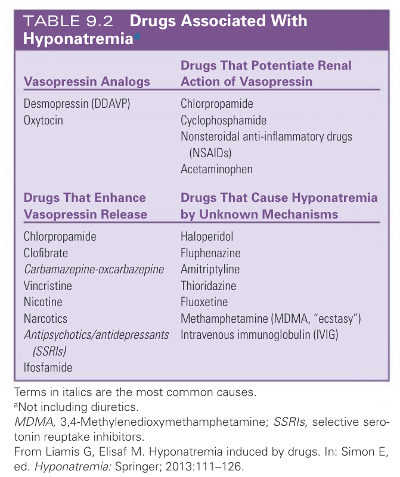

#### Table Data (CSV: [Table_9_2.csv](Table_9_2.csv))

```markdown
| Table Text (OCR) |
| :--- |
| TABLE 9.2 |
| Drugs Associated With |
| Hyponatremiaa |
| Vasopressin Analogs |
| Drugs That Potentiate Renal |
| Action of Vasopressin |
| Desmopressin (DDAVP) |
| Oxytocin |
| Chlorpropamide |
| Cyclophosphamide |
| Nonsteroidal anti-inflammatory drugs |
| (NSAIDs) |
| Acetaminophen |
| Drugs That Enhance |
| Vasopressin Release |
| Drugs That Cause Hyponatremia |
| by Unknown Mechanisms |
| Chlorpropamide |
| Clofibrate |
| Carbamazepine-oxcarbazepine |
| Vincristine |
| Nicotine |
| Narcotics |
| Antipsychotics/antidepressants |
| (SSRIs) |
| Ifosfamide |
| Haloperidol |
| Fluphenazine |
| Amitriptyline |
| Thioridazine |
| Fluoxetine |
| Methamphetamine (MDMA, “ecstasy”) |
| Intravenous immunoglobulin (IVIG) |
| Terms in italics are the most common causes. |
| aNot including diuretics. |
| MDMA, 3,4-Methylenedioxymethamphetamine; SSRIs, selective serotonin reuptake inhibitors. |
| From Liamis G, Elisaf M. Hyponatremia induced by drugs. In: Simon E, |
| ed. Hyponatremia: Springer; 2013:111–126. |
```

Table 9.2 Drugs Associated With Hyponatremia $^{a}$

---

### Table_9_3

#### Table Image

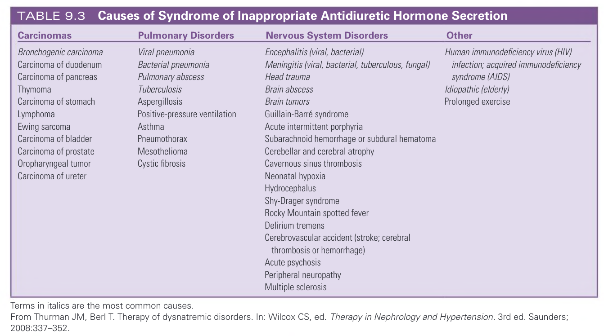

#### Table Data (CSV: [Table_9_3.csv](Table_9_3.csv))

```markdown
| Table Text (OCR) |
| :--- |
| TABLE 9.3 |
| Causes of Syndrome of Inappropriate Antidiuretic Hormone Secretion |
| Carcinomas |
| Pulmonary Disorders |
| Nervous System Disorders |
| Other |
| Bronchogenic carcinoma |
| Carcinoma of duodenum |
| Carcinoma of pancreas |
| Thymoma |
| Carcinoma of stomach |
| Lymphoma |
| Ewing sarcoma |
| Carcinoma of bladder |
| Carcinoma of prostate |
| Oropharyngeal tumor |
| Carcinoma of ureter |
| Viral pneumonia |
| Bacterial pneumonia |
| Pulmonary abscess |
| Tuberculosis |
| Aspergillosis |
| Positive-pressure ventilation |
| Asthma |
| Pneumothorax |
| Mesothelioma |
| Cystic fibrosis |
| Encephalitis (viral, bacterial) |
| Meningitis (viral, bacterial, tuberculous, fungal) |
| Head trauma |
| Brain abscess |
| Brain tumors |
| Guillain-Barré syndrome |
| Acute intermittent porphyria |
| Subarachnoid hemorrhage or subdural hematoma |
| Cerebellar and cerebral atrophy |
| Cavernous sinus thrombosis |
| Neonatal hypoxia |
| Hydrocephalus |
| Shy-Drager syndrome |
| Rocky Mountain spotted fever |
| Delirium tremens |
| Cerebrovascular accident (stroke; cerebral |
| thrombosis or hemorrhage) |
| Acute psychosis |
| Peripheral neuropathy |
| Multiple sclerosis |
| Human immunodeficiency virus (HIV) |
| infection; acquired immunodeficiency |
| syndrome (AIDS) |
| Idiopathic (elderly) |
| Prolonged exercise |
| Terms in italics are the most common causes. |
| From Thurman JM, Berl T. Therapy of dysnatremic disorders. In: Wilcox CS, ed. Therapy in Nephrology and Hypertension. 3rd ed. Saunders; |
| 2008:337–352. |
```

Table 9.3 Causes of Syndrome of Inappropriate Antidiuretic Hormone Secretion

---

### Table_9_4

#### Table Image

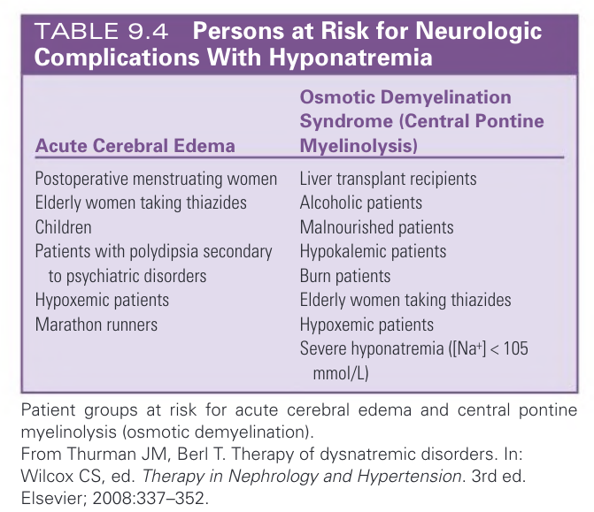

#### Table Data (CSV: [Table_9_4.csv](Table_9_4.csv))

```markdown
| Table Text (OCR) |
| :--- |
| TABLE 9.4 |
| Persons at Risk for Neurologic |
| Complications With Hyponatremia |
| Acute Cerebral Edema |
| Osmotic Demyelination |
| Syndrome (Central Pontine |
| Myelinolysis) |
| Postoperative menstruating women |
| Elderly women taking thiazides |
| Children |
| Patients with polydipsia secondary |
| to psychiatric disorders |
| Hypoxemic patients |
| Marathon runners |
| Liver transplant recipients |
| Alcoholic patients |
| Malnourished patients |
| Hypokalemic patients |
| Burn patients |
| Elderly women taking thiazides |
| Hypoxemic patients |
| Severe hyponatremia ([Na+] < 105 |
| mmol/L) |
| Patient groups at risk for acute cerebral edema and central pontine |
| myelinolysis (osmotic demyelination). |
| From Thurman JM, Berl T. Therapy of dysnatremic disorders. In: |
| Wilcox CS, ed. Therapy in Nephrology and Hypertension. 3rd ed. |
| Elsevier; 2008:337–352. |
```

Table 9.4 Persons at Risk for Neurologic Complications With Hyponatremia

---

### Table_9_5

#### Table Image

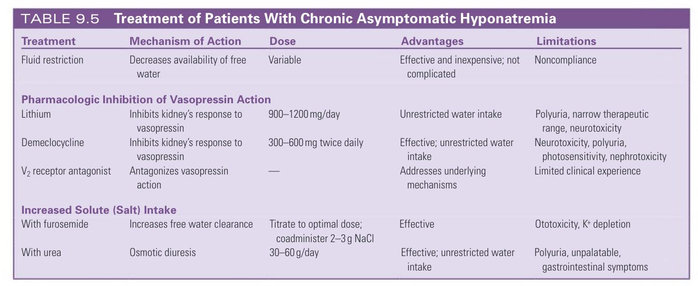

#### Table Data (CSV: [Table_9_5.csv](Table_9_5.csv))

```markdown
| Table Text (OCR) |
| :--- |
| TABLE 9.5 |
| Treatment of Patients With Chronic Asymptomatic Hyponatremia |
| Treatment |
| Mechanism of Action |
| Dose |
| Advantages |
| Limitations |
| Fluid restriction |
| Decreases availability of free |
| water |
| Variable |
| Effective and inexpensive; not |
| complicated |
| Noncompliance |
| Pharmacologic Inhibition of Vasopressin Action |
| Lithium |
| Inhibits kidney’s response to |
| vasopressin |
| 900–1200mg/day |
| Unrestricted water intake |
| Polyuria, narrow therapeutic |
| range, neurotoxicity |
| Demeclocycline |
| Inhibits kidney’s response to |
| vasopressin |
| 300–600mg twice daily |
| Effective; unrestricted water |
| intake |
| Neurotoxicity, polyuria, |
| photosensitivity, nephrotoxicity |
| V2 receptor antagonist |
| Antagonizes vasopressin |
| action |
| — |
| Addresses underlying |
| mechanisms |
| Limited clinical experience |
| Increased Solute (Salt) Intake |
| With furosemide |
| Increases free water clearance |
| Titrate to optimal dose; |
| coadminister 2–3g NaCl |
| Effective |
| Ototoxicity, K+ depletion |
| With urea |
| Osmotic diuresis |
| 30–60g/day |
| Effective; unrestricted water |
| intake |
| Polyuria, unpalatable, |
| gastrointestinal symptoms |
```

Table 9.5 Treatment of Patients With Chronic Asymptomatic Hyponatremia

---

### Table_9_6

#### Table Image

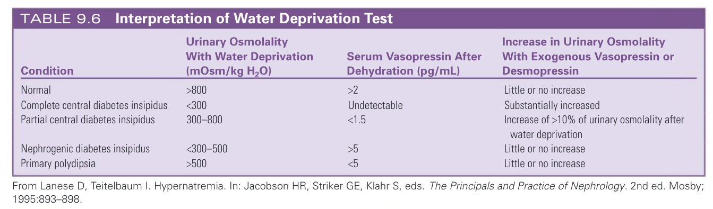

#### Table Data (CSV: [Table_9_6.csv](Table_9_6.csv))

```markdown
| Table Text (OCR) |
| :--- |
| TABLE 9.6 |
| Interpretation of Water Deprivation Test |
| Condition |
| Urinary Osmolality |
| With Water Deprivation |
| (mOsm/kg H2O) |
| Serum Vasopressin After |
| Dehydration (pg/mL) |
| Increase in Urinary Osmolality |
| With Exogenous Vasopressin or |
| Desmopressin |
| Normal |
| >800 |
| >2 |
| Little or no increase |
| Complete central diabetes insipidus |
| <300 |
| Undetectable |
| Substantially increased |
| Partial central diabetes insipidus |
| 300–800 |
| <1.5 |
| Increase of >10% of urinary osmolality after |
| water deprivation |
| Nephrogenic diabetes insipidus |
| <300–500 |
| >5 |
| Little or no increase |
| Primary polydipsia |
| >500 |
| <5 |
| Little or no increase |
| From Lanese D, Teitelbaum I. Hypernatremia. In: Jacobson HR, Striker GE, Klahr S, eds. The Principals and Practice of Nephrology. 2nd ed. Mosby; |
| 1995:893–898. |
```

Table 9.6 Interpretation of Water Deprivation Test

---

### Table_9_7

#### Table Image

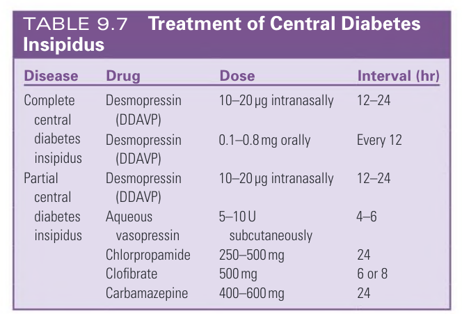

#### Table Data (CSV: [Table_9_7.csv](Table_9_7.csv))

```markdown
| Table Text (OCR) |
| :--- |
| TABLE 9.7 |
| Treatment of Central Diabetes |
| Insipidus |
| Disease |
| Drug |
| Dose |
| Interval (hr) |
| Complete |
| central |
| diabetes |
| insipidus |
| Desmopressin |
| (DDAVP) |
| 10–20μg intranasally |
| 12–24 |
| Desmopressin |
| (DDAVP) |
| 0.1–0.8mg orally |
| Every 12 |
| Partial |
| central |
| diabetes |
| insipidus |
| Desmopressin |
| (DDAVP) |
| 10–20μg intranasally |
| 12–24 |
| Aqueous |
| vasopressin |
| 5–10U |
| subcutaneously |
| 4–6 |
| Chlorpropamide |
| 250–500mg |
| 24 |
| Clofibrate |
| 500mg |
| 6 or 8 |
| Carbamazepine |
| 400–600mg |
| 24 |
```

Table 9.7 Treatment of Central Diabetes Insipidus

---

### Table_9_8

#### Table Image

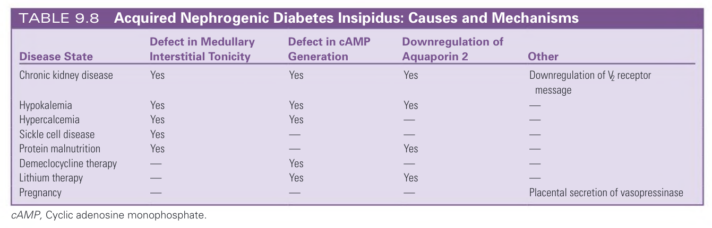

#### Table Data (CSV: [Table_9_8.csv](Table_9_8.csv))

```markdown
| Table Text (OCR) |
| :--- |
| TABLE 9.8 |
| Acquired Nephrogenic Diabetes Insipidus: Causes and Mechanisms |
| Disease State |
| Defect in Medullary |
| Interstitial Tonicity |
| Defect in cAMP |
| Generation |
| Downregulation of |
| Aquaporin 2 |
| Other |
| Chronic kidney disease |
| Yes |
| Yes |
| Yes |
| Downregulation of V2 receptor |
| message |
| Hypokalemia |
| Yes |
| Yes |
| Yes |
| — |
| Hypercalcemia |
| Yes |
| Yes |
| — |
| — |
| Sickle cell disease |
| Yes |
| — |
| — |
| — |
| Protein malnutrition |
| Yes |
| — |
| Yes |
| — |
| Demeclocycline therapy |
| — |
| Yes |
| — |
| — |
| Lithium therapy |
| — |
| Yes |
| Yes |
| — |
| Pregnancy |
| — |
| — |
| — |
| Placental secretion of vasopressinase |
| cAMP, Cyclic adenosine monophosphate. |
```

Table 9.8 Acquired Nephrogenic Diabetes Insipidus: Causes and Mechanisms

---

## Boxes

### Box_9_1

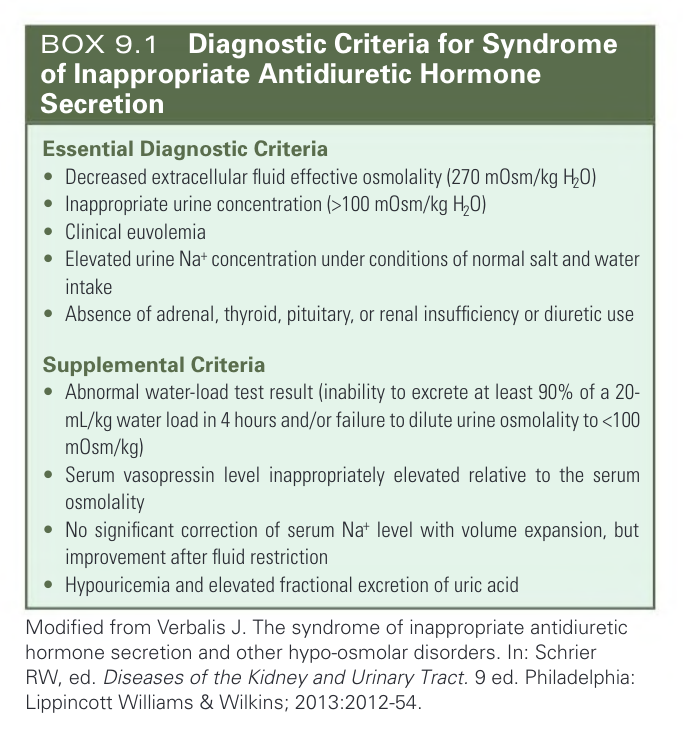

#### Box Text

```markdown
BOX 9.1 Diagnostic Criteria for Syndrome of Inappropriate Antidiuretic Hormone Secretion Essential Diagnostic Criteria • Decreased extracellular fluid effective osmolality (270 mOsm/kg H2O) • Inappropriate urine concentration (>100 mOsm/kg H2O) • Clinical euvolemia • Elevated urine Na+ concentration under conditions of normal salt and water intake • Absence of adrenal, thyroid, pituitary, or renal insufficiency or diuretic use Supplemental Criteria • Abnormal water-load test result (inability to excrete at least 90% of a 20mL/kg water load in 4 hours and/or failure to dilute urine osmolality to <100 mOsm/kg) • Serum vasopressin level inappropriately elevated relative to the serum osmolality • No significant correction of serum Na+ level with volume expansion, but improvement after fluid restriction • Hypouricemia and elevated fractional excretion of uric acid Modified from Verbalis J. The syndrome of inappropriate antidiuretic hormone secretion and other hypo-osmolar disorders. In: Schrier RW, ed. Diseases of the Kidney and Urinary Tract. 9 ed. Philadelphia: Lippincott Williams & Wilkins; 2013:2012-54.
```

Box 9.1 Diagnostic Criteria for Syndrome of Inappropriate Antidiuretic Hormone Secretion

---

### Box_9_2

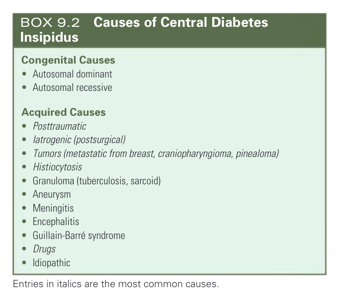

#### Box Text

```markdown
BOX 9.2 Causes of Central Diabetes Insipidus Congenital Causes • Autosomal dominant • Autosomal recessive Acquired Causes • Posttraumatic • Iatrogenic (postsurgical) • Tumors (metastatic from breast, craniopharyngioma, pinealoma) • Histiocytosis • Granuloma (tuberculosis, sarcoid) • Aneurysm • Meningitis • Encephalitis • Guillain-Barré syndrome • Drugs • Idiopathic Entries in italics are the most common causes.
```

Box 9.2 Causes of Central Diabetes Insipidus

---

### Box_9_3

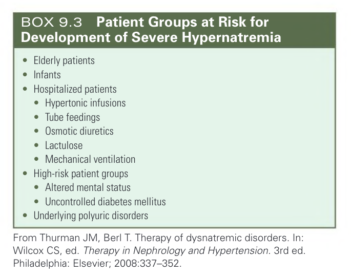

#### Box Text

```markdown
BOX 9.3 Patient Groups at Risk for Development of Severe Hypernatremia • Elderly patients • Infants • Hospitalized patients • Hypertonic infusions • Tube feedings • Osmotic diuretics • Lactulose • Mechanical ventilation • High-risk patient groups • Altered mental status • Uncontrolled diabetes mellitus • Underlying polyuric disorders From Thurman JM, Berl T. Therapy of dysnatremic disorders. In: Wilcox CS, ed. Therapy in Nephrology and Hypertension. 3rd ed. Philadelphia: Elsevier; 2008:337–352.
```

Box 9.3 Patient Groups at Risk for Development of Severe Hypernatremia

---

### U_9_p14_1

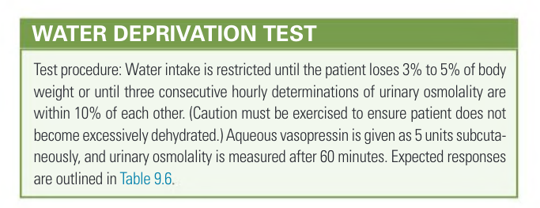

#### Box Text

```markdown
WATER DEPRIVATION TEST Test procedure: Water intake is restricted until the patient loses 3% to 5% of body weight or until three consecutive hourly determinations of urinary osmolality are within 10% of each other. (Caution must be exercised to ensure patient does not become excessively dehydrated.) Aqueous vasopressin is given as 5 units subcutaneously, and urinary osmolality is measured after 60 minutes. Expected responses are outlined in Table 9.6
```

U_9_p14_1 WATER DEPRIVATION TEST

---
