# 010. Disorders of Potassium Metabolism - Figures and Tables Index

This document lists all figures, tables and boxes extracted from `010. Disorders of Potassium Metabolism.pdf`.

## Table of Contents
- [Figures](#figures)
- [Tables](#tables)
- [Boxes](#boxes)

---

## Figures

### Fig_10_1

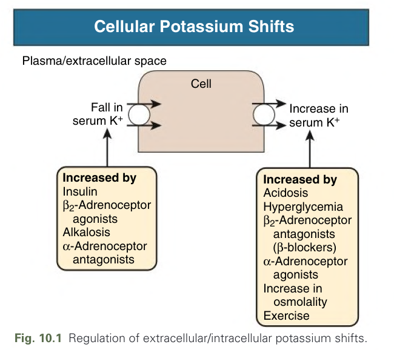

Fig. 10.1 Regulation of extracellular/intracellular potassium shifts.

---

### Fig_10_2

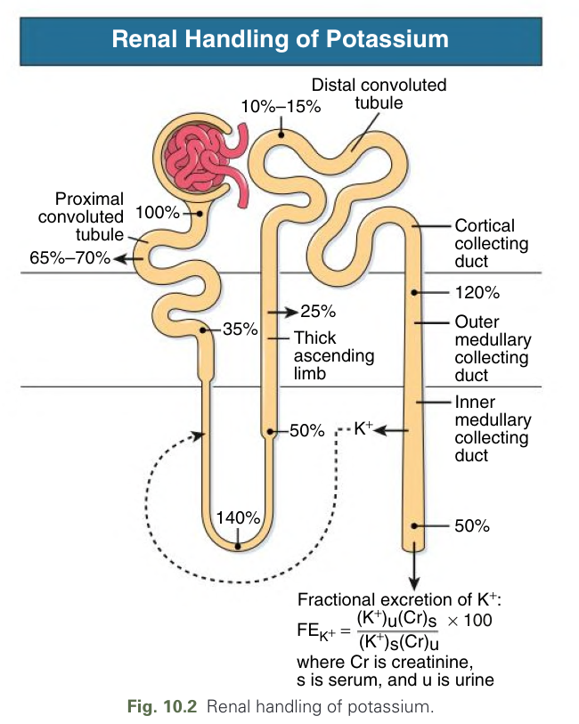

Fig. 10.2 Renal handling of potassium.

---

### Fig_10_3

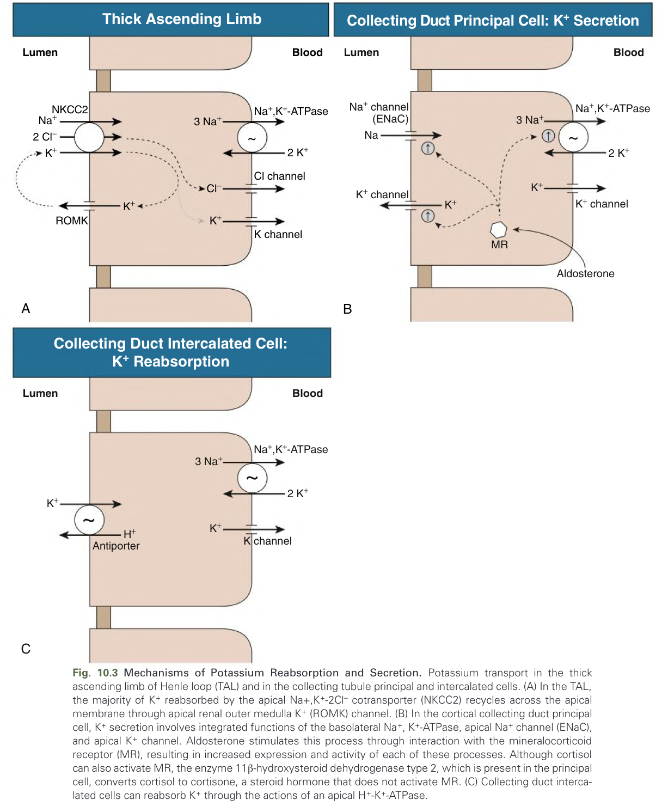

Fig. 10.3 Mechanisms of Potassium Reabsorption and Secretion. Potassium transport in the thick ascending limb of Henle loop (TAL) and in the collecting tubule principal and intercalated cells. (A) In the TAL, the majority of $K^{+}$ reabsorbed by the apical $Na^{+}, K^{+}-2Cl^{-}$ cotransporter (NKCC2) recycles across the apical membrane through apical renal outer medulla $K^{+}$ (ROMK) channel. (B) In the cortical collecting duct principal cell, $K^{+}$ secretion involves integrated functions of the basolateral $Na^{+}$ , $K^{+}$ -ATPase, apical $Na^{+}$ channel (ENaC), and apical $K^{+}$ channel. Aldosterone stimulates this process through interaction with the mineralocorticoid receptor (MR), resulting in increased expression and activity of each of these processes. Although cortisol can also activate MR, the enzyme 11β-hydroxysteroid dehydrogenase type 2, which is present in the principal cell, converts cortisol to cortisone, a steroid hormone that does not activate MR. (C) Collecting duct intercalated cells can reabsorb $K^{+}$ through the actions of an apical $H^{+}-K^{+}$ -ATPase.

---

### Fig_10_4

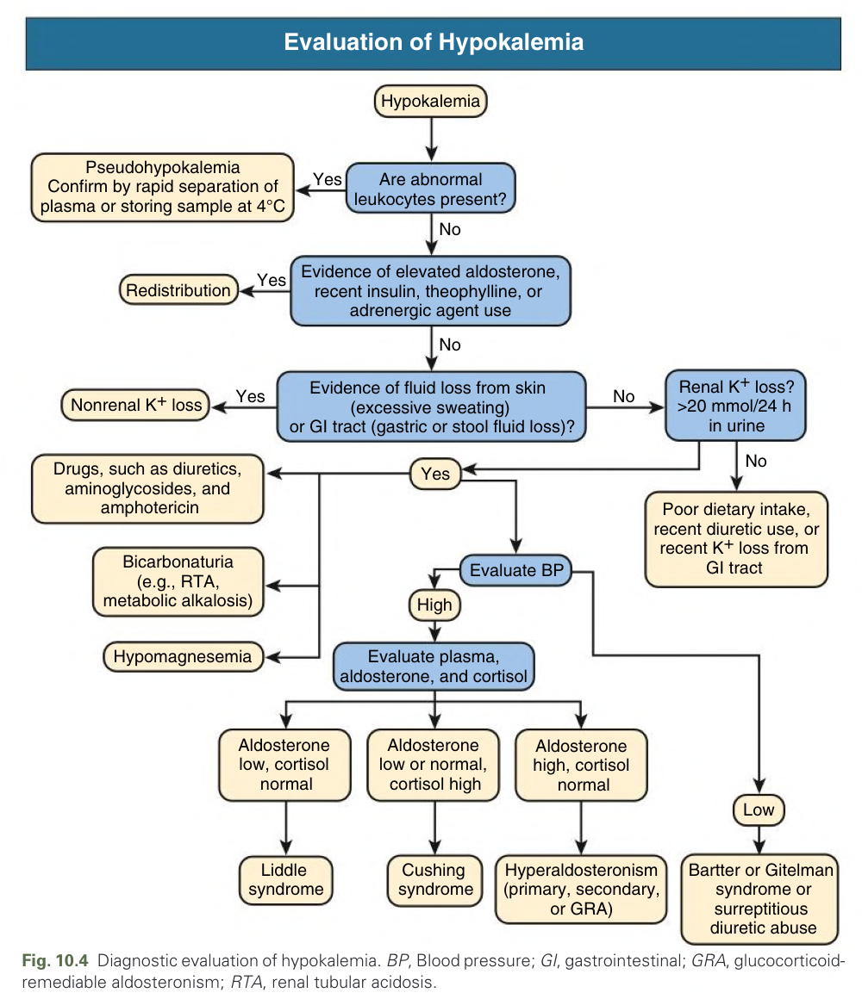

Fig. 10.4 Diagnostic evaluation of hypokalemia. BP, Blood pressure; GI, gastrointestinal; GRA, glucocorticoid-remediable aldosteronism; RTA, renal tubular acidosis.

---

### Fig_10_5

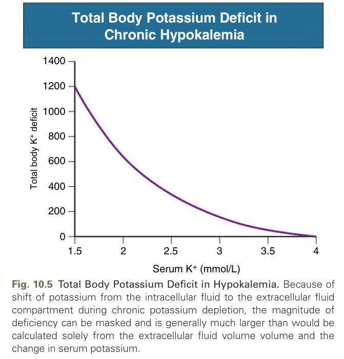

Fig. 10.5 Total Body Potassium Deficit in Hypokalemia. Because of shift of potassium from the intracellular fluid to the extracellular fluid compartment during chronic potassium depletion, the magnitude of deficiency can be masked and is generally much larger than would be calculated solely from the extracellular fluid volume volume and the change in serum potassium.

---

### Fig_10_6

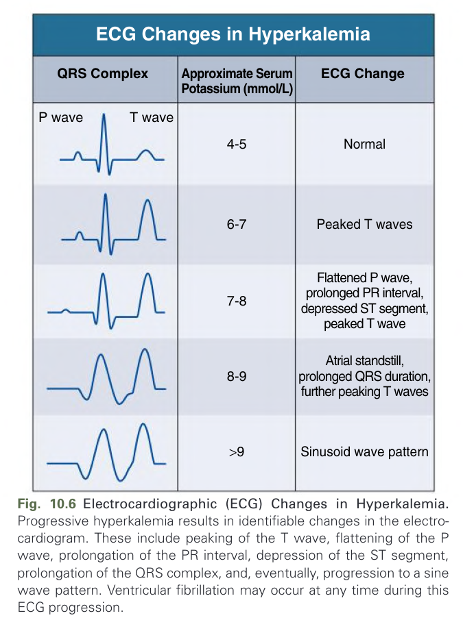

Fig. 10.6 Electrocardiographic (ECG) Changes in Hyperkalemia. Progressive hyperkalemia results in identifiable changes in the electrocardiogram. These include peaking of the T wave, flattening of the P wave, prolongation of the PR interval, depression of the ST segment, prolongation of the QRS complex, and, eventually, progression to a sine wave pattern. Ventricular fibrillation may occur at any time during this ECG progression.

---

### Fig_10_7

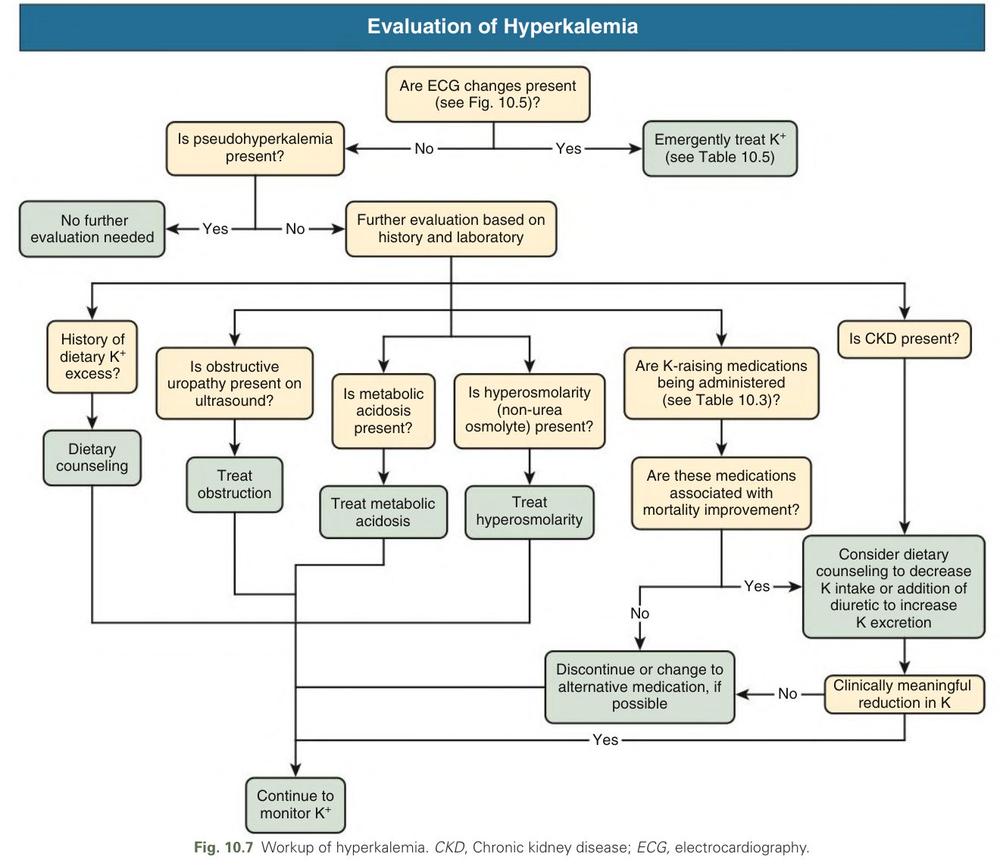

Fig. 10.7 Workup of hyperkalemia. CKD, Chronic kidney disease; ECG, electrocardiography.

---

## Tables

### Table_10_1

#### Table Image

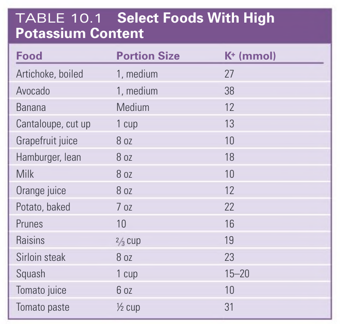

#### Table Data (CSV: [Table_10_1.csv](Table_10_1.csv))

```markdown
| Food | Portion Size | K+ (mmol) |
| :--- | :--- | :--- |
| Artichoke, boiled | 1, medium | 27 |
| Avocado | 1, medium | 38 |
| Banana | Medium | 12 |
| Cantaloupe, cut up | 1 cup | 13 |
| Grapefruit juice | 8 oz | 10 |
| Hamburger, lean | 8 oz | 18 |
| Milk | 8 oz | 10 |
| Orange juice | 8 oz | 12 |
| Potato, baked | 7 oz | 22 |
| Prunes | 10 | 16 |
| Raisins | 2/3 cup | 19 |
| Sirloin steak | 8 oz | 23 |
| Squash | 1 cup | 15-20 |
| Tomato juice | 6 oz | 10 |
| Tomato paste | 1/2 cup | 31 |
```

Table 10.1 Select Foods With High Potassium Content

---

### Table_10_2

#### Table Image

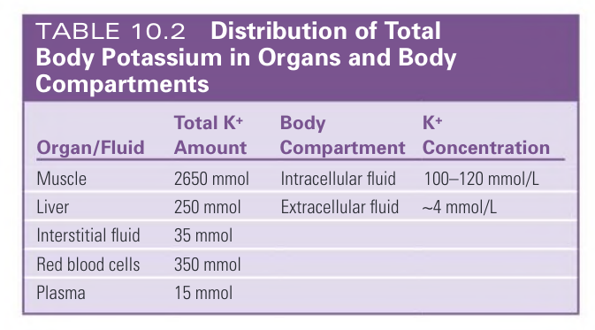

#### Table Data (CSV: [Table_10_2.csv](Table_10_2.csv))

```markdown
| Organ/Fluid | Total K+ Amount | Body Compartment | K+ Concentration |
| :--- | :--- | :--- | :--- |
| Muscle | 2650 mmol | Intracellular fluid | 100-120 mmol/L |
| Liver | 250 mmol | Extracellular fluid | ~4 mmol/L |
| Interstitial fluid | 35 mmol | | |
| Red blood cells | 350 mmol | | |
| Plasma | 15 mmol | | |
```

Table 10.2 Distribution of Total Body Potassium in Organs and Body Compartments

---

### Table_10_3

#### Table Image

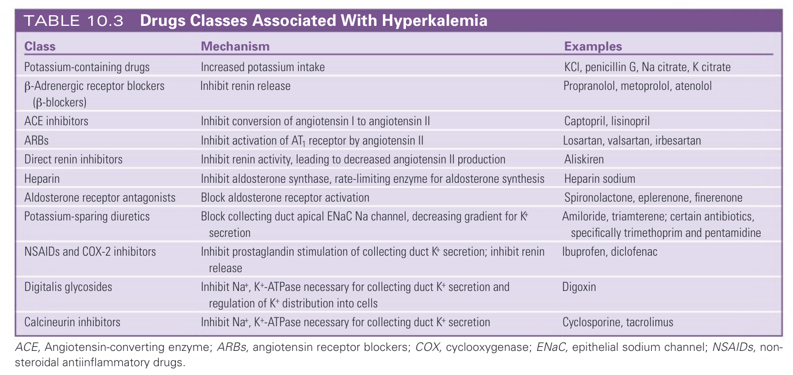

#### Table Data (CSV: [Table_10_3.csv](Table_10_3.csv))

```markdown
| Class | Mechanism | Examples |
| :--- | :--- | :--- |
| Potassium-containing drugs | Increased potassium intake | KCl, penicillin G, Na citrate, K citrate |
| B-Adrenergic receptor blockers (β-blockers) | Inhibit renin release | Propranolol, metoprolol, atenolol |
| ACE inhibitors | Inhibit conversion of angiotensin I to angiotensin II | Captopril, lisinopril |
| ARBs | Inhibit activation of AT, receptor by angiotensin II | Losartan, valsartan, irbesartan |
| Direct renin inhibitors | Inhibit renin activity, leading to decreased angiotensin II production | Aliskiren |
| Heparin | Inhibit aldosterone synthase, rate-limiting enzyme for aldosterone synthesis | Heparin sodium |
| Aldosterone receptor antagonists | Block aldosterone receptor activation | Spironolactone, eplerenone, finerenone |
| Potassium-sparing diuretics | Block collecting duct apical ENaC Na channel, decreasing gradient for K secretion | Amiloride, triamterene; certain antibiotics, specifically trimethoprim and pentamidine |
| NSAIDs and COX-2 inhibitors | Inhibit prostaglandin stimulation of collecting duct K+ secretion; inhibit renin release | Ibuprofen, diclofenac |
| Digitalis glycosides | Inhibit Na+, K+-ATPase necessary for collecting duct K+ secretion and regulation of K+ distribution into cells | Digoxin |
| Calcineurin inhibitors | Inhibit Na+, K+-ATPase necessary for collecting duct K+ secretion | Cyclosporine, tacrolimus |
ACE, Angiotensin-converting enzyme; ARBs, angiotensin receptor blockers; COX, cyclooxygenase; ENaC, epithelial sodium channel; NSAIDs, non-steroidal antiinflammatory drugs.
```

Table 10.3 Drugs Classes Associated With Hyperkalemia

---

### Table_10_4

#### Table Image

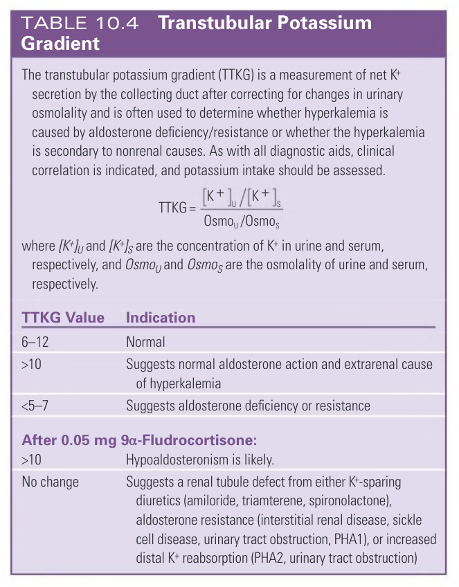

#### Table Data (CSV: [Table_10_4.csv](Table_10_4.csv))

```markdown
The transtubular potassium gradient (TTKG) is a measurement of net K+ secretion by the collecting duct after correcting for changes in urinary osmolality and is often used to determine whether hyperkalemia is caused by aldosterone deficiency/resistance or whether the hyperkalemia is secondary to nonrenal causes. As with all diagnostic aids, clinical correlation is indicated, and potassium intake should be assessed.
TTKG = ([K+]u/[K+]s) / (Osmou/Osmos)
where [K+]u and [K+]s are the concentration of K+ in urine and serum, respectively, and Osmou and Osmos are the osmolality of urine and serum, respectively.
| TTKG Value | Indication |
| :--- | :--- |
| 6-12 | Normal |
| >10 | Suggests normal aldosterone action and extrarenal cause of hyperkalemia |
| <5-7 | Suggests aldosterone deficiency or resistance |
| **After 0.05 mg 9a-Fludrocortisone:** | |
| >10 | Hypoaldosteronism is likely. |
| No change | Suggests a renal tubule defect from either K+-sparing diuretics (amiloride, triamterene, spironolactone), aldosterone resistance (interstitial renal disease, sickle cell disease, urinary tract obstruction, PHA1), or increased distal K+ reabsorption (PHA2, urinary tract obstruction) |
```

Table 10.4 Transtubular Potassium Gradient

---

### Table_10_5

#### Table Image

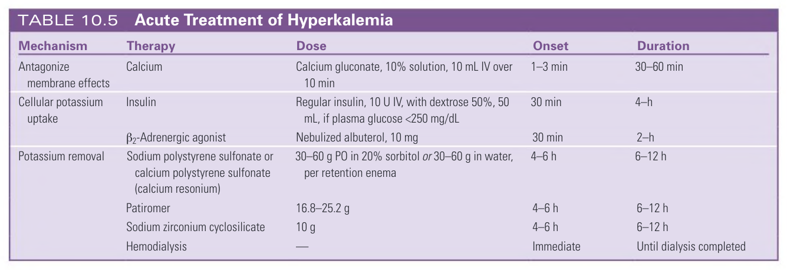

#### Table Data (CSV: [Table_10_5.csv](Table_10_5.csv))

```markdown
| Mechanism | Therapy | Dose | Onset | Duration |
| :--- | :--- | :--- | :--- | :--- |
| Antagonize membrane effects | Calcium | Calcium gluconate, 10% solution, 10 mL IV over 10 min | 1-3 min | 30-60 min |
| Cellular potassium uptake | Insulin | Regular insulin, 10 U IV, with dextrose 50%, 50 mL, if plasma glucose <250 mg/dL | 30 min | 4-h |
| | B2-Adrenergic agonist | Nebulized albuterol, 10 mg | 30 min | 2-h |
| Potassium removal | Sodium polystyrene sulfonate or calcium polystyrene sulfonate (calcium resonium) | 30-60 g PO in 20% sorbitol or 30-60 g in water, per retention enema | 4-6 h | 6-12 h |
| | Patiromer | 16.8-25.2 g | 4-6 h | 6-12 h |
| | Sodium zirconium cyclosilicate | 10 g | 4-6 h | 6-12 h |
| | Hemodialysis | | Immediate | Until dialysis completed |
```

Table 10.5 Acute Treatment of Hyperkalemia

---

## Boxes

*No boxes resolved for this chapter.*
