# 011. Disorders of Calcium, Phosphate, and Magnesium Metabolism - Figures and Tables Index

This document lists all figures, tables and boxes extracted from `011. Disorders of Calcium, Phosphate, and Magnesium Metabolism.pdf`.

## Table of Contents
- [Figures](#figures)
- [Tables](#tables)
- [Boxes](#boxes)

---

## Figures

### Fig_11_1

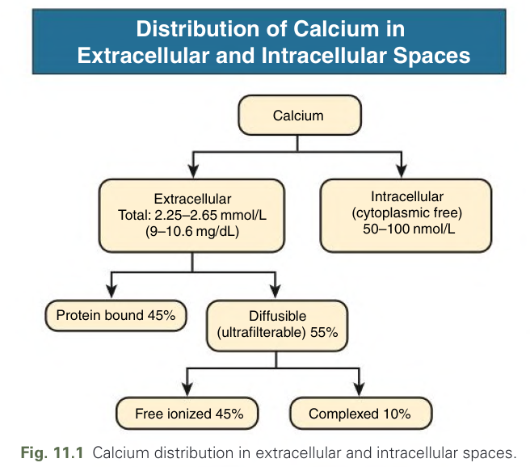

Fig. 11.1 Calcium distribution in extracellular and intracellular spaces.

---

### Fig_11_2

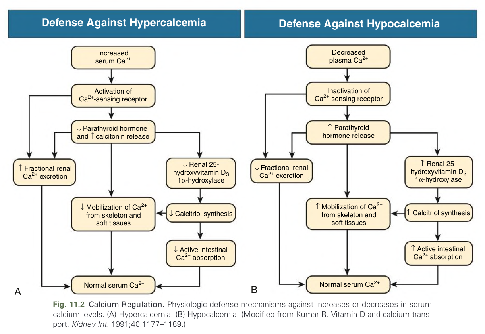

Fig. 11.2 Calcium Regulation. Physiologic defense mechanisms against increases or decreases in serum calcium levels. (A) Hypercalcemia. (B) Hypocalcemia. (Modified from Kumar R. Vitamin D and calcium transport. Kidney Int. 1991;40:1177–1189.)

---

### Fig_11_3

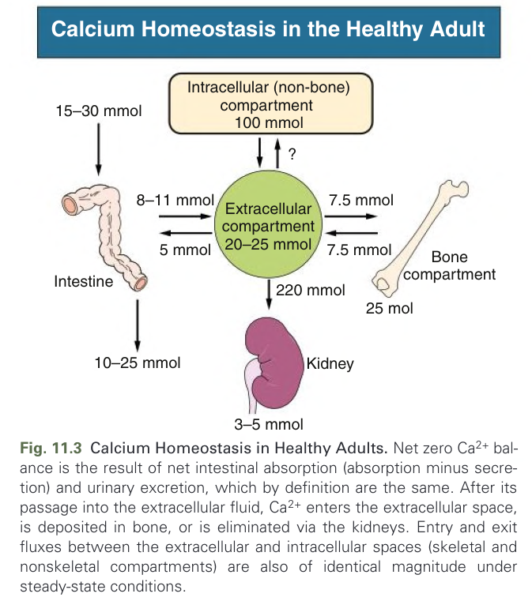

Fig. 11.3 Calcium Homeostasis in Healthy Adults. Net zero $Ca^{2+}$ balance is the result of net intestinal absorption (absorption minus secretion) and urinary excretion, which by definition are the same. After its passage into the extracellular fluid, $Ca^{2+}$ enters the extracellular space, is deposited in bone, or is eliminated via the kidneys. Entry and exit fluxes between the extracellular and intracellular spaces (skeletal and nonskeletal compartments) are also of identical magnitude under steady-state conditions.

---

### Fig_11_4

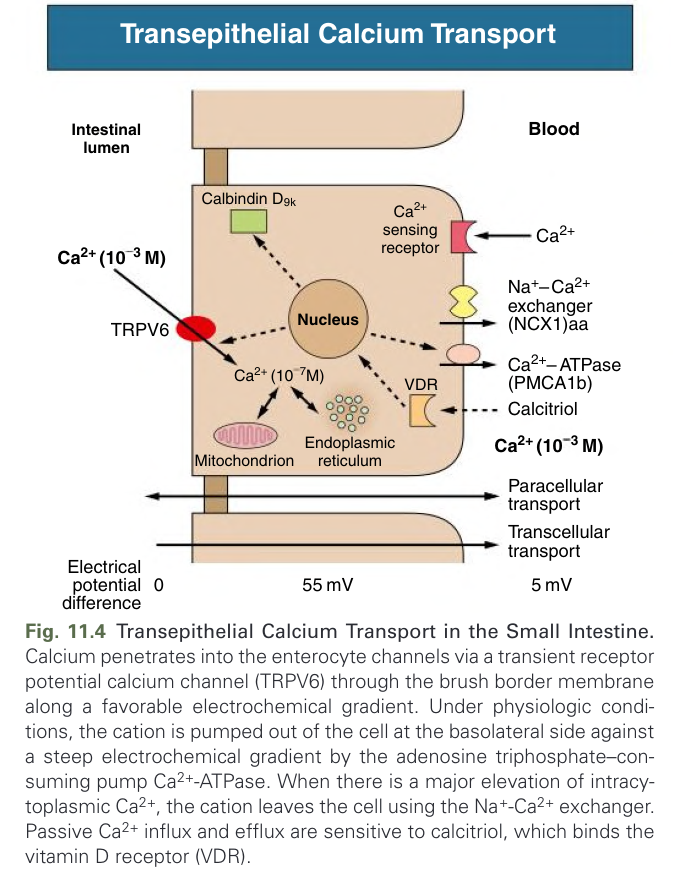

Fig. 11.4 Transepithelial Calcium Transport in the Small Intestine. Calcium penetrates into the enterocyte channels via a transient receptor potential calcium channel (TRPV6) through the brush border membrane along a favorable electrochemical gradient. Under physiologic conditions, the cation is pumped out of the cell at the basolateral side against a steep electrochemical gradient by the adenosine triphosphate-consuming pump $Ca^{2+}$ -ATPase. When there is a major elevation of intracytoplasmic $Ca^{2+}$ , the cation leaves the cell using the $Na^{+}-Ca^{2+}$ exchanger. Passive $Ca^{2+}$ influx and efflux are sensitive to calcitriol, which binds the vitamin D receptor (VDR).

---

### Fig_11_5

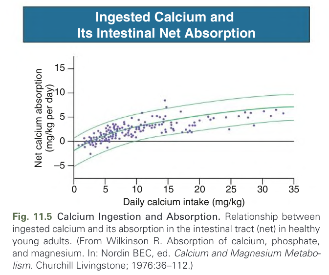

Fig. 11.5 Calcium Ingestion and Absorption. Relationship between ingested calcium and its absorption in the intestinal tract (net) in healthy young adults. (From Wilkinson R. Absorption of calcium, phosphate, and magnesium. In: Nordin BEC, ed. Calcium and Magnesium Metabolism. Churchill Livingstone; 1976:36–112.)

---

### Fig_11_6

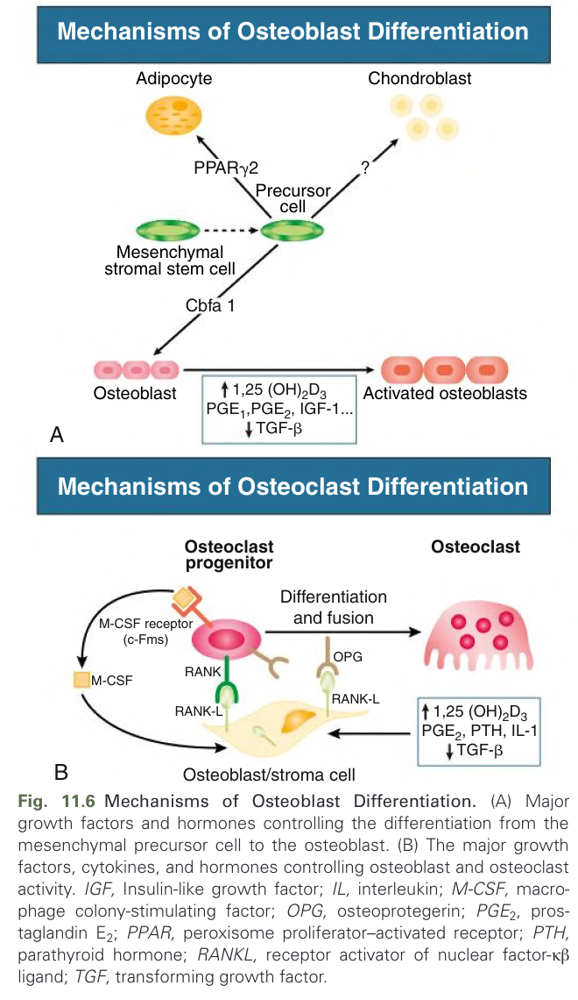

Fig. 11.6 Mechanisms of Osteoblast Differentiation. (A) Major growth factors and hormones controlling the differentiation from the mesenchymal precursor cell to the osteoblast. (B) The major growth factors, cytokines, and hormones controlling osteoblast and osteoclast activity. IGF, Insulin-like growth factor; IL, interleukin; M-CSF, macrophage colony-stimulating factor; OPG, osteoprotegerin; $PGE_{2}$ , prostaglandin $E_{2}$ ; PPAR, peroxisome proliferator–activated receptor; PTH, parathyroid hormone; RANKL, receptor activator of nuclear factor- $\kappa\beta$ ligand; TGF, transforming growth factor.

---

### Fig_11_7

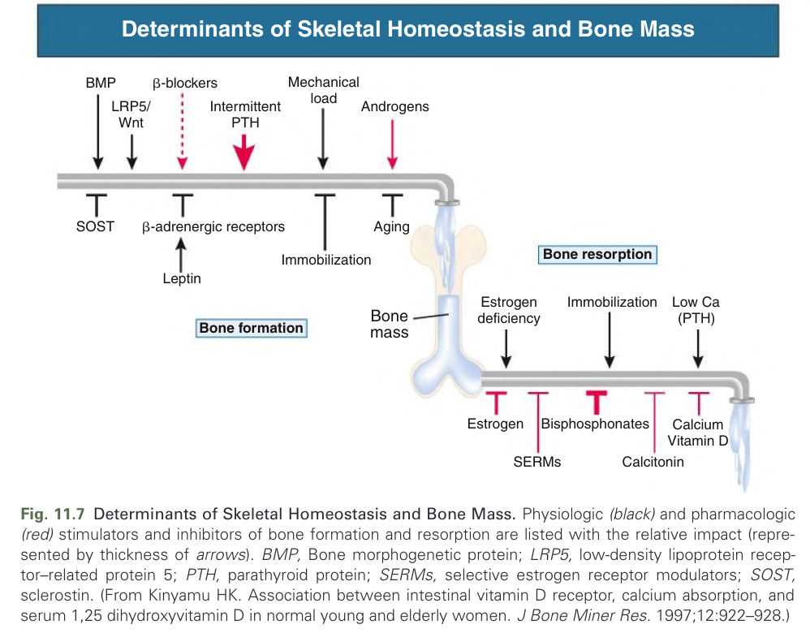

Fig. 11.7 Determinants of Skeletal Homeostasis and Bone Mass. Physiologic (black) and pharmacologic (red) stimulators and inhibitors of bone formation and resorption are listed with the relative impact (represented by thickness of arrows). BMP, Bone morphogenetic protein; LRP5, low-density lipoprotein receptor-related protein 5; PTH, parathyroid protein; SERMs, selective estrogen receptor modulators; SOST, sclerostin. (From Kinyamu HK. Association between intestinal vitamin D receptor, calcium absorption, and serum 1,25 dihydroxyvitamin D in normal young and elderly women. J Bone Miner Res. 1997;12:922–928.)

---

### Fig_11_8

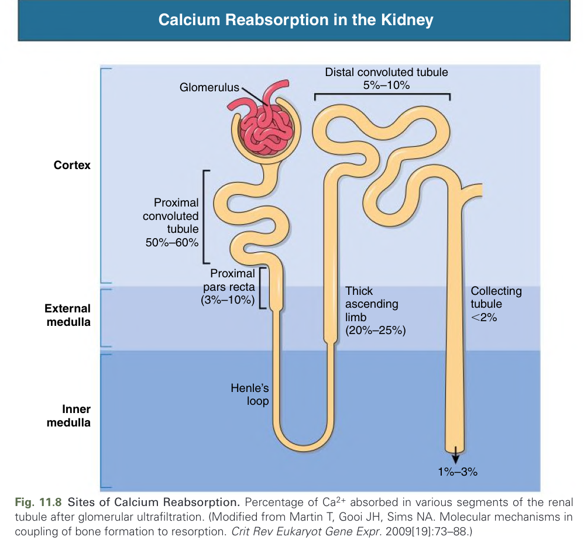

Fig. 11.8 Sites of Calcium Reabsorption. Percentage of $Ca^{2+}$ absorbed in various segments of the renal tubule after glomerular ultrafiltration. (Modified from Martin T, Gooi JH, Sims NA. Molecular mechanisms in coupling of bone formation to resorption. Crit Rev Eukaryot Gene Expr. 2009[19]:73–88.)

---

### Fig_11_9

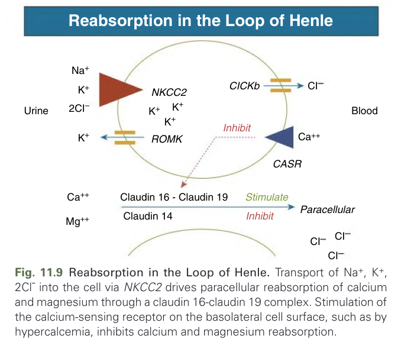

Fig. 11.9 Reabsorption in the Loop of Henle. Transport of $Na^{+}$ , $K^{+}$ , $2Cl^{-}$ into the cell via NKCC2 drives paracellular reabsorption of calcium and magnesium through a claudin 16-claudin 19 complex. Stimulation of the calcium-sensing receptor on the basolateral cell surface, such as by hypercalcemia, inhibits calcium and magnesium reabsorption.

---

### Fig_11_10

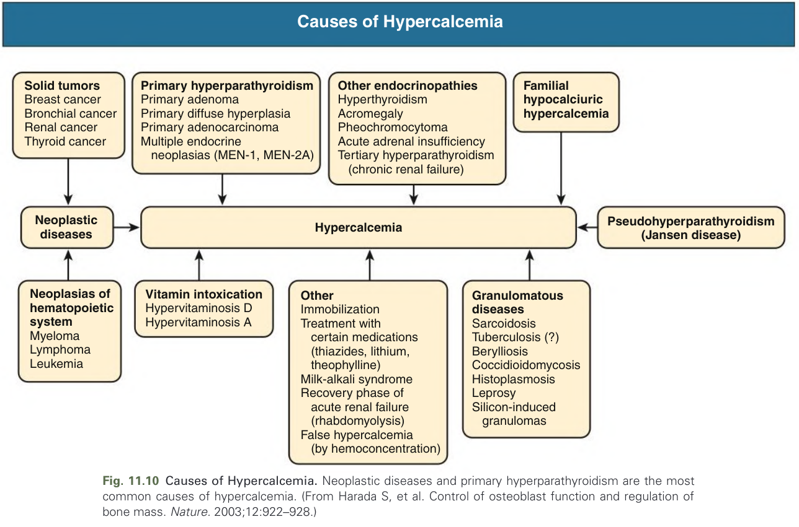

Fig. 11.10 Causes of Hypercalcemia. Neoplastic diseases and primary hyperparathyroidism are the most common causes of hypercalcemia. (From Harada S, et al. Control of osteoblast function and regulation of bone mass. Nature. 2003;12:922–928.)

---

### Fig_11_11

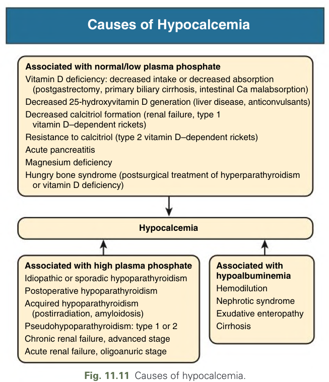

Fig. 11.11 Causes of hypocalcemia.

---

### Fig_11_12

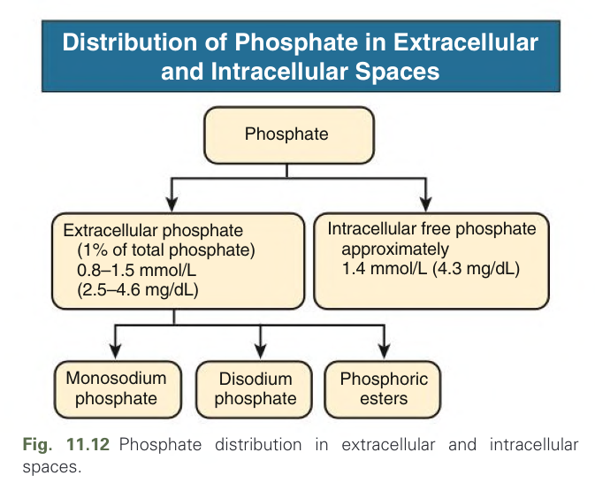

Fig. 11.12 Phosphate distribution in extracellular and intracellular spaces.

---

### Fig_11_13

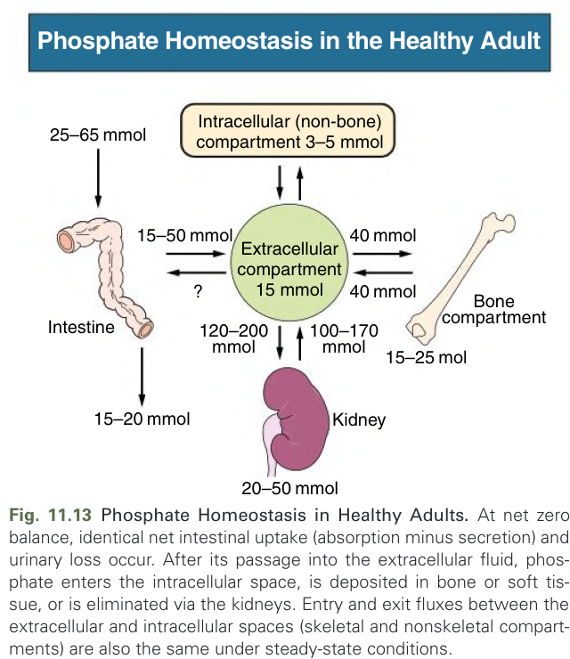

Fig. 11.13 Phosphate Homeostasis in Healthy Adults. At net zero balance, identical net intestinal uptake (absorption minus secretion) and urinary loss occur. After its passage into the extracellular fluid, phosphate enters the intracellular space, is deposited in bone or soft tissue, or is eliminated via the kidneys. Entry and exit fluxes between the extracellular and intracellular spaces (skeletal and nonskeletal compartments) are also the same under steady-state conditions.

---

### Fig_11_14

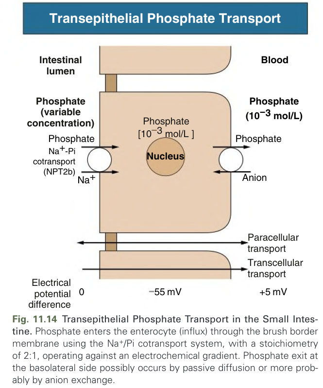

Fig. 11.14 Transepithelial Phosphate Transport in the Small Intestine. Phosphate enters the enterocyte (influx) through the brush border membrane using the Na+/Pi cotransport system, with a stoichiometry of 2:1, operating against an electrochemical gradient. Phosphate exit at the basolateral side possibly occurs by passive diffusion or more probably by anion exchange.

---

### Fig_11_15

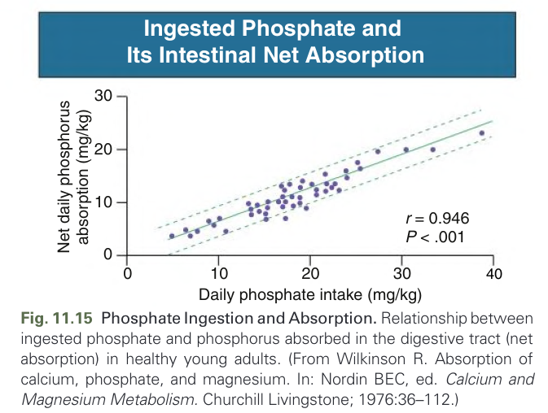

Fig. 11.15 Phosphate Ingestion and Absorption. Relationship between ingested phosphate and phosphorus absorbed in the digestive tract (net absorption) in healthy young adults. (From Wilkinson R. Absorption of calcium, phosphate, and magnesium. In: Nordin BEC, ed. Calcium and Magnesium Metabolism. Churchill Livingstone; 1976:36–112.)

---

### Fig_11_16

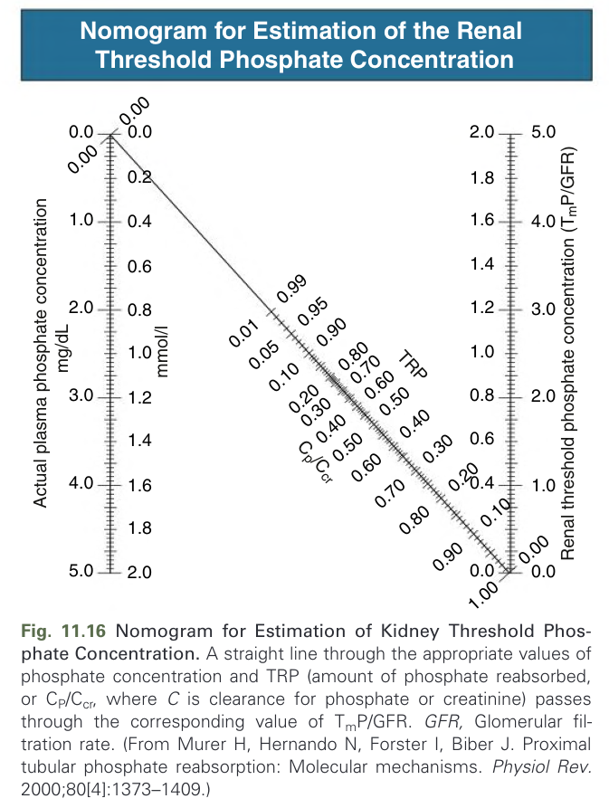

Fig. 11.16 Nomogram for Estimation of Kidney Threshold Phosphate Concentration. A straight line through the appropriate values of phosphate concentration and TRP (amount of phosphate reabsorbed, or $C_{P}/C_{cr}$ , where C is clearance for phosphate or creatinine) passes through the corresponding value of $T_{m}P/GFR$ . GFR, Glomerular filtration rate. (From Murer H, Hernando N, Forster I, Biber J. Proximal tubular phosphate reabsorption: Molecular mechanisms. Physiol Rev. 2000;80[4]:1373–1409.)

---

### Fig_11_17

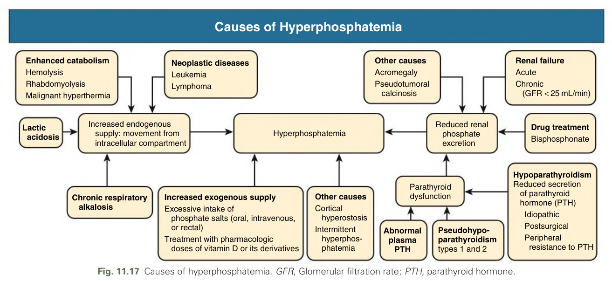

Fig. 11.17 Causes of hyperphosphatemia. GFR, Glomerular filtration rate; PTH, parathyroid hormone.

---

### Fig_11_18

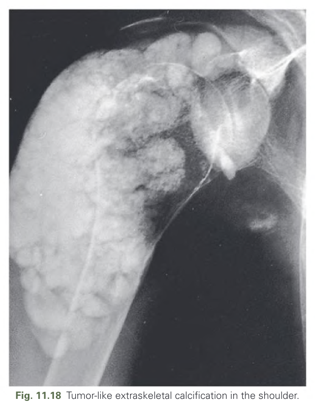

Fig. 11.18 Tumor-like extraskeletal calcification in the shoulder.

---

### Fig_11_19

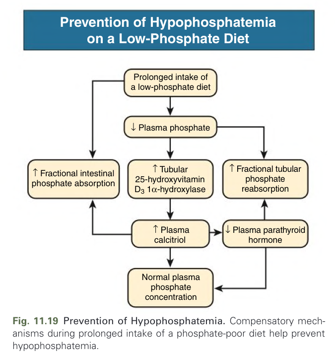

Fig. 11.19 Prevention of Hypophosphatemia. Compensatory mechanisms during prolonged intake of a phosphate-poor diet help prevent hypophosphatemia.

---

### Fig_11_20

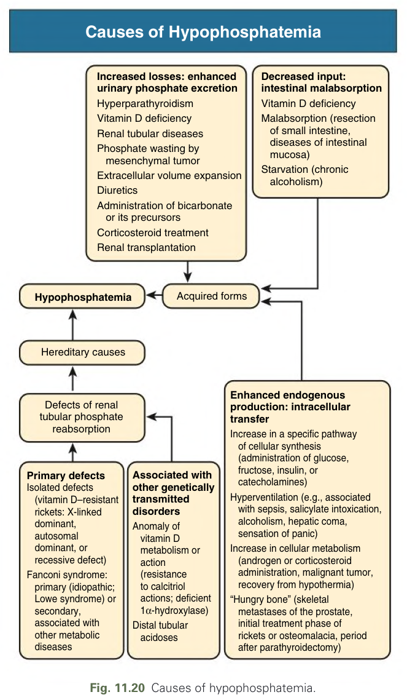

Fig. 11.20 Causes of hypophosphatemia.

---

### Fig_11_21

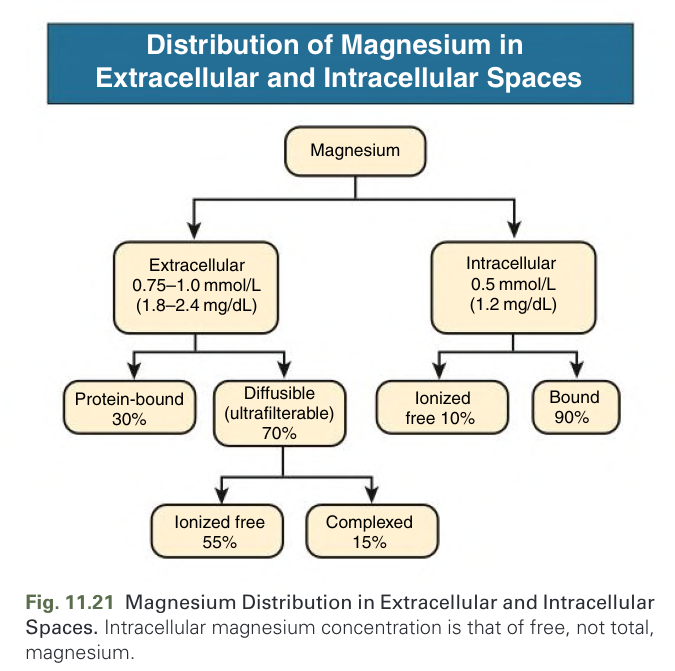

Fig. 11.21 Magnesium Distribution in Extracellular and Intracellular Spaces. Intracellular magnesium concentration is that of free, not total, magnesium.

---

### Fig_11_22

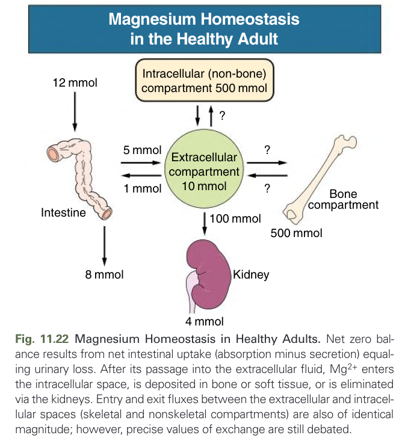

Fig. 11.22 Magnesium Homeostasis in Healthy Adults. Net zero balance results from net intestinal uptake (absorption minus secretion) equaling urinary loss. After its passage into the extracellular fluid, $Mg^{2+}$ enters the intracellular space, is deposited in bone or soft tissue, or is eliminated via the kidneys. Entry and exit fluxes between the extracellular and intracellular spaces (skeletal and nonskeletal compartments) are also of identical magnitude; however, precise values of exchange are still debated.

---

### Fig_11_23

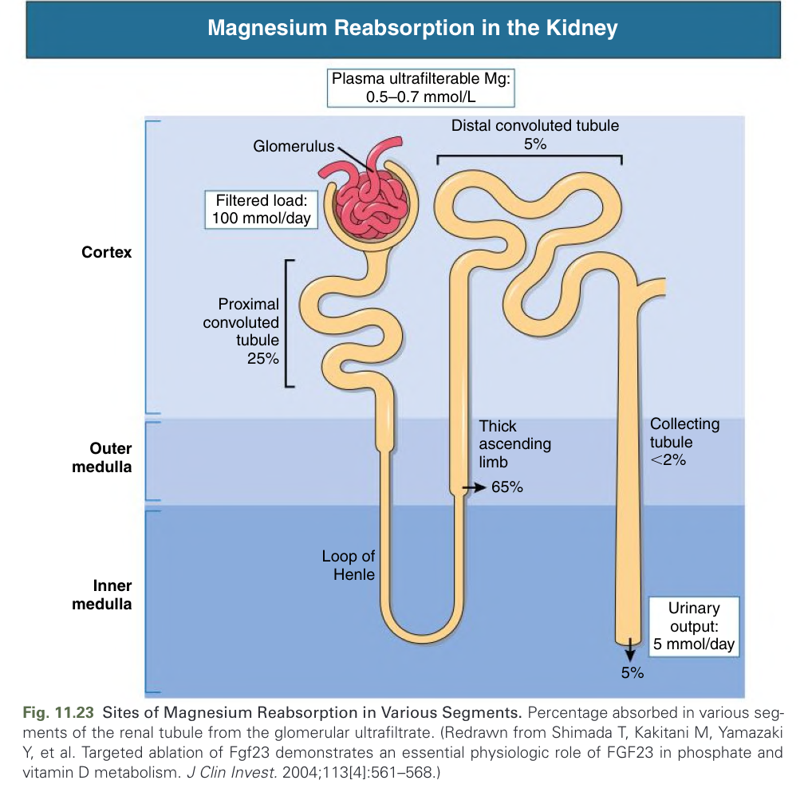

Fig. 11.23 Sites of Magnesium Reabsorption in Various Segments. Percentage absorbed in various segments of the renal tubule from the glomerular ultrafiltrate. (Redrawn from Shimada T, Kakitani M, Yamazaki Y, et al. Targeted ablation of Fgf23 demonstrates an essential physiologic role of FGF23 in phosphate and vitamin D metabolism. J Clin Invest. 2004;113[4]:561–568.)

---

### Fig_11_24

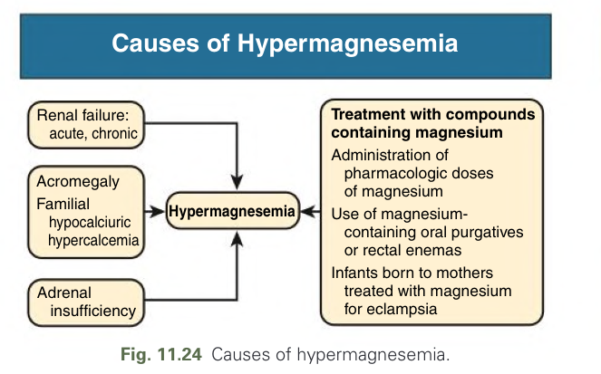

Fig. 11.24 Causes of hypermagnesemia.

---

### Fig_11_25

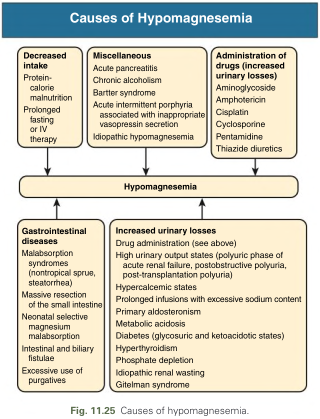

Fig. 11.25 Causes of hypomagnesemia.

---

## Tables

*No tables resolved for this chapter.*

## Boxes

*No boxes resolved for this chapter.*
