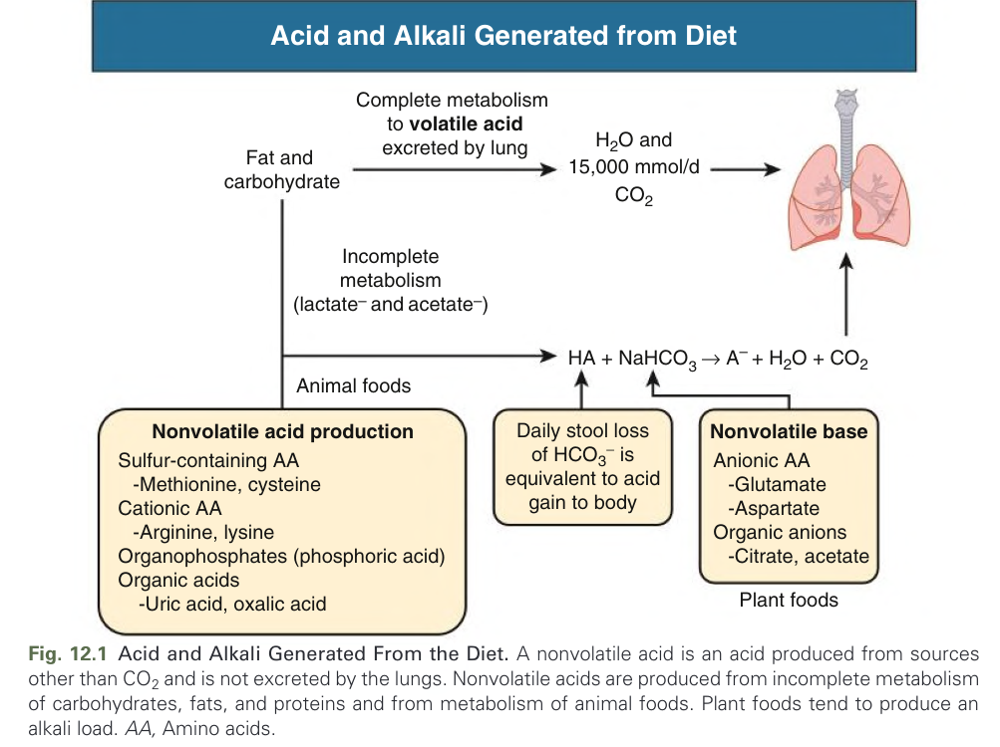
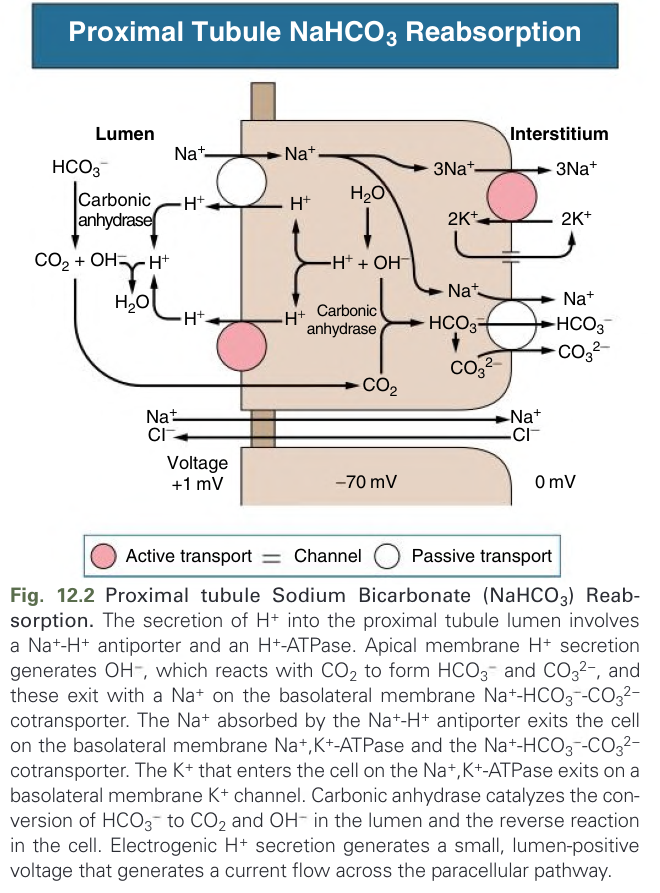
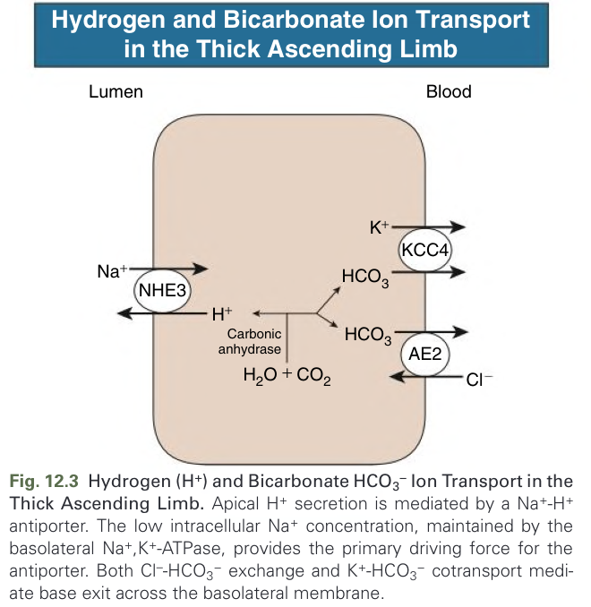
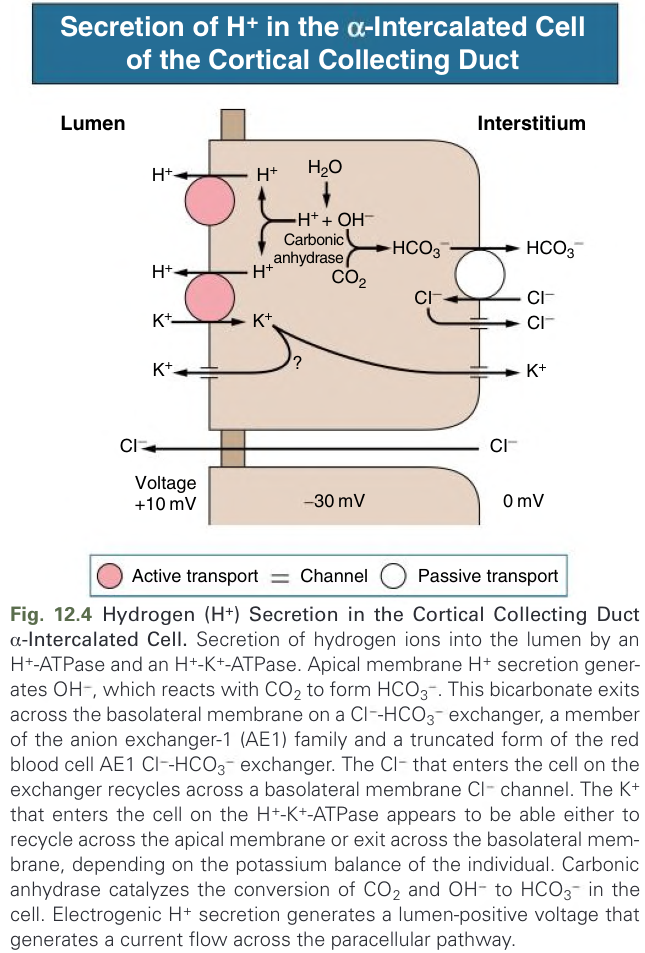
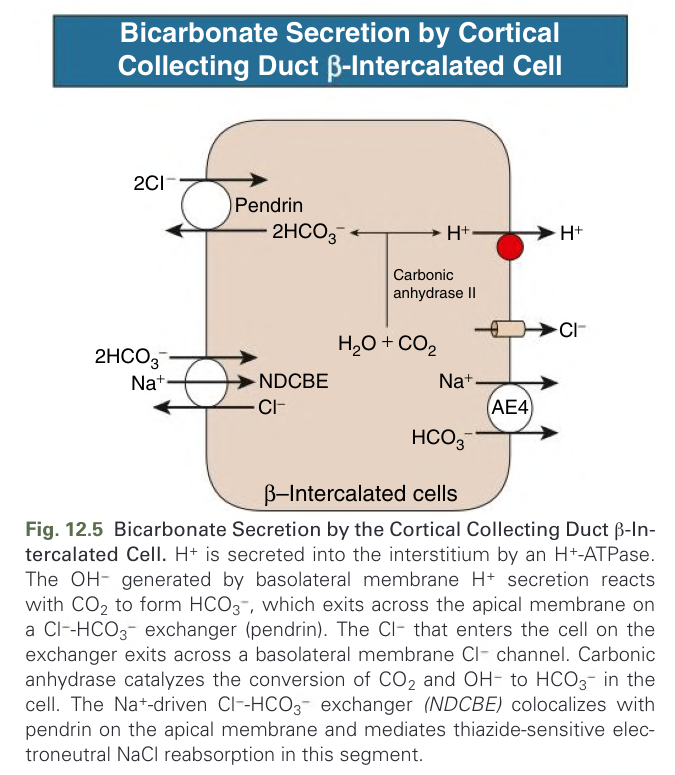
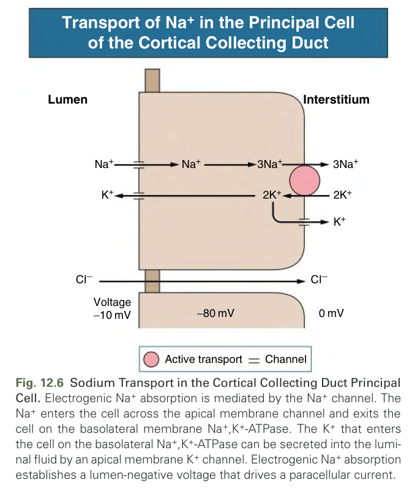
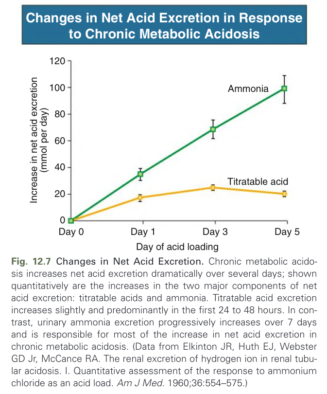
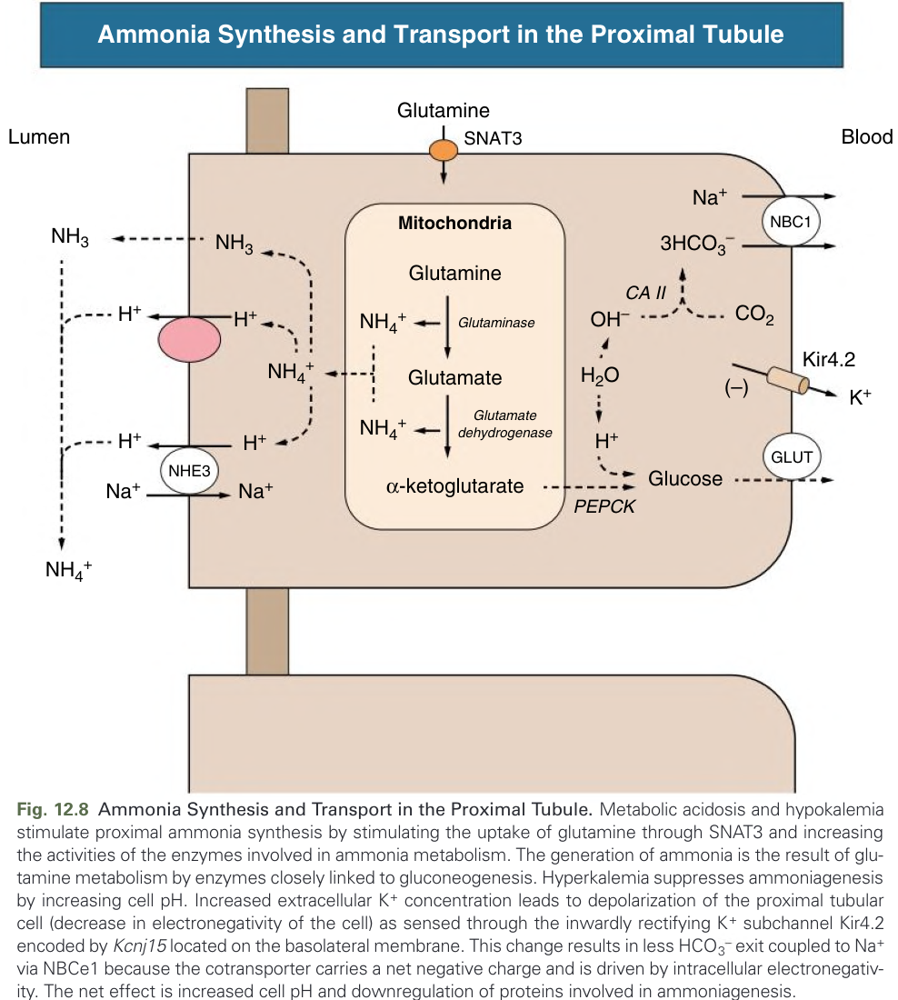
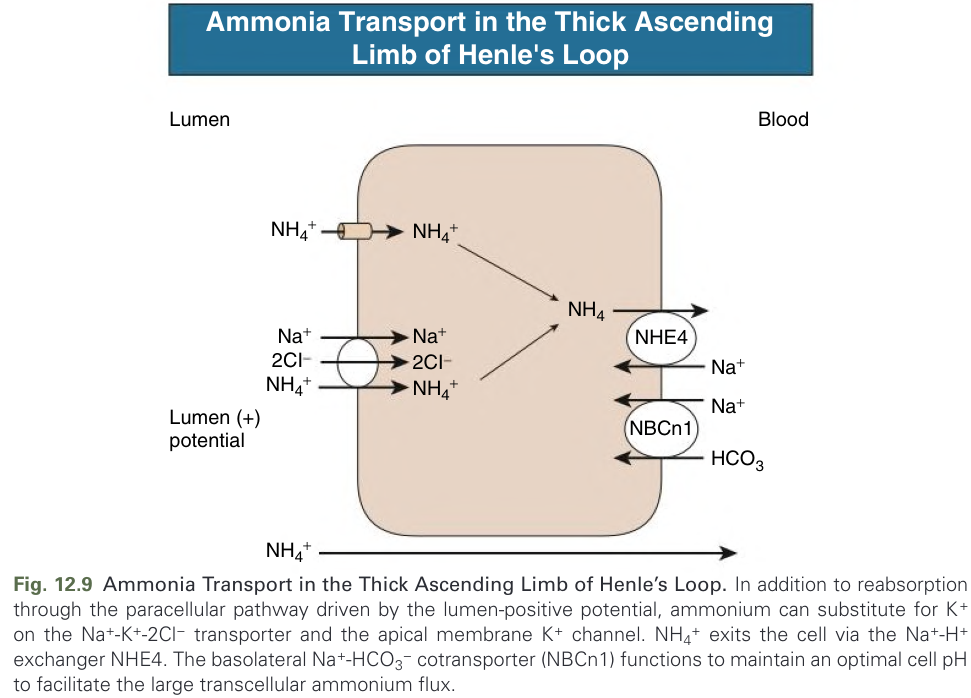

# 012. Normal Acid-Base Balance - Figures and Tables Index

This document lists all figures, tables and boxes extracted from `012. Normal Acid-Base Balance.pdf`.

## Table of Contents
- [Figures](#figures)
- [Tables](#tables)
- [Boxes](#boxes)

---

## Figures

### Fig_12_1

Fig. 12.1 Acid and Alkali Generated From the Diet. A nonvolatile acid is an acid produced from sources other than $CO_{2}$ and is not excreted by the lungs. Nonvolatile acids are produced from incomplete metabolism of carbohydrates, fats, and proteins and from metabolism of animal foods. Plant foods tend to produce an alkali load. AA, Amino acids.

---

### Fig_12_2

Fig. 12.2 Proximal tubule Sodium Bicarbonate (NaHCO₃) Reabsorption. The secretion of H⁺ into the proximal tubule lumen involves a Na⁺-H⁺ antiporter and an H⁺-ATPase. Apical membrane H⁺ secretion generates OH⁻, which reacts with CO₂ to form HCO₃⁻ and CO₃²⁻, and these exit with a Na⁺ on the basolateral membrane Na⁺-HCO₃⁻-CO₃²⁻ cotransporter. The Na⁺ absorbed by the Na⁺-H⁺ antiporter exits the cell on the basolateral membrane Na⁺, K⁺-ATPase and the Na⁺-HCO₃⁻-CO₃²⁻ cotransporter. The K⁺ that enters the cell on the Na⁺, K⁺-ATPase exits on a basolateral membrane K⁺ channel. Carbonic anhydrase catalyzes the conversion of HCO₃⁻ to CO₂ and OH⁻ in the lumen and the reverse reaction in the cell. Electrogenic H⁺ secretion generates a small, lumen-positive voltage that generates a current flow across the paracellular pathway.

---

### Fig_12_3

Fig. 12.3 Hydrogen (H $^{+}$ ) and Bicarbonate HCO $_{3}^{-}$ Ion Transport in the Thick Ascending Limb. Apical H $^{+}$ secretion is mediated by a Na $^{+}$ -H $^{+}$ antiporter. The low intracellular Na $^{+}$ concentration, maintained by the basolateral Na $^{+}$ ,K $^{+}$ -ATPase, provides the primary driving force for the antiporter. Both Cl $^{-}$ -HCO $_{3}^{-}$ exchange and K $^{+}$ -HCO $_{3}^{-}$ cotransport mediate base exit across the basolateral membrane.

---

### Fig_12_4

Fig. 12.4 Hydrogen (H+) Secretion in the Cortical Collecting Duct α-Intercalated Cell. Secretion of hydrogen ions into the lumen by an H+-ATPase and an H+-K+-ATPase. Apical membrane H+ secretion generates OH-, which reacts with CO2 to form HCO3-. This bicarbonate exits across the basolateral membrane on a Cl-HCO3-exchanger, a member of the anion exchanger-1 (AE1) family and a truncated form of the red blood cell AE1 Cl-HCO3-exchanger. The Cl- that enters the cell on the exchanger recycles across a basolateral membrane Cl-channel. The K+ that enters the cell on the H+-K+-ATPase appears to be able either to recycle across the apical membrane or exit across the basolateral membrane, depending on the potassium balance of the individual. Carbonic anhydrase catalyzes the conversion of CO2 and OH- to HCO3- in the cell. Electrogenic H+ secretion generates a lumen-positive voltage that generates a current flow across the paracellular pathway.

---

### Fig_12_5

Fig. 12.5 Bicarbonate Secretion by the Cortical Collecting Duct β-Intercalated Cell. H $^{+}$ is secreted into the interstitium by an H $^{+}$ -ATPase. The OH $^{-}$ generated by basolateral membrane H $^{+}$ secretion reacts with CO $_{2}$ to form HCO $_{3}^{-}$ , which exits across the apical membrane on a Cl $^{-}$ -HCO $_{3}^{-}$ exchanger (pendrin). The Cl $^{-}$ that enters the cell on the exchanger exits across a basolateral membrane Cl $^{-}$ channel. Carbonic anhydrase catalyzes the conversion of CO $_{2}$ and OH $^{-}$ to HCO $_{3}^{-}$ in the cell. The Na $^{+}$ -driven Cl $^{-}$ -HCO $_{3}^{-}$ exchanger (NDCBE) colocalizes with pendrin on the apical membrane and mediates thiazide-sensitive electroneutral NaCl reabsorption in this segment.

---

### Fig_12_6

Fig. 12.6 Sodium Transport in the Cortical Collecting Duct Principal Cell. Electrogenic $Na^{+}$ absorption is mediated by the $Na^{+}$ channel. The $Na^{+}$ enters the cell across the apical membrane channel and exits the cell on the basolateral membrane $Na^{+}, K^{+}$ -ATPase. The $K^{+}$ that enters the cell on the basolateral $Na^{+}, K^{+}$ -ATPase can be secreted into the luminal fluid by an apical membrane $K^{+}$ channel. Electrogenic $Na^{+}$ absorption establishes a lumen-negative voltage that drives a paracellular current.

---

### Fig_12_7

Fig. 12.7 Changes in Net Acid Excretion. Chronic metabolic acidosis increases net acid excretion dramatically over several days; shown quantitatively are the increases in the two major components of net acid excretion: titratable acids and ammonia. Titratable acid excretion increases slightly and predominantly in the first 24 to 48 hours. In contrast, urinary ammonia excretion progressively increases over 7 days and is responsible for most of the increase in net acid excretion in chronic metabolic acidosis. (Data from Elkinton JR, Huth EJ, Webster GD Jr, McCance RA. The renal excretion of hydrogen ion in renal tubular acidosis. I. Quantitative assessment of the response to ammonium chloride as an acid load. Am J Med. 1960;36:554–575.)

---

### Fig_12_8

Fig. 12.8 Ammonia Synthesis and Transport in the Proximal Tubule. Metabolic acidosis and hypokalemia stimulate proximal ammonia synthesis by stimulating the uptake of glutamine through SNAT3 and increasing the activities of the enzymes involved in ammonia metabolism. The generation of ammonia is the result of glutamine metabolism by enzymes closely linked to gluconeogenesis. Hyperkalemia suppresses ammoniagenesis by increasing cell pH. Increased extracellular $K^{+}$ concentration leads to depolarization of the proximal tubular cell (decrease in electronegativity of the cell) as sensed through the inwardly rectifying $K^{+}$ subchannel Kir4.2 encoded by Kcnj15 located on the basolateral membrane. This change results in less $HCO_{3}^{-}$ exit coupled to $Na^{+}$ via NBCe1 because the cotransporter carries a net negative charge and is driven by intracellular electronegativity. The net effect is increased cell pH and downregulation of proteins involved in ammoniagenesis.

---

### Fig_12_9

Fig. 12.9 Ammonia Transport in the Thick Ascending Limb of Henle's Loop. In addition to reabsorption through the paracellular pathway driven by the lumen-positive potential, ammonium can substitute for $K^{+}$ on the $Na^{+}-K^{+}-2Cl^{-}$ transporter and the apical membrane $K^{+}$ channel. $NH_{4}^{+}$ exits the cell via the $Na^{+}-H^{+}$ exchanger NHE4. The basolateral $Na^{+}-HCO_{3}^{-}$ cotransporter (NBCn1) functions to maintain an optimal cell pH to facilitate the large transcellular ammonium flux.

---

## Tables

*No tables resolved for this chapter.*

## Boxes

*No boxes resolved for this chapter.*
