# 013. Metabolic Acidosis - Figures and Tables Index

This document lists all figures, tables and boxes extracted from `013. Metabolic Acidosis.pdf`.

## Table of Contents
- [Figures](#figures)
- [Tables](#tables)
- [Boxes](#boxes)

---

## Figures

### Fig_13_1

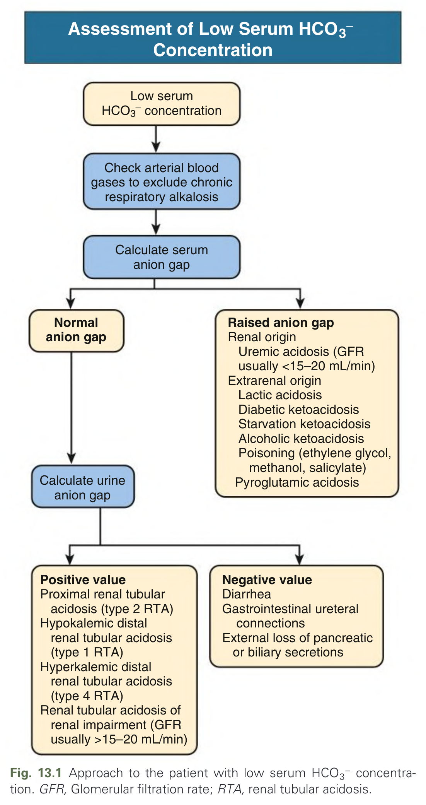

Fig. 13.1 Approach to the patient with low serum HCO3− concentration. GFR, Glomerular filtration rate; RTA, renal tubular acidosis.

---

### Fig_13_2

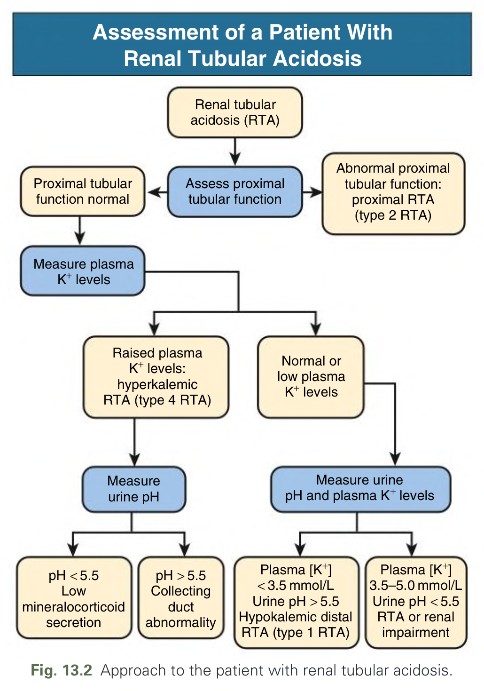

Fig. 13.2 Approach to the patient with renal tubular acidosis.

---

### Fig_13_3

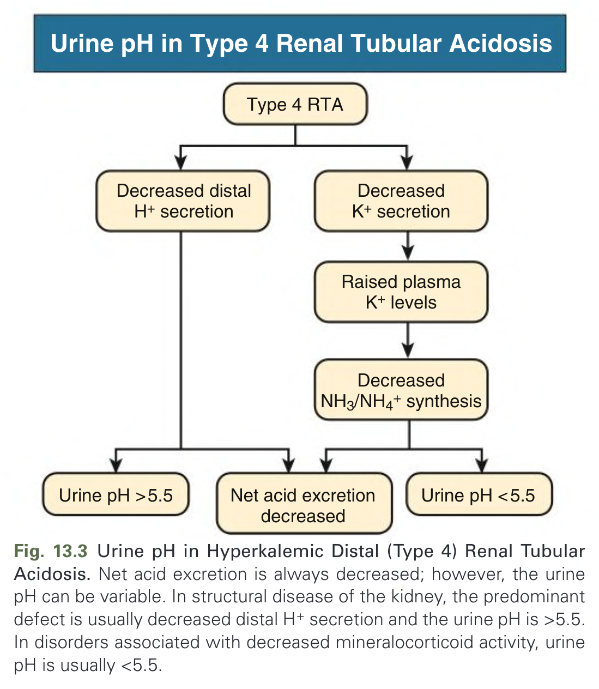

Fig. 13.3 Urine pH in Hyperkalemic Distal (Type 4) Renal Tubular Acidosis. Net acid excretion is always decreased; however, the urine pH can be variable. In structural disease of the kidney, the predominant defect is usually decreased distal H+ secretion and the urine pH is >5.5. In disorders associated with decreased mineralocorticoid activity, urine pH is usually <5.5.

---

### Fig_13_4

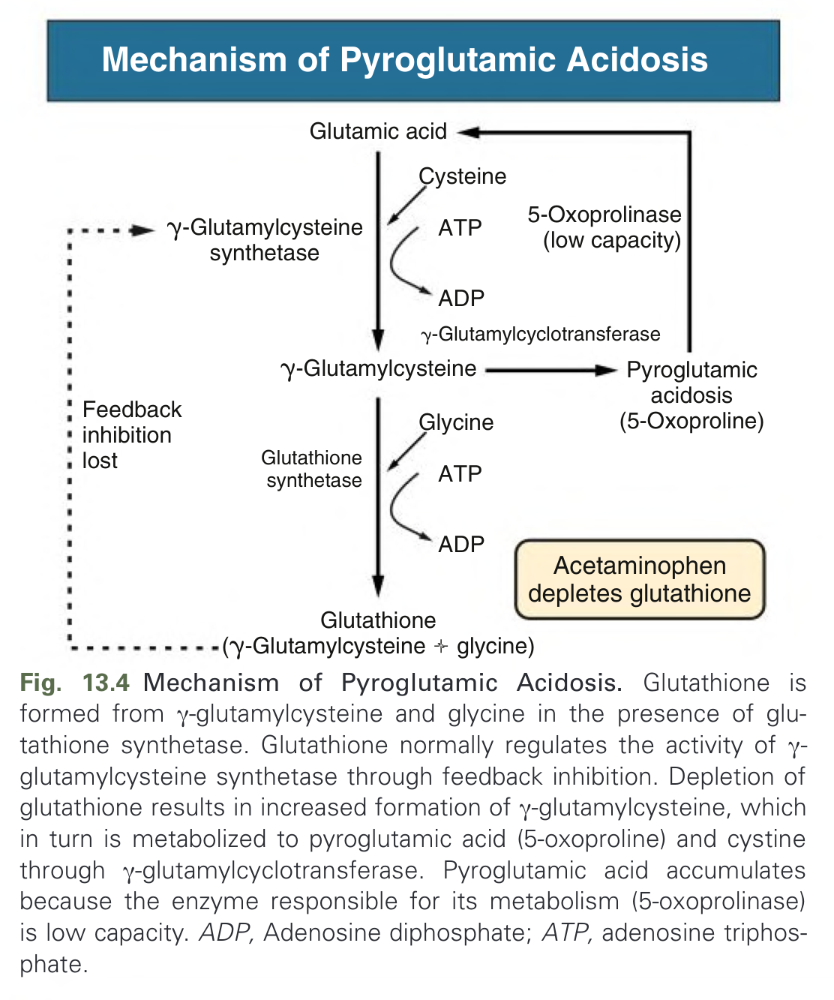

Fig. 13.4 Mechanism of Pyroglutamic Acidosis. Glutathione is formed from γ-glutamylcysteine and glycine in the presence of glutathione synthetase. Glutathione normally regulates the activity of γ-glutamylcysteine synthetase through feedback inhibition. Depletion of glutathione results in increased formation of γ-glutamylcysteine, which in turn is metabolized to pyroglutamic acid (5-oxoproline) and cystine through γ-glutamylcyclotransferase. Pyroglutamic acid accumulates because the enzyme responsible for its metabolism (5-oxoprolinase) is low capacity. ADP, Adenosine diphosphate; ATP, adenosine triphosphate.

---

## Tables

### Table_13_1

#### Table Image

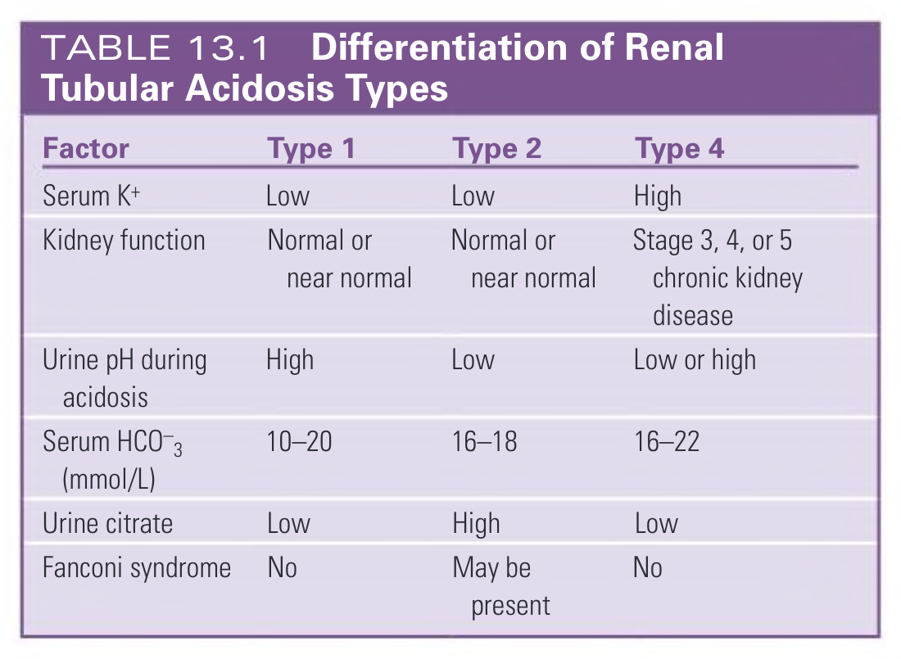

#### Table Data (CSV: [Table_13_1.csv](Table_13_1.csv))

```markdown
| Factor | Type 1 | Type 2 | Type 4 |
| :--- | :--- | :--- | :--- |
| Serum K+ | Low | Low | High |
| Kidney function | Normal or near normal | Normal or near normal | Stage 3, 4, or 5 chronic kidney disease |
| Urine pH during acidosis | High | Low | Low or high |
| Serum HCO-3 (mmol/L) | 10-20 | 16-18 | 16-22 |
| Urine citrate | Low | High | Low |
| Fanconi syndrome | No | May be present | No |
```

TABLE 13.1 Differentiation of Renal Tubular Acidosis Types

---

### Table_13_2

#### Table Image

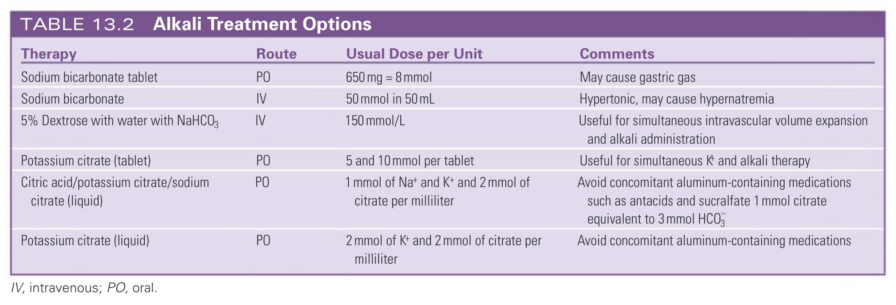

#### Table Data (CSV: [Table_13_2.csv](Table_13_2.csv))

```markdown
| Therapy | Route | Usual Dose per Unit | Comments |
| :--- | :--- | :--- | :--- |
| Sodium bicarbonate tablet | PO | 650 mg = 8 mmol | May cause gastric gas |
| Sodium bicarbonate | IV | 50 mmol in 50 mL | Hypertonic, may cause hypernatremia |
| 5% Dextrose with water with NaHCO3 | IV | 150 mmol/L | Useful for simultaneous intravascular volume expansion and alkali administration |
| Potassium citrate (tablet) | PO | 5 and 10 mmol per tablet | Useful for simultaneous K and alkali therapy |
| Citric acid/potassium citrate/sodium citrate (liquid) | PO | 1 mmol of Na+ and K+ and 2 mmol of citrate per milliliter | Avoid concomitant aluminum-containing medications such as antacids and sucralfate 1 mmol citrate equivalent to 3 mmol HCO3 |
| Potassium citrate (liquid) | PO | 2 mmol of K+ and 2 mmol of citrate per milliliter | Avoid concomitant aluminum-containing medications |

IV, intravenous; PO, oral.
```

TABLE 13.2 Alkali Treatment Options

---

## Boxes

### Box_13_1

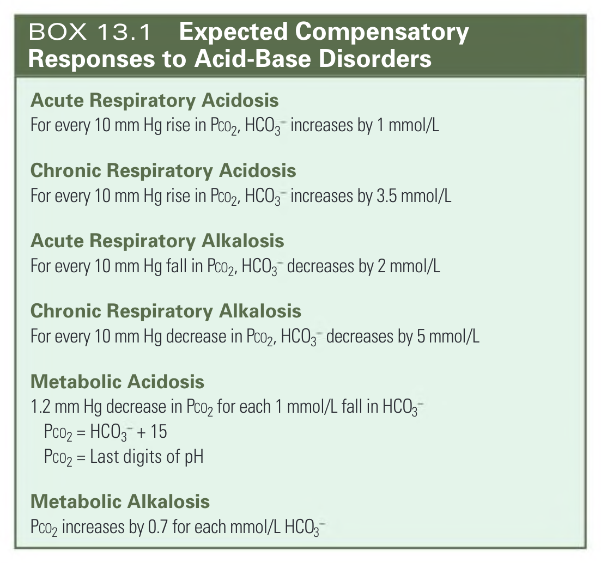

#### Box Text

```markdown
**Acute Respiratory Acidosis**
For every 10 mm Hg rise in PCO2, HCO3- increases by 1 mmol/L

**Chronic Respiratory Acidosis**
For every 10 mm Hg rise in PCO2, HCO3- increases by 3.5 mmol/L

**Acute Respiratory Alkalosis**
For every 10 mm Hg fall in PCO2, HCO3- decreases by 2 mmol/L

**Chronic Respiratory Alkalosis**
For every 10 mm Hg decrease in PCO2, HCO3- decreases by 5 mmol/L

**Metabolic Acidosis**
1.2 mm Hg decrease in PCO2 for each 1 mmol/L fall in HCO3-
PCO2 = HCO3- + 15
PCO2 = Last digits of pH

**Metabolic Alkalosis**
PCO2 increases by 0.7 for each mmol/L HCO3-
```

BOX 13.1 Expected Compensatory Responses to Acid-Base Disorders

---

### Box_13_2

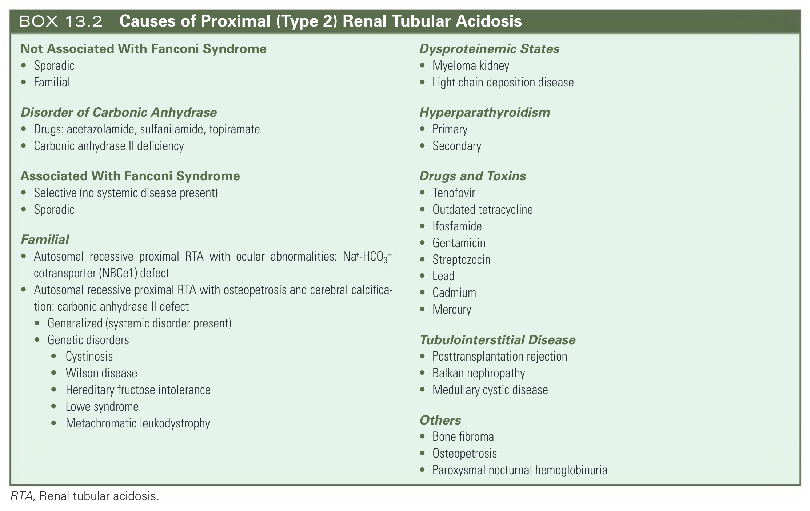

#### Box Text

```markdown
**Not Associated With Fanconi Syndrome**
* Sporadic
* Familial

**Disorder of Carbonic Anhydrase**
* Drugs: acetazolamide, sulfanilamide, topiramate
* Carbonic anhydrase II deficiency

**Associated With Fanconi Syndrome**
* Selective (no systemic disease present)
* Sporadic

**Familial**
* Autosomal recessive proximal RTA with ocular abnormalities: Na+-HCO3- cotransporter (NBCe1) defect
* Autosomal recessive proximal RTA with osteopetrosis and cerebral calcification: carbonic anhydrase II defect
* Generalized (systemic disorder present)
* Genetic disorders
    * Cystinosis
    * Wilson disease
    * Hereditary fructose intolerance
    * Lowe syndrome
    * Metachromatic leukodystrophy

**Dysproteinemic States**
* Myeloma kidney
* Light chain deposition disease

**Hyperparathyroidism**
* Primary
* Secondary

**Drugs and Toxins**
* Tenofovir
* Outdated tetracycline
* Ifosfamide
* Gentamicin
* Streptozocin
* Lead
* Cadmium
* Mercury

**Tubulointerstitial Disease**
* Posttransplantation rejection
* Balkan nephropathy
* Medullary cystic disease

**Others**
* Bone fibroma
* Osteopetrosis
* Paroxysmal nocturnal hemoglobinuria

RTA, Renal tubular acidosis.
```

BOX 13.2 Causes of Proximal (Type 2) Renal Tubular Acidosis

---

### Box_13_3

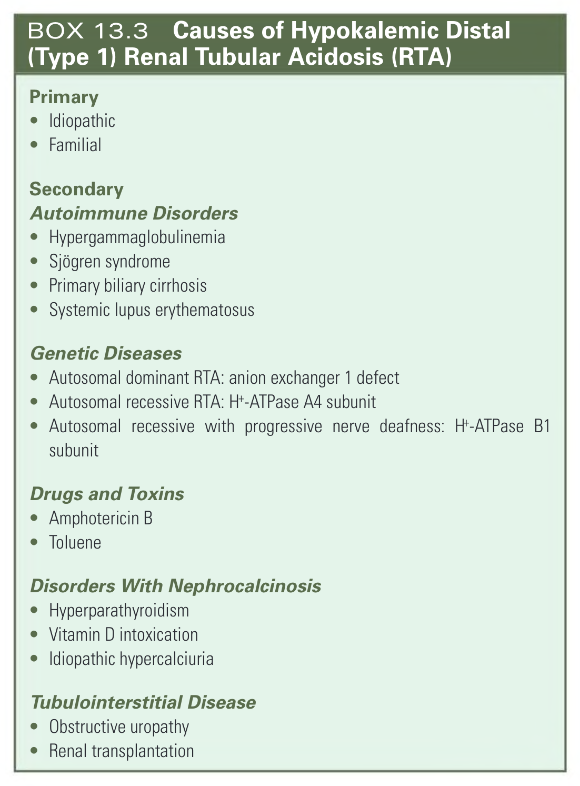

#### Box Text

```markdown
**Primary**
* Idiopathic
* Familial

**Secondary**
**Autoimmune Disorders**
* Hypergammaglobulinemia
* Sjögren syndrome
* Primary biliary cirrhosis
* Systemic lupus erythematosus

**Genetic Diseases**
* Autosomal dominant RTA: anion exchanger 1 defect
* Autosomal recessive RTA: H+-ATPase A4 subunit
* Autosomal recessive with progressive nerve deafness: H+-ATPase B1 subunit

**Drugs and Toxins**
* Amphotericin B
* Toluene

**Disorders With Nephrocalcinosis**
* Hyperparathyroidism
* Vitamin D intoxication
* Idiopathic hypercalciuria

**Tubulointerstitial Disease**
* Obstructive uropathy
* Renal transplantation
```

BOX 13.3 Causes of Hypokalemic Distal (Type 1) Renal Tubular Acidosis (RTA)

---

### Box_13_4

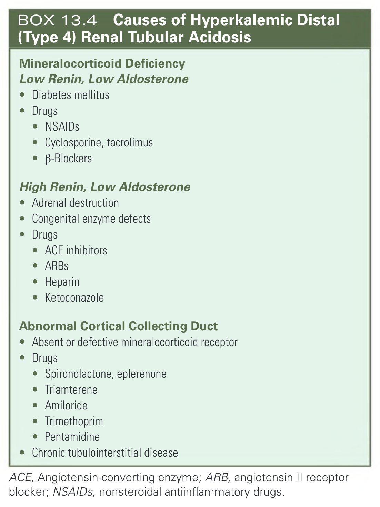

#### Box Text

```markdown
**Mineralocorticoid Deficiency**
**Low Renin, Low Aldosterone**
* Diabetes mellitus
* Drugs
    * NSAIDS
    * Cyclosporine, tacrolimus
    * ß-Blockers

**High Renin, Low Aldosterone**
* Adrenal destruction
* Congenital enzyme defects
* Drugs
    * ACE inhibitors
    * ARBs
    * Heparin
    * Ketoconazole

**Abnormal Cortical Collecting Duct**
* Absent or defective mineralocorticoid receptor
* Drugs
    * Spironolactone, eplerenone
    * Triamterene
    * Amiloride
    * Trimethoprim
    * Pentamidine
* Chronic tubulointerstitial disease

ACE, Angiotensin-converting enzyme; ARB, angiotensin II receptor blocker; NSAIDs, nonsteroidal antiinflammatory drugs.
```

BOX 13.4 Causes of Hyperkalemic Distal (Type 4) Renal Tubular Acidosis

---

### Box_13_5

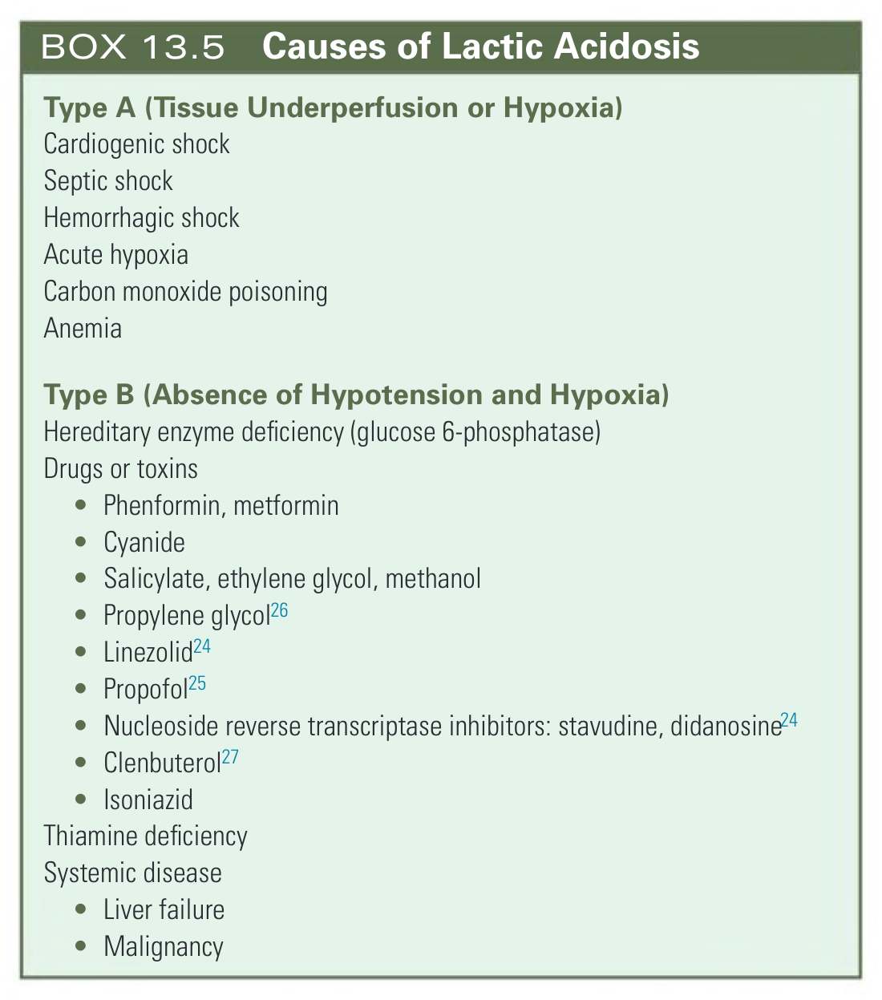

#### Box Text

```markdown
**Type A (Tissue Underperfusion or Hypoxia)**
* Cardiogenic shock
* Septic shock
* Hemorrhagic shock
* Acute hypoxia
* Carbon monoxide poisoning
* Anemia

**Type B (Absence of Hypotension and Hypoxia)**
* Hereditary enzyme deficiency (glucose 6-phosphatase)
* Drugs or toxins
    * Phenformin, metformin
    * Cyanide
    * Salicylate, ethylene glycol, methanol
    * Propylene glycol
    * Linezolid
    * Propofol
    * Nucleoside reverse transcriptase inhibitors: stavudine, didanosine
    * Clenbuterol
    * Isoniazid
* Thiamine deficiency
* Systemic disease
    * Liver failure
    * Malignancy
```

BOX 13.5 Causes of Lactic Acidosis

---

### Box_13_6

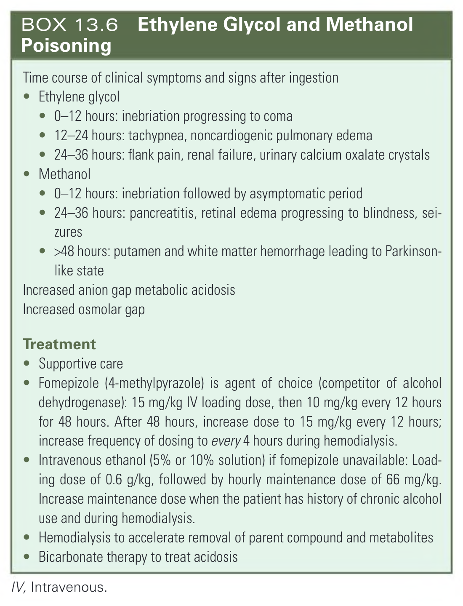

#### Box Text

```markdown
**Time course of clinical symptoms and signs after ingestion**
* **Ethylene glycol**
    * 0-12 hours: inebriation progressing to coma
    * 12-24 hours: tachypnea, noncardiogenic pulmonary edema
    * 24-36 hours: flank pain, renal failure, urinary calcium oxalate crystals
* **Methanol**
    * 0-12 hours: inebriation followed by asymptomatic period
    * 24-36 hours: pancreatitis, retinal edema progressing to blindness, seizures
    * >48 hours: putamen and white matter hemorrhage leading to Parkinson-like state
Increased anion gap metabolic acidosis
Increased osmolar gap

**Treatment**
* Supportive care
* Fomepizole (4-methylpyrazole) is agent of choice (competitor of alcohol dehydrogenase): 15 mg/kg IV loading dose, then 10 mg/kg every 12 hours for 48 hours. After 48 hours, increase dose to 15 mg/kg every 12 hours; increase frequency of dosing to every 4 hours during hemodialysis.
* Intravenous ethanol (5% or 10% solution) if fomepizole unavailable: Loading dose of 0.6 g/kg, followed by hourly maintenance dose of 66 mg/kg. Increase maintenance dose when the patient has history of chronic alcohol use and during hemodialysis.
* Hemodialysis to accelerate removal of parent compound and metabolites
* Bicarbonate therapy to treat acidosis

IV, Intravenous.
```

BOX 13.6 Ethylene Glycol and Methanol Poisoning

---
